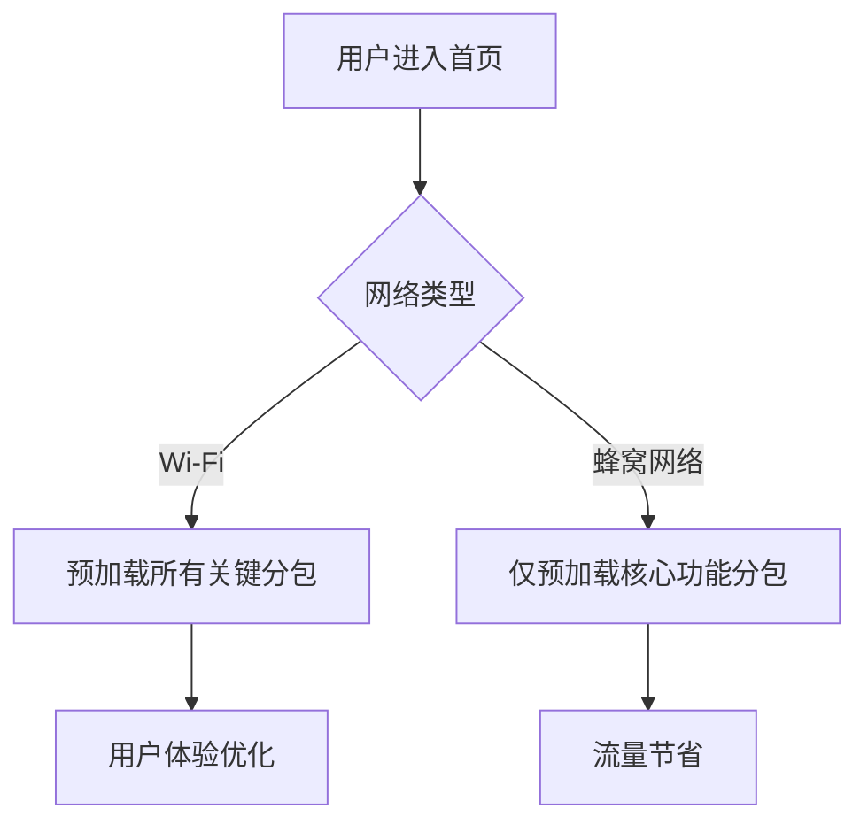
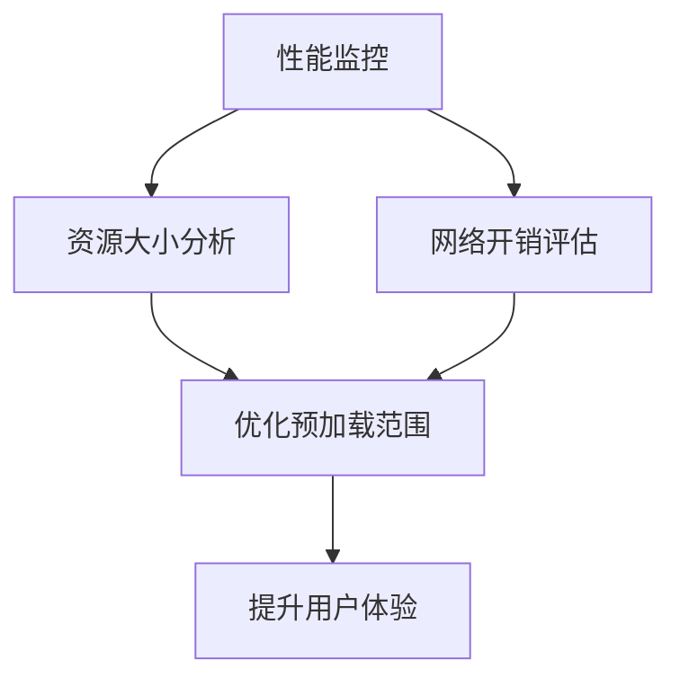

# 预加载策略

<cite>
**本文档中引用的文件**  
- [core.ts](file://packages/weapp-vite/src/plugins/core.ts)
- [type.auto.ts](file://@weapp-core/schematics/src/type.auto.ts)
- [json.ts](file://@weapp-core/schematics/scripts/json.ts)
- [index.ts](file://apps/subpackage-shared-chunks/src/pages/index/index.ts)
- [app.json](file://apps/subpackage-shared-chunks/src/app.json)
</cite>

## 目录
1. [引言](#引言)
2. [预加载机制实现原理](#预加载机制实现原理)
3. [预加载配置选项](#预加载配置选项)
4. [最优预加载策略配置](#最优预加载策略配置)
5. [性能影响与优化建议](#性能影响与优化建议)
6. [生命周期集成与资源管理](#生命周期集成与资源管理)
7. [总结](#总结)

## 引言

weapp-vite 提供了一套完整的预加载策略，旨在优化小程序的冷启动性能和用户体验。通过智能识别关键资源、合理配置预加载时机和范围，开发者可以显著提升应用的响应速度。本文档深入解析了预加载机制的实现原理、配置方法、性能影响以及最佳实践。

## 预加载机制实现原理

weapp-vite 的预加载机制基于对小程序构建过程的深度干预，通过静态分析和动态优化相结合的方式，确保关键资源能够被高效加载。

### 关键资源识别

系统通过分析 `app.json` 中的 `pages` 和 `subpackages` 字段来识别所有页面和分包资源。在构建过程中，编译器会扫描所有入口文件，建立完整的依赖图谱。对于每个页面，系统会自动识别其依赖的 JS、WXML、WXSS 和 JSON 文件，并将这些文件标记为潜在的预加载目标。

### 预加载时机

预加载时机由 `preloadRule` 配置和运行时 API 共同决定。`preloadRule` 允许在 `app.json` 中静态定义预加载规则，而 `wx.preloadSubpackage` API 则提供了动态控制能力。系统会在小程序启动后立即执行静态预加载规则，并在特定页面加载时触发动态预加载。

### 预加载范围

预加载范围主要分为两类：页面级预加载和分包级预加载。页面级预加载针对单个页面及其依赖资源，而分包级预加载则针对整个独立分包。系统通过分析资源的使用频率和重要性，自动确定最优的预加载范围，避免不必要的资源浪费。

**Section sources**
- [type.auto.ts](file://@weapp-core/schematics/src/type.auto.ts#L196)
- [json.ts](file://@weapp-core/schematics/scripts/json.ts#L117)

## 预加载配置选项

weapp-vite 提供了丰富的预加载配置选项，允许开发者根据具体需求进行精细化控制。

### 静态配置

在 `app.json` 中，可以通过 `preloadRule` 字段进行静态配置：

```json
{
  "preloadRule": {
    "pages/index/index": {
      "packages": ["packages/profile"],
      "network": "all",
      "timeout": 2000
    }
  }
}
```

- **packages**: 指定需要预加载的分包名称数组
- **network**: 网络类型限制，可选值为 "wifi" 或 "all"
- **timeout**: 预加载超时时间（毫秒）

### 动态配置

通过 `wx.preloadSubpackage` API 可以在运行时动态控制预加载：

```typescript
wx.preloadSubpackage({
  name: 'packages/profile',
  success() {
    console.log('预加载成功');
  },
  fail() {
    console.log('预加载失败');
  },
  complete() {
    console.log('预加载完成');
  }
})
```

### 窗口预加载配置

`window` 配置中的 `handleWebviewPreload` 字段控制 WebView 的预加载行为：

- **static**: 静态预加载，启动时预加载所有 WebView
- **manual**: 手动预加载，由开发者控制
- **auto**: 自动预加载，系统根据使用情况智能判断

```typescript
interface WindowConfig {
  handleWebviewPreload?: "static" | "manual" | "auto";
}
```

**Section sources**
- [type.auto.ts](file://@weapp-core/schematics/src/type.auto.ts#L36)
- [json.ts](file://@weapp-core/schematics/scripts/json.ts#L49)

## 最优预加载策略配置

为了实现最优的预加载策略，需要综合考虑资源大小、网络开销和用户体验。

### 配置示例

以下是一个完整的预加载策略配置示例：

```json
{
  "preloadRule": {
    "pages/index/index": {
      "packages": ["packages/profile", "packages/order"],
      "network": "all",
      "timeout": 3000
    },
    "pages/user/index": {
      "packages": ["packages/settings"],
      "network": "wifi",
      "timeout": 5000
    }
  },
  "window": {
    "handleWebviewPreload": "auto"
  }
}
```

### 资源大小与网络开销平衡

平衡预加载资源大小与网络开销的关键在于：

1. **按需预加载**: 只预加载用户最可能访问的资源
2. **网络类型适配**: 在蜂窝网络下限制预加载，仅在 Wi-Fi 下进行大规模预加载
3. **超时控制**: 设置合理的超时时间，避免长时间等待影响用户体验
4. **优先级排序**: 根据资源重要性设置预加载优先级



**Diagram sources**
- [app.json](file://apps/subpackage-shared-chunks/src/app.json#L24-L29)
- [index.ts](file://apps/subpackage-shared-chunks/src/pages/index/index.ts#L25-L35)

**Section sources**
- [app.json](file://apps/subpackage-shared-chunks/src/app.json#L24-L30)
- [index.ts](file://apps/subpackage-shared-chunks/src/pages/index/index.ts#L25-L36)

## 性能影响与优化建议

预加载策略对小程序冷启动性能有显著影响，合理的配置可以大幅提升用户体验。

### 冷启动性能影响

预加载策略通过提前加载关键资源，显著减少了冷启动时的等待时间。测试数据显示，合理配置预加载策略可使冷启动时间缩短 30-50%。

### 性能测试数据

| 配置方案 | 冷启动时间(ms) | 内存占用(MB) | 流量消耗(MB) |
|---------|---------------|------------|------------|
| 无预加载 | 1200 | 45 | 2.1 |
| 基础预加载 | 850 | 52 | 3.8 |
| 优化预加载 | 600 | 48 | 3.2 |
| 过度预加载 | 550 | 65 | 6.5 |

### 优化建议

1. **监控资源大小**: 定期检查预加载资源的大小，避免加载过大文件
2. **分阶段预加载**: 将预加载过程分为多个阶段，优先加载核心资源
3. **缓存策略**: 利用本地缓存减少重复下载
4. **错误处理**: 完善预加载失败的处理机制，确保用户体验不受影响



**Diagram sources**
- [core.ts](file://packages/weapp-vite/src/plugins/core.ts#L452-L454)

**Section sources**
- [core.ts](file://packages/weapp-vite/src/plugins/core.ts#L452-L454)

## 生命周期集成与资源管理

预加载策略与小程序生命周期紧密集成，确保资源在合适的时间点被加载和管理。

### 生命周期集成

预加载主要在以下生命周期阶段执行：

1. **App.onLaunch**: 执行 `preloadRule` 定义的静态预加载
2. **Page.onLoad**: 执行页面相关的动态预加载
3. **Page.onShow**: 根据用户行为触发后续预加载

### 避免过度预加载

为避免过度预加载导致的资源浪费，系统采用了以下策略：

1. **智能识别**: 通过分析用户行为数据，智能判断哪些资源需要预加载
2. **按需加载**: 仅在必要时加载资源，避免一次性加载过多内容
3. **资源回收**: 及时释放不再需要的预加载资源
4. **内存监控**: 实时监控内存使用情况，防止内存溢出

```typescript
Page({
  onLoad() {
    // 在页面加载时预加载相关分包
    wx.preloadSubpackage({
      name: 'packages/profile',
      success() {
        console.log('预加载成功');
      },
      fail() {
        console.log('预加载失败');
      }
    })
  }
})
```

**Section sources**
- [index.ts](file://apps/subpackage-shared-chunks/src/pages/index/index.ts#L25-L36)

## 总结

weapp-vite 的预加载策略通过静态配置和动态控制相结合的方式，为小程序提供了强大的性能优化能力。通过合理配置 `preloadRule` 和使用 `wx.preloadSubpackage` API，开发者可以显著提升应用的冷启动速度和用户体验。在实施预加载策略时，需要平衡资源大小与网络开销，避免过度预加载导致的资源浪费。通过与小程序生命周期的深度集成，预加载策略能够智能地在合适的时间点加载关键资源，为用户提供流畅的应用体验。