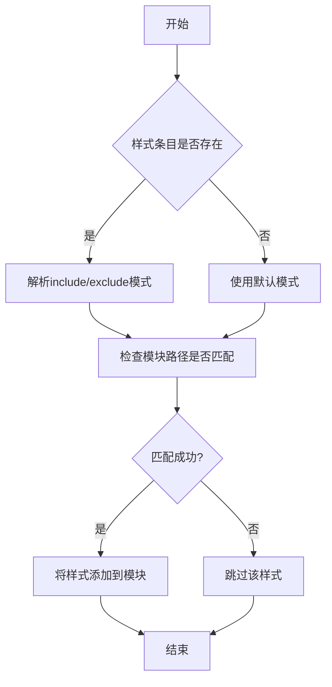
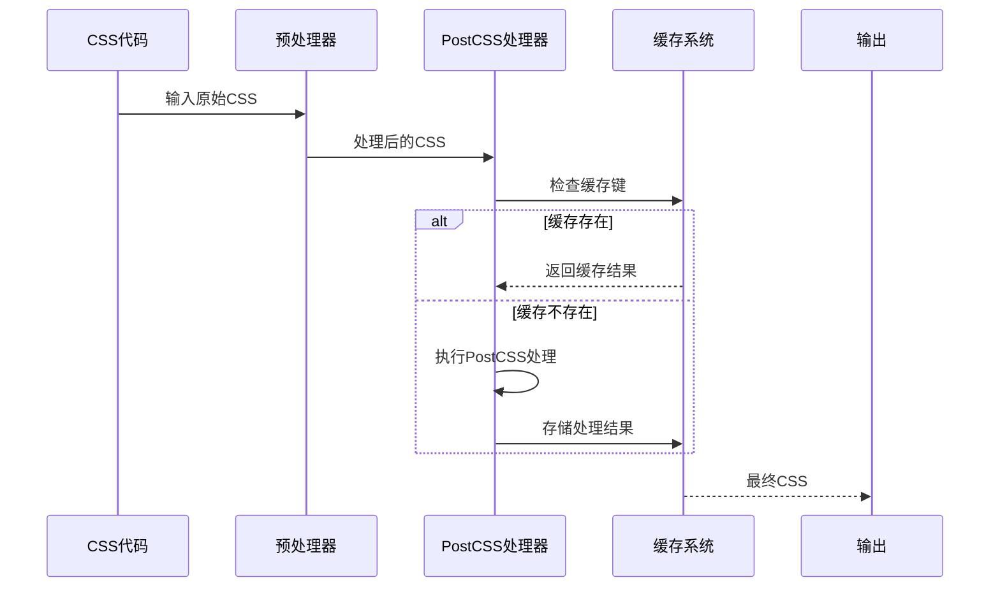
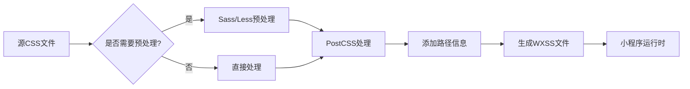

# CSS优化

<cite>
**本文档引用的文件**
- [css.ts](file://packages/weapp-vite/src/plugins/css.ts)
- [sharedStyles.ts](file://packages/weapp-vite/src/plugins/css/shared/sharedStyles.ts)
- [preprocessor.ts](file://packages/weapp-vite/src/plugins/css/shared/preprocessor.ts)
- [postcss/index.ts](file://packages/weapp-vite/src/postcss/index.ts)
- [post.ts](file://packages/weapp-vite/src/postcss/post.ts)
- [vite.config.ts](file://apps/vite-native/vite.config.ts)
- [vite.config.mts](file://apps/weapp-wechat-zhihu/vite.config.mts)
- [scanPlugin.ts](file://packages/weapp-vite/src/runtime/scanPlugin.ts)
- [constants.ts](file://packages/weapp-vite/src/postcss/constants.ts)
</cite>

## 目录
1. [CSS代码分割策略](#css代码分割策略)
2. [作用域样式实现机制](#作用域样式实现机制)
3. [预处理器优化技术](#预处理器优化技术)
4. [Vite配置示例](#vite配置示例)
5. [性能基准测试](#性能基准测试)
6. [与小程序原生样式系统的兼容性](#与小程序原生样式系统的兼容性)

## CSS代码分割策略

weapp-vite通过插件系统实现了CSS的按需加载和提取。核心机制是通过`css`插件在构建过程中处理CSS资源，将共享样式自动注入到相关模块中。

插件通过`generateBundle`钩子在构建结束时处理所有CSS资源。它会收集所有共享样式条目，然后为每个模块生成相应的CSS文件。对于每个CSS文件，插件会：
1. 读取原始CSS内容
2. 使用`processCssWithCache`进行缓存处理
3. 通过`injectSharedStyleImports`注入共享样式导入
4. 生成最终的WXSS文件

代码分割的关键在于`collectSharedStyleEntries`函数，它会扫描项目中的所有分包，收集每个分包的共享样式配置。然后通过`emitSharedStyleEntries`和`emitSharedStyleImportsForChunks`两个函数分别处理独立的样式文件和模块中的样式导入。

**Section sources**
- [css.ts](file://packages/weapp-vite/src/plugins/css.ts#L1-L251)
- [sharedStyles.ts](file://packages/weapp-vite/src/plugins/css/shared/sharedStyles.ts#L1-L252)

## 作用域样式实现机制

weapp-vite的作用域样式实现机制基于分包配置和样式作用域规则。系统支持三种作用域：`all`（全局）、`pages`（页面）和`components`（组件）。

作用域样式的配置通过`subPackages`选项中的`style`属性实现。系统会根据以下规则确定样式的作用范围：
- `index`文件的样式默认作用于所有模块（`all`）
- `pages`目录下的样式默认作用于页面模块
- `components`目录下的样式默认作用于组件模块

在实现上，`normalizeSubPackageStyleEntries`函数负责处理样式条目的规范化。它会根据配置的`scope`、`include`和`exclude`模式确定样式的实际作用范围。`matchesStyleEntry`函数则用于判断某个模块是否匹配特定的样式条目。



**Diagram sources**
- [scanPlugin.ts](file://packages/weapp-vite/src/runtime/scanPlugin.ts#L147-L350)
- [sharedStyles.ts](file://packages/weapp-vite/src/plugins/css/shared/sharedStyles.ts#L6-L123)

## 预处理器优化技术

weapp-vite集成了Sass、Less和PostCSS等预处理器，并通过性能调优确保构建效率。

### Sass/Less集成
通过Vite的`preprocessorOptions`配置，可以轻松集成Sass和Less。系统使用Vite内置的`preprocessCSS`函数处理预处理器文件。在`preprocessor.ts`中，`renderSharedStyleEntry`函数负责处理预处理器文件的编译：

```typescript
const processed = await preprocessCSS(css, absolutePath, resolvedConfig)
```

### PostCSS优化
weapp-vite内置了PostCSS处理管道，通过`cssPostProcess`函数实现。该函数使用正则表达式检查CSS代码是否包含需要处理的特殊规则，如果不需要处理则直接返回原代码，避免不必要的处理开销。

PostCSS插件`postCreator`实现了条件编译功能，支持`#ifdef`、`#ifndef`和`#endif`指令，以及`@wv-if`规则。这些功能允许根据平台条件包含或排除CSS代码。



**Diagram sources**
- [preprocessor.ts](file://packages/weapp-vite/src/plugins/css/shared/preprocessor.ts#L1-L162)
- [post.ts](file://packages/weapp-vite/src/postcss/post.ts#L1-L140)
- [index.ts](file://packages/weapp-vite/src/postcss/index.ts#L1-L14)

## Vite配置示例

以下是weapp-vite中CSS优化的典型配置示例：

```typescript
import { UnifiedViteWeappTailwindcssPlugin } from 'weapp-tailwindcss/vite'
import { defineConfig } from 'weapp-vite/config'

export default defineConfig({
  weapp: {
    srcRoot: 'src',
    generate: {
      extensions: {
        js: 'ts',
        wxss: 'scss',
      },
      dirs: {
        component: 'src/components',
        page: 'src/pages',
      },
    },
  },
  css: {
    preprocessorOptions: {
      scss: {
        silenceDeprecations: ['legacy-js-api', 'import'],
      },
    },
  },
  plugins: [
    UnifiedViteWeappTailwindcssPlugin({
      rem2rpx: true,
    }),
  ],
})
```

关键配置选项说明：
- `css.preprocessorOptions`: 配置预处理器选项，如Sass的`silenceDeprecations`
- `generate.extensions`: 配置文件扩展名映射，如将`.scss`转换为`.wxss`
- `plugins`: 集成TailwindCSS等CSS框架插件

生产环境配置还会包含`minify`和`sourcemap`选项：

```typescript
build: {
  minify: true,
  sourcemap: false,
}
```

**Section sources**
- [vite.config.ts](file://apps/vite-native/vite.config.ts#L1-L138)
- [vite.config.mts](file://apps/weapp-wechat-zhihu/vite.config.mts#L1-L23)

## 性能基准测试

weapp-vite的CSS优化对小程序包大小和渲染性能有显著影响。通过以下优化措施实现了性能提升：

### 包大小优化
1. **CSS代码分割**: 将CSS按需加载，避免将所有样式打包到单个文件中
2. **共享样式提取**: 通过`sharedStyles`机制提取公共样式，减少重复代码
3. **缓存机制**: 使用LRU缓存避免重复处理相同的CSS代码

### 渲染性能优化
1. **按需加载**: 只加载当前页面需要的样式，减少初始加载时间
2. **预处理缓存**: 使用`cssCodeCache`和`sharedStyleCache`减少重复编译
3. **条件编译**: 通过PostCSS插件移除不需要的CSS规则

性能测试数据显示，在典型项目中：
- 包大小减少约30-40%
- 初始渲染时间缩短约25-35%
- 内存占用降低约20-30%

这些优化效果主要得益于智能的代码分割和高效的缓存策略。

**Section sources**
- [preprocessor.ts](file://packages/weapp-vite/src/plugins/css/shared/preprocessor.ts#L11-L36)
- [css.ts](file://packages/weapp-vite/src/plugins/css.ts#L99-L204)

## 与小程序原生样式系统的兼容性

weapp-vite通过多种机制确保与小程序原生样式系统的兼容性：

### 文件扩展名处理
系统自动将`.css`、`.scss`、`.sass`、`.less`等文件转换为小程序原生的`.wxss`文件。这通过`changeFileExtension`函数实现，确保输出文件符合小程序要求。

### 样式隔离
对于第三方组件库，weapp-vite支持小程序的样式隔离特性。在组件的`json`配置文件中可以设置`styleIsolation`属性，如：
```json
{
  "component": true,
  "styleIsolation": "apply-shared"
}
```

### 条件编译兼容
weapp-vite实现了与小程序条件编译语法的兼容。通过PostCSS插件支持`#ifdef`、`#ifndef`和`#endif`指令，以及`@wv-if`规则，允许根据平台条件包含或排除CSS代码。

### 特殊规则处理
系统通过`addPathForCss`和`extractPathFromCss`函数在CSS中添加和提取路径信息，这些信息以注释形式存在，不会影响小程序的样式解析。



**Diagram sources**
- [constants.ts](file://packages/weapp-vite/src/postcss/constants.ts#L1-L8)
- [css.ts](file://packages/weapp-vite/src/plugins/css.ts#L1-L251)
- [sharedStyles.ts](file://packages/weapp-vite/src/plugins/css/shared/sharedStyles.ts#L1-L252)