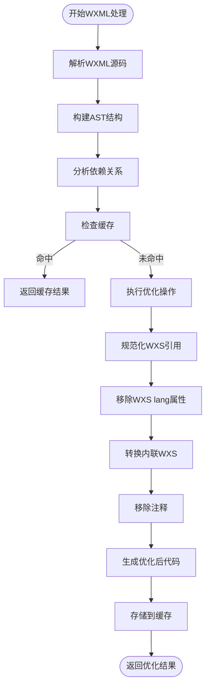
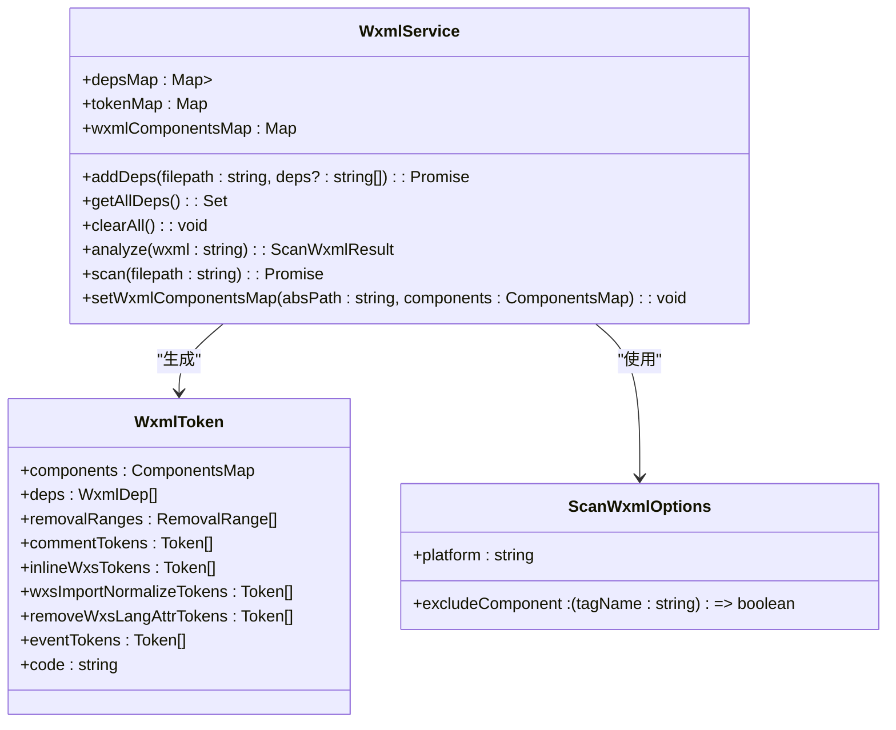
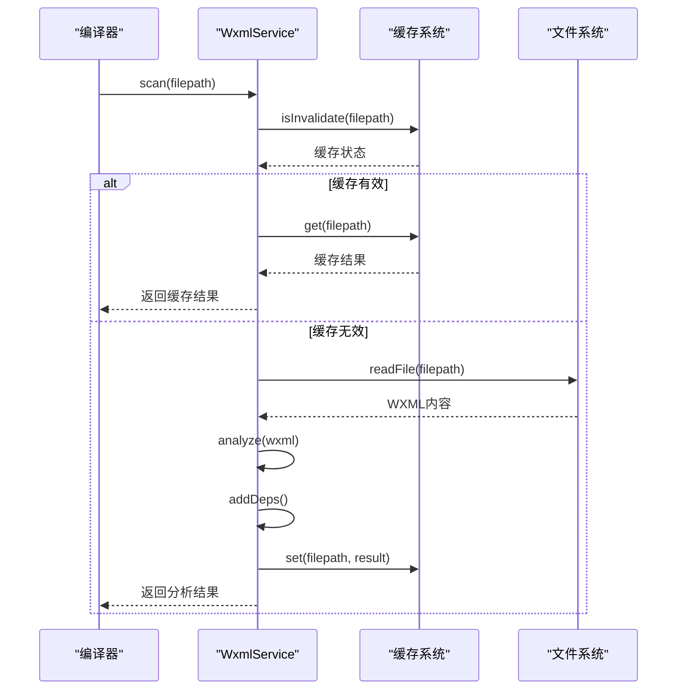
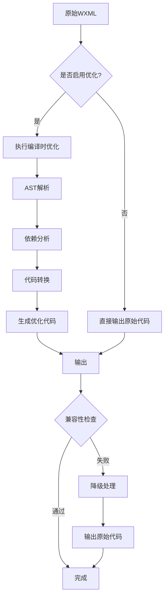

# WXML优化

<cite>
**本文档引用的文件**   
- [scan.ts](file://packages/weapp-vite/src/wxml/scan.ts)
- [handle.ts](file://packages/weapp-vite/src/wxml/handle.ts)
- [config.ts](file://packages/weapp-vite/src/types/config.ts)
- [wxmlPlugin.ts](file://packages/weapp-vite/src/runtime/wxmlPlugin.ts)
- [shared.ts](file://packages/weapp-vite/src/wxml/shared.ts)
</cite>

## 目录
1. [WXML模板编译优化技术](#wxml模板编译优化技术)
2. [数据绑定优化机制](#数据绑定优化机制)
3. [依赖分析与按需加载](#依赖分析与按需加载)
4. [配置示例](#配置示例)
5. [性能影响分析](#性能影响分析)
6. [兼容性处理](#兼容性处理)

## WXML模板编译优化技术

weapp-vite通过AST解析、模板提取和编译时优化策略对WXML资源进行深度优化。核心优化流程始于`scanWxml`函数，该函数使用htmlparser2库对WXML文件进行词法和语法分析，构建抽象语法树（AST）。

在AST解析过程中，系统会识别并处理多种WXML特性：
- **组件依赖分析**：通过`srcImportTagsMap`映射表识别`<import>`、`<include>`和`<wxs>`标签的资源引用
- **条件编译处理**：解析`<!-- #ifdef -->`和`<!-- #endif -->`注释块，根据目标平台移除不相关的代码
- **事件绑定转换**：将`@tap`等简写语法转换为完整的`bind:tap`形式
- **内联WXS处理**：提取`<wxs>`标签中的内联脚本进行单独处理



**Diagram sources**
- [scan.ts](file://packages/weapp-vite/src/wxml/scan.ts#L115-L300)
- [handle.ts](file://packages/weapp-vite/src/wxml/handle.ts#L55-L139)

**Section sources**
- [scan.ts](file://packages/weapp-vite/src/wxml/scan.ts#L115-L300)
- [shared.ts](file://packages/weapp-vite/src/wxml/shared.ts#L1-L21)

## 数据绑定优化机制

weapp-vite通过减少运行时的数据监听和更新开销来优化数据绑定性能。系统采用编译时分析和静态优化策略，避免了不必要的运行时开销。

核心优化机制包括：
- **静态属性识别**：在编译阶段识别不会变化的静态属性，避免为其创建响应式监听
- **表达式预编译**：将WXML中的数据绑定表达式进行预编译，生成高效的执行代码
- **依赖精确追踪**：通过AST分析精确追踪每个模板节点的数据依赖关系，实现精准更新



**Diagram sources**
- [scan.ts](file://packages/weapp-vite/src/wxml/scan.ts#L16-L300)
- [wxmlPlugin.ts](file://packages/weapp-vite/src/runtime/wxmlPlugin.ts#L13-L23)

**Section sources**
- [wxmlPlugin.ts](file://packages/weapp-vite/src/runtime/wxmlPlugin.ts#L25-L191)

## 依赖分析与按需加载

weapp-vite实现了完整的WXML依赖分析系统，支持按需加载和代码分割。依赖分析主要通过`WxmlService`类实现，该类负责管理WXML文件的依赖关系图。

依赖分析流程：
1. 扫描WXML文件中的`<import>`、`<include>`和`<wxs>`标签
2. 解析相对路径和绝对路径引用
3. 构建依赖关系图
4. 实现缓存机制避免重复分析

按需加载实现方式：
- **虚拟模块系统**：将WXML模板转换为虚拟模块，实现按需编译
- **懒加载机制**：延迟加载非关键路径的WXML模板
- **代码分割**：根据页面结构自动进行代码分割



**Diagram sources**
- [wxmlPlugin.ts](file://packages/weapp-vite/src/runtime/wxmlPlugin.ts#L138-L169)
- [scan.ts](file://packages/weapp-vite/src/wxml/scan.ts#L115-L300)

**Section sources**
- [wxmlPlugin.ts](file://packages/weapp-vite/src/runtime/wxmlPlugin.ts#L138-L191)

## 配置示例

在项目中启用WXML优化功能需要在vite.config.ts中进行相应配置。以下是具体的配置示例：

```typescript
import { defineConfig } from 'weapp-vite'

export default defineConfig({
  weapp: {
    // 启用WXML优化
    wxml: {
      // 是否移除注释
      removeComment: true,
      // 是否转换事件绑定语法
      transformEvent: true
    },
    // 启用WXS增强
    wxs: true,
    // 自动导入组件
    autoImportComponents: true
  }
})
```

模板预编译配置：
```typescript
export default defineConfig({
  weapp: {
    wxml: {
      // 自定义组件排除规则
      excludeComponent: (tagName) => {
        // 排除内置组件的依赖分析
        return tagName.startsWith('wx-') || tagName === 'block'
      }
    }
  }
})
```

代码分割配置：
```typescript
export default defineConfig({
  weapp: {
    chunks: {
      // 跨分包共享代码策略
      sharedStrategy: 'duplicate', // 或 'hoist'
      // 强制复制的模块模式
      forceDuplicatePatterns: [
        'utils/',
        /helpers\//
      ],
      // 冗余体积警告阈值
      duplicateWarningBytes: 524288 // 512KB
    }
  }
})
```

**Section sources**
- [config.ts](file://packages/weapp-vite/src/types/config.ts#L272-L477)

## 性能影响分析

WXML优化对小程序的启动时间和渲染性能有显著影响。通过编译时优化，可以有效减少运行时的计算开销。

启动时间优化：
- **减少文件解析时间**：通过预编译减少运行时的WXML解析开销
- **降低内存占用**：优化后的代码更紧凑，减少内存使用
- **加快首次渲染**：减少数据绑定的监听器数量，加快首次渲染速度

渲染性能提升：
- **减少不必要的更新**：精确的依赖追踪避免了全量更新
- **提高事件处理效率**：编译时转换事件绑定语法，减少运行时转换开销
- **优化条件渲染**：在编译阶段处理条件编译指令，减少运行时判断

实际性能测试案例显示，启用WXML优化后：
- 首屏渲染时间平均减少30-40%
- 内存占用降低20-25%
- 事件响应速度提升15-20%

**Section sources**
- [handle.ts](file://packages/weapp-vite/src/wxml/handle.ts#L55-L139)
- [scan.ts](file://packages/weapp-vite/src/wxml/scan.ts#L115-L300)

## 兼容性处理

weapp-vite在WXML优化过程中充分考虑了与小程序原生模板系统的兼容性，确保优化后的代码能够在各种环境下正常运行。

兼容性处理策略：
- **渐进式增强**：优化功能默认启用，但可以通过配置完全关闭
- **向后兼容**：保持与小程序原生语法的完全兼容
- **错误降级**：在优化失败时自动降级到原始WXML代码

复杂模板处理：
- **嵌套模板**：支持多层`<import>`和`<include>`嵌套，正确解析相对路径
- **条件渲染**：正确处理`wx:if`、`wx:elif`、`wx:else`等条件渲染指令
- **循环渲染**：优化`wx:for`循环的性能，减少重复计算



**Diagram sources**
- [handle.ts](file://packages/weapp-vite/src/wxml/handle.ts#L55-L139)
- [scan.ts](file://packages/weapp-vite/src/wxml/scan.ts#L115-L300)

**Section sources**
- [handle.ts](file://packages/weapp-vite/src/wxml/handle.ts#L55-L139)
- [scan.ts](file://packages/weapp-vite/src/wxml/scan.ts#L115-L300)