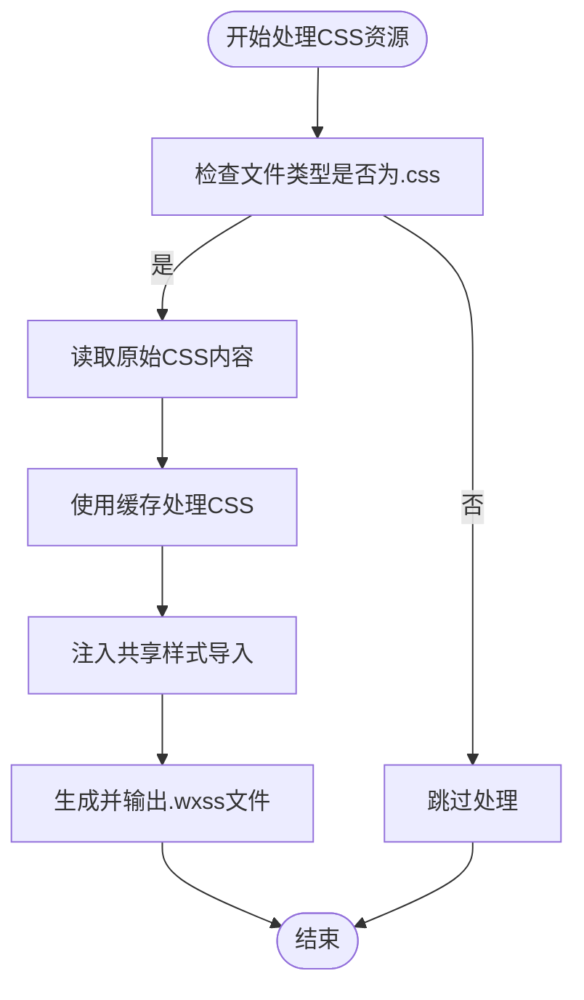
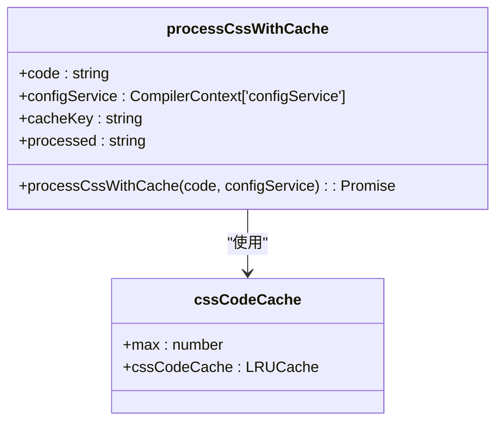
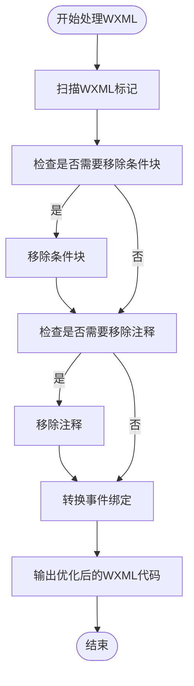
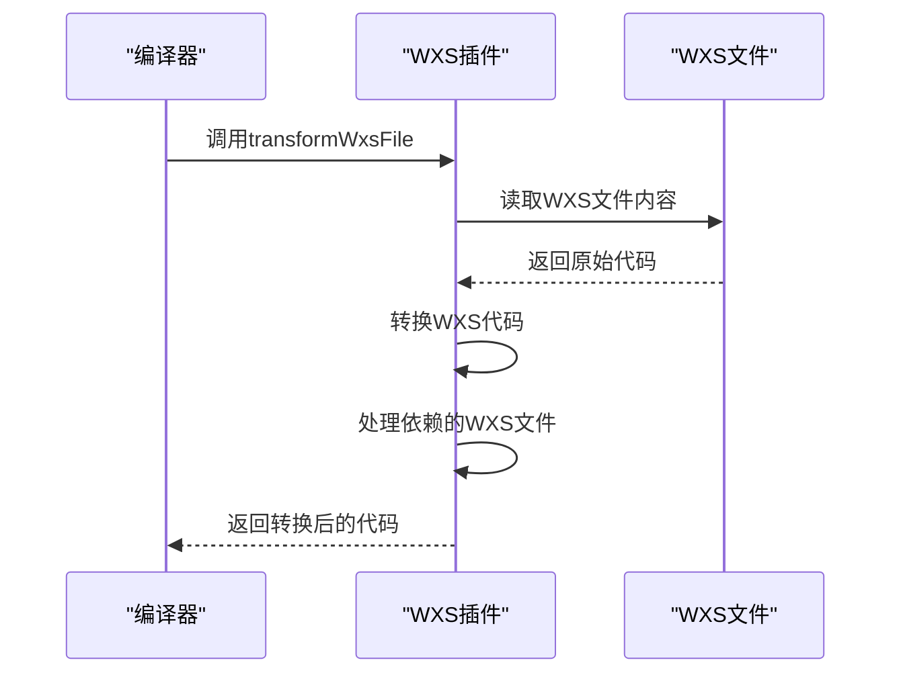
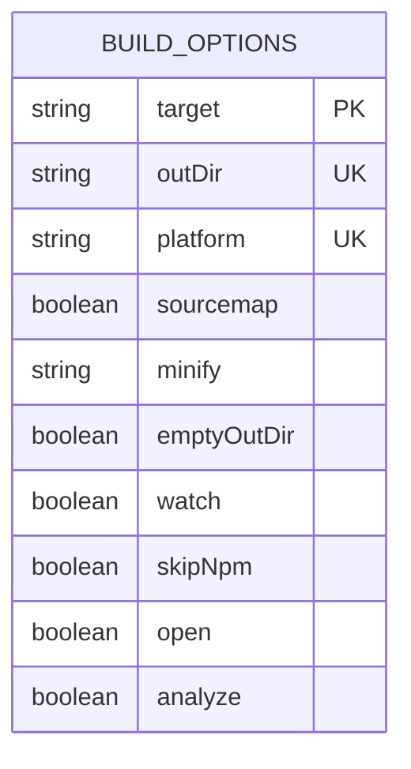

# 资源优化

<cite>
**本文档中引用的文件**  
- [css.ts](file://packages/weapp-vite/src/plugins/css.ts)
- [preprocessor.ts](file://packages/weapp-vite/src/plugins/css/shared/preprocessor.ts)
- [sharedStyles.ts](file://packages/weapp-vite/src/plugins/css/shared/sharedStyles.ts)
- [wxs.ts](file://packages/weapp-vite/src/plugins/wxs.ts)
- [handle.ts](file://packages/weapp-vite/src/wxml/handle.ts)
- [post.ts](file://packages/weapp-vite/src/postcss/post.ts)
- [index.ts](file://packages/weapp-vite/src/postcss/index.ts)
- [build.ts](file://packages/weapp-vite/src/cli/commands/build.ts)
</cite>

## 目录
1. [引言](#引言)
2. [CSS提取与优化策略](#css提取与优化策略)
3. [WXML优化技术](#wxml优化技术)
4. [WXS编译优化机制](#wxs编译优化机制)
5. [配置选项与使用示例](#配置选项与使用示例)
6. [性能收益分析](#性能收益分析)
7. [高级资源优化技巧](#高级资源优化技巧)
8. [结论](#结论)

## 引言
weapp-vite 是一个专为微信小程序设计的构建工具，旨在通过先进的资源优化技术提升小程序的性能和用户体验。本文档深入探讨了 weapp-vite 在 CSS 提取与优化、WXML 优化以及 WXS 编译优化方面的核心技术。我们将详细阐述每种优化技术的实现原理、配置选项、使用示例及其对小程序运行时性能的影响，为追求极致性能的开发者提供全面的指导。

## CSS提取与优化策略

### CSS代码分割
weapp-vite 通过 `css.ts` 插件实现了高效的 CSS 代码分割。该插件在构建过程中自动处理 CSS 资源，确保每个页面或组件的样式被正确地提取和打包。具体来说，`handleBundleEntry` 函数负责处理 `.css` 文件，并将其转换为 `.wxss` 文件，同时注入共享样式导入。



**Diagram sources**
- [css.ts](file://packages/weapp-vite/src/plugins/css.ts#L63-L97)

**Section sources**
- [css.ts](file://packages/weapp-vite/src/plugins/css.ts#L13-L97)

### 作用域样式
weapp-vite 支持作用域样式，确保不同组件之间的样式不会相互干扰。通过 `collectSharedStyleEntries` 和 `injectSharedStyleImports` 函数，系统能够收集并注入共享样式条目，从而实现样式的作用域隔离。

### 预处理器优化
weapp-vite 支持多种 CSS 预处理器，如 Sass、Less 等。通过 `preprocessCSS` 函数，可以在构建过程中对预处理后的 CSS 进行进一步优化。此外，`processCssWithCache` 函数利用 LRU 缓存机制，避免重复处理相同的 CSS 代码，显著提升了构建效率。



**Diagram sources**
- [preprocessor.ts](file://packages/weapp-vite/src/plugins/css/shared/preprocessor.ts#L21-L36)

**Section sources**
- [preprocessor.ts](file://packages/weapp-vite/src/plugins/css/shared/preprocessor.ts#L11-L36)

## WXML优化技术

### 模板编译优化
weapp-vite 通过 `handleWxml` 函数对 WXML 模板进行编译优化。该函数能够识别并处理 WXML 中的条件语句、事件绑定等，确保生成的代码更加高效。例如，`shouldRemoveConditionals` 和 `shouldRemoveComments` 标志位用于决定是否移除条件块和注释，从而减少最终输出的代码量。



**Diagram sources**
- [handle.ts](file://packages/weapp-vite/src/wxml/handle.ts#L83-L139)

**Section sources**
- [handle.ts](file://packages/weapp-vite/src/wxml/handle.ts#L55-L139)

### 数据绑定优化
weapp-vite 通过 `createTemplate` 函数实现了高效的数据绑定优化。该函数能够将 WXML 模板中的数据绑定表达式转换为高效的 JavaScript 代码，确保在运行时能够快速渲染页面。例如，`wx:if` 和 `wx:for` 指令会被转换为相应的 JavaScript 条件和循环语句。

## WXS编译优化机制

### WXS模块的打包
weapp-vite 通过 `wxs.ts` 插件实现了 WXS 模块的打包优化。`transformWxsFile` 函数负责处理 WXS 文件，将其转换为可在小程序中运行的代码。该函数会递归处理所有依赖的 WXS 文件，确保所有模块都被正确打包。



**Diagram sources**
- [wxs.ts](file://packages/weapp-vite/src/plugins/wxs.ts#L21-L79)

**Section sources**
- [wxs.ts](file://packages/weapp-vite/src/plugins/wxs.ts#L21-L79)

### 执行优化
weapp-vite 通过 `wxsCodeCache` 缓存机制，避免重复编译相同的 WXS 代码，从而提升构建速度。此外，`handleWxsDeps` 函数确保所有 WXS 依赖都被正确处理，避免运行时错误。

## 配置选项与使用示例

### 配置选项
weapp-vite 提供了丰富的配置选项，允许开发者根据项目需求进行定制。例如，`build` 命令支持 `--target`、`--outDir`、`--platform` 等选项，可以灵活控制构建过程。



**Diagram sources**
- [build.ts](file://packages/weapp-vite/src/cli/commands/build.ts#L13-L43)

**Section sources**
- [build.ts](file://packages/weapp-vite/src/cli/commands/build.ts#L13-L43)

### 使用示例
以下是一个典型的 weapp-vite 配置示例：

```json
{
  "build": {
    "target": "modules",
    "outDir": "dist",
    "platform": "weapp",
    "sourcemap": false,
    "minify": "esbuild",
    "emptyOutDir": true,
    "watch": false,
    "skipNpm": false,
    "open": false,
    "analyze": false
  }
}
```

## 性能收益分析

### 渲染性能
通过 CSS 代码分割和作用域样式，weapp-vite 显著减少了每个页面的样式文件大小，从而加快了页面的加载和渲染速度。此外，WXML 模板编译优化减少了运行时的解析开销，进一步提升了渲染性能。

### 内存使用
weapp-vite 的缓存机制和代码分割策略有效降低了内存占用。通过避免重复处理相同的资源，系统能够在构建过程中更高效地利用内存，从而提升整体性能。

## 高级资源优化技巧

### 自定义构建流程
开发者可以通过自定义 `rolldownOptions` 来进一步优化构建流程。例如，可以指定特定的输出格式或添加自定义插件，以满足项目的特殊需求。

### 动态导入
利用动态导入功能，可以按需加载资源，减少初始加载时间。weapp-vite 支持动态导入语法，使得开发者能够轻松实现懒加载。

## 结论
weapp-vite 通过一系列先进的资源优化技术，显著提升了微信小程序的性能和用户体验。本文档详细介绍了 CSS 提取与优化、WXML 优化以及 WXS 编译优化的核心技术，并提供了具体的配置选项和使用示例。希望这些内容能够帮助开发者更好地理解和应用 weapp-vite，实现极致的性能优化。