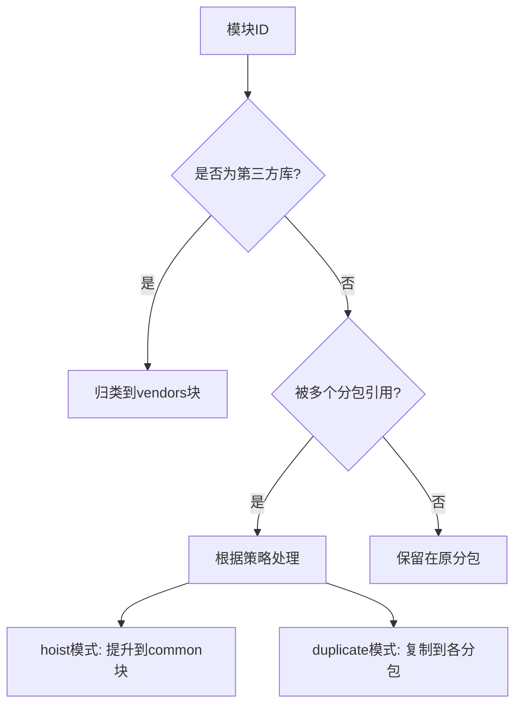
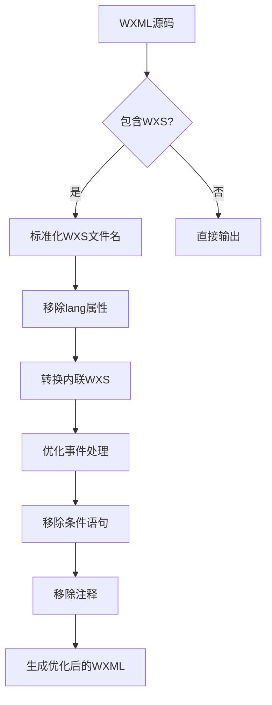

# 运行时优化

<cite>
**本文档引用的文件**   
- [chunkStrategy.ts](file://packages/weapp-vite/src/runtime/chunkStrategy.ts)
- [advancedChunks.ts](file://packages/weapp-vite/src/runtime/advancedChunks.ts)
- [core.ts](file://packages/weapp-vite/src/plugins/core.ts)
- [wxs/index.ts](file://packages/weapp-vite/src/wxs/index.ts)
- [wxml/handle.ts](file://packages/weapp-vite/src/wxml/handle.ts)
- [css.ts](file://packages/weapp-vite/src/plugins/css.ts)
- [wxss.ts](file://packages/web/src/css/wxss.ts)
- [vite-plugin-performance](file://packages/vite-plugin-performance)
</cite>

## 目录
1. [代码分割与懒加载策略](#代码分割与懒加载策略)
2. [advancedChunks与chunkStrategy优化](#advancedchunks与chunkstrategy优化)
3. [资源优化技术](#资源优化技术)
4. [运行时性能分析工具](#运行时性能分析工具)
5. [高级优化技巧](#高级优化技巧)

## 代码分割与懒加载策略

weapp-vite通过分包优化和按需加载机制实现高效的代码分割与懒加载。系统支持主包与分包架构，通过`subPackageRoots`配置分包根目录，实现模块的合理划分。对于跨分包共享的模块，系统采用智能分析机制，识别被多个分包引用的公共模块，并将其提取为共享块。

按需加载机制通过动态导入实现，系统会分析模块依赖关系，仅在需要时加载相应代码块。对于页面级别的预加载，系统提供了`removeImplicitPagePreloads`功能，可以移除不必要的隐式页面预加载，减少初始加载体积。该功能通过分析`implicitlyLoadedBefore`属性，识别并移除对页面chunk的预加载引用，从而优化启动性能。

分包优化策略还包括独立分包构建，通过`buildIndependentBundle`函数实现分包的独立构建流程。每个分包可以配置独立的构建选项，实现更精细的构建控制。这种策略特别适用于大型应用，可以显著减少主包体积，提高加载速度。

**Section sources**
- [chunkStrategy.ts](file://packages/weapp-vite/src/runtime/chunkStrategy.ts#L8-807)
- [core.ts](file://packages/weapp-vite/src/plugins/core.ts#L59-105)

## advancedChunks与chunkStrategy优化

weapp-vite的运行时优化核心在于`advancedChunks`和`chunkStrategy`机制。`advancedChunks`提供高级代码块名称解析功能，通过`createAdvancedChunkNameResolver`函数创建解析器，实现更智能的代码分割策略。

`chunkStrategy`定义了共享代码块的处理策略，支持`hoist`（提升）和`duplicate`（复制）两种模式。在`hoist`模式下，共享模块被提升到主包的`common`块中；在`duplicate`模式下，共享模块被复制到各个分包中。系统通过`resolveSharedChunkName`函数确定共享块的名称，该函数分析模块的导入关系，确保跨分包共享的模块能够被正确识别和处理。

`advancedChunks`机制进一步增强了代码分割能力，通过`vendorsMatchers`配置，可以将`node_modules`中的第三方库统一归类到`vendors`块中。这不仅减少了代码重复，还提高了缓存效率。当`strategy`为`hoist`时，第三方库会被集中到`vendors`块；当为`duplicate`时，则根据分包情况进行复制。

系统还支持强制复制机制，通过`forceDuplicateTester`函数，可以指定特定模块即使在主包中也要进行复制。这对于某些需要在每个分包中独立运行的模块非常有用，避免了跨分包调用的性能开销。



**Diagram sources **
- [advancedChunks.ts](file://packages/weapp-vite/src/runtime/advancedChunks.ts#L1-57)
- [chunkStrategy.ts](file://packages/weapp-vite/src/runtime/chunkStrategy.ts#L76-162)

**Section sources**
- [advancedChunks.ts](file://packages/weapp-vite/src/runtime/advancedChunks.ts#L1-57)
- [chunkStrategy.ts](file://packages/weapp-vite/src/runtime/chunkStrategy.ts#L76-162)

## 资源优化技术

weapp-vite提供了一系列资源优化技术，包括CSS提取、WXML优化和WXS编译优化，显著提升小程序的运行性能。

### CSS提取与优化

CSS资源通过`css.ts`插件进行处理，系统会将CSS文件转换为小程序支持的WXSS格式。`transformWxssToCss`函数负责rpx到px的转换，通过`pxPerRpx`配置项控制转换比例，默认值为0.5，即1rpx等于0.5px。这种转换确保了在不同设备上的显示一致性。

CSS提取过程还包括共享样式注入，通过`injectSharedStyleImports`函数，可以将公共样式自动注入到各个页面中。这避免了样式的重复定义，减少了包体积。同时，系统支持多种CSS预处理器，包括scss、less、sass和styl，开发者可以根据需要选择合适的预处理方式。

### WXML优化

WXML优化主要通过`wxml/handle.ts`文件中的`handleWxml`函数实现。该函数提供了一系列优化功能：
- WXS文件名标准化：通过`normalizeWxsFilename`函数确保WXS文件扩展名统一
- WXS语言属性移除：移除`lang`属性，简化WXML结构
- 内联WXS转换：将内联WXS代码转换为可执行的JavaScript
- 事件处理优化：转换事件绑定语法，提高运行效率
- 条件语句移除：移除不必要的条件语句，精简代码
- 注释移除：在生产环境中移除注释，减少文件大小

这些优化通过`MagicString`库实现，确保代码转换的准确性和高效性。系统还提供了缓存机制，避免重复处理相同的WXML内容，进一步提升构建性能。

### WXS编译优化

WXS（WeiXin Script）是小程序特有的脚本语言，weapp-vite通过Babel进行编译优化。`transformWxsCode`函数使用`@babel/preset-env`和`@babel/preset-typescript`预设，将现代JavaScript语法转换为小程序运行环境支持的代码。

编译过程包括：
- `require`调用处理：将`require`调用的路径标准化
- `__esModule`定义移除：移除不必要的模块定义
- `RegExp`和`Date`构造函数转换：转换为小程序支持的`getRegExp`和`getDate`调用
- `exports`成员表达式转换：确保模块导出的正确性
- `import`声明处理：收集模块依赖关系

这些优化确保了WXS代码在小程序环境中的兼容性和运行效率。系统还提供了`wxsCodeCache`缓存，避免重复编译相同的WXS代码，显著提升构建速度。



**Diagram sources **
- [wxml/handle.ts](file://packages/weapp-vite/src/wxml/handle.ts#L83-139)
- [wxss.ts](file://packages/web/src/css/wxss.ts#L1-28)

**Section sources**
- [wxml/handle.ts](file://packages/weapp-vite/src/wxml/handle.ts#L83-139)
- [css.ts](file://packages/weapp-vite/src/plugins/css.ts#L37-204)
- [wxs/index.ts](file://packages/weapp-vite/src/wxs/index.ts#L1-140)

## 运行时性能分析工具

weapp-vite集成了`vite-plugin-performance`性能分析工具，帮助开发者识别和解决运行时性能瓶颈。该工具可以包裹Vite插件，测量每个生命周期钩子的执行时间，提供详细的性能数据。

### 配置与使用

`vite-plugin-performance`通过`wrapPlugin`函数使用，可以包裹单个或多个插件。基本配置如下：

```typescript
import { wrapPlugin } from 'vite-plugin-performance'

export default {
  plugins: [
    wrapPlugin(YourPlugin(), {
      threshold: 50, // 设置性能阈值（毫秒）
      onHookExecution: ({ pluginName, hookName, duration }) => {
        // 自定义性能数据处理
        console.log(`${pluginName} ${hookName} 耗时: ${duration}ms`)
      }
    })
  ]
}
```

### 性能监控指标

该工具监控以下关键性能指标：
- **钩子执行时间**：测量每个插件钩子的执行时间
- **内存使用变化**：监控构建过程中的内存消耗
- **依赖分析时间**：测量依赖解析的耗时
- **代码转换时间**：监控代码转换和优化的耗时

### 分析仪表盘

weapp-vite提供了分析仪表盘功能，通过`analyze-dashboard`可视化构建结果。仪表盘显示：
- 包体数量和源码模块数量
- 各分包的大小分布
- 模块依赖关系图
- 共享代码的复用情况

开发者可以通过仪表盘快速识别包体结构中的问题，如过大的分包或重复的代码块，从而进行针对性优化。

**Section sources**
- [vite-plugin-performance](file://packages/vite-plugin-performance)
- [analyze-dashboard](file://packages/weapp-vite/analyze-dashboard)

## 高级优化技巧

为追求极致运行时性能，weapp-vite提供了一系列高级优化技巧：

### 分包策略优化

合理规划分包结构是性能优化的关键。建议：
- 将高频使用的功能模块放在主包
- 将低频使用的功能模块拆分为独立分包
- 将公共组件和工具函数提取为共享模块
- 避免分包间的循环依赖

通过`markTakeModuleImporter`函数，可以显式指定模块的导入关系，确保共享模块被正确处理。对于必须在每个分包中独立运行的模块，可以使用`forceDuplicateTester`强制复制策略。

### 缓存优化

weapp-vite充分利用缓存机制提升性能：
- `wxsCodeCache`：缓存编译后的WXS代码
- `handleCache`：缓存WXML处理结果
- `inlineWxsTransformCache`：缓存内联WXS转换结果

合理配置缓存大小和策略，可以显著减少重复计算，提高构建速度。建议在开发环境中启用完整缓存，在生产环境中根据内存情况调整缓存大小。

### 懒加载优化

除了页面级别的懒加载，还可以实现组件级别的懒加载：
- 使用动态导入加载非关键组件
- 按需加载大型第三方库
- 延迟加载非首屏内容

通过`import()`语法实现动态导入，系统会自动将其转换为小程序支持的异步加载方式。结合`IntersectionObserver`等API，可以实现滚动触加载等高级懒加载模式。

### 构建配置优化

在`vite.config.ts`中配置优化选项：
```typescript
export default {
  weappVite: {
    chunks: {
      sharedStrategy: 'duplicate', // 或 'hoist'
      forceDuplicatePatterns: [/critical-module/] // 强制复制的模块
    }
  }
}
```

这些高级技巧需要根据具体应用场景灵活运用，通过性能分析工具验证优化效果，持续迭代改进。

**Section sources**
- [chunkStrategy.ts](file://packages/weapp-vite/src/runtime/chunkStrategy.ts#L1-807)
- [advancedChunks.ts](file://packages/weapp-vite/src/runtime/advancedChunks.ts#L1-57)
- [wxs/index.ts](file://packages/weapp-vite/src/wxs/index.ts#L1-140)