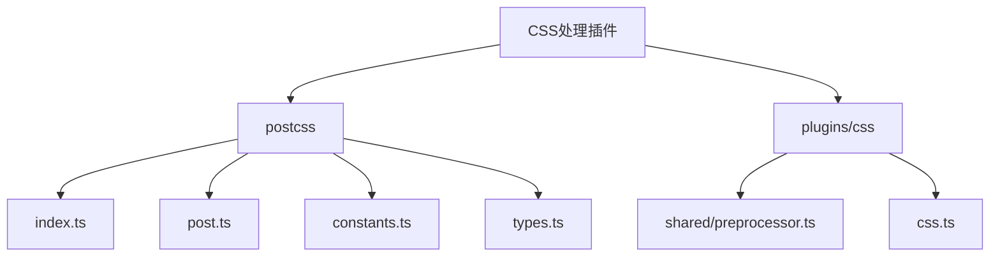
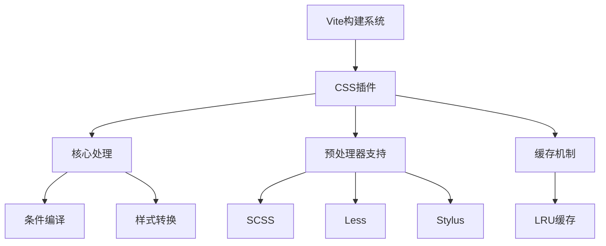
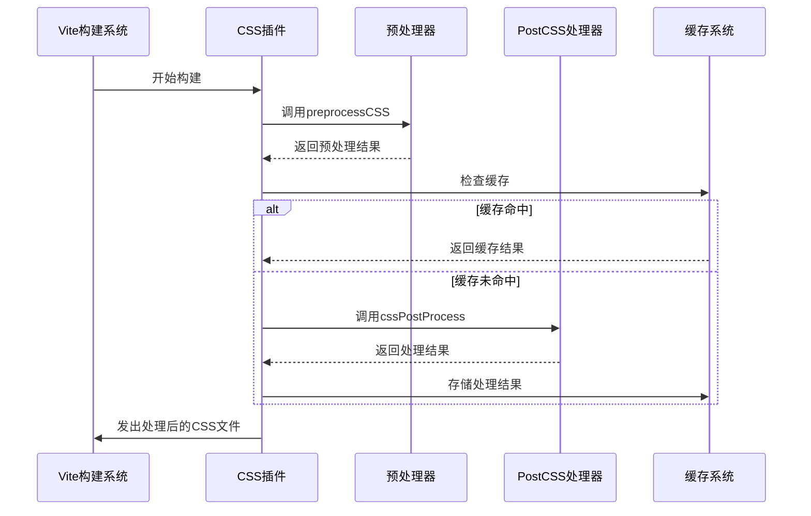
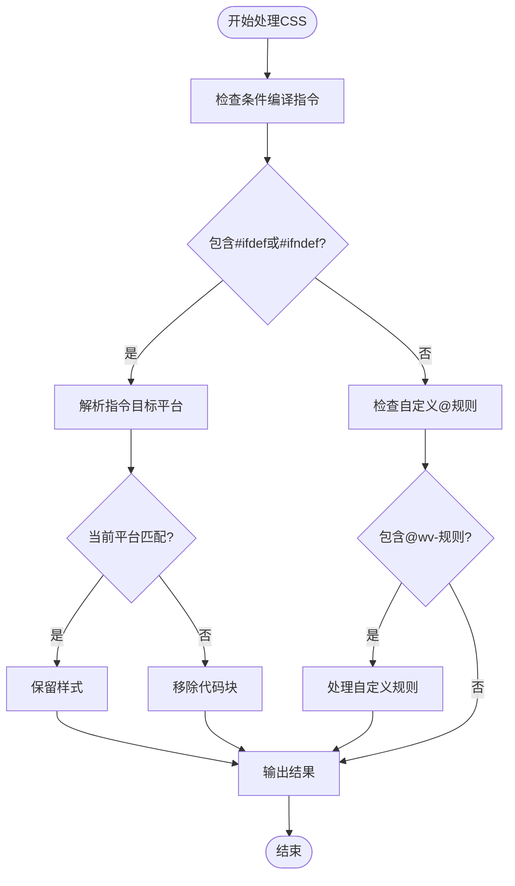
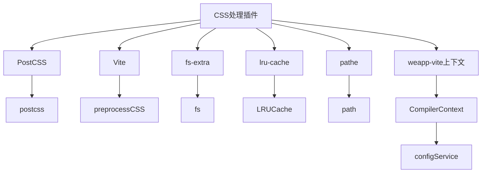

# CSS处理插件

<cite>
**本文档中引用的文件**  
- [index.ts](file://packages/weapp-vite/src/postcss/index.ts)
- [post.ts](file://packages/weapp-vite/src/postcss/post.ts)
- [constants.ts](file://packages/weapp-vite/src/postcss/constants.ts)
- [types.ts](file://packages/weapp-vite/src/postcss/types.ts)
- [preprocessor.ts](file://packages/weapp-vite/src/plugins/css/shared/preprocessor.ts)
- [css.ts](file://packages/weapp-vite/src/plugins/css.ts)
- [postcss.config.js](file://apps/weapp-wechat-zhihu/postcss.config.js)
</cite>

## 目录
1. [简介](#简介)
2. [项目结构](#项目结构)
3. [核心组件](#核心组件)
4. [架构概述](#架构概述)
5. [详细组件分析](#详细组件分析)
6. [依赖分析](#依赖分析)
7. [性能考虑](#性能考虑)
8. [故障排除指南](#故障排除指南)
9. [结论](#结论)

## 简介
CSS处理插件是WeApp Vite构建系统中的关键组件，负责处理小程序中的样式文件。该插件支持多种CSS预处理器（如SCSS、Less）、PostCSS集成以及样式转换机制。它能够处理不同平台的条件编译，并与构建系统无缝集成，在编译过程中执行样式处理任务。本文档将详细介绍该插件的工作原理、配置选项和最佳实践。

## 项目结构
CSS处理插件的代码主要分布在`packages/weapp-vite/src/postcss`和`packages/weapp-vite/src/plugins/css`目录中。插件通过Vite插件系统集成到构建流程中，提供了完整的CSS处理能力。



**图示来源**  
- [index.ts](file://packages/weapp-vite/src/postcss/index.ts)
- [post.ts](file://packages/weapp-vite/src/postcss/post.ts)
- [constants.ts](file://packages/weapp-vite/src/postcss/constants.ts)
- [types.ts](file://packages/weapp-vite/src/postcss/types.ts)
- [preprocessor.ts](file://packages/weapp-vite/src/plugins/css/shared/preprocessor.ts)
- [css.ts](file://packages/weapp-vite/src/plugins/css.ts)

**本节来源**  
- [packages/weapp-vite/src/postcss](file://packages/weapp-vite/src/postcss)
- [packages/weapp-vite/src/plugins/css](file://packages/weapp-vite/src/plugins/css)

## 核心组件
CSS处理插件的核心功能包括预处理器支持、PostCSS处理和条件编译。插件通过`cssPostProcess`函数处理CSS代码，利用PostCSS插件系统实现样式转换。`processCssWithCache`函数提供了缓存机制，提高构建性能。插件还支持SCSS、Less等预处理器，通过Vite的`preprocessCSS`函数进行处理。

**本节来源**  
- [index.ts](file://packages/weapp-vite/src/postcss/index.ts#L8-L14)
- [preprocessor.ts](file://packages/weapp-vite/src/plugins/css/shared/preprocessor.ts#L21-L36)
- [css.ts](file://packages/weapp-vite/src/plugins/css.ts#L204-L210)

## 架构概述
CSS处理插件采用分层架构设计，分为核心处理层、预处理器层和插件集成层。核心处理层负责基本的CSS处理和条件编译，预处理器层支持各种CSS预处理器，插件集成层将CSS处理功能集成到Vite构建系统中。



**图示来源**  
- [css.ts](file://packages/weapp-vite/src/plugins/css.ts#L235-L250)
- [preprocessor.ts](file://packages/weapp-vite/src/plugins/css/shared/preprocessor.ts#L11-L13)
- [index.ts](file://packages/weapp-vite/src/postcss/index.ts#L8-L14)

## 详细组件分析

### 核心处理组件分析
CSS处理插件的核心处理功能通过PostCSS实现，支持条件编译和自定义规则处理。

#### 核心处理类图
```mermaid
classDiagram
class cssPostProcess {
+cssPostProcess(code : string, options : CssPostProcessOptions) Promise~string~
}
class postCreator {
+postCreator(options : {platform : MpPlatform}) PluginCreator
+postcss : true
}
class processCssWithCache {
+processCssWithCache(code : string, configService : CompilerContext['configService']) Promise~string~
}
cssPostProcess --> postCreator : "使用"
processCssWithCache --> cssPostProcess : "使用"
```

**图示来源**  
- [index.ts](file://packages/weapp-vite/src/postcss/index.ts#L8-L14)
- [post.ts](file://packages/weapp-vite/src/postcss/post.ts#L76-L140)
- [preprocessor.ts](file://packages/weapp-vite/src/plugins/css/shared/preprocessor.ts#L21-L36)

#### 处理流程序列图


**图示来源**  
- [css.ts](file://packages/weapp-vite/src/plugins/css.ts#L200-L213)
- [preprocessor.ts](file://packages/weapp-vite/src/plugins/css/shared/preprocessor.ts#L99-L106)
- [index.ts](file://packages/weapp-vite/src/postcss/index.ts#L8-L14)

#### 条件编译流程图


**图示来源**  
- [post.ts](file://packages/weapp-vite/src/postcss/post.ts#L107-L133)
- [constants.ts](file://packages/weapp-vite/src/postcss/constants.ts#L3-L7)

**本节来源**  
- [index.ts](file://packages/weapp-vite/src/postcss/index.ts)
- [post.ts](file://packages/weapp-vite/src/postcss/post.ts)
- [constants.ts](file://packages/weapp-vite/src/postcss/constants.ts)
- [preprocessor.ts](file://packages/weapp-vite/src/plugins/css/shared/preprocessor.ts)

## 依赖分析
CSS处理插件依赖于多个外部库和内部模块，形成了复杂的依赖关系网络。



**图示来源**  
- [index.ts](file://packages/weapp-vite/src/postcss/index.ts#L2)
- [preprocessor.ts](file://packages/weapp-vite/src/plugins/css/shared/preprocessor.ts#L1-L9)
- [css.ts](file://packages/weapp-vite/src/plugins/css.ts#L236-L237)

**本节来源**  
- [index.ts](file://packages/weapp-vite/src/postcss/index.ts)
- [preprocessor.ts](file://packages/weapp-vite/src/plugins/css/shared/preprocessor.ts)
- [css.ts](file://packages/weapp-vite/src/plugins/css.ts)

## 性能考虑
CSS处理插件通过多种机制优化构建性能，包括缓存、条件处理和依赖管理。

- **缓存机制**：使用LRU缓存存储处理后的CSS代码，避免重复处理
- **条件检查**：在处理前检查是否需要PostCSS处理，跳过不需要处理的文件
- **依赖跟踪**：跟踪样式文件的依赖关系，实现增量构建
- **Tailwind JIT支持**：特殊处理Tailwind CSS的JIT模式，确保样式正确生成

**本节来源**  
- [preprocessor.ts](file://packages/weapp-vite/src/plugins/css/shared/preprocessor.ts#L11-L13)
- [index.ts](file://packages/weapp-vite/src/postcss/index.ts#L9-L11)
- [preprocessor.ts](file://packages/weapp-vite/src/plugins/css/shared/preprocessor.ts#L126-L161)

## 故障排除指南
当遇到CSS处理问题时，可以参考以下常见问题和解决方案：

- **样式未生效**：检查条件编译指令是否正确，确保平台匹配
- **预处理器错误**：确认已安装相应的预处理器包（如sass、less）
- **缓存问题**：清除缓存或重启开发服务器
- **PostCSS插件未生效**：检查postcss.config.js配置是否正确

**本节来源**  
- [post.ts](file://packages/weapp-vite/src/postcss/post.ts#L107-L133)
- [preprocessor.ts](file://packages/weapp-vite/src/plugins/css/shared/preprocessor.ts#L64-L72)
- [postcss.config.js](file://apps/weapp-wechat-zhihu/postcss.config.js)

## 结论
CSS处理插件为WeApp Vite提供了强大的样式处理能力，支持多种预处理器和PostCSS集成。通过条件编译和缓存机制，插件能够高效处理小程序样式文件，满足不同平台的开发需求。开发者可以利用这些功能实现灵活的样式管理，提高开发效率。