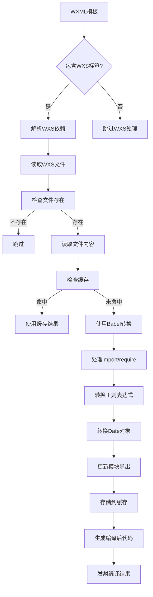
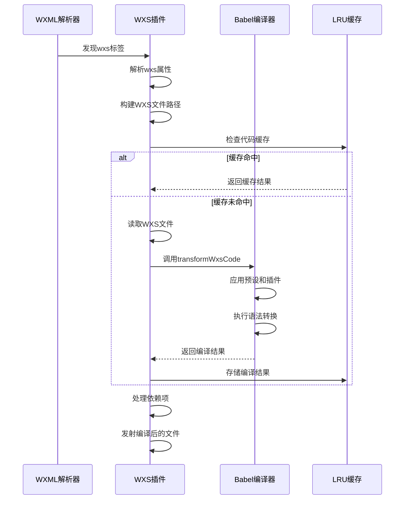
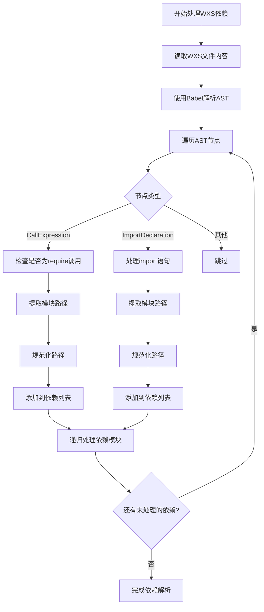

# WXS脚本插件

<cite>
**本文档引用的文件**  
- [wxs.ts](file://packages/weapp-vite/src/plugins/wxs.ts)
- [index.ts](file://packages/weapp-vite/src/wxs/index.ts)
- [utils.ts](file://packages/weapp-vite/src/wxs/utils.ts)
- [handle.ts](file://packages/weapp-vite/src/wxml/handle.ts)
- [constants.ts](file://packages/weapp-vite/src/constants.ts)
</cite>

## 目录
1. [简介](#简介)
2. [WXS插件架构](#wxs插件架构)
3. [语法解析与编译机制](#语法解析与编译机制)
4. [模块支持与作用域管理](#模块支持与作用域管理)
5. [依赖处理机制](#依赖处理机制)
6. [WXS在模板中的使用](#wxs在模板中的使用)
7. [与其他构建插件的协作](#与其他构建插件的协作)
8. [最佳实践](#最佳实践)

## 简介

WXS（WeiXin Script）是微信小程序中的一种脚本语言，用于在WXML模板中执行简单的逻辑处理。weapp-vite通过专门的WXS插件提供了对WXS脚本的增强支持，包括对TypeScript和JavaScript语法的支持、模块化处理、依赖解析和编译优化等功能。该插件使得开发者可以使用现代JavaScript/TypeScript语法编写WXS脚本，并在小程序中无缝集成。

**Section sources**
- [wxs.ts](file://packages/weapp-vite/src/plugins/wxs.ts#L1-L141)

## WXS插件架构

WXS插件是weapp-vite构建系统中的一个重要组成部分，负责处理所有与WXS相关的编译任务。插件采用预构建（pre-build）模式，在构建过程的早期阶段介入，确保WXS脚本能够被正确解析和转换。

插件的核心组件包括：
- **WXS代码缓存**：使用LRU缓存机制存储已编译的WXS代码，提高构建性能
- **文件转换器**：负责读取、解析和转换WXS文件
- **依赖处理器**：分析WXML模板中的WXS依赖关系
- **Babel转换器**：使用Babel进行语法转换和降级处理

插件通过Vite插件系统注册，设置为预处理模式（enforce: 'pre'），确保在其他插件处理之前完成WXS相关的转换工作。



**Diagram sources**
- [wxs.ts](file://packages/weapp-vite/src/plugins/wxs.ts#L1-L141)

**Section sources**
- [wxs.ts](file://packages/weapp-vite/src/plugins/wxs.ts#L1-L141)

## 语法解析与编译机制

WXS插件使用Babel作为核心的语法解析和编译引擎，支持现代JavaScript和TypeScript语法。编译过程主要包括以下几个步骤：

### 语法转换规则

插件通过Babel插件系统实现了一系列特定的转换规则，以确保WXS脚本能够在小程序环境中正确运行：

1. **移除use strict指令**：WXS环境不支持严格模式指令，插件会自动移除所有`"use strict"`指令
2. **模块系统转换**：将ES模块语法转换为WXS兼容的模块系统
3. **正则表达式转换**：将`new RegExp()`和正则字面量转换为`getRegExp()`调用
4. **日期对象转换**：将`new Date()`转换为`getDate()`调用
5. **模块导出转换**：将`exports.xxx`转换为`module.exports.xxx`

### 编译流程



**Diagram sources**
- [index.ts](file://packages/weapp-vite/src/wxs/index.ts#L1-L140)
- [wxs.ts](file://packages/weapp-vite/src/plugins/wxs.ts#L1-L141)

**Section sources**
- [index.ts](file://packages/weapp-vite/src/wxs/index.ts#L1-L140)

## 模块支持与作用域管理

WXS插件提供了完整的模块支持和作用域管理机制，确保WXS脚本能够在正确的上下文中运行。

### 模块解析

插件支持多种WXS模块的引入方式：

1. **外部WXS文件**：通过`<wxs module="moduleName" src="./path.wxs" />`标签引入
2. **内联WXS代码**：直接在WXML中编写WXS代码
3. **TypeScript/JavaScript文件**：支持`.wxs.ts`和`.wxs.js`扩展名

### 作用域隔离

每个WXS模块都有独立的作用域，避免变量和函数的命名冲突。插件通过以下机制实现作用域隔离：

- **模块包装**：将每个WXS模块包装在独立的函数作用域中
- **变量重命名**：对模块内部的私有变量进行重命名，防止外部访问
- **导出控制**：只暴露通过`module.exports`或`export`声明的公共接口

### 文件名规范化

插件提供了文件名规范化功能，确保WXS模块的路径正确性：

```typescript
export function normalizeWxsFilename(value: string) {
  return addExtension(removeExtensionDeep(value), '.wxs')
}
```

此函数会移除输入路径的所有扩展名，然后添加`.wxs`扩展名，确保模块引用的一致性。

**Section sources**
- [utils.ts](file://packages/weapp-vite/src/wxs/utils.ts#L1-L6)
- [index.ts](file://packages/weapp-vite/src/wxs/index.ts#L1-L140)

## 依赖处理机制

WXS插件实现了完整的依赖处理机制，能够自动解析和处理WXS脚本中的各种依赖关系。

### 依赖类型

插件支持以下几种依赖类型：

1. **静态依赖**：通过`require('./module.wxs')`或`import './module.wxs'`引入的模块
2. **动态依赖**：通过变量拼接路径的动态引入
3. **嵌套依赖**：被依赖的模块自身又依赖其他模块

### 依赖解析流程



### 依赖缓存

为了提高构建性能，插件使用LRU缓存存储已处理的WXS代码：

```typescript
export const wxsCodeCache = new LRUCache<string, string>({
  max: 512,
})
```

缓存使用原始代码作为键，编译后的代码作为值，当缓存达到最大容量时，最久未使用的条目将被移除。

**Section sources**
- [wxs.ts](file://packages/weapp-vite/src/plugins/wxs.ts#L1-L141)
- [index.ts](file://packages/weapp-vite/src/wxs/index.ts#L1-L140)

## WXS在模板中的使用

WXS脚本可以在WXML模板中以多种方式使用，插件提供了相应的支持和转换。

### 外部WXS文件

在WXML中通过`<wxs>`标签引入外部WXS文件：

```xml
<wxs module="utils" src="./utils.wxs" />
<view>{{utils.formatDate(data)}}</view>
```

插件会自动解析`src`属性，编译对应的WXS文件，并在输出中正确引用。

### 内联WXS代码

支持在WXML中直接编写WXS代码：

```xml
<wxs module="inline">
  var msg = "Hello World";
  module.exports = {
    message: msg
  }
</wxs>
<view>{{inline.message}}</view>
```

插件会提取内联代码，使用Babel进行编译，并将其转换为标准的WXS格式。

### TypeScript支持

插件支持使用TypeScript编写WXS脚本，文件扩展名为`.wxs.ts`：

```typescript
// utils.wxs.ts
export const formatDate = (date: string): string => {
  return date.replace(/-/g, '/')
}

export const capitalize = (str: string): string => {
  return str.charAt(0).toUpperCase() + str.slice(1)
}
```

在WXML中使用：

```xml
<wxs module="utils" src="./utils.wxs.ts" />
<view>{{utils.formatDate('2023-12-01')}}</view>
```

插件会自动将TypeScript代码编译为兼容的JavaScript代码。

**Section sources**
- [handle.ts](file://packages/weapp-vite/src/wxml/handle.ts#L1-L140)
- [index.ts](file://packages/weapp-vite/src/wxs/index.ts#L1-L140)

## 与其他构建插件的协作

WXS插件与其他构建插件协同工作，形成完整的构建流水线。

### 插件执行顺序


WXS插件设置为预处理模式（enforce: 'pre'），确保在其他插件处理之前完成WXS相关的转换工作。

### 与Vite生态集成

WXS插件遵循Vite插件规范，与其他Vite插件无缝集成：

- **开发服务器**：在开发模式下，插件支持热更新，当WXS文件修改时自动重新编译
- **生产构建**：在生产模式下，插件生成优化后的WXS代码，并与其他资源一起打包
- **依赖追踪**：插件正确标记文件依赖关系，确保增量构建的准确性

### 配置选项

WXS插件可以通过配置文件进行定制：

```typescript
// vite.config.ts
export default defineConfig({
  weapp: {
    wxs: true, // 启用WXS增强
    // 其他配置...
  }
})
```

**Section sources**
- [wxs.ts](file://packages/weapp-vite/src/plugins/wxs.ts#L1-L141)
- [constants.ts](file://packages/weapp-vite/src/constants.ts#L1-L30)

## 最佳实践

为了充分利用WXS插件的功能，建议遵循以下最佳实践：

### 1. 使用TypeScript编写WXS

利用TypeScript的类型检查和现代语法特性，提高代码质量和可维护性：

```typescript
// 推荐：使用TypeScript
export const validateEmail = (email: string): boolean => {
  const pattern = getRegExp('^[a-zA-Z0-9._%+-]+@[a-zA-Z0-9.-]+\\.[a-zA-Z]{2,}$')
  return pattern.test(email)
}

export interface User {
  id: number
  name: string
  email: string
}
```

### 2. 模块化组织代码

将相关功能组织在独立的WXS模块中，便于复用和维护：

```
utils/
├── date.wxs.ts
├── string.wxs.ts
├── validation.wxs.ts
└── index.wxs.ts
```

在`index.wxs.ts`中统一导出：

```typescript
export * from './date.wxs.ts'
export * from './string.wxs.ts'
export * from './validation.wxs.ts'
```

### 3. 避免复杂逻辑

WXS主要用于模板中的简单逻辑处理，避免在WXS中实现复杂的业务逻辑：

```typescript
// 推荐：简单格式化
export const formatPrice = (price: number): string => {
  return `¥${price.toFixed(2)}`
}

// 不推荐：复杂业务逻辑
export const calculateOrderTotal = (items: Item[], discounts: Discount[]) => {
  // 复杂的计算逻辑...
  // 应该在JS/TS文件中处理
}
```

### 4. 合理使用缓存

对于计算密集型的WXS函数，可以考虑使用缓存机制：

```typescript
const cache = new Map<string, string>()

export const expensiveOperation = (input: string): string => {
  if (cache.has(input)) {
    return cache.get(input)!
  }
  
  const result = /* 复杂计算 */
  cache.set(input, result)
  return result
}
```

### 5. 注意性能影响

WXS代码在小程序的渲染层执行，频繁的WXS调用可能影响渲染性能：

- 避免在列表渲染中使用复杂的WXS函数
- 尽量将计算逻辑移到JS/TS文件中，在数据层完成
- 使用memoization技术缓存计算结果

通过遵循这些最佳实践，开发者可以充分利用WXS插件的功能，同时确保小程序的性能和可维护性。

**Section sources**
- [index.ts](file://packages/weapp-vite/src/wxs/index.ts#L1-L140)
- [wxs.ts](file://packages/weapp-vite/src/plugins/wxs.ts#L1-L141)
- [utils.ts](file://packages/weapp-vite/src/wxs/utils.ts#L1-L6)