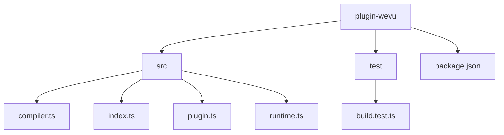
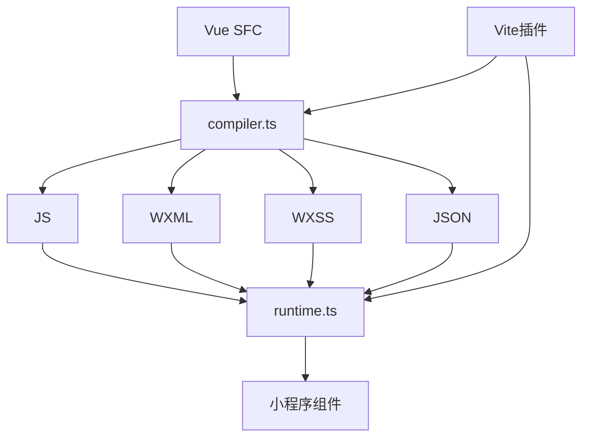
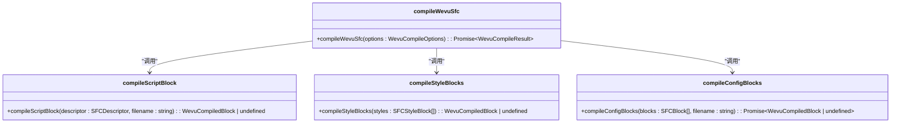
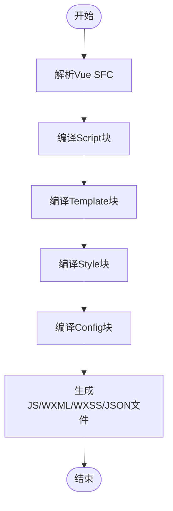
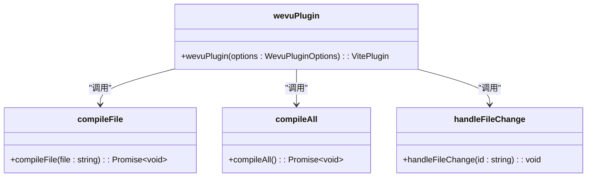
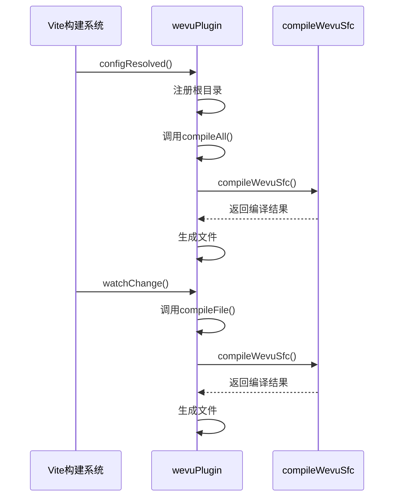
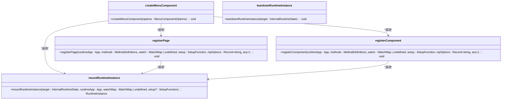
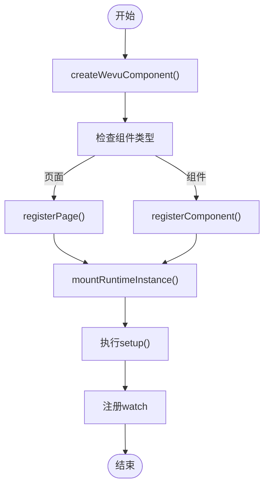

# plugin-wevu插件

<cite>
**本文档引用的文件**   
- [index.ts](file://packages/plugin-wevu/src/index.ts)
- [plugin.ts](file://packages/plugin-wevu/src/plugin.ts)
- [compiler.ts](file://packages/plugin-wevu/src/compiler.ts)
- [runtime.ts](file://packages/plugin-wevu/src/runtime.ts)
- [wevu-vue-demo/src/app.vue](file://apps/wevu-vue-demo/src/app.vue)
- [wevu-vue-demo/src/pages/wevu/index.vue](file://apps/wevu-vue-demo/src/pages/wevu/index.vue)
- [wevu-vue-demo/vite.config.ts](file://apps/wevu-vue-demo/vite.config.ts)
- [build.test.ts](file://packages/plugin-wevu/test/build.test.ts)
</cite>

## 目录
1. [介绍](#介绍)
2. [项目结构](#项目结构)
3. [核心组件](#核心组件)
4. [架构概述](#架构概述)
5. [详细组件分析](#详细组件分析)
6. [依赖分析](#依赖分析)
7. [性能考虑](#性能考虑)
8. [故障排除指南](#故障排除指南)
9. [结论](#结论)

## 介绍

plugin-wevu插件为weapp-vite提供了Vue语法支持，允许开发者使用Vue单文件组件（SFC）语法开发小程序。该插件通过编译器将Vue SFC转换为小程序原生组件，同时提供运行时支持，实现了Vue的响应式系统和组合式API在小程序环境中的应用。

插件的核心功能包括：
- 将Vue SFC编译为小程序的WXML、WXSS、JS和JSON文件
- 提供运行时支持，实现Vue的响应式数据绑定和计算属性
- 支持Vue的watch机制，监听数据变化
- 兼容Vue的setup语法，提供组合式API能力

**Section sources**
- [index.ts](file://packages/plugin-wevu/src/index.ts)
- [plugin.ts](file://packages/plugin-wevu/src/plugin.ts)

## 项目结构

plugin-wevu插件的项目结构清晰，主要包含以下几个部分：

```
packages/plugin-wevu/
├── src/
│   ├── compiler.ts        # Vue SFC编译器
│   ├── index.ts           # 插件入口
│   ├── plugin.ts          # Vite插件实现
│   └── runtime.ts         # 运行时支持
├── test/
│   └── build.test.ts      # 构建测试
└── package.json           # 项目配置
```

插件的源码位于`src`目录下，其中`compiler.ts`负责Vue SFC的编译，`plugin.ts`实现了Vite插件接口，`runtime.ts`提供了运行时支持。测试文件位于`test`目录下，用于验证插件的功能。



**Diagram sources **
- [package.json](file://packages/plugin-wevu/package.json)
- [src](file://packages/plugin-wevu/src)

**Section sources**
- [package.json](file://packages/plugin-wevu/package.json)
- [src](file://packages/plugin-wevu/src)

## 核心组件

plugin-wevu插件的核心组件包括编译器、Vite插件和运行时支持。编译器负责将Vue SFC转换为小程序原生文件，Vite插件负责在构建过程中调用编译器，运行时支持则提供了Vue的响应式系统和组合式API能力。

编译器通过解析Vue SFC的script、template、style和config块，分别生成对应的JS、WXML、WXSS和JSON文件。Vite插件在构建过程中监听文件变化，自动调用编译器重新编译修改的文件。运行时支持通过`createWevuComponent`函数将Vue组件挂载到小程序环境中，实现数据绑定和生命周期管理。

**Section sources**
- [compiler.ts](file://packages/plugin-wevu/src/compiler.ts)
- [plugin.ts](file://packages/plugin-wevu/src/plugin.ts)
- [runtime.ts](file://packages/plugin-wevu/src/runtime.ts)

## 架构概述

plugin-wevu插件的架构可以分为三个主要部分：编译器、Vite插件和运行时支持。编译器负责将Vue SFC转换为小程序原生文件，Vite插件负责在构建过程中调用编译器，运行时支持则提供了Vue的响应式系统和组合式API能力。



**Diagram sources **
- [compiler.ts](file://packages/plugin-wevu/src/compiler.ts)
- [runtime.ts](file://packages/plugin-wevu/src/runtime.ts)
- [plugin.ts](file://packages/plugin-wevu/src/plugin.ts)

## 详细组件分析

### 编译器分析

编译器是plugin-wevu插件的核心，负责将Vue SFC转换为小程序原生文件。编译器通过解析Vue SFC的script、template、style和config块，分别生成对应的JS、WXML、WXSS和JSON文件。

#### 编译器实现


**Diagram sources **
- [compiler.ts](file://packages/plugin-wevu/src/compiler.ts)

#### 编译流程


**Diagram sources **
- [compiler.ts](file://packages/plugin-wevu/src/compiler.ts)

**Section sources**
- [compiler.ts](file://packages/plugin-wevu/src/compiler.ts)

### Vite插件分析

Vite插件负责在构建过程中调用编译器，将Vue SFC转换为小程序原生文件。插件通过监听文件变化，自动重新编译修改的文件。

#### Vite插件实现


**Diagram sources **
- [plugin.ts](file://packages/plugin-wevu/src/plugin.ts)

#### 插件执行流程


**Diagram sources **
- [plugin.ts](file://packages/plugin-wevu/src/plugin.ts)

**Section sources**
- [plugin.ts](file://packages/plugin-wevu/src/plugin.ts)

### 运行时支持分析

运行时支持提供了Vue的响应式系统和组合式API能力，通过`createWevuComponent`函数将Vue组件挂载到小程序环境中。

#### 运行时实现


**Diagram sources **
- [runtime.ts](file://packages/plugin-wevu/src/runtime.ts)

#### 组件挂载流程


**Diagram sources **
- [runtime.ts](file://packages/plugin-wevu/src/runtime.ts)

**Section sources**
- [runtime.ts](file://packages/plugin-wevu/src/runtime.ts)

## 依赖分析

plugin-wevu插件依赖于多个外部库，包括Vue编译器、Babel解析器、文件操作库等。这些依赖项在`package.json`中定义，确保了插件的正常运行。

```mermaid
graph TD
A[plugin-wevu] --> B[vue/compiler-sfc]
A --> C[@babel/parser]
A --> D[@babel/traverse]
A --> E[fs-extra]
A --> F[fast-glob]
A --> G[rolldown-require]
A --> H[wevu]
```

**Diagram sources **
- [package.json](file://packages/plugin-wevu/package.json)

**Section sources**
- [package.json](file://packages/plugin-wevu/package.json)

## 性能考虑

plugin-wevu插件在设计时考虑了性能优化，包括：
- 使用`fast-glob`进行文件匹配，提高文件查找效率
- 在编译过程中缓存结果，避免重复编译
- 使用`magic-string`进行代码转换，减少内存占用
- 在运行时使用`createHash`生成唯一ID，避免重复计算

这些优化措施确保了插件在大型项目中的高效运行。

## 故障排除指南

在使用plugin-wevu插件时，可能会遇到一些常见问题。以下是一些故障排除建议：

1. **编译失败**：检查Vue SFC语法是否正确，确保没有语法错误。
2. **文件未生成**：检查Vite配置中的`include`和`outputRoot`选项，确保路径正确。
3. **运行时错误**：检查`createWevuComponent`的调用是否正确，确保组件选项符合要求。
4. **性能问题**：检查项目中是否有大量Vue SFC文件，考虑使用`include`选项限制编译范围。

**Section sources**
- [plugin.ts](file://packages/plugin-wevu/src/plugin.ts)
- [compiler.ts](file://packages/plugin-wevu/src/compiler.ts)
- [runtime.ts](file://packages/plugin-wevu/src/runtime.ts)

## 结论

plugin-wevu插件为weapp-vite提供了强大的Vue语法支持，通过编译器、Vite插件和运行时支持的协同工作，实现了Vue SFC到小程序原生组件的无缝转换。插件的设计考虑了性能优化和易用性，为开发者提供了高效的开发体验。

通过本文档的介绍，开发者可以深入了解plugin-wevu插件的实现原理和使用方法，充分利用Vue语法开发小程序，提高开发效率和代码质量。