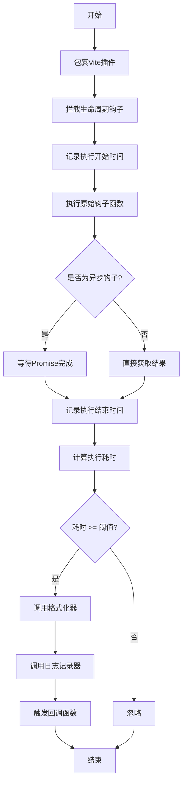
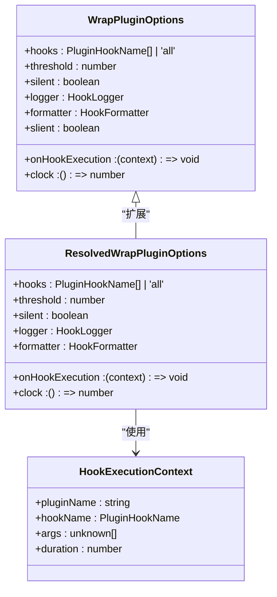
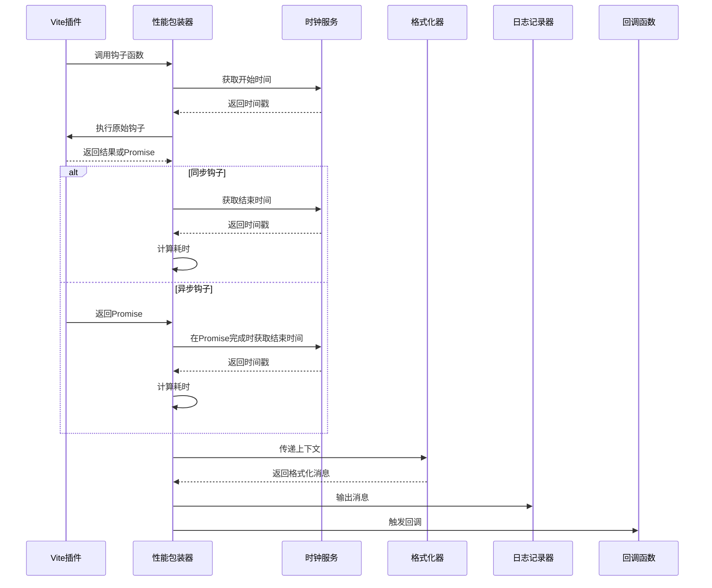

# vite-plugin-performance插件

<cite>
**本文档中引用的文件**  
- [index.ts](file://packages/vite-plugin-performance/src/index.ts)
- [options.ts](file://packages/vite-plugin-performance/src/options.ts)
- [types.ts](file://packages/vite-plugin-performance/src/types.ts)
- [constants.ts](file://packages/vite-plugin-performance/src/constants.ts)
- [wrapPlugin.ts](file://packages/vite-plugin-performance/src/wrapPlugin.ts)
- [weapp-vite/src/plugins/index.ts](file://packages/weapp-vite/src/plugins/index.ts)
- [README.md](file://packages/vite-plugin-performance/README.md)
- [README.zh-CN.md](file://packages/vite-plugin-performance/README.zh-CN.md)
</cite>

## 目录
1. [介绍](#介绍)
2. [核心功能](#核心功能)
3. [配置选项](#配置选项)
4. [数据收集机制](#数据收集机制)
5. [报告生成方式](#报告生成方式)
6. [实际示例与结果解读](#实际示例与结果解读)
7. [构建流程集成](#构建流程集成)
8. [性能优化指导](#性能优化指导)
9. [结论](#结论)

## 介绍

vite-plugin-performance是一个专为Vite构建系统设计的性能分析插件，旨在为weapp-vite项目提供全面的性能监控能力。该插件通过包裹Vite插件的生命周期钩子，精确测量每个钩子函数的执行时间，帮助开发者识别构建过程中的性能瓶颈。插件在保持原有插件行为不变的前提下，提供可操作的性能洞察，使开发者能够优化构建流程，提升开发效率。

**Section sources**
- [README.md](file://packages/vite-plugin-performance/README.md#L1-L10)
- [README.zh-CN.md](file://packages/vite-plugin-performance/README.zh-CN.md#L1-L10)

## 核心功能

vite-plugin-performance提供了多项核心功能，使其成为weapp-vite项目中不可或缺的性能分析工具。插件支持包裹单个或多个Vite插件，通过一次调用即可为多个插件添加性能监控。它内置了合理的默认钩子列表，包括`options`、`config`、`configResolved`、`configureServer`、`buildStart`、`resolveId`、`load`、`transform`等关键生命周期钩子，确保对构建流程的全面监控。

插件采用阈值过滤机制，只有当钩子执行时间超过设定阈值时才会记录和输出，避免了不必要的日志干扰。同时，插件提供了可插拔的日志记录器、格式化器和生命周期回调功能，便于与现有的监控系统集成。特别值得一提的是，插件完全兼容异步钩子，并能优雅地处理异常情况，确保在各种复杂的构建场景下都能准确收集性能数据。



**Diagram sources**
- [wrapPlugin.ts](file://packages/vite-plugin-performance/src/wrapPlugin.ts#L6-L86)
- [constants.ts](file://packages/vite-plugin-performance/src/constants.ts#L3-L16)

**Section sources**
- [README.md](file://packages/vite-plugin-performance/README.md#L7-L13)
- [README.zh-CN.md](file://packages/vite-plugin-performance/README.zh-CN.md#L7-L13)

## 配置选项

vite-plugin-performance提供了丰富的配置选项，允许开发者根据具体需求定制性能分析行为。主要配置选项包括：

| 选项 | 类型 | 默认值 | 说明 |
|------|------|--------|------|
| `hooks` | `PluginHookName[] \| 'all'` | `DEFAULT_PLUGIN_HOOKS` | 指定需要包裹的钩子；传 `'all'` 包裹所有函数钩子 |
| `threshold` | `number` | `0` | 只有耗时大于等于该值的钩子才会被记录 |
| `silent` | `boolean` | `false` | 关闭内置日志输出 |
| `logger` | `(message, context) => void` | `console.log` | 自定义日志输出函数 |
| `formatter` | `(context) => string` | `[plugin] transform ⏱  12.34 ms` | 自定义日志内容格式 |
| `onHookExecution` | `(context) => void` | `undefined` | 钩子执行完毕后触发，可用于上报 |
| `clock` | `() => number` | `performance.now` 或 `Date.now` | 高精度计时器，便于测试或自定义时间源 |

其中，`hooks`选项允许开发者指定需要监控的具体生命周期钩子，或者使用`'all'`来监控所有函数钩子。`threshold`选项用于设置性能阈值，只有执行时间超过此阈值的钩子才会被记录，这有助于过滤掉执行时间较短的钩子，专注于真正的性能瓶颈。`silent`选项可以关闭内置的日志输出，适用于需要完全自定义日志处理的场景。



**Diagram sources**
- [types.ts](file://packages/vite-plugin-performance/src/types.ts#L1-L44)
- [options.ts](file://packages/vite-plugin-performance/src/options.ts#L1-L40)

**Section sources**
- [README.md](file://packages/vite-plugin-performance/README.md#L47-L60)
- [README.zh-CN.md](file://packages/vite-plugin-performance/README.zh-CN.md#L47-L60)
- [options.ts](file://packages/vite-plugin-performance/src/options.ts#L15-L39)

## 数据收集机制

vite-plugin-performance的数据收集机制基于对Vite插件生命周期钩子的包裹和拦截。当插件被包裹后，其每个指定的生命周期钩子都会被替换为一个包装函数，该函数在调用原始钩子前后分别记录时间戳，从而计算出钩子的执行耗时。

数据收集过程从`wrapPlugin`函数开始，该函数接收一个或多个Vite插件以及配置选项。对于每个插件，插件会遍历其所有指定的钩子函数，并用性能监控包装函数替换它们。包装函数首先调用`clock()`函数获取当前时间作为开始时间，然后执行原始的钩子函数。对于异步钩子，包装函数会返回一个Promise，该Promise在原始钩子完成或拒绝时记录结束时间并计算耗时。

收集到的性能数据以`HookExecutionContext`对象的形式存在，包含插件名称、钩子名称、调用参数和执行耗时等信息。这些数据随后会被传递给格式化器、日志记录器和回调函数进行处理。整个数据收集过程对原始插件的行为完全透明，确保了构建流程的稳定性和可靠性。



**Diagram sources**
- [wrapPlugin.ts](file://packages/vite-plugin-performance/src/wrapPlugin.ts#L26-L48)
- [utils.ts](file://packages/vite-plugin-performance/src/utils.ts#L5-L7)

**Section sources**
- [wrapPlugin.ts](file://packages/vite-plugin-performance/src/wrapPlugin.ts#L6-L86)
- [utils.ts](file://packages/vite-plugin-performance/src/utils.ts#L1-L8)

## 报告生成方式

vite-plugin-performance提供了灵活的报告生成方式，允许开发者根据需求定制性能报告的输出格式和处理逻辑。当钩子执行时间超过设定阈值时，插件会触发报告生成流程，该流程包括格式化、日志输出和回调执行三个主要步骤。

默认情况下，插件使用内置的格式化器将性能数据转换为易于阅读的文本格式，如`[plugin] transform ⏱ 78.42 ms`。开发者可以通过`formatter`选项提供自定义的格式化函数，以生成符合特定需求的报告格式。格式化后的消息会被传递给日志记录器，默认使用`console.log`输出到控制台，但可以通过`logger`选项替换为自定义的日志处理函数，如发送到远程监控系统或写入日志文件。

此外，插件还提供了`onHookExecution`回调选项，允许在每次钩子执行完成后执行自定义逻辑。这个回调函数接收完整的`HookExecutionContext`对象，可以用于将性能数据上报到APM系统、生成详细的性能分析报告或触发其他监控操作。这种灵活的报告生成机制使得vite-plugin-performance能够无缝集成到各种开发和监控环境中。

**Section sources**
- [constants.ts](file://packages/vite-plugin-performance/src/constants.ts#L21-L29)
- [wrapPlugin.ts](file://packages/vite-plugin-performance/src/wrapPlugin.ts#L78-L83)

## 实际示例与结果解读

在weapp-vite项目中，vite-plugin-performance的实际应用主要体现在对构建流程的性能监控上。以weapp-vite核心插件为例，该插件通过`applyInspect`函数将性能监控功能集成到插件链中：

```typescript
function applyInspect(ctx: CompilerContext, plugins: Plugin[]): Plugin[] {
  const inspectOptions = ctx.configService.weappViteConfig?.debug?.inspect
  if (!inspectOptions) {
    return plugins
  }

  // @ts-ignore third-party typings do not surface Plugin[] overload
  return wrapPlugin(plugins, inspectOptions)
}
```

当开发者在项目配置中启用`debug.inspect`选项时，所有Vite插件都会被性能包装器包裹，从而实现全面的性能监控。例如，当配置`inspect: { threshold: 50 }`时，任何执行时间超过50毫秒的钩子都会被记录。

性能分析结果的典型输出格式为`[plugin-name] hook-name ⏱ duration ms`，其中包含了插件名称、钩子名称和执行耗时。通过分析这些数据，开发者可以识别出构建流程中的性能瓶颈。例如，如果`transform`钩子的执行时间异常长，可能表明某个转换插件处理的文件过大或转换逻辑过于复杂；如果`resolveId`钩子耗时较长，则可能暗示模块解析过程中存在低效的路径查找或过多的文件系统访问。

基于这些分析结果，开发者可以采取相应的优化措施，如优化文件处理逻辑、减少不必要的转换操作、改进模块解析策略等，从而显著提升构建性能。

**Section sources**
- [weapp-vite/src/plugins/index.ts](file://packages/weapp-vite/src/plugins/index.ts#L36-L43)
- [website/config/shared.md](file://website/config/shared.md#L42-L67)

## 构建流程集成

vite-plugin-performance在weapp-vite构建流程中的集成方式体现了其设计的灵活性和实用性。插件通过`wrapPlugin`函数作为入口点，可以轻松地集成到现有的Vite配置中。在weapp-vite项目中，性能监控功能被设计为可选的调试特性，通过`debug.inspect`配置项进行控制。

集成过程发生在插件链组装的最后阶段，确保所有核心功能插件都已准备就绪。`applyInspect`函数检查当前构建上下文中的调试配置，如果启用了性能监控，则使用`wrapPlugin`函数包裹整个插件数组。这种设计确保了性能监控不会影响正常构建流程的稳定性，同时提供了全面的性能数据收集能力。

插件的执行时机精确地对应于Vite的各个生命周期阶段。从`options`和`config`阶段开始，到`buildStart`、`resolveId`、`load`、`transform`等核心构建阶段，再到`generateBundle`、`renderChunk`和`writeBundle`等输出阶段，vite-plugin-performance能够全程监控构建流程的性能表现。这种全面的监控能力使得开发者能够在开发、构建和优化的各个阶段获得有价值的性能洞察。

**Section sources**
- [weapp-vite/src/plugins/index.ts](file://packages/weapp-vite/src/plugins/index.ts#L53-L77)
- [website/config/shared.md](file://website/config/shared.md#L35-L72)

## 性能优化指导

基于vite-plugin-performance收集的性能数据，开发者可以获得有针对性的优化建议，有效解决构建过程中的性能瓶颈。首先，建议设置合理的阈值（如50-100ms），专注于分析执行时间较长的关键钩子，避免被大量短时操作的噪声数据干扰。

当发现特定钩子执行时间过长时，可以从以下几个方面进行优化：对于`transform`钩子，检查是否有大文件或复杂文件需要处理，考虑对文件进行分割或优化转换逻辑；对于`resolveId`钩子，分析模块解析路径，减少不必要的文件系统访问，优化路径查找算法；对于`load`钩子，检查文件读取操作，考虑使用缓存机制避免重复读取。

此外，建议定期运行性能分析，建立构建性能的基线数据，以便及时发现性能退化。对于频繁执行的钩子，即使单次执行时间不长，其累积效应也可能显著影响整体构建时间，因此也需要关注其调用频率。通过持续监控和优化，开发者可以显著提升weapp-vite项目的构建效率，改善开发体验。

**Section sources**
- [README.md](file://packages/vite-plugin-performance/README.md#L41-L45)
- [README.zh-CN.md](file://packages/vite-plugin-performance/README.zh-CN.md#L41-L45)

## 结论

vite-plugin-performance作为一个轻量级但功能强大的性能分析工具，为weapp-vite项目提供了全面的构建性能监控能力。通过精确测量Vite插件生命周期钩子的执行时间，插件帮助开发者识别和定位构建流程中的性能瓶颈，为性能优化提供了可靠的数据支持。

插件的设计体现了高内聚、低耦合的原则，通过非侵入式的方式集成到现有构建流程中，确保了构建系统的稳定性和可靠性。其灵活的配置选项和可扩展的报告机制，使得插件能够适应各种不同的开发和监控需求。在实际应用中，vite-plugin-performance已经证明了其在提升构建性能和开发效率方面的价值，成为weapp-vite生态系统中不可或缺的工具之一。

未来，随着weapp-vite项目的不断发展，vite-plugin-performance有望进一步增强其分析能力，如提供更详细的性能报告、支持更复杂的分析场景、集成更先进的可视化工具等，为开发者提供更加全面和深入的性能洞察。