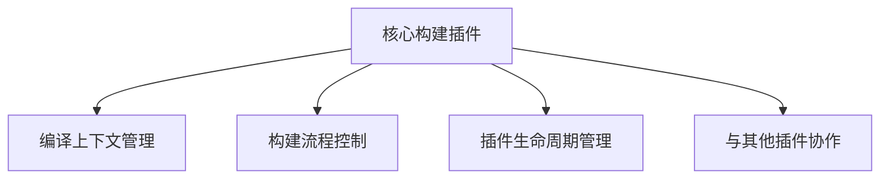
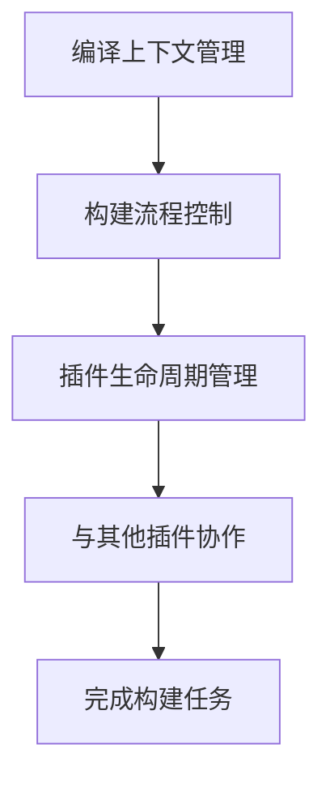
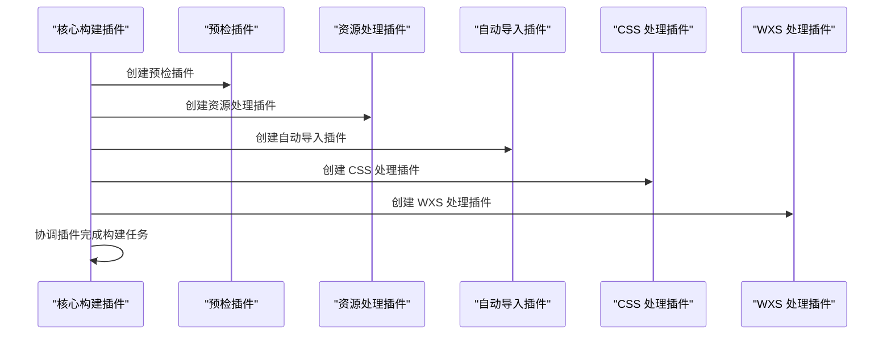
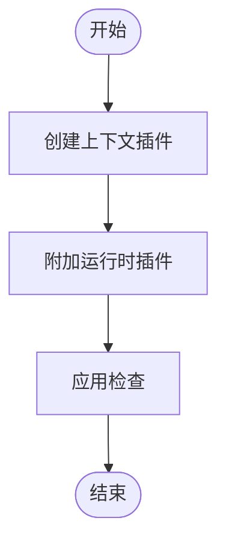
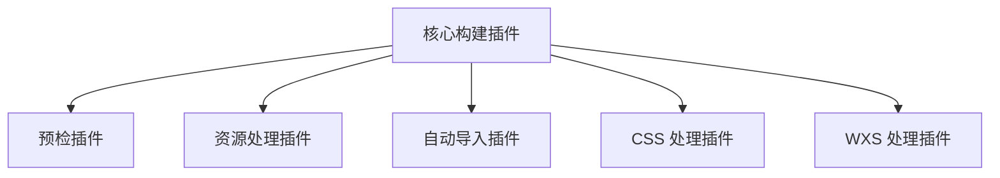

# 核心构建插件

<cite>
**本文档中引用的文件**  
- [index.ts](file://packages/weapp-vite/src/plugins/index.ts)
- [core.ts](file://packages/weapp-vite/src/plugins/core.ts)
- [createContext.ts](file://packages/weapp-vite/src/createContext.ts)
- [context.ts](file://packages/weapp-vite/src/types/context.ts)
- [preflight.ts](file://packages/weapp-vite/src/plugins/preflight.ts)
- [asset.ts](file://packages/weapp-vite/src/plugins/asset.ts)
- [autoImport.ts](file://packages/weapp-vite/src/plugins/autoImport.ts)
- [css.ts](file://packages/weapp-vite/src/plugins/css.ts)
- [wxs.ts](file://packages/weapp-vite/src/plugins/wxs.ts)
- [workers.ts](file://packages/weapp-vite/src/plugins/workers.ts)
</cite>

## 目录
1. [介绍](#介绍)
2. [项目结构](#项目结构)
3. [核心组件](#核心组件)
4. [架构概述](#架构概述)
5. [详细组件分析](#详细组件分析)
6. [依赖分析](#依赖分析)
7. [性能考虑](#性能考虑)
8. [故障排除指南](#故障排除指南)
9. [结论](#结论)

## 介绍
weapp-vite 核心构建插件是微信小程序构建流程的核心组件，负责编译上下文管理、构建流程控制和插件生命周期管理。该插件通过协调多个内置插件来完成复杂的构建任务，为开发者提供高效的开发体验。本文档深入探讨了插件的架构设计、关键类和方法的实现细节，并说明了插件与其他内置插件的协作关系和数据流。

## 项目结构
weapp-vite 核心构建插件位于 `packages/weapp-vite/src/plugins` 目录下，主要由多个功能模块组成，包括核心插件、预检插件、资源处理插件、自动导入插件、CSS 处理插件等。这些模块共同协作，确保构建流程的顺利进行。



**Diagram sources**
- [index.ts](file://packages/weapp-vite/src/plugins/index.ts#L53-L77)
- [core.ts](file://packages/weapp-vite/src/plugins/core.ts#L45-L67)

**Section sources**
- [index.ts](file://packages/weapp-vite/src/plugins/index.ts#L53-L77)
- [core.ts](file://packages/weapp-vite/src/plugins/core.ts#L45-L67)

## 核心组件
weapp-vite 核心构建插件的核心组件包括编译上下文管理、构建流程控制和插件生命周期管理。这些组件通过协调多个内置插件来完成复杂的构建任务。

**Section sources**
- [index.ts](file://packages/weapp-vite/src/plugins/index.ts#L53-L77)
- [core.ts](file://packages/weapp-vite/src/plugins/core.ts#L45-L67)

## 架构概述
weapp-vite 核心构建插件的架构设计旨在提供高效、灵活的构建流程。插件通过编译上下文管理、构建流程控制和插件生命周期管理来协调多个内置插件完成构建任务。



**Diagram sources**
- [index.ts](file://packages/weapp-vite/src/plugins/index.ts#L53-L77)
- [core.ts](file://packages/weapp-vite/src/plugins/core.ts#L45-L67)

## 详细组件分析

### 编译上下文管理
编译上下文管理是 weapp-vite 核心构建插件的基础，负责创建和管理编译上下文。通过 `createCompilerContext` 函数，插件可以初始化配置服务、扫描服务和自动路由服务，确保构建流程的顺利进行。

#### 编译上下文管理类图
```mermaid
classDiagram
class CompilerContext {
+configService : ConfigService
+scanService : ScanService
+autoRoutesService : AutoRoutesService
+createCompilerContext(options : Partial~LoadConfigOptions & { key? : string }~) : Promise~CompilerContext~
}
```

**Diagram sources**
- [createContext.ts](file://packages/weapp-vite/src/createContext.ts#L4-L27)
- [context.ts](file://packages/weapp-vite/src/types/context.ts#L1-L17)

**Section sources**
- [createContext.ts](file://packages/weapp-vite/src/createContext.ts#L4-L27)
- [context.ts](file://packages/weapp-vite/src/types/context.ts#L1-L17)

### 构建流程控制
构建流程控制是 weapp-vite 核心构建插件的关键部分，负责协调多个内置插件完成构建任务。通过 `vitePluginWeapp` 函数，插件可以创建和管理多个插件组，确保构建流程的顺利进行。

#### 构建流程控制序列图


**Diagram sources**
- [index.ts](file://packages/weapp-vite/src/plugins/index.ts#L53-L77)
- [preflight.ts](file://packages/weapp-vite/src/plugins/preflight.ts#L45-L48)
- [asset.ts](file://packages/weapp-vite/src/plugins/asset.ts#L128-L132)
- [autoImport.ts](file://packages/weapp-vite/src/plugins/autoImport.ts#L172-L176)
- [css.ts](file://packages/weapp-vite/src/plugins/css.ts#L235-L251)
- [wxs.ts](file://packages/weapp-vite/src/plugins/wxs.ts#L1-L13)

**Section sources**
- [index.ts](file://packages/weapp-vite/src/plugins/index.ts#L53-L77)
- [preflight.ts](file://packages/weapp-vite/src/plugins/preflight.ts#L45-L48)
- [asset.ts](file://packages/weapp-vite/src/plugins/asset.ts#L128-L132)
- [autoImport.ts](file://packages/weapp-vite/src/plugins/autoImport.ts#L172-L176)
- [css.ts](file://packages/weapp-vite/src/plugins/css.ts#L235-L251)
- [wxs.ts](file://packages/weapp-vite/src/plugins/wxs.ts#L1-L13)

### 插件生命周期管理
插件生命周期管理是 weapp-vite 核心构建插件的重要组成部分，负责管理插件的生命周期。通过 `createContextPlugin` 函数，插件可以在构建流程的早期阶段创建上下文插件，确保后续插件可以访问编译上下文。

#### 插件生命周期管理流程图


**Diagram sources**
- [index.ts](file://packages/weapp-vite/src/plugins/index.ts#L17-L44)
- [core.ts](file://packages/weapp-vite/src/plugins/core.ts#L45-L67)

**Section sources**
- [index.ts](file://packages/weapp-vite/src/plugins/index.ts#L17-L44)
- [core.ts](file://packages/weapp-vite/src/plugins/core.ts#L45-L67)

## 依赖分析
weapp-vite 核心构建插件依赖于多个内置插件，包括预检插件、资源处理插件、自动导入插件、CSS 处理插件和 WXS 处理插件。这些插件通过协调工作，确保构建流程的顺利进行。



**Diagram sources**
- [index.ts](file://packages/weapp-vite/src/plugins/index.ts#L53-L77)
- [preflight.ts](file://packages/weapp-vite/src/plugins/preflight.ts#L45-L48)
- [asset.ts](file://packages/weapp-vite/src/plugins/asset.ts#L128-L132)
- [autoImport.ts](file://packages/weapp-vite/src/plugins/autoImport.ts#L172-L176)
- [css.ts](file://packages/weapp-vite/src/plugins/css.ts#L235-L251)
- [wxs.ts](file://packages/weapp-vite/src/plugins/wxs.ts#L1-L13)

**Section sources**
- [index.ts](file://packages/weapp-vite/src/plugins/index.ts#L53-L77)
- [preflight.ts](file://packages/weapp-vite/src/plugins/preflight.ts#L45-L48)
- [asset.ts](file://packages/weapp-vite/src/plugins/asset.ts#L128-L132)
- [autoImport.ts](file://packages/weapp-vite/src/plugins/autoImport.ts#L172-L176)
- [css.ts](file://packages/weapp-vite/src/plugins/css.ts#L235-L251)
- [wxs.ts](file://packages/weapp-vite/src/plugins/wxs.ts#L1-L13)

## 性能考虑
weapp-vite 核心构建插件在设计时充分考虑了性能优化。通过预检插件移除不必要的 Vite 插件、资源处理插件优化资源文件的处理、自动导入插件减少手动导入的工作量、CSS 处理插件优化 CSS 文件的生成，以及 WXS 处理插件优化 WXS 文件的处理，确保构建流程的高效性。

## 故障排除指南
在使用 weapp-vite 核心构建插件时，可能会遇到一些常见问题。以下是一些故障排除建议：

- **编译上下文创建失败**：检查 `createCompilerContext` 函数的参数是否正确，确保配置服务、扫描服务和自动路由服务已正确初始化。
- **构建流程中断**：检查 `vitePluginWeapp` 函数的返回值，确保所有插件都已正确创建和管理。
- **插件生命周期管理问题**：检查 `createContextPlugin` 函数的实现，确保上下文插件在构建流程的早期阶段正确创建。

**Section sources**
- [createContext.ts](file://packages/weapp-vite/src/createContext.ts#L4-L27)
- [index.ts](file://packages/weapp-vite/src/plugins/index.ts#L53-L77)
- [core.ts](file://packages/weapp-vite/src/plugins/core.ts#L45-L67)

## 结论
weapp-vite 核心构建插件通过编译上下文管理、构建流程控制和插件生命周期管理，协调多个内置插件完成复杂的构建任务。其架构设计灵活高效，为开发者提供了强大的构建工具。通过深入理解插件的架构和实现细节，开发者可以更好地进行高级定制和问题排查。