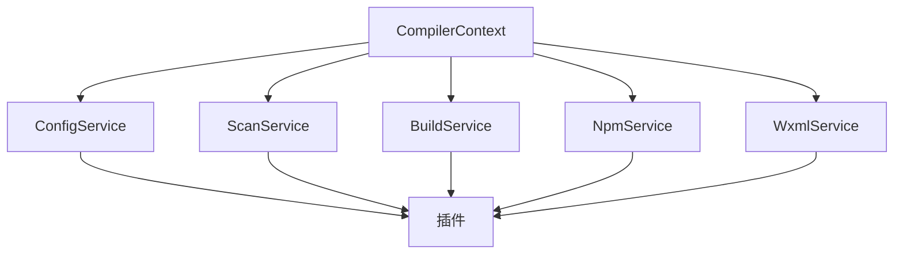
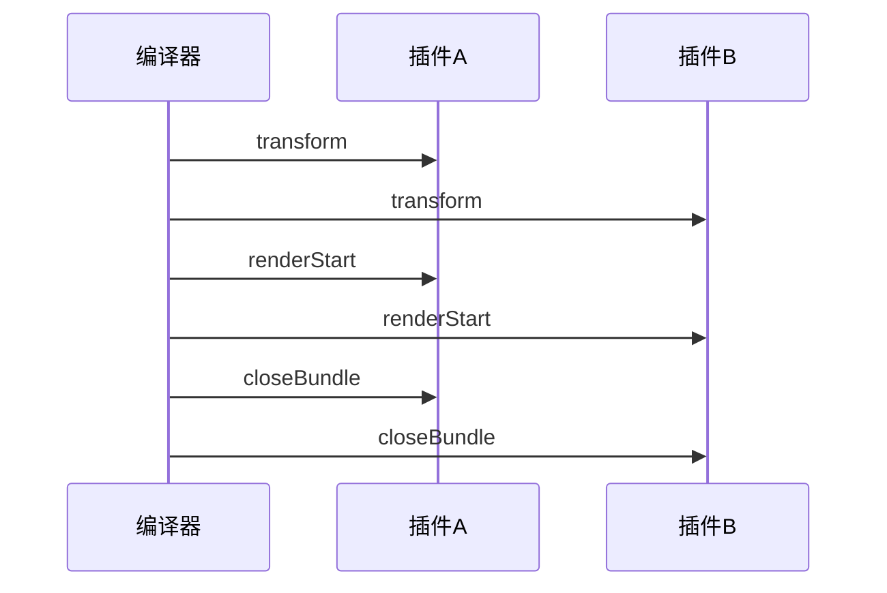
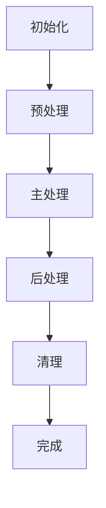
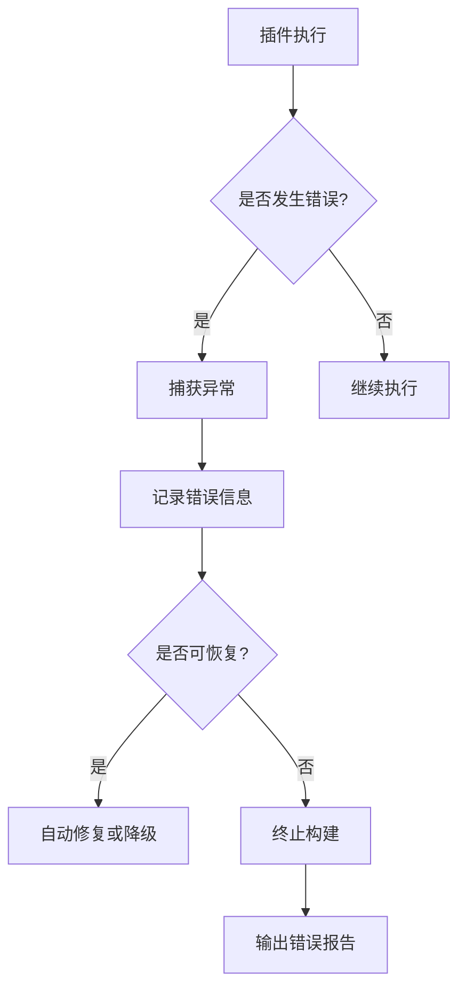

# 插件架构

<cite>
**本文档引用的文件**   
- [plugin.md](file://website/guide/plugin.md)
- [core.ts](file://packages/weapp-vite/src/plugins/core.ts)
- [CompilerContext.ts](file://packages/weapp-vite/src/context/CompilerContext.ts)
- [createContext.ts](file://packages/weapp-vite/src/createContext.ts)
- [getInstance.ts](file://packages/weapp-vite/src/context/getInstance.ts)
- [wxmlPlugin.ts](file://packages/weapp-vite/src/runtime/wxmlPlugin.ts)
- [npmPlugin.ts](file://packages/weapp-vite/src/runtime/npmPlugin.ts)
- [independentError.ts](file://packages/weapp-vite/src/runtime/independentError.ts)
- [wrapPlugin.ts](file://packages/vite-plugin-performance/src/wrapPlugin.ts)
</cite>

## 目录

1. [简介](#简介)
2. [微内核+插件架构设计](#微内核+插件架构设计)
3. [核心组件与插件交互机制](#核心组件与插件交互机制)
4. [插件生命周期与钩子函数](#插件生命周期与钩子函数)
5. [编译上下文(CompilerContext)共享](#编译上下文compilercontext共享)
6. [插件依赖管理与执行顺序](#插件依赖管理与执行顺序)
7. [插件系统工作流程](#插件系统工作流程)
8. [错误处理与异常恢复](#错误处理与异常恢复)
9. [总结](#总结)

## 简介

weapp-vite采用微内核+插件的架构设计，为微信小程序开发提供了灵活、可扩展的构建系统。该架构允许开发者在同一个项目中同时维护主应用和插件，共享工具链、依赖和IDE提示，极大地提升了开发效率。本文档将深入解析weapp-vite的插件架构，帮助开发者理解其设计理念和实现机制，从而设计出高效、稳定的插件。

**本文档引用的文件**   
- [plugin.md](file://website/guide/plugin.md)

## 微内核+插件架构设计

weapp-vite的微内核架构以CompilerContext为核心，通过插件系统实现功能扩展。微内核负责提供基础的编译环境和上下文管理，而具体的功能实现则由各个插件完成。这种设计使得系统具有高度的模块化和可扩展性，开发者可以根据需要添加或移除插件，而不会影响核心功能的稳定性。

微内核架构的优势在于：
- **高内聚低耦合**：核心功能与扩展功能分离，降低了系统复杂度。
- **易于维护**：插件可以独立开发、测试和部署，便于团队协作。
- **灵活扩展**：开发者可以根据项目需求定制插件，满足特定场景的需求。

**本文档引用的文件**   
- [CompilerContext.ts](file://packages/weapp-vite/src/context/CompilerContext.ts)
- [createContext.ts](file://packages/weapp-vite/src/createContext.ts)

## 核心组件与插件交互机制

weapp-vite的核心组件通过CompilerContext与插件进行交互。CompilerContext作为编译过程中的全局上下文，包含了配置服务、扫描服务、构建服务等多个子服务，这些服务为插件提供了必要的数据和功能支持。

插件通过访问CompilerContext中的服务来获取项目配置、扫描文件、生成代码等。例如，wxml插件通过wxmlService获取WXML文件的依赖关系，npm插件通过npmService处理npm包的构建。这种基于服务的交互机制确保了插件之间的松耦合，同时也保证了数据的一致性和安全性。

**图表来源**  
- [CompilerContext.ts](file://packages/weapp-vite/src/context/CompilerContext.ts)

**本文档引用的文件**   
- [CompilerContext.ts](file://packages/weapp-vite/src/context/CompilerContext.ts)
- [wxmlPlugin.ts](file://packages/weapp-vite/src/runtime/wxmlPlugin.ts)
- [npmPlugin.ts](file://packages/weapp-vite/src/runtime/npmPlugin.ts)

## 插件生命周期与钩子函数

weapp-vite的插件生命周期遵循Vite的插件规范，主要包括transform、renderStart、closeBundle等钩子函数。这些钩子函数在不同的编译阶段被调用，允许插件在适当的时机执行特定的操作。

- **transform**：在文件转换阶段调用，用于修改源代码。例如，wxml插件在此阶段处理WXML文件中的事件绑定和条件渲染。
- **renderStart**：在渲染开始阶段调用，用于初始化插件状态和准备输出文件。例如，wxml插件在此阶段扫描WXML文件并生成依赖关系图。
- **closeBundle**：在构建结束阶段调用，用于清理资源和生成最终的输出文件。例如，npm插件在此阶段打包npm依赖并生成miniprogram_npm目录。

钩子函数的执行顺序严格按照编译流程进行，确保了插件之间的协调和一致性。

**图表来源**  
- [core.ts](file://packages/weapp-vite/src/plugins/core.ts)

**本文档引用的文件**   
- [core.ts](file://packages/weapp-vite/src/plugins/core.ts)

## 编译上下文(CompilerContext)共享

CompilerContext是weapp-vite插件系统的核心，它在插件之间共享数据和状态。每个编译任务都会创建一个独立的CompilerContext实例，确保了不同任务之间的隔离性。CompilerContext通过MutableCompilerContext接口暴露给插件，允许插件访问和修改上下文中的数据。

CompilerContext中的数据主要包括：
- **配置信息**：项目配置、平台适配器、构建选项等。
- **服务实例**：配置服务、扫描服务、构建服务等。
- **运行时状态**：文件缓存、依赖关系、构建队列等。

通过共享CompilerContext，插件可以方便地获取所需的数据，同时也可以将处理结果反馈给其他插件，实现了高效的数据交换和协作。

**本文档引用的文件**   
- [CompilerContext.ts](file://packages/weapp-vite/src/context/CompilerContext.ts)
- [createContext.ts](file://packages/weapp-vite/src/createContext.ts)

## 插件依赖管理与执行顺序

weapp-vite通过插件注册机制管理插件的依赖关系和执行顺序。插件在注册时可以指定enforce属性，用于控制插件的执行优先级。enforce属性的值可以是"pre"、"default"或"post"，分别表示插件在预处理阶段、默认阶段或后处理阶段执行。

此外，插件还可以通过api属性暴露内部接口，供其他插件调用。这种基于接口的依赖管理机制使得插件之间的交互更加灵活和可控。例如，一个插件可以在renderStart钩子中调用另一个插件的api方法，获取所需的资源或数据。

**本文档引用的文件**   
- [core.ts](file://packages/weapp-vite/src/plugins/core.ts)

## 插件系统工作流程

weapp-vite的插件系统工作流程如下：
1. **初始化**：创建CompilerContext实例，加载项目配置和插件。
2. **预处理**：执行enforce为"pre"的插件，处理文件解析和依赖分析。
3. **主处理**：执行enforce为"default"的插件，进行代码转换和资源生成。
4. **后处理**：执行enforce为"post"的插件，进行资源优化和输出文件生成。
5. **清理**：执行closeBundle钩子，清理临时资源和生成最终的构建产物。

整个流程通过CompilerContext协调各个插件的执行，确保了构建过程的有序性和一致性。

**图表来源**  
- [core.ts](file://packages/weapp-vite/src/plugins/core.ts)

**本文档引用的文件**   
- [core.ts](file://packages/weapp-vite/src/plugins/core.ts)

## 错误处理与异常恢复

weapp-vite的插件系统具备完善的错误处理和异常恢复机制。当插件在执行过程中发生错误时，系统会捕获异常并记录详细的错误信息，包括错误类型、发生位置、堆栈跟踪等。这些信息可以帮助开发者快速定位和解决问题。

对于可恢复的错误，系统会尝试进行自动修复或降级处理。例如，当某个文件无法解析时，系统会跳过该文件并继续处理其他文件，避免整个构建过程因单个文件的错误而中断。对于不可恢复的错误，系统会终止构建并输出错误报告，提示开发者进行手动干预。

**图表来源**  
- [independentError.ts](file://packages/weapp-vite/src/runtime/independentError.ts)
- [wrapPlugin.ts](file://packages/vite-plugin-performance/src/wrapPlugin.ts)

**本文档引用的文件**   
- [independentError.ts](file://packages/weapp-vite/src/runtime/independentError.ts)
- [wrapPlugin.ts](file://packages/vite-plugin-performance/src/wrapPlugin.ts)

## 总结

weapp-vite的微内核+插件架构为微信小程序开发提供了强大的构建能力。通过CompilerContext共享数据和状态，插件可以高效地协作和交互。插件生命周期和钩子函数的设计使得插件可以在适当的时机执行特定的操作，确保了构建过程的灵活性和可控性。完善的错误处理和异常恢复机制保障了系统的稳定性和可靠性。开发者可以基于这一架构设计出高效、稳定的插件，满足各种复杂的开发需求。

**本文档引用的文件**   
- [plugin.md](file://website/guide/plugin.md)
- [core.ts](file://packages/weapp-vite/src/plugins/core.ts)
- [CompilerContext.ts](file://packages/weapp-vite/src/context/CompilerContext.ts)
- [createContext.ts](file://packages/weapp-vite/src/createContext.ts)
- [getInstance.ts](file://packages/weapp-vite/src/context/getInstance.ts)
- [wxmlPlugin.ts](file://packages/weapp-vite/src/runtime/wxmlPlugin.ts)
- [npmPlugin.ts](file://packages/weapp-vite/src/runtime/npmPlugin.ts)
- [independentError.ts](file://packages/weapp-vite/src/runtime/independentError.ts)
- [wrapPlugin.ts](file://packages/vite-plugin-performance/src/wrapPlugin.ts)