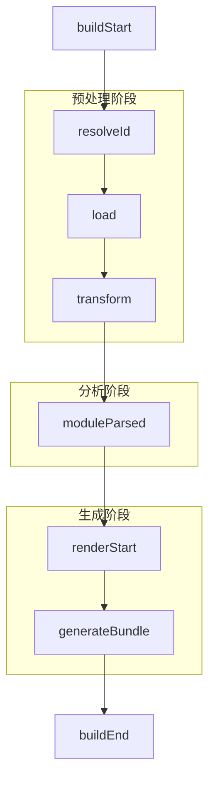
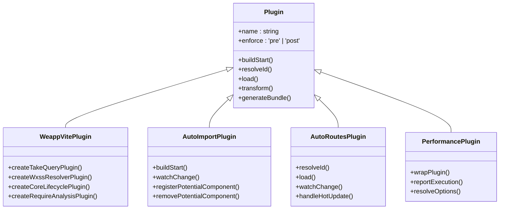
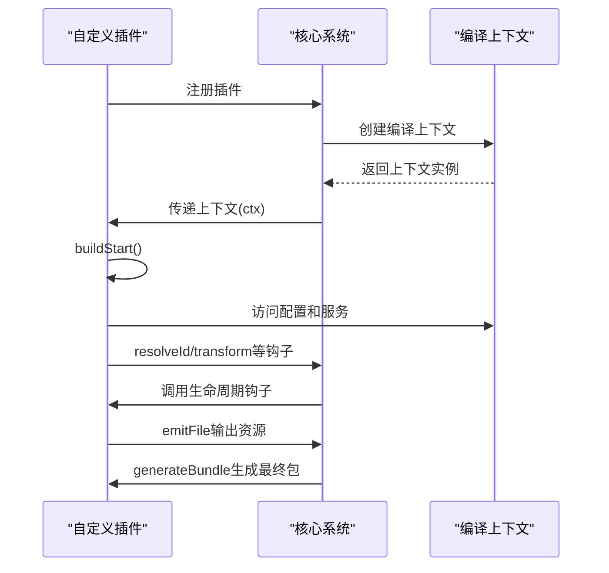

# 插件系统

<cite>
**本文档中引用的文件**  
- [index.ts](file://packages/weapp-vite/src/plugins/index.ts)
- [core.ts](file://packages/weapp-vite/src/plugins/core.ts)
- [autoImport.ts](file://packages/weapp-vite/src/plugins/autoImport.ts)
- [autoRoutes.ts](file://packages/weapp-vite/src/plugins/autoRoutes.ts)
- [css.ts](file://packages/weapp-vite/src/plugins/css.ts)
- [wxs.ts](file://packages/weapp-vite/src/plugins/wxs.ts)
- [workers.ts](file://packages/weapp-vite/src/plugins/workers.ts)
- [preflight.ts](file://packages/weapp-vite/src/plugins/preflight.ts)
- [asset.ts](file://packages/weapp-vite/src/plugins/asset.ts)
- [wrapPlugin.ts](file://packages/vite-plugin-performance/src/wrapPlugin.ts)
- [hooks.ts](file://packages/wevu/src/runtime/hooks.ts)
- [builtin.auto.ts](file://packages/weapp-vite/src/auto-import-components/builtin.auto.ts)
</cite>

## 目录
1. [插件架构设计理念](#插件架构设计理念)
2. [核心机制与生命周期](#核心机制与生命周期)
3. [内置插件功能与实现](#内置插件功能与实现)
4. [自定义插件开发指南](#自定义插件开发指南)
5. [插件与核心系统交互](#插件与核心系统交互)
6. [代码示例](#代码示例)
7. [灵活性与可扩展性优势](#灵活性与可扩展性优势)
8. [插件管理指南](#插件管理指南)

## 插件架构设计理念

weapp-vite插件系统基于Vite插件架构构建，采用模块化设计原则，通过组合式插件实现功能扩展。系统核心设计理念是将复杂的小程序构建流程分解为多个独立、可复用的插件单元，每个插件负责特定的构建任务，如代码转换、资源处理、依赖分析等。这种设计实现了关注点分离，提高了系统的可维护性和可扩展性。

插件系统采用预处理（pre）和后处理（post）的执行顺序策略，确保关键的转换和分析操作在正确的时机执行。通过`enforce: 'pre'`配置，核心插件优先于其他插件执行，保证了基础转换的正确性。同时，系统支持运行时插件注入机制，允许在编译上下文中动态添加插件，为框架扩展提供了灵活的接口。

**Section sources**
- [index.ts](file://packages/weapp-vite/src/plugins/index.ts#L1-L78)
- [core.ts](file://packages/weapp-vite/src/plugins/core.ts#L1-L776)

## 核心机制与生命周期

weapp-vite插件系统的核心机制围绕Vite的生命周期钩子构建，通过精心设计的执行顺序确保构建过程的正确性和高效性。系统定义了多个关键生命周期阶段，包括`buildStart`、`resolveId`、`load`、`transform`、`renderStart`和`generateBundle`等。

插件执行顺序遵循严格的优先级规则：预处理插件（enforce: 'pre'）最先执行，然后是普通插件，最后是后处理插件（enforce: 'post'）。这种顺序确保了基础转换（如路径解析、语法支持）在代码分析和优化之前完成。例如，`createTakeQueryPlugin`在`buildStart`阶段初始化导入注册表，而`createRequireAnalysisPlugin`在`moduleParsed`阶段分析require调用，两者按顺序协同工作。

系统还实现了钩子函数的链式调用机制，通过`callHookList`和`callHookReturn`函数统一管理生命周期事件的处理。这种设计允许多个插件响应同一事件，同时保持执行顺序的可控性。



**Diagram sources**
- [core.ts](file://packages/weapp-vite/src/plugins/core.ts#L153-L483)
- [hooks.ts](file://packages/wevu/src/runtime/hooks.ts#L36-L98)

## 内置插件功能与实现

weapp-vite提供了多个内置插件，每个插件负责特定的构建功能。核心插件包括`weappVite`、`autoImport`、`autoRoutes`、`css`、`wxs`和`workers`等，它们共同构成了完整的构建流水线。

Vue语法支持通过`plugin-wevu`包实现，该插件集成了Vue的编译器和运行时，将Vue单文件组件转换为小程序原生代码。性能分析插件`vite-plugin-performance`则通过包裹其他插件，测量各生命周期钩子的执行耗时，帮助开发者识别构建性能瓶颈。

自动导入插件`autoImport`扫描项目中的组件文件，自动生成类型定义和导入映射，实现了无需手动导入组件的开发体验。路由自动生成插件`autoRoutes`根据文件系统结构自动生成路由配置，简化了页面管理。



**Diagram sources**
- [autoImport.ts](file://packages/weapp-vite/src/plugins/autoImport.ts#L1-L176)
- [autoRoutes.ts](file://packages/weapp-vite/src/autoRoutes.ts#L1-L91)
- [wrapPlugin.ts](file://packages/vite-plugin-performance/src/wrapPlugin.ts#L1-L86)

## 自定义插件开发指南

开发自定义插件需要遵循weapp-vite的插件接口规范。插件必须导出一个符合Vite插件格式的对象，包含`name`属性和相应的生命周期钩子函数。建议使用`enforce: 'pre'`或`enforce: 'post'`明确指定插件执行顺序。

插件接口定义在`WeappVitePluginApi`类型中，通过`ctx`属性访问编译上下文，获取配置、服务实例等资源。开发者可以利用编译上下文提供的各种服务，如`configService`、`scanService`和`buildService`，实现复杂的构建逻辑。

最佳实践包括：使用符号常量定义插件名称，避免命名冲突；在`buildStart`阶段初始化状态，在`buildEnd`阶段清理资源；合理使用`this.addWatchFile`监控文件变化；通过`this.emitFile`输出生成的资源。



**Diagram sources**
- [index.ts](file://packages/weapp-vite/src/plugins/index.ts#L3-L7)
- [types/plugin.ts](file://packages/weapp-vite/src/types/plugin.ts#L3-L7)

## 插件与核心系统交互

插件通过编译上下文（CompilerContext）与核心系统进行交互。核心系统在`vitePluginWeapp`函数中创建上下文插件，将编译上下文暴露给其他插件。插件通过`WEAPP_VITE_CONTEXT_PLUGIN_NAME`标识符获取上下文实例，从而访问配置、服务和状态。

系统提供了`attachRuntimePlugins`函数，支持在运行时动态添加插件。这使得框架扩展和第三方集成更加灵活。同时，`applyInspect`函数集成了性能分析功能，通过包裹插件链，实现了非侵入式的性能监控。

插件间的通信通过共享状态实现。例如，`createCoreLifecyclePlugin`维护`CorePluginState`对象，存储加载的入口、JSON文件映射等状态，供其他插件访问和更新。这种设计避免了插件间的直接依赖，降低了耦合度。

**Section sources**
- [index.ts](file://packages/weapp-vite/src/plugins/index.ts#L17-L34)
- [core.ts](file://packages/weapp-vite/src/plugins/core.ts#L32-L43)

## 代码示例

以下示例展示了如何创建一个简单的自定义插件：

```typescript
import type { Plugin } from 'vite'
import type { CompilerContext } from '@/context'

export function myPlugin(ctx: CompilerContext): Plugin {
  return {
    name: 'weapp-vite:my-plugin',
    enforce: 'pre',
    
    buildStart() {
      // 初始化插件状态
    },
    
    resolveId(source, importer) {
      // 自定义路径解析逻辑
      if (source.startsWith('my-prefix:')) {
        const id = source.slice('my-prefix:'.length)
        return this.resolve(id, importer, { skipSelf: true })
      }
      return null
    },
    
    transform(code, id) {
      // 代码转换逻辑
      return {
        code: code.replace(/__MY_VAR__/g, 'Hello World'),
        map: null
      }
    }
  }
}
```

性能分析插件的使用示例：

```typescript
import { defineConfig } from 'vite'
import { wrapPlugin } from 'vite-plugin-performance'
import myPlugin from './myPlugin'

export default defineConfig({
  plugins: [
    wrapPlugin(myPlugin(ctx), {
      threshold: 50,
      onHookExecution({ pluginName, hookName, duration }) {
        console.log(`${pluginName} ${hookName} took ${duration}ms`)
      }
    })
  ]
})
```

**Section sources**
- [index.ts](file://packages/weapp-vite/src/plugins/index.ts#L53-L71)
- [wrapPlugin.ts](file://packages/vite-plugin-performance/src/wrapPlugin.ts#L6-L13)

## 灵活性与可扩展性优势

weapp-vite插件系统的设计充分体现了灵活性和可扩展性优势。通过模块化插件架构，开发者可以按需组合功能，构建定制化的构建流水线。系统支持插件的动态加载和运行时注入，为框架扩展提供了强大的基础。

插件系统的分层设计实现了关注点分离，每个插件专注于单一职责，降低了系统的复杂性。同时，标准化的插件接口和丰富的生命周期钩子，使得第三方开发者能够轻松创建高质量的插件。

性能分析插件的实现展示了系统的非侵入式扩展能力。通过包裹现有插件而不改变其行为，实现了功能增强与核心逻辑的解耦。这种设计模式可以应用于各种监控、日志和优化场景。

**Section sources**
- [index.ts](file://packages/weapp-vite/src/plugins/index.ts#L36-L44)
- [wrapPlugin.ts](file://packages/vite-plugin-performance/src/wrapPlugin.ts#L26-L49)

## 插件管理指南

对于插件使用者，weapp-vite提供了清晰的管理指南。在`vite.config.ts`中通过`plugins`数组配置插件，按执行顺序排列。建议将预处理插件放在前面，后处理插件放在后面。

内置插件已集成在`vitePluginWeapp`函数中，通常无需手动配置。对于自定义插件，应确保正确设置`enforce`属性，避免执行顺序冲突。使用`wrapPlugin`包装性能敏感的插件，可以帮助识别构建瓶颈。

插件开发时应遵循最佳实践：使用唯一且描述性的插件名称，合理管理插件状态，正确处理异步操作，提供清晰的错误信息。通过`logger`输出调试信息，但生产环境中应避免过多日志输出。

**Section sources**
- [index.ts](file://packages/weapp-vite/src/plugins/index.ts#L53-L71)
- [wrapPlugin.ts](file://packages/vite-plugin-performance/src/wrapPlugin.ts#L6-L13)