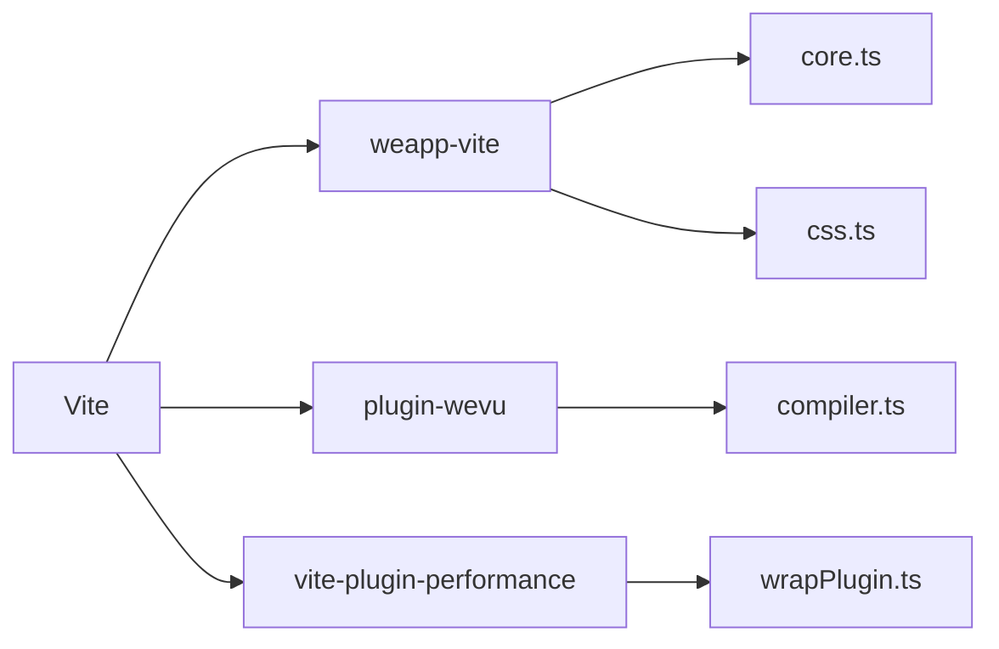
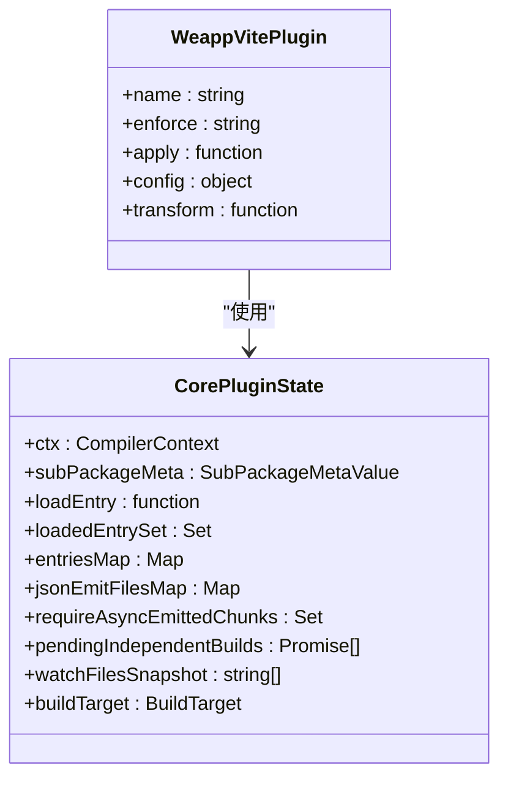
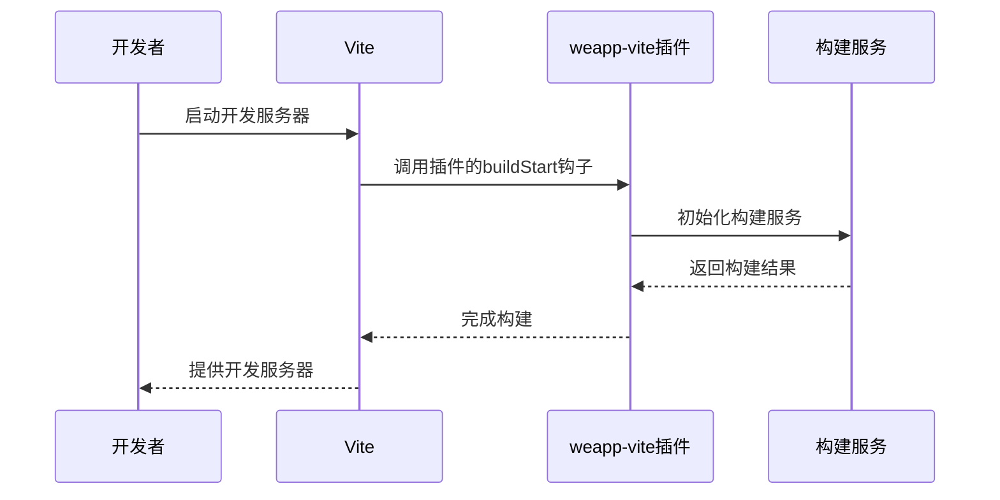
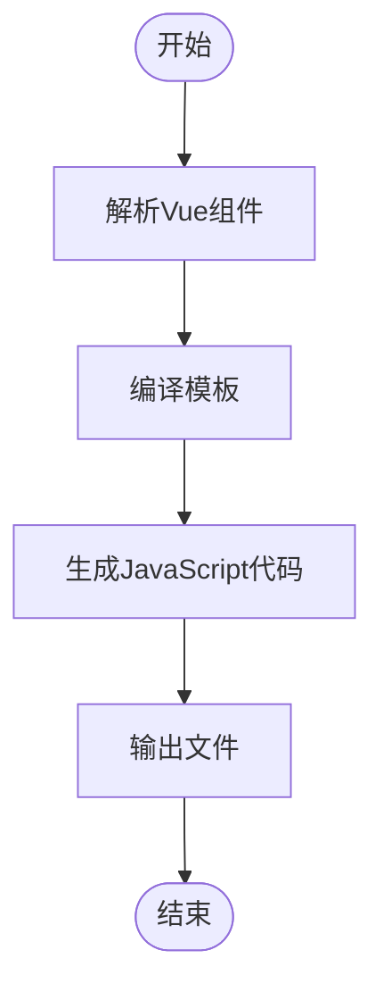
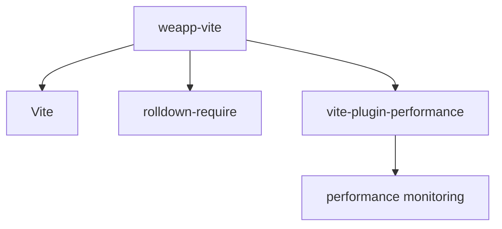

# 自定义插件开发

<cite>
**本文档中引用的文件**  
- [core.ts](file://packages/weapp-vite/src/plugins/core.ts)
- [plugin.ts](file://packages/plugin-wevu/src/plugin.ts)
- [plugin.json](file://apps/plugin-demo/plugin/plugin.json)
- [index.ts](file://apps/plugin-demo/plugin/index.ts)
- [vite.config.ts](file://apps/plugin-demo/vite.config.mts)
- [plugin.md](file://website/guide/plugin.md)
- [wrapPlugin.ts](file://packages/vite-plugin-performance/src/wrapPlugin.ts)
- [types.ts](file://packages/weapp-vite/src/types/plugin.ts)
</cite>

## 目录
1. [简介](#简介)
2. [项目结构](#项目结构)
3. [核心组件](#核心组件)
4. [架构概述](#架构概述)
5. [详细组件分析](#详细组件分析)
6. [依赖分析](#依赖分析)
7. [性能考虑](#性能考虑)
8. [故障排除指南](#故障排除指南)
9. [结论](#结论)
10. [附录](#附录)（如有必要）

## 简介
本文档旨在为开发者提供一个全面的自定义插件开发指南，涵盖从基础到高级的各个方面。我们将深入探讨插件接口和类型定义，包括`Plugin`对象的各个属性（如`name`、`enforce`、`apply`、`config`、`transform`等）的含义和用法。通过逐步演示从简单插件到复杂插件的开发过程，帮助开发者掌握如何使用钩子函数扩展构建流程、与其他插件交互以及处理错误和异常。此外，还将介绍插件调试技巧和测试方法，并提供最佳实践建议，如性能优化、错误处理和兼容性考虑。

## 项目结构
本项目采用单体仓库（monorepo）结构，使用pnpm进行包管理。主要目录包括`@weapp-core`、`apps`、`packages`、`templates`和`website`。其中，`packages`目录包含了核心的`weapp-vite`包和其他相关插件，而`apps`目录则包含多个示例应用，用于演示不同功能的使用方式。

```mermaid
graph TD
A[根目录] --> B[@weapp-core]
A --> C[apps]
A --> D[packages]
A --> E[templates]
A --> F[website]
D --> G[weapp-vite]
D --> H[plugin-wevu]
D --> I[vite-plugin-performance]
C --> J[plugin-demo]
C --> K[wevu-vue-demo]
```

**Diagram sources**
- [project structure](file://README.md)

**Section sources**
- [project structure](file://README.md)

## 核心组件
在`weapp-vite`项目中，核心组件主要包括`weapp-vite`主包、`plugin-wevu`插件和`vite-plugin-performance`性能监控插件。这些组件共同构成了一个完整的开发环境，支持从开发到构建的全流程。

**Section sources**
- [core.ts](file://packages/weapp-vite/src/plugins/core.ts)
- [plugin.ts](file://packages/plugin-wevu/src/plugin.ts)
- [wrapPlugin.ts](file://packages/vite-plugin-performance/src/wrapPlugin.ts)

## 架构概述
整个系统的架构基于Vite插件系统，通过定义一系列插件来扩展Vite的功能。每个插件都有自己的生命周期钩子，可以在不同的构建阶段执行特定的操作。例如，`weapp-vite`插件负责处理小程序特有的文件格式（如`.wxml`、`.wxss`），而`plugin-wevu`插件则提供了对Vue框架的支持。



**Diagram sources**
- [core.ts](file://packages/weapp-vite/src/plugins/core.ts)
- [plugin.ts](file://packages/plugin-wevu/src/plugin.ts)
- [wrapPlugin.ts](file://packages/vite-plugin-performance/src/wrapPlugin.ts)

## 详细组件分析
### weapp-vite 插件分析
`weapp-vite`插件是整个系统的核心，它负责处理小程序的所有构建任务。该插件通过定义多个子插件来实现不同的功能，如`createCoreLifecyclePlugin`用于管理构建生命周期，`createWxssResolverPlugin`用于解析`.wxss`文件。

#### 对象导向组件


**Diagram sources**
- [core.ts](file://packages/weapp-vite/src/plugins/core.ts)

#### API/服务组件


**Diagram sources**
- [core.ts](file://packages/weapp-vite/src/plugins/core.ts)

### plugin-wevu 插件分析
`plugin-wevu`插件为Vite提供了对Vue框架的支持。它通过编译Vue组件并将其转换为小程序可识别的格式来实现这一目标。

#### 复杂逻辑组件


**Diagram sources**
- [plugin.ts](file://packages/plugin-wevu/src/plugin.ts)

**Section sources**
- [plugin.ts](file://packages/plugin-wevu/src/plugin.ts)

### 概念概述
除了具体的代码实现外，理解插件的工作原理也非常重要。插件通过监听Vite的生命周期事件来介入构建过程，从而实现对构建流程的扩展和定制。


[无源，因为此图表显示的是概念工作流，而不是实际的代码结构]

[无源，因为此部分不分析特定源文件]

## 依赖分析
项目中的各个组件之间存在复杂的依赖关系。`weapp-vite`插件依赖于Vite的核心API，同时也依赖于其他辅助插件，如`vite-plugin-performance`。这些依赖关系确保了构建过程的顺利进行。



**Diagram sources**
- [package.json](file://packages/weapp-vite/package.json)
- [package.json](file://packages/vite-plugin-performance/package.json)

**Section sources**
- [package.json](file://packages/weapp-vite/package.json)
- [package.json](file://packages/vite-plugin-performance/package.json)

## 性能考虑
在开发插件时，性能是一个重要的考虑因素。`vite-plugin-performance`插件提供了一种机制，可以监控其他插件的执行时间，并在超过阈值时发出警告。这有助于开发者识别和优化性能瓶颈。

[无源，因为此部分提供一般性指导]

## 故障排除指南
当遇到问题时，首先检查插件的配置是否正确。例如，确保`pluginRoot`设置正确，并且`plugin.json`文件中的路径与实际文件结构匹配。此外，查看构建日志可以帮助定位问题所在。

**Section sources**
- [plugin.md](file://website/guide/plugin.md)
- [common issues](file://website/guide/plugin.md#常见问题)

## 结论
通过本文档，我们详细介绍了如何开发自定义插件，从基础概念到高级技巧。希望这些信息能帮助开发者创建高质量的插件，提升开发效率。

[无源，因为此部分总结而不分析特定源文件]