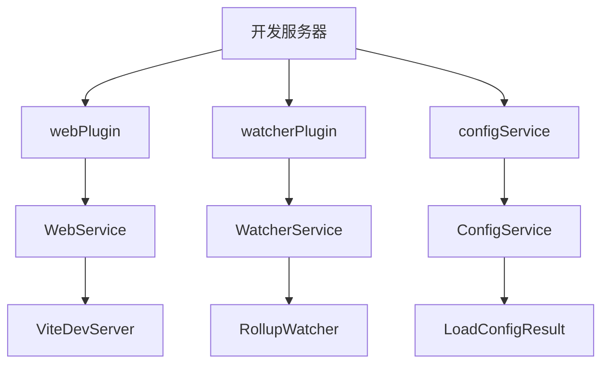
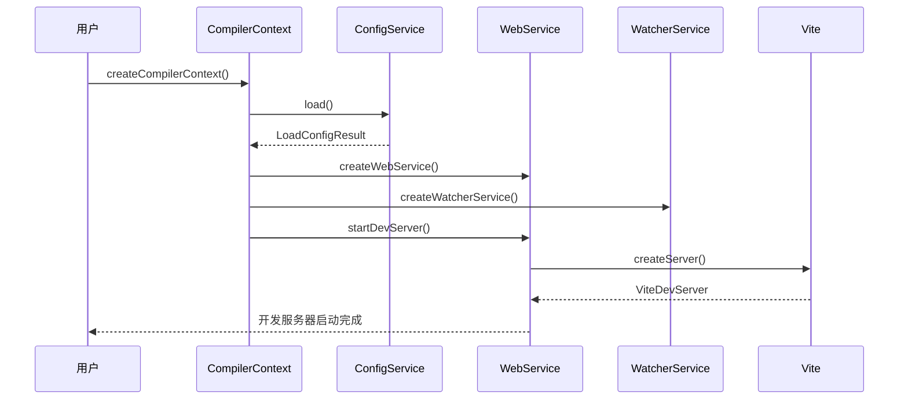
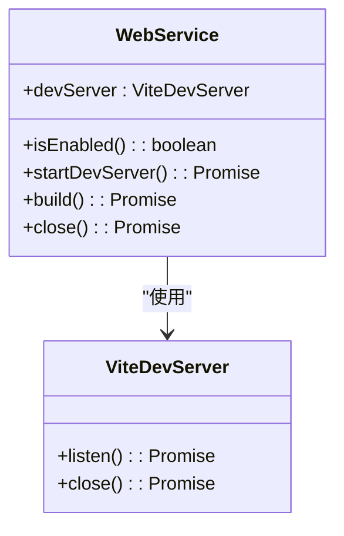
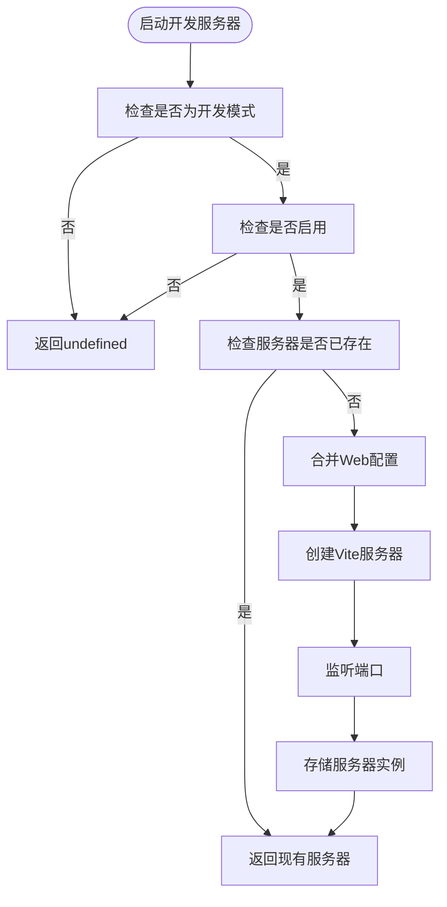
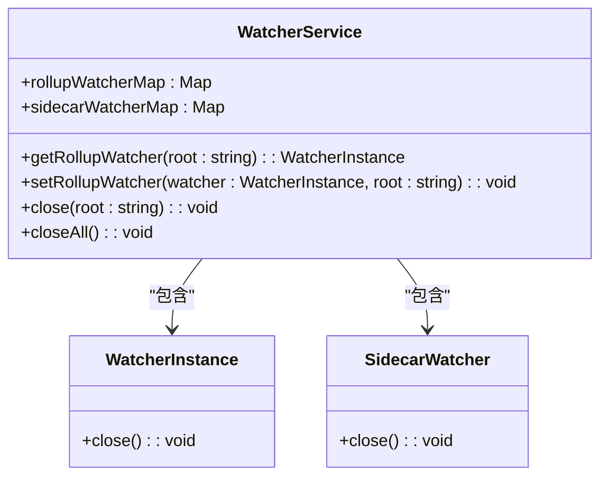
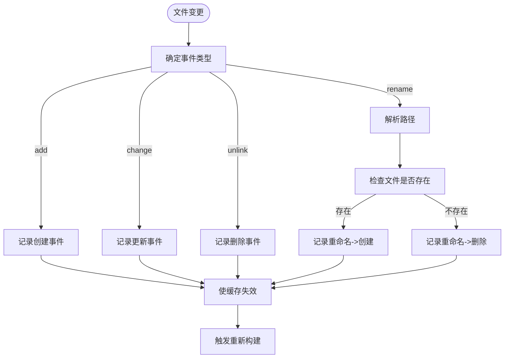
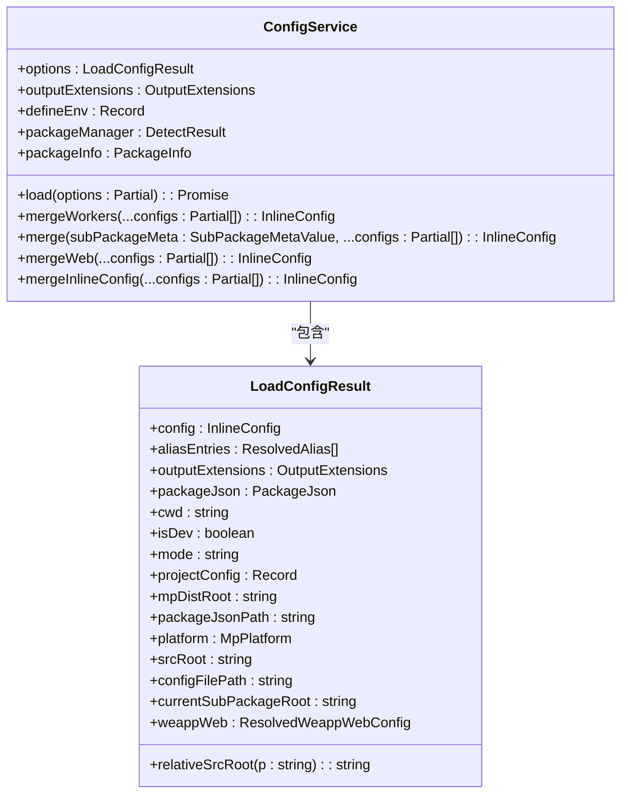
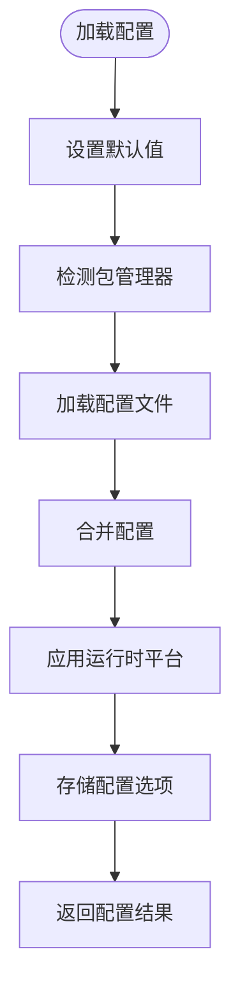

# 开发服务器

<cite>
**本文档中引用的文件**  
- [webPlugin.ts](file://packages/weapp-vite/src/runtime/webPlugin.ts)
- [watcherPlugin.ts](file://packages/weapp-vite/src/runtime/watcherPlugin.ts)
- [CompilerContext.ts](file://packages/weapp-vite/src/context/CompilerContext.ts)
- [createConfigService.ts](file://packages/weapp-vite/src/runtime/config/createConfigService.ts)
- [web.ts](file://packages/weapp-vite/src/runtime/config/web.ts)
- [types.ts](file://packages/weapp-vite/src/runtime/config/types.ts)
- [buildPlugin.ts](file://packages/weapp-vite/src/runtime/buildPlugin.ts)
- [getInstance.ts](file://packages/weapp-vite/src/context/getInstance.ts)
</cite>

## 目录
1. [简介](#简介)
2. [项目结构](#项目结构)
3. [核心组件](#核心组件)
4. [架构概述](#架构概述)
5. [详细组件分析](#详细组件分析)
6. [依赖分析](#依赖分析)
7. [性能考虑](#性能考虑)
8. [故障排除指南](#故障排除指南)
9. [结论](#结论)

## 简介
本文档深入探讨了weapp-vite开发服务器的实现机制，重点分析基于Vite的开发服务器如何实现热更新、按需编译和实时重载等核心特性。文档详细描述了webPlugin中WebService的创建和管理机制，包括开发服务器的启动、关闭和构建流程。同时分析了开发服务器与编译上下文(CompilerContext)的集成方式，以及在开发模式下(isDev: true)的特殊处理逻辑。通过实际代码示例展示开发服务器在不同场景下的工作流程，包括普通构建和插件构建的差异处理，并阐述开发服务器如何与watcherService协同工作以实现文件变更的实时响应。

## 项目结构
weapp-vite开发服务器的代码主要分布在packages/weapp-vite/src/runtime目录下，其中核心组件包括webPlugin、watcherPlugin、configService等。这些组件通过CompilerContext进行协调和管理，形成了一个完整的开发服务器生态系统。



**图示来源**
- [webPlugin.ts](file://packages/weapp-vite/src/runtime/webPlugin.ts)
- [watcherPlugin.ts](file://packages/weapp-vite/src/runtime/watcherPlugin.ts)
- [createConfigService.ts](file://packages/weapp-vite/src/runtime/config/createConfigService.ts)

**本节来源**
- [webPlugin.ts](file://packages/weapp-vite/src/runtime/webPlugin.ts)
- [watcherPlugin.ts](file://packages/weapp-vite/src/runtime/watcherPlugin.ts)
- [createConfigService.ts](file://packages/weapp-vite/src/runtime/config/createConfigService.ts)

## 核心组件
weapp-vite开发服务器的核心组件包括WebService、WatcherService和ConfigService。WebService负责管理Vite开发服务器的生命周期，包括启动、关闭和构建操作。WatcherService负责管理文件监听器，实现文件变更的实时响应。ConfigService负责加载和合并配置，为开发服务器提供必要的配置信息。

**本节来源**
- [webPlugin.ts](file://packages/weapp-vite/src/runtime/webPlugin.ts)
- [watcherPlugin.ts](file://packages/weapp-vite/src/runtime/watcherPlugin.ts)
- [createConfigService.ts](file://packages/weapp-vite/src/runtime/config/createConfigService.ts)

## 架构概述
weapp-vite开发服务器采用模块化架构，通过CompilerContext协调各个服务组件。开发服务器的启动流程如下：首先创建CompilerContext，然后初始化ConfigService加载配置，接着创建WebService和WatcherService，最后启动Vite开发服务器。



**图示来源**
- [webPlugin.ts](file://packages/weapp-vite/src/runtime/webPlugin.ts)
- [watcherPlugin.ts](file://packages/weapp-vite/src/runtime/watcherPlugin.ts)
- [createConfigService.ts](file://packages/weapp-vite/src/runtime/config/createConfigService.ts)

## 详细组件分析

### WebService分析
WebService是weapp-vite开发服务器的核心组件，负责管理Vite开发服务器的生命周期。它提供了启动、关闭和构建等操作接口。

#### WebService类图


**图示来源**
- [webPlugin.ts](file://packages/weapp-vite/src/runtime/webPlugin.ts)

#### WebService启动流程


**图示来源**
- [webPlugin.ts](file://packages/weapp-vite/src/runtime/webPlugin.ts)

**本节来源**
- [webPlugin.ts](file://packages/weapp-vite/src/runtime/webPlugin.ts)

### WatcherService分析
WatcherService负责管理文件监听器，实现文件变更的实时响应。它通过RollupWatcher和SidecarWatcher来监听不同类型的文件变化。

#### WatcherService类图


**图示来源**
- [watcherPlugin.ts](file://packages/weapp-vite/src/runtime/watcherPlugin.ts)

#### 文件变更处理流程


**图示来源**
- [buildPlugin.ts](file://packages/weapp-vite/src/runtime/buildPlugin.ts)
- [watcherPlugin.ts](file://packages/weapp-vite/src/runtime/watcherPlugin.ts)

**本节来源**
- [watcherPlugin.ts](file://packages/weapp-vite/src/runtime/watcherPlugin.ts)
- [buildPlugin.ts](file://packages/weapp-vite/src/runtime/buildPlugin.ts)

### ConfigService分析
ConfigService负责加载和合并配置，为开发服务器提供必要的配置信息。它通过load方法加载配置，并通过merge系列方法合并不同来源的配置。

#### ConfigService类图


**图示来源**
- [createConfigService.ts](file://packages/weapp-vite/src/runtime/config/createConfigService.ts)
- [types.ts](file://packages/weapp-vite/src/runtime/config/types.ts)

#### 配置加载流程


**图示来源**
- [createConfigService.ts](file://packages/weapp-vite/src/runtime/config/createConfigService.ts)

**本节来源**
- [createConfigService.ts](file://packages/weapp-vite/src/runtime/config/createConfigService.ts)
- [types.ts](file://packages/weapp-vite/src/runtime/config/types.ts)

## 依赖分析
weapp-vite开发服务器的各个组件之间存在紧密的依赖关系。WebService依赖于ConfigService获取Web配置，WatcherService依赖于ConfigService获取监听配置，而所有服务都通过CompilerContext进行协调。

```mermaid
graph TD
A[CompilerContext] --> B[ConfigService]
A --> C[WebService]
A --> D[WatcherService]
A --> E[BuildService]
C --> B : "获取Web配置"
D --> B : "获取监听配置"
E --> B : "获取构建配置"
C --> |启动| Vite[Vite开发服务器]
D --> |监听| FS[文件系统]
E --> |构建| Rollup[Rollup打包器]
```

**图示来源**
- [CompilerContext.ts](file://packages/weapp-vite/src/context/CompilerContext.ts)
- [webPlugin.ts](file://packages/weapp-vite/src/runtime/webPlugin.ts)
- [watcherPlugin.ts](file://packages/weapp-vite/src/runtime/watcherPlugin.ts)
- [buildPlugin.ts](file://packages/weapp-vite/src/runtime/buildPlugin.ts)

**本节来源**
- [CompilerContext.ts](file://packages/weapp-vite/src/context/CompilerContext.ts)
- [webPlugin.ts](file://packages/weapp-vite/src/runtime/webPlugin.ts)
- [watcherPlugin.ts](file://packages/weapp-vite/src/runtime/watcherPlugin.ts)
- [buildPlugin.ts](file://packages/weapp-vite/src/runtime/buildPlugin.ts)

## 性能考虑
weapp-vite开发服务器在设计时充分考虑了性能优化。通过按需编译和缓存机制，减少了不必要的构建操作。同时，通过独立的构建任务管理，避免了构建过程中的资源竞争。

## 故障排除指南
当开发服务器出现问题时，可以按照以下步骤进行排查：
1. 检查配置文件是否正确
2. 检查依赖包是否安装完整
3. 检查端口是否被占用
4. 检查文件权限是否正确

**本节来源**
- [webPlugin.ts](file://packages/weapp-vite/src/runtime/webPlugin.ts)
- [watcherPlugin.ts](file://packages/weapp-vite/src/runtime/watcherPlugin.ts)
- [createConfigService.ts](file://packages/weapp-vite/src/runtime/config/createConfigService.ts)

## 结论
weapp-vite开发服务器通过模块化设计和紧密的组件协作，实现了高效的热更新、按需编译和实时重载功能。通过深入理解其内部工作原理，开发者可以更好地利用这些特性提高开发效率。