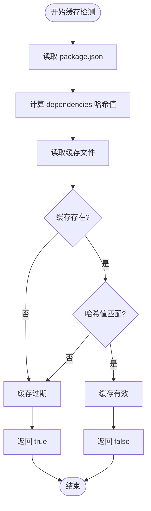
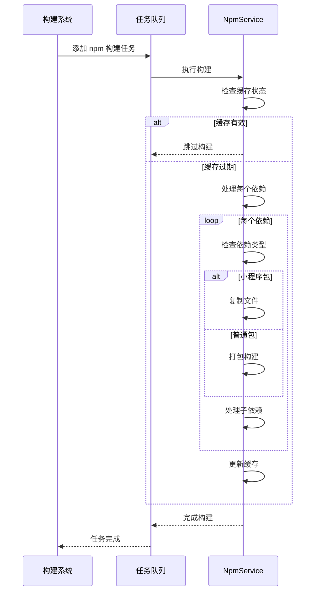
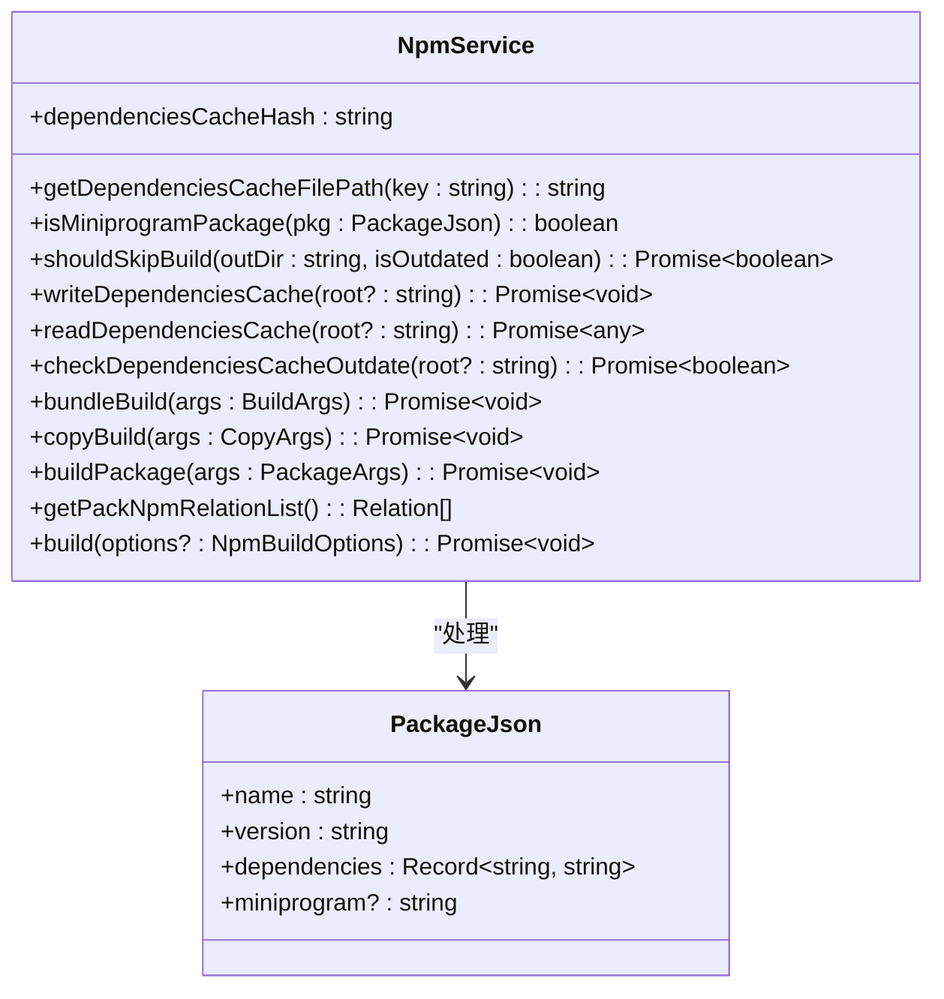
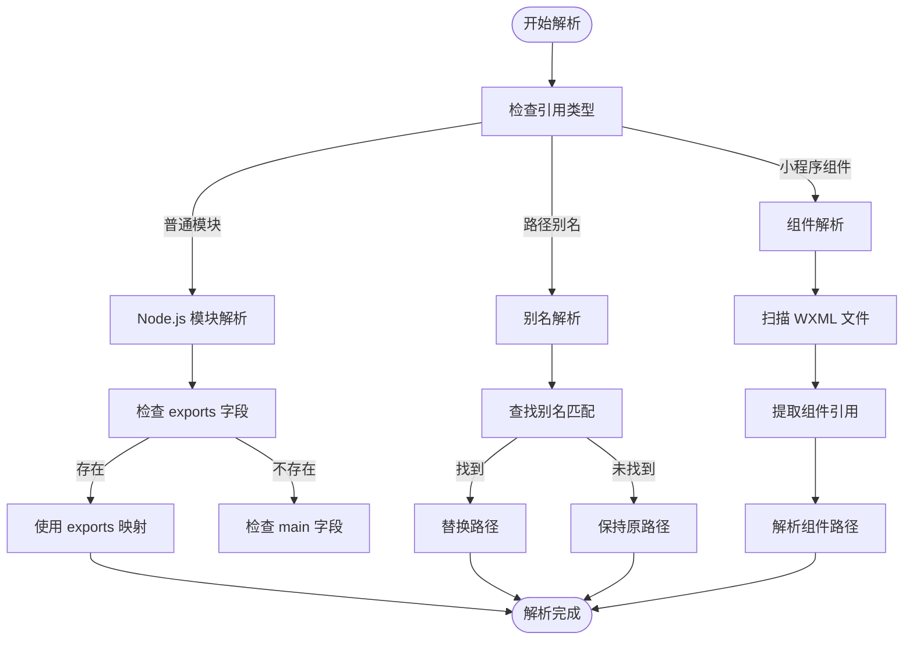
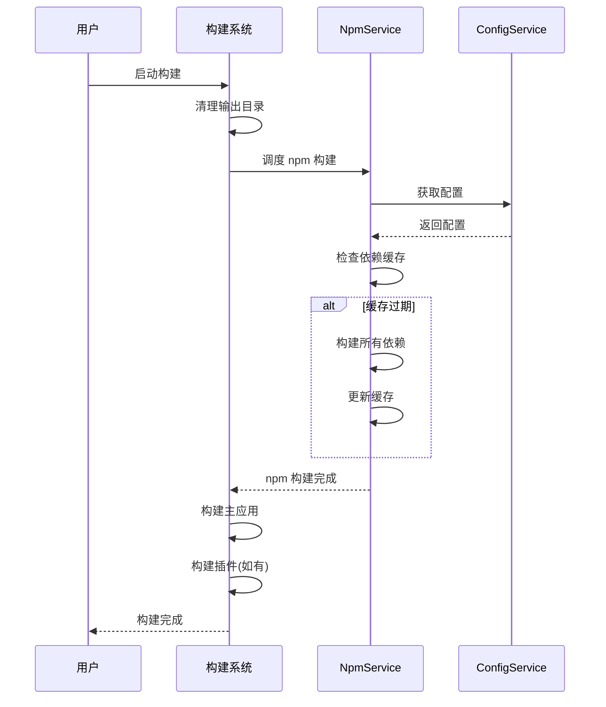
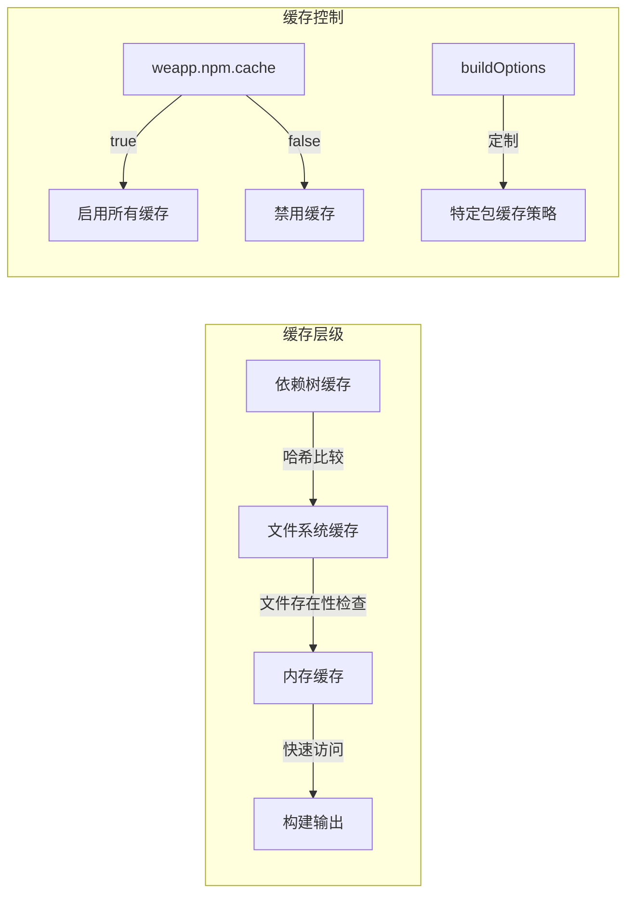

# 依赖管理

<cite>
**本文档引用的文件**  
- [buildPlugin.ts](file://packages/weapp-vite/src/runtime/buildPlugin.ts)
- [npmPlugin.ts](file://packages/weapp-vite/src/runtime/npmPlugin.ts)
- [resolve.ts](file://packages/rolldown-require/src/plugins/resolve.ts)
- [alias.ts](file://packages/weapp-vite/src/runtime/config/internal/alias.ts)
- [npm.md](file://website/config/npm.md)
</cite>

## 目录
1. [scheduleNpmBuild 构建流程](#schedulenpmbuild-构建流程)
2. [依赖缓存过期检测](#依赖缓存过期检测)
3. [异步调度机制](#异步调度机制)
4. [npmService 依赖管理](#npmservice-依赖管理)
5. [依赖解析器(resolve)](#依赖解析器resolve)
6. [构建系统协同工作](#构建系统协同工作)
7. [缓存策略](#缓存策略)

## scheduleNpmBuild 构建流程

`scheduleNpmBuild` 函数是 weapp-vite 中 npm 依赖构建的核心调度函数，负责协调第三方包的构建流程。该函数通过 `buildService` 服务进行管理，确保在构建过程中正确处理 npm 依赖。

当构建任务启动时，`scheduleNpmBuild` 首先检查是否需要跳过 npm 构建（通过 `skipNpm` 选项）。如果不需要跳过，则将 npm 构建任务添加到任务队列中。在开发模式下，函数会先检查依赖缓存是否过期，只有在缓存过期或尚未构建过 npm 依赖时才会执行构建任务。

构建流程的核心是调用 `npmService.build()` 方法，该方法会读取 `package.json` 文件中的依赖声明，然后对每个依赖进行处理。对于普通 npm 包，使用 `bundleBuild` 方法进行打包；对于小程序专用包（包含 `miniprogram` 字段的包），则直接复制文件到输出目录。

**Section sources**
- [buildPlugin.ts](file://packages/weapp-vite/src/runtime/buildPlugin.ts#L314-L344)
- [npmPlugin.ts](file://packages/weapp-vite/src/runtime/npmPlugin.ts#L256-L347)

## 依赖缓存过期检测

weapp-vite 实现了智能的依赖缓存机制，通过哈希值比较来检测缓存是否过期。缓存检测的核心逻辑在 `checkDependenciesCacheOutdate` 函数中实现。

系统首先计算当前 `package.json` 中 dependencies 对象的哈希值，然后与缓存文件中存储的哈希值进行比较。如果两者不一致，则认为缓存已过期，需要重新构建依赖。哈希值的计算使用 `objectHash` 函数，确保对依赖树的任何更改都能被准确检测。

缓存文件存储在 `node_modules/weapp-vite/.cache/` 目录下，文件名基于项目根路径生成。这种设计避免了不同项目之间的缓存冲突，同时保证了缓存的持久性。

**Diagram sources**
- [npmPlugin.ts](file://packages/weapp-vite/src/runtime/npmPlugin.ts#L76-L85)

**Section sources**
- [npmPlugin.ts](file://packages/weapp-vite/src/runtime/npmPlugin.ts#L76-L85)

## 异步调度机制

weapp-vite 的依赖构建采用异步调度机制，通过任务队列管理构建任务，确保构建过程的高效性和可靠性。调度机制的核心是 `PQueue` 任务队列，它允许将多个构建任务按顺序执行，避免资源竞争和构建冲突。

`scheduleNpmBuild` 函数使用 `queue.add()` 方法将 npm 构建任务添加到队列中。在开发模式下，系统会智能判断是否需要执行构建任务：如果依赖缓存未过期且已经构建过，则直接跳过构建；否则启动新的构建任务。

对于依赖树的处理，系统采用递归异步方式。当处理一个包的依赖时，会使用 `Promise.all()` 并行处理所有子依赖，这大大提高了构建效率。同时，系统会检查每个依赖的输出目录是否存在且未过期，如果满足条件则跳过该依赖的构建，进一步优化构建性能。

**Diagram sources**
- [buildPlugin.ts](file://packages/weapp-vite/src/runtime/buildPlugin.ts#L319-L320)
- [npmPlugin.ts](file://packages/weapp-vite/src/runtime/npmPlugin.ts#L177-L179)

**Section sources**
- [buildPlugin.ts](file://packages/weapp-vite/src/runtime/buildPlugin.ts#L314-L344)

## npmService 依赖管理

`NpmService` 是 weapp-vite 中负责管理第三方包构建和缓存的核心服务。该服务提供了完整的 API 来处理 npm 依赖的整个生命周期，从解析、构建到缓存管理。

服务通过 `getPackNpmRelationList` 方法获取项目中所有需要处理的 `package.json` 文件及其对应的输出目录。默认情况下，系统会处理项目根目录下的 `package.json`，但也支持手动配置多个 npm 关系列表，以支持复杂的项目结构。

对于每个依赖，`NpmService` 会根据包的类型采取不同的处理策略：
- 普通 npm 包：使用 Vite 的库模式进行打包，输出为 CommonJS 格式
- 小程序专用包：直接复制 `miniprogram` 字段指定的目录到输出目录
- 内置模块：特殊处理，确保正确引用

服务还提供了 `buildOptions` 钩子，允许开发者针对特定包覆写构建配置，如调整编译目标、添加外部依赖等。

**Diagram sources**
- [npmPlugin.ts](file://packages/weapp-vite/src/runtime/npmPlugin.ts#L17-L30)

**Section sources**
- [npmPlugin.ts](file://packages/weapp-vite/src/runtime/npmPlugin.ts#L17-L365)

## 依赖解析器(resolve)

weapp-vite 的依赖解析器基于 `rolldown-require` 实现，负责处理模块引用和路径别名。解析器支持标准的 Node.js 模块解析规则，包括 `package.json` 的 `exports`、`imports` 和 `browser` 字段。

路径别名通过 `AliasManager` 进行管理，系统会自动注入内置别名，并允许开发者在配置中定义自定义别名。别名解析在构建早期阶段完成，确保所有模块引用都能正确解析。

解析器还处理小程序特有的模块引用，如 WXML 模板中的组件引用和 WXSS 样式文件中的引用。通过静态分析，系统能够准确识别和处理各种类型的模块依赖。

**Diagram sources**
- [resolve.ts](file://packages/rolldown-require/src/plugins/resolve.ts#L301-L774)
- [alias.ts](file://packages/weapp-vite/src/runtime/config/internal/alias.ts#L1-L60)

**Section sources**
- [resolve.ts](file://packages/rolldown-require/src/plugins/resolve.ts#L301-L774)
- [alias.ts](file://packages/weapp-vite/src/runtime/config/internal/alias.ts#L1-L60)

## 构建系统协同工作

weapp-vite 的依赖管理与构建系统紧密集成，形成完整的构建流水线。构建流程从 `buildEntry` 函数开始，首先清理输出目录，然后调度 npm 依赖构建，最后执行主应用构建。

系统通过 `configService` 统一管理所有配置，包括 Vite 配置、weapp-vite 特有配置和项目配置。`buildService` 负责协调各个构建任务，确保任务按正确顺序执行。

在开发模式下，系统会启动监听器，实时响应文件变化并重新构建相关模块。生产模式下则执行一次性完整构建，生成优化后的输出文件。

**Diagram sources**
- [buildPlugin.ts](file://packages/weapp-vite/src/runtime/buildPlugin.ts#L354-L364)

**Section sources**
- [buildPlugin.ts](file://packages/weapp-vite/src/runtime/buildPlugin.ts#L314-L365)

## 缓存策略

weapp-vite 实现了多层次的缓存策略，以优化构建性能。主要缓存机制包括：

1. **依赖树缓存**：基于 `package.json` dependencies 的哈希值，只有当依赖树发生变化时才重新构建
2. **文件系统缓存**：在 `.cache` 目录中存储构建中间产物，避免重复解析
3. **内存缓存**：在开发模式下使用内存缓存，加快热重载速度

缓存策略可通过 `weapp.npm.cache` 配置项控制，默认启用。开发者可以在 `weapp-vite.config.ts` 中禁用缓存以进行调试，或为特定包定制构建选项。

**Diagram sources**
- [npm.md](file://website/config/npm.md#L25-L85)
- [npmPlugin.ts](file://packages/weapp-vite/src/runtime/npmPlugin.ts#L62-L66)

**Section sources**
- [npm.md](file://website/config/npm.md#L25-L85)
- [npmPlugin.ts](file://packages/weapp-vite/src/runtime/npmPlugin.ts#L58-L67)