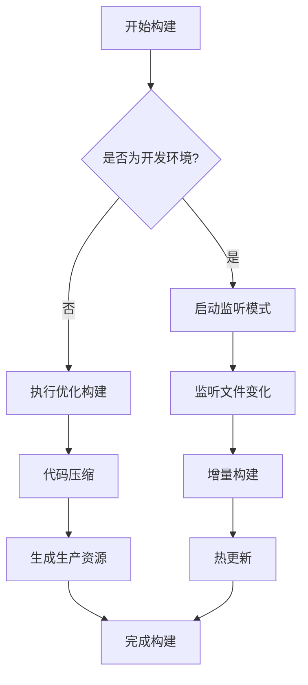

# 构建流程

<cite>
**本文档中引用的文件**  
- [buildPlugin.ts](file://packages/weapp-vite/src/runtime/buildPlugin.ts)
- [runtimeState.ts](file://packages/weapp-vite/src/runtime/runtimeState.ts)
- [scanPlugin.ts](file://packages/weapp-vite/src/runtime/scanPlugin.ts)
- [sharedBuildConfig.ts](file://packages/weapp-vite/src/runtime/sharedBuildConfig.ts)
- [npmPlugin.ts](file://packages/weapp-vite/src/runtime/npmPlugin.ts)
- [createContext.ts](file://packages/weapp-vite/src/createContext.ts)
- [CompilerContext.ts](file://packages/weapp-vite/src/context/CompilerContext.ts)
</cite>

## 目录
1. [构建入口与整体流程](#构建入口与整体流程)
2. [开发与生产环境构建策略](#开发与生产环境构建策略)
3. [构建队列与任务调度机制](#构建队列与任务调度机制)
4. [独立构建任务管理](#独立构建任务管理)
5. [扫描服务协同机制](#扫描服务协同机制)
6. [插件模式下的特殊处理](#插件模式下的特殊处理)

## 构建入口与整体流程

weapp-vite的构建流程始于`buildEntry`函数，该函数作为构建系统的入口点，负责协调整个构建过程。在执行构建前，系统首先调用`cleanOutputs`函数清理输出目录，确保构建环境的干净。随后，构建流程会根据环境变量决定是否调度npm依赖构建任务，并启动主应用的构建目标。

构建流程的核心是通过`runBuildTarget`函数执行具体的构建逻辑，该函数根据当前环境（开发或生产）选择相应的构建策略。在完成主应用构建后，如果项目配置了插件根目录，系统将自动启动插件构建任务，确保所有组件都被正确编译。

**Section sources**
- [buildPlugin.ts](file://packages/weapp-vite/src/runtime/buildPlugin.ts#L354-L365)

## 开发与生产环境构建策略

weapp-vite通过`runBuildTarget`函数实现开发与生产环境的不同构建策略。当`configService.isDev`为true时，系统执行开发环境构建（`runDev`），否则执行生产环境构建（`runProd`）。这种环境感知的构建机制确保了开发和生产环境能够采用最适合的优化策略。

在开发环境中，构建系统会启动监听模式，实时响应文件变化并重新构建。而在生产环境中，系统会执行完整的优化构建，包括代码压缩、资源优化等。两种环境都通过`createSharedBuildConfig`函数生成共享的构建配置，确保构建行为的一致性。

**Section sources**
- [buildPlugin.ts](file://packages/weapp-vite/src/runtime/buildPlugin.ts#L346-L352)

## 构建队列与任务调度机制

weapp-vite使用PQueue库实现构建队列管理，确保构建任务能够有序执行。构建队列在`runtimeState`中初始化，并通过`buildState.queue`属性暴露给构建服务。这种队列机制允许系统在高并发场景下有效管理构建任务，避免资源竞争。

构建任务通过`queue.add`方法添加到队列中，系统会在适当时候调用`queue.start()`启动队列执行。这种延迟启动机制使得多个构建任务可以被批量处理，提高构建效率。队列的自动启动功能被禁用（`autoStart: false`），给予系统更精细的控制能力。

**Diagram sources**
- [runtimeState.ts](file://packages/weapp-vite/src/runtime/runtimeState.ts#L158-L163)
- [buildPlugin.ts](file://packages/weapp-vite/src/runtime/buildPlugin.ts#L319-L324)

## 独立构建任务管理

对于独立分包场景，weapp-vite提供了专门的构建任务管理机制。系统通过`buildIndependentBundle`函数处理独立分包的构建，该函数会检查是否存在正在进行的构建任务，避免重复构建。每个独立构建任务都被缓存在`independentBuildTasks`映射中，确保任务的唯一性。

独立构建的输出结果通过`storeIndependentOutput`函数存储在`independentState.outputs`映射中，便于后续查询和管理。当分包内容发生变化时，`invalidateIndependentOutput`函数会清除对应的缓存输出，触发重新构建。这种精细化的缓存管理机制显著提升了构建效率。

**Section sources**
- [buildPlugin.ts](file://packages/weapp-vite/src/runtime/buildPlugin.ts#L63-L108)

## 扫描服务协同机制

构建系统与扫描服务（scanService）紧密协作，确保构建过程能够准确识别项目结构。扫描服务负责解析`app.json`文件，识别主包和分包配置，并将这些信息提供给构建系统。在构建开始前，`loadAppEntry`函数会加载应用入口信息，为后续构建提供必要的上下文。

当文件系统发生变化时，扫描服务会标记相应的分包为"脏"状态，触发重新构建。对于独立分包，`markIndependentDirty`函数会将变化的根目录添加到`independentDirtyRoots`集合中，在下一次构建时处理。这种事件驱动的协同机制确保了构建结果的准确性和时效性。

**Section sources**
- [scanPlugin.ts](file://packages/weapp-vite/src/runtime/scanPlugin.ts#L602-L619)

## 插件模式下的特殊处理

在插件模式下，weapp-vite会执行额外的构建步骤。当`configService.absolutePluginRoot`存在时，系统会在主应用构建完成后，调用`runBuildTarget('plugin')`执行插件构建。这种分阶段的构建策略确保了插件能够正确引用主应用的资源。

插件构建过程中，系统会特别处理`workers`目录，确保插件的工作线程脚本被正确编译。如果检测到`workers`目录但未配置`weapp.worker.entry`，系统会抛出错误提示开发者进行配置。这种严格的验证机制避免了常见的配置错误，提高了开发体验。

**Section sources**
- [buildPlugin.ts](file://packages/weapp-vite/src/runtime/buildPlugin.ts#L360-L362)
- [buildPlugin.ts](file://packages/weapp-vite/src/runtime/buildPlugin.ts#L110-L123)