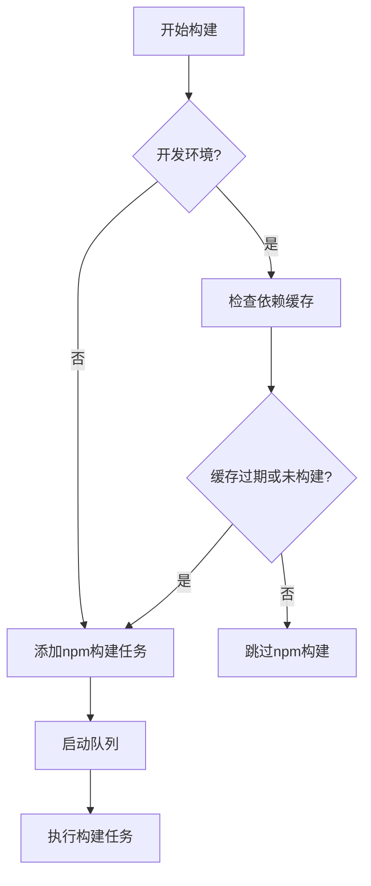
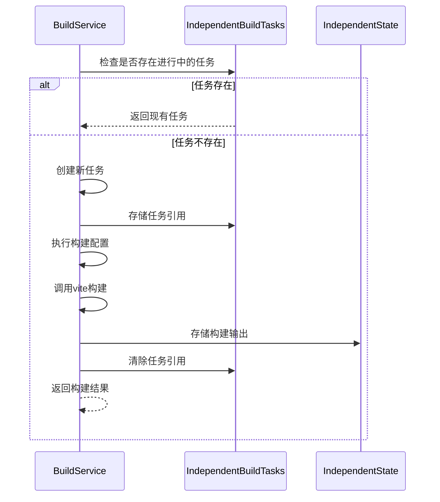
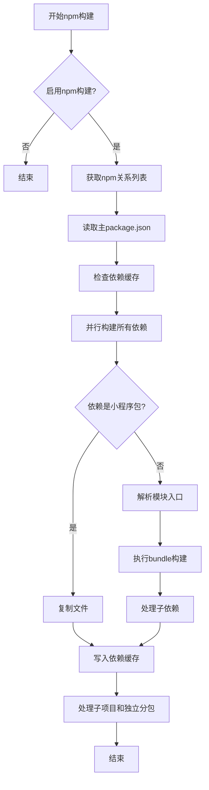
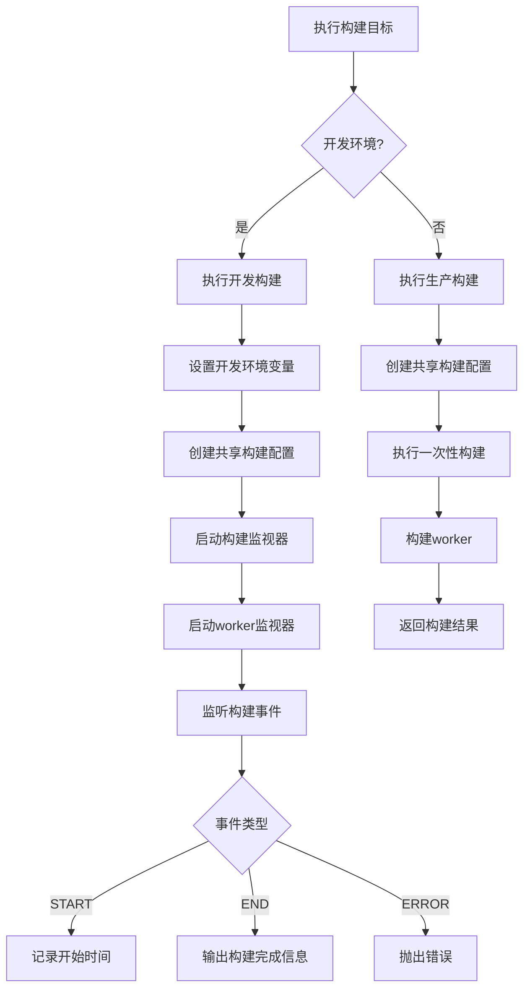
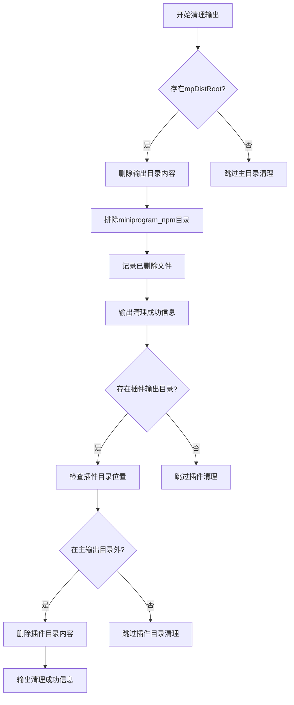
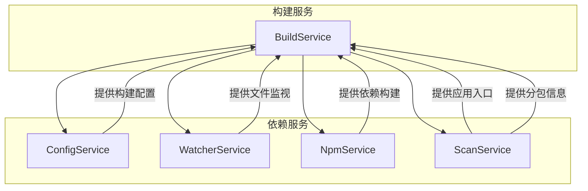
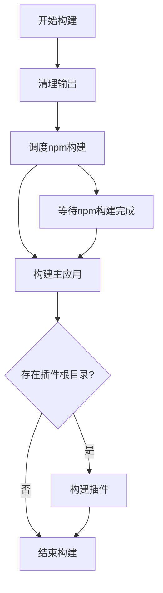

# 构建系统

<cite>
**本文档引用的文件**   
- [buildPlugin.ts](file://packages/weapp-vite/src/runtime/buildPlugin.ts)
- [npmPlugin.ts](file://packages/weapp-vite/src/runtime/npmPlugin.ts)
- [scanPlugin.ts](file://packages/weapp-vite/src/runtime/scanPlugin.ts)
- [runtimeState.ts](file://packages/weapp-vite/src/runtime/runtimeState.ts)
- [sharedBuildConfig.ts](file://packages/weapp-vite/src/runtime/sharedBuildConfig.ts)
</cite>

## 目录
1. [构建服务概述](#构建服务概述)
2. [构建队列与任务调度](#构建队列与任务调度)
3. [独立构建任务管理](#独立构建任务管理)
4. [npm依赖构建流程](#npm依赖构建流程)
5. [构建目标执行策略](#构建目标执行策略)
6. [构建前清理机制](#构建前清理机制)
7. [构建系统协同工作](#构建系统协同工作)
8. [插件模式处理](#插件模式处理)

## 构建服务概述

构建服务（BuildService）是weapp-vite构建系统的核心组件，负责协调和管理整个构建流程。该服务通过`createBuildService`函数创建，需要依赖配置服务（configService）、监视服务（watcherService）、npm服务（npmService）和扫描服务（scanService）的初始化。构建服务提供了构建队列、独立构建包、获取和失效独立输出等核心功能。

**Section sources**
- [buildPlugin.ts](file://packages/weapp-vite/src/runtime/buildPlugin.ts#L31-L383)

## 构建队列与任务调度

构建服务使用PQueue库来管理构建任务队列，确保任务按顺序执行。构建队列在`runtimeState`中初始化，并通过`buildState.queue`访问。任务调度机制通过`scheduleNpmBuild`函数实现，该函数根据开发/生产环境决定是否执行npm构建任务。

在开发环境中，系统会检测依赖缓存是否过期，只有当缓存过期或尚未构建时才会执行npm构建任务。在生产环境中，任务会被直接添加到队列中并立即开始执行。

**Diagram sources **
- [buildPlugin.ts](file://packages/weapp-vite/src/runtime/buildPlugin.ts#L314-L344)

**Section sources**
- [buildPlugin.ts](file://packages/weapp-vite/src/runtime/buildPlugin.ts#L314-L344)

## 独立构建任务管理

独立构建任务管理是构建系统的重要功能，用于处理小程序的独立分包。系统通过`buildIndependentBundle`函数实现独立分包的构建，该函数接收分包根路径和元数据作为参数。

构建过程中，系统会检查是否存在正在进行的相同任务，避免重复构建。构建结果通过`storeIndependentOutput`函数存储在`independentState.outputs`映射中，可以通过`getIndependentOutput`函数获取。当分包内容发生变化时，`invalidateIndependentOutput`函数会清除对应的缓存输出。

**Diagram sources **
- [buildPlugin.ts](file://packages/weapp-vite/src/runtime/buildPlugin.ts#L63-L108)

**Section sources**
- [buildPlugin.ts](file://packages/weapp-vite/src/runtime/buildPlugin.ts#L63-L108)

## npm依赖构建流程

npm依赖构建流程由`NpmService`负责管理，通过`build`函数执行完整的npm依赖处理。系统首先检查`weappViteConfig.npm.enable`配置决定是否启用npm构建。

构建流程包括：
1. 获取npm关系列表（packNpmRelationList）
2. 读取主package.json文件
3. 检查依赖缓存是否过期
4. 并行构建所有依赖包
5. 写入新的依赖缓存

对于每个依赖包，系统会根据其是否为小程序包（通过`miniprogram`字段判断）采用不同的构建策略：小程序包直接复制文件，普通包则通过bundleBuild进行打包。

**Diagram sources **
- [npmPlugin.ts](file://packages/weapp-vite/src/runtime/npmPlugin.ts#L256-L347)

**Section sources**
- [npmPlugin.ts](file://packages/weapp-vite/src/runtime/npmPlugin.ts#L256-L347)

## 构建目标执行策略

`runBuildTarget`函数根据当前环境执行不同的构建策略。在开发环境中调用`runDev`函数，在生产环境中调用`runProd`函数。

开发环境构建（`runDev`）会创建一个监视器（watcher），实时监听文件变化并重新构建。生产环境构建（`runProd`）则直接执行一次性构建，生成最终的输出文件。

**Diagram sources **
- [buildPlugin.ts](file://packages/weapp-vite/src/runtime/buildPlugin.ts#L346-L352)

**Section sources**
- [buildPlugin.ts](file://packages/weapp-vite/src/runtime/buildPlugin.ts#L346-L352)

## 构建前清理机制

`cleanOutputs`函数负责在构建前清理输出目录，确保构建环境的干净。该函数会删除输出目录中的所有文件和隐藏文件，但会保留`miniprogram_npm`目录，避免重复构建npm依赖。

对于插件输出目录，系统会检查其是否在主输出目录内，只有当插件输出目录在主输出目录外时才会进行清理。

**Diagram sources **
- [buildPlugin.ts](file://packages/weapp-vite/src/runtime/buildPlugin.ts#L277-L312)

**Section sources**
- [buildPlugin.ts](file://packages/weapp-vite/src/runtime/buildPlugin.ts#L277-L312)

## 构建系统协同工作

构建系统与其他服务（如npmService、scanService）紧密协作。`scanService`负责扫描应用入口、插件配置和分包信息，为构建提供必要的元数据。`npmService`负责处理npm依赖的构建和缓存管理。

在构建过程中，系统会首先通过`scanService.loadAppEntry()`加载应用入口，然后通过`scanService.loadSubPackages()`加载分包信息。这些信息被用于配置构建选项，确保正确处理各个模块。

**Diagram sources **
- [buildPlugin.ts](file://packages/weapp-vite/src/runtime/buildPlugin.ts#L45-L46)
- [scanPlugin.ts](file://packages/weapp-vite/src/runtime/scanPlugin.ts#L431-L492)

**Section sources**
- [buildPlugin.ts](file://packages/weapp-vite/src/runtime/buildPlugin.ts#L45-L46)
- [scanPlugin.ts](file://packages/weapp-vite/src/runtime/scanPlugin.ts#L431-L492)

## 插件模式处理

在插件模式下，构建系统会额外处理插件相关的构建任务。当`configService.absolutePluginRoot`存在时，系统会在主应用构建完成后，调用`runBuildTarget('plugin')`执行插件构建。

插件构建流程与主应用构建类似，但会使用插件特定的配置。系统会确保插件构建在主应用构建完成后执行，避免构建顺序问题。

**Diagram sources **
- [buildPlugin.ts](file://packages/weapp-vite/src/runtime/buildPlugin.ts#L354-L362)

**Section sources**
- [buildPlugin.ts](file://packages/weapp-vite/src/runtime/buildPlugin.ts#L354-L362)