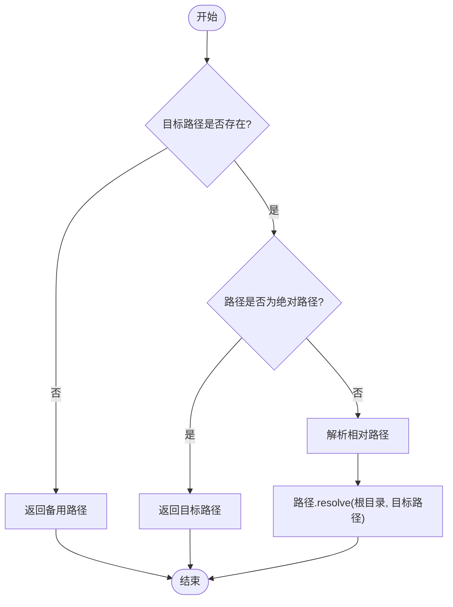
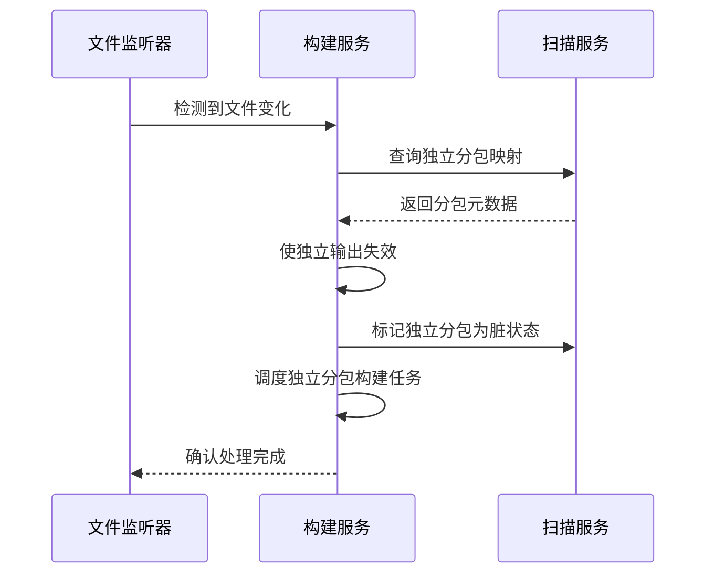
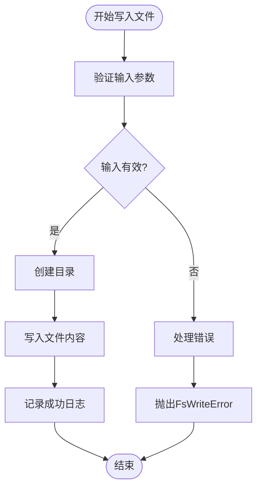
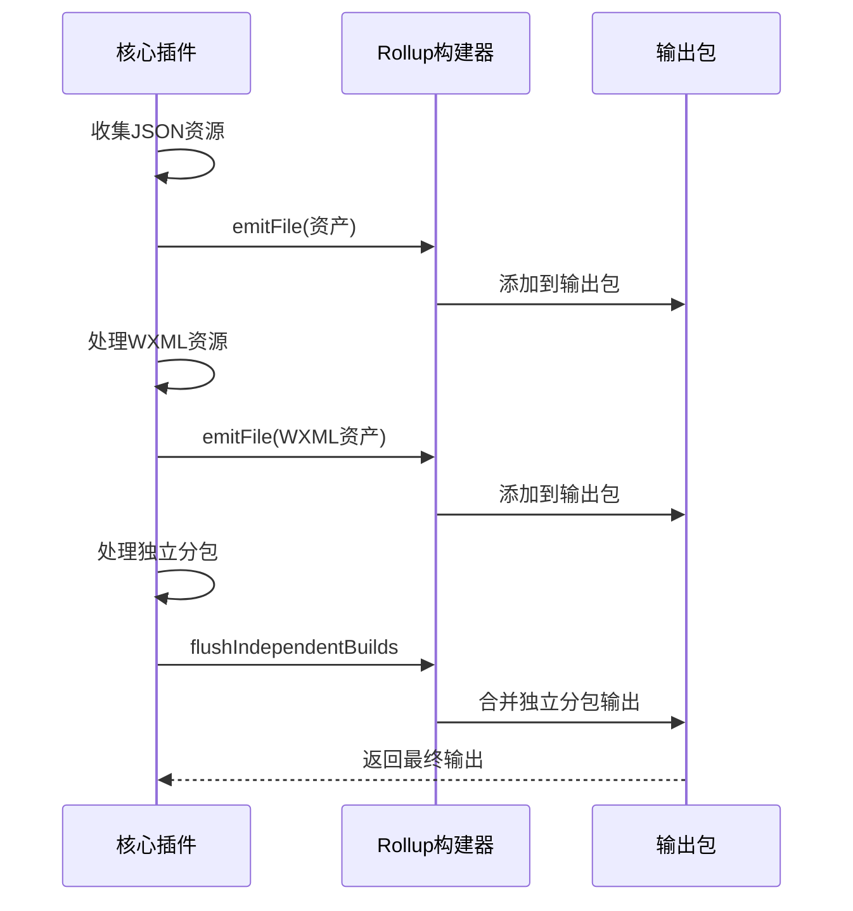
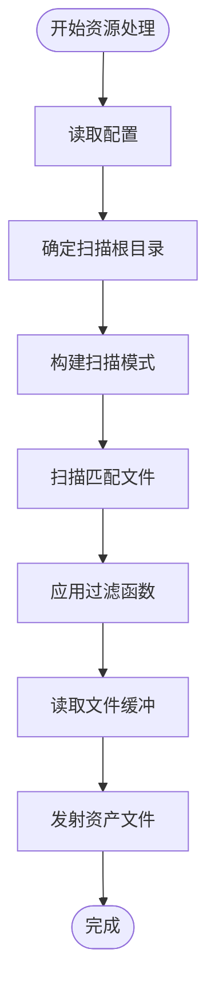
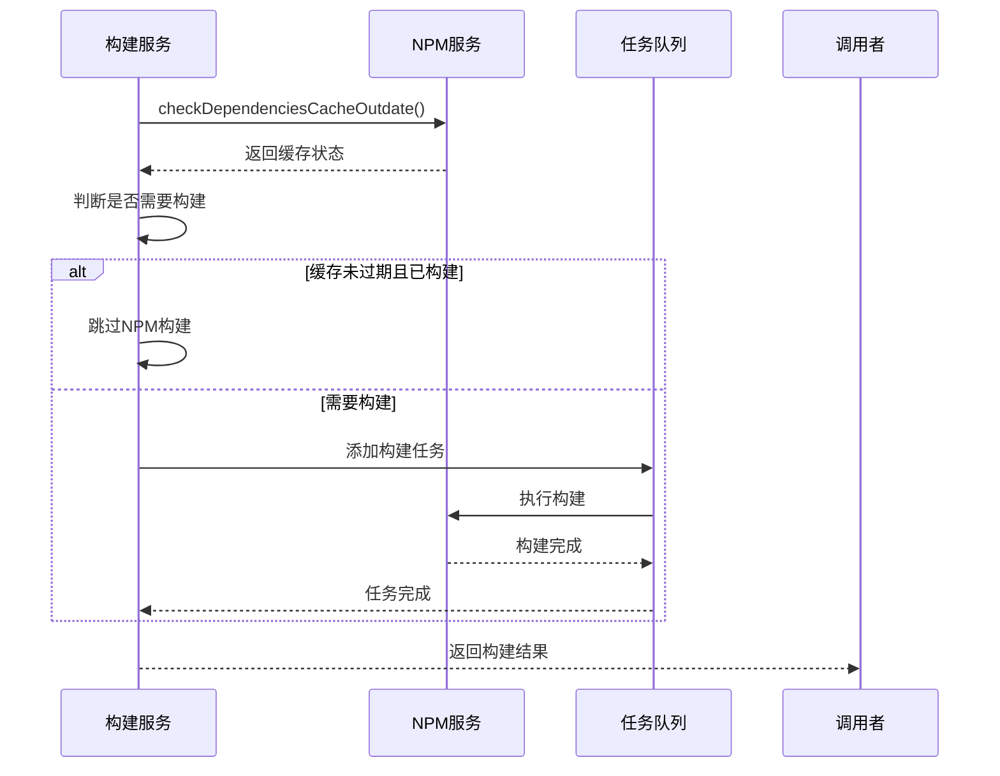
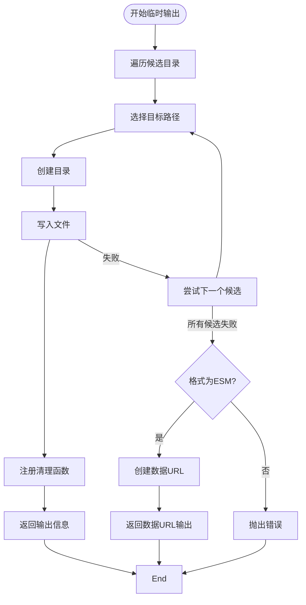

# 输出处理

<cite>
**本文档引用的文件**
- [core.ts](file://packages/weapp-vite/src/plugins/core.ts)
- [buildPlugin.ts](file://packages/weapp-vite/src/runtime/buildPlugin.ts)
- [asset.ts](file://packages/weapp-vite/src/plugins/asset.ts)
- [file.ts](file://packages/weapp-vite/src/utils/file.ts)
- [path.ts](file://@weapp-core/init/src/utils/path.ts)
- [configFiles.ts](file://@weapp-core/init/src/configFiles.ts)
- [projectConfig.ts](file://@weapp-core/init/src/projectConfig.ts)
- [packageJson.ts](file://@weapp-core/init/src/packageJson.ts)
- [temp-output.ts](file://packages/rolldown-require/src/temp-output.ts)
</cite>

## 目录
1. [输出处理概述](#输出处理概述)
2. [输出路径配置与管理](#输出路径配置与管理)
3. [独立分包输出处理](#独立分包输出处理)
4. [文件写入流程](#文件写入流程)
5. [资源文件处理](#资源文件处理)
6. [增量构建优化](#增量构建优化)

## 输出处理概述

weapp-vite构建系统的输出处理机制负责管理构建结果的生成、存储和优化。系统通过多层插件架构和运行时服务协同工作，确保输出文件的正确生成和高效管理。输出处理涵盖了JS、WXML、WXSS等小程序文件类型以及静态资源文件的处理。

**Section sources**
- [core.ts](file://packages/weapp-vite/src/plugins/core.ts#L1-L776)
- [buildPlugin.ts](file://packages/weapp-vite/src/runtime/buildPlugin.ts#L1-L384)

## 输出路径配置与管理

weapp-vite通过`resolveOutputPath`函数统一管理输出路径的解析和配置。该函数根据项目根目录、目标路径和备用路径来确定最终的输出位置。



**Diagram sources**
- [path.ts](file://@weapp-core/init/src/utils/path.ts#L3-L9)

输出路径的配置贯穿于项目初始化和构建过程的各个阶段，包括vite配置文件、ts声明文件、tsconfig配置和package.json等。

**Section sources**
- [configFiles.ts](file://@weapp-core/init/src/configFiles.ts#L11-L78)
- [packageJson.ts](file://@weapp-core/init/src/packageJson.ts#L9-L93)
- [projectConfig.ts](file://@weapp-core/init/src/projectConfig.ts#L6-L117)

## 独立分包输出处理

weapp-vite通过`buildIndependentBundle`函数处理独立分包的构建和输出管理。系统维护一个独立输出缓存，用于存储和检索已构建的独立分包结果。

```mermaid
classDiagram
class BuildService {
+queue : PQueue
+build(options) : Promise<RolldownOutput>
+buildIndependentBundle(root, meta) : Promise<RolldownOutput>
+getIndependentOutput(root) : RolldownOutput | undefined
+invalidateIndependentOutput(root) : void
}
class IndependentState {
+outputs : Map<string, RolldownOutput>
}
class BuildPluginState {
+pendingIndependentBuilds : Promise<IndependentBuildResult>[]
+subPackageMeta? : SubPackageMetaValue
}
BuildService --> IndependentState : "存储"
BuildService --> BuildPluginState : "协调"
BuildPluginState --> BuildService : "触发构建"
BuildService --> "Rolldown" : "调用"
```

**Diagram sources**
- [buildPlugin.ts](file://packages/weapp-vite/src/runtime/buildPlugin.ts#L31-L109)

当文件发生变化时，系统会自动检测并使相关独立分包的输出失效，确保输出的时效性。



**Diagram sources**
- [core.ts](file://packages/weapp-vite/src/plugins/core.ts#L182-L205)

## 文件写入流程

weapp-vite的文件写入流程通过`writeFile`和`writeJsonFile`函数实现，这些函数封装了底层的文件系统操作，并提供了错误处理和日志记录功能。



**Diagram sources**
- [fs.ts](file://@weapp-core/init/src/utils/fs.ts#L51-L60)

在构建过程中，系统通过Vite的emitFile API将各种类型的输出文件添加到构建结果中。



**Diagram sources**
- [core.ts](file://packages/weapp-vite/src/plugins/core.ts#L580-L775)

## 资源文件处理

weapp-vite通过asset插件处理静态资源文件的拷贝和优化。系统会扫描指定目录下的资源文件，并将其复制到输出目录中。

```mermaid
classDiagram
class AssetPluginState {
+ctx : CompilerContext
+buildTarget : BuildTarget
+resolvedConfig? : ResolvedConfig
+pendingAssets? : Promise<AssetCandidate[]>
}
class AssetCollector {
+configResolved(config)
+buildStart()
+buildEnd()
}
class AssetScanner {
+scanAssetFiles(configService, config, buildTarget)
+normalizeCopyGlobs(globs)
}
AssetCollector --> AssetScanner : "调用"
AssetPluginState --> AssetCollector : "状态"
AssetScanner --> "fdir" : "文件扫描"
AssetCollector --> "Vite" : "emitFile"
```

**Diagram sources**
- [asset.ts](file://packages/weapp-vite/src/plugins/asset.ts#L1-L132)

资源文件处理支持自定义包含和排除模式，以及过滤函数，提供了灵活的资源配置能力。



**Diagram sources**
- [asset.ts](file://packages/weapp-vite/src/plugins/asset.ts#L26-L88)

## 增量构建优化

weapp-vite通过缓存机制和任务队列优化增量构建性能。系统会检查依赖项缓存是否过期，并根据结果决定是否需要重新构建。



**Diagram sources**
- [buildPlugin.ts](file://packages/weapp-vite/src/runtime/buildPlugin.ts#L314-L344)

对于临时输出文件，系统提供了多种写入策略，包括尝试多个候选目录和使用数据URL作为后备方案。



**Diagram sources**
- [temp-output.ts](file://packages/rolldown-require/src/temp-output.ts#L45-L80)