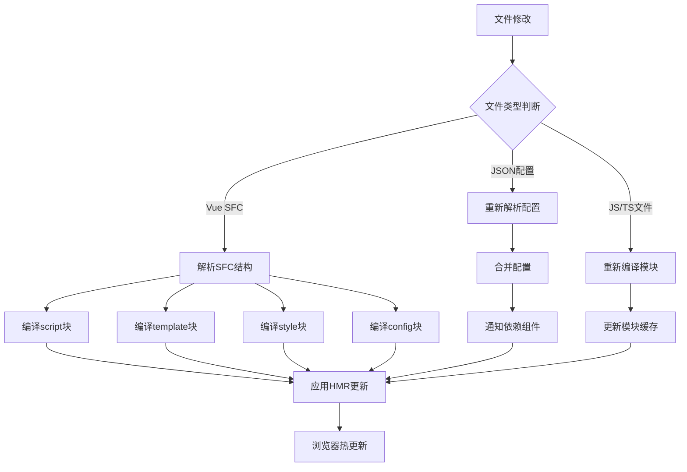
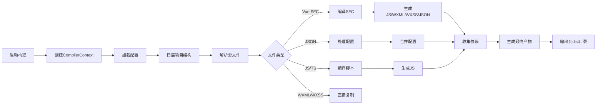
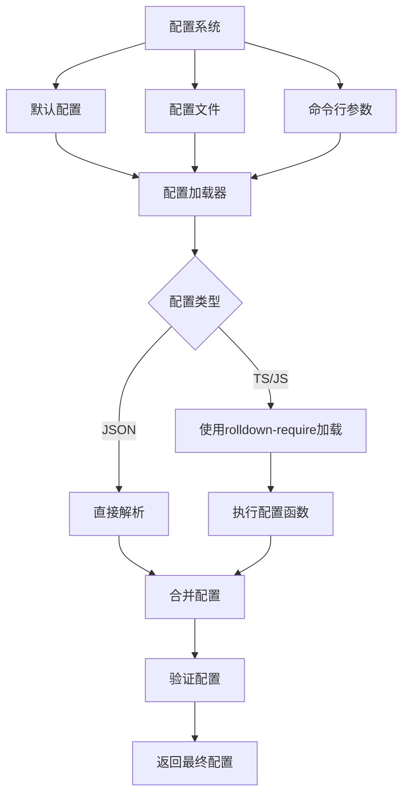
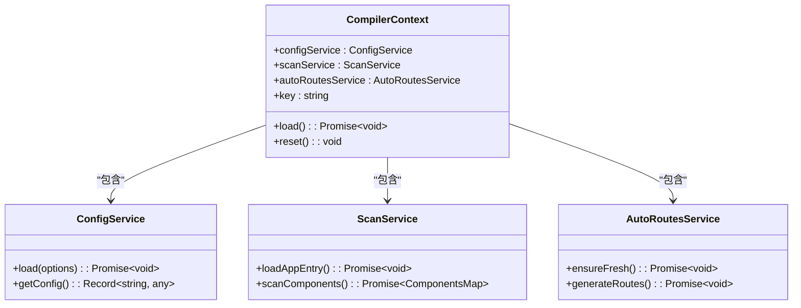
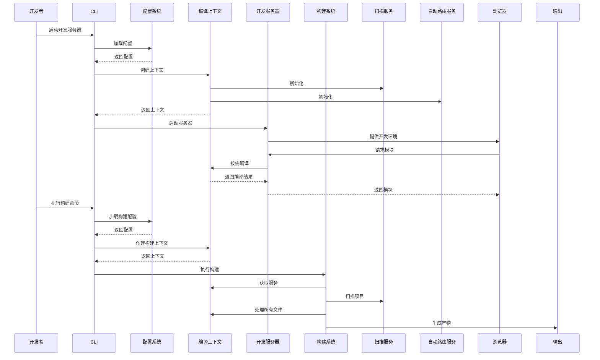

# 核心功能

<cite>
**本文档中引用的文件**  
- [@weapp-core/init/src/context.ts](file://@weapp-core/init/src/context.ts)
- [packages/weapp-vite/src/createContext.ts](file://packages/weapp-vite/src/createContext.ts)
- [packages/plugin-wevu/src/compiler.ts](file://packages/plugin-wevu/src/compiler.ts)
- [packages/weapp-vite/src/types/context.ts](file://packages/weapp-vite/src/types/context.ts)
- [packages/weapp-vite/src/cli/commands/build.ts](file://packages/weapp-vite/src/cli/commands/build.ts)
- [packages/weapp-vite/src/config/index.ts](file://packages/weapp-vite/src/config/index.ts)
</cite>

## 目录
1. [简介](#简介)
2. [开发服务器与热更新机制](#开发服务器与热更新机制)
3. [构建系统工作流程](#构建系统工作流程)
4. [配置系统设计](#配置系统设计)
5. [编译上下文(CompilerContext)管理](#编译上下文compilercontext管理)
6. [核心功能协同工作原理](#核心功能协同工作原理)
7. [总结](#总结)

## 简介

weapp-vite 是一个专为微信小程序开发设计的现代化构建工具，基于 Vite 构建，提供了高效的开发体验。本文档深入解析其核心功能实现机制，包括基于 Vite 的开发服务器、构建系统、配置系统以及编译上下文管理等关键组件。通过分析源码结构和实现原理，帮助开发者理解系统内部工作机制，同时保持内容对初学者的可理解性。

**Section sources**
- [@weapp-core/init/src/context.ts](file://@weapp-core/init/src/context.ts#L1-L39)
- [packages/weapp-vite/src/types/context.ts](file://packages/weapp-vite/src/types/context.ts#L1-L17)

## 开发服务器与热更新机制

weapp-vite 的开发服务器基于 Vite 的核心架构，利用原生 ES 模块导入和浏览器的模块化支持，实现了极快的启动速度和高效的热模块替换（HMR）功能。当开发者启动开发服务器时，系统会创建一个编译上下文（CompilerContext），该上下文包含了项目配置、扫描服务和自动路由服务等核心组件。

热更新机制的核心在于文件监听和依赖追踪。系统通过 Vite 的插件系统监听项目文件的变化，当检测到文件修改时，会触发相应的编译流程。对于 Vue 单文件组件（SFC），weapp-vite 使用自定义的编译器（如 plugin-wevu）来处理 `<script>`、`<template>`、`<style>` 和 `<config>` 块的转换。编译器会分析组件的依赖关系，并在文件变化时精确地更新受影响的模块，而不是重新加载整个页面。

**Diagram sources**
- [packages/plugin-wevu/src/compiler.ts](file://packages/plugin-wevu/src/compiler.ts#L1-L284)

**Section sources**
- [packages/plugin-wevu/src/compiler.ts](file://packages/plugin-wevu/src/compiler.ts#L1-L284)

## 构建系统工作流程

weapp-vite 的构建系统从源代码到最终输出的完整转换过程遵循一个清晰的工作流程。构建过程始于 `build` 命令的执行，该命令位于 `packages/weapp-vite/src/cli/commands/build.ts` 文件中。构建流程主要包括以下几个阶段：

1. **初始化编译上下文**：创建 CompilerContext 实例，加载项目配置和服务
2. **解析源代码**：扫描项目目录，识别所有小程序页面和组件
3. **转换处理**：对不同类型的文件进行相应的转换处理
4. **依赖分析**：分析模块间的依赖关系，构建依赖图
5. **代码生成**：生成最终的小程序代码
6. **输出结果**：将构建结果输出到指定目录

构建系统特别关注小程序特有的文件结构和配置要求。例如，系统会自动处理 `app.json`、页面 JSON 配置文件以及组件依赖关系。对于 Vue SFC 文件，构建系统会将其分解为独立的 `.js`、`.wxml`、`.wxss` 和 `.json` 文件，以符合小程序的运行时要求。

**Diagram sources**
- [packages/weapp-vite/src/cli/commands/build.ts](file://packages/weapp-vite/src/cli/commands/build.ts)

**Section sources**
- [packages/weapp-vite/src/cli/commands/build.ts](file://packages/weapp-vite/src/cli/commands/build.ts)

## 配置系统设计

weapp-vite 的配置系统设计灵活且强大，支持多种配置文件格式和复杂的配置合并策略。配置系统的核心位于 `packages/weapp-vite/src/config/index.ts` 文件中，负责管理项目的配置加载和解析过程。

配置文件的加载顺序遵循特定的优先级规则：
1. 默认配置
2. 项目根目录的配置文件（如 `weapp.config.ts`）
3. 命令行参数覆盖

系统支持多种配置文件格式，包括 `.js`、`.ts`、`.json` 等。对于 TypeScript 配置文件，系统使用 `rolldown-require` 进行动态加载和执行，确保类型安全的同时保持运行时的灵活性。

配置合并策略采用深度合并（deep merge）的方式，确保不同来源的配置能够正确地组合在一起。例如，当项目同时存在默认配置和用户自定义配置时，系统会递归地合并对象属性，而不是简单地覆盖整个配置对象。

**Diagram sources**
- [packages/weapp-vite/src/config/index.ts](file://packages/weapp-vite/src/config/index.ts)

**Section sources**
- [packages/weapp-vite/src/config/index.ts](file://packages/weapp-vite/src/config/index.ts)

## 编译上下文(CompilerContext)管理

编译上下文（CompilerContext）是 weapp-vite 构建系统的核心数据结构，负责管理整个构建过程中的状态和服务实例。CompilerContext 的创建和管理机制位于 `packages/weapp-vite/src/createContext.ts` 文件中。

CompilerContext 的主要职责包括：
- 存储项目配置信息
- 管理扫描服务（ScanService）
- 管理自动路由服务（AutoRoutesService）
- 提供全局状态管理

创建 CompilerContext 的过程如下：
1. 调用 `createCompilerContext` 函数
2. 设置活动上下文键（key）
3. 获取或创建对应的编译上下文实例
4. 加载配置服务
5. 确保自动路由服务的最新状态
6. 预检应用入口文件

系统通过 `getCompilerContext` 和 `setActiveCompilerContextKey` 等函数来管理多个编译上下文实例，支持在同一个进程中处理多个项目或不同构建任务。

**Diagram sources**
- [packages/weapp-vite/src/createContext.ts](file://packages/weapp-vite/src/createContext.ts#L1-L28)
- [@weapp-core/init/src/context.ts](file://@weapp-core/init/src/context.ts#L1-L39)

**Section sources**
- [packages/weapp-vite/src/createContext.ts](file://packages/weapp-vite/src/createContext.ts#L1-L28)

## 核心功能协同工作原理

weapp-vite 的各个核心功能组件协同工作，共同提供高效的开发体验。整个系统的工作流程可以概括为：配置系统提供基础设置，编译上下文管理全局状态，开发服务器提供实时预览，构建系统生成最终产物。

在开发模式下，当开发者启动服务器时：
1. 配置系统加载项目配置
2. 创建编译上下文，初始化各项服务
3. 开发服务器启动，监听文件变化
4. 首次请求时，按需编译所需模块
5. 文件变化时，触发热更新流程

在构建模式下：
1. 配置系统加载构建配置
2. 创建编译上下文
3. 扫描整个项目结构
4. 按照构建流程处理所有文件
5. 生成最终的小程序包

这些功能通过精心设计的接口和依赖关系紧密耦合，同时保持足够的解耦以支持独立的功能扩展和维护。

**Diagram sources**
- [packages/weapp-vite/src/createContext.ts](file://packages/weapp-vite/src/createContext.ts#L1-L28)
- [packages/weapp-vite/src/cli/commands/build.ts](file://packages/weapp-vite/src/cli/commands/build.ts)
- [packages/weapp-vite/src/config/index.ts](file://packages/weapp-vite/src/config/index.ts)

**Section sources**
- [packages/weapp-vite/src/createContext.ts](file://packages/weapp-vite/src/createContext.ts#L1-L28)
- [packages/weapp-vite/src/cli/commands/build.ts](file://packages/weapp-vite/src/cli/commands/build.ts)
- [packages/weapp-vite/src/config/index.ts](file://packages/weapp-vite/src/config/index.ts)

## 总结

weapp-vite 通过整合 Vite 的现代化构建理念和小程序的特定需求，创造了一个高效、灵活的开发工具。其核心功能包括基于 Vite 的开发服务器、完整的构建系统、灵活的配置系统和强大的编译上下文管理机制。这些功能协同工作，为开发者提供了快速的启动速度、即时的热更新和可靠的构建输出。

系统的设计注重可维护性和扩展性，通过清晰的模块划分和接口定义，使得功能组件既能够独立工作，又能够无缝集成。对于开发者而言，理解这些核心功能的实现机制不仅有助于更好地使用工具，还能在遇到问题时快速定位和解决。

**Section sources**
- [@weapp-core/init/src/context.ts](file://@weapp-core/init/src/context.ts#L1-L39)
- [packages/weapp-vite/src/createContext.ts](file://packages/weapp-vite/src/createContext.ts#L1-L28)
- [packages/plugin-wevu/src/compiler.ts](file://packages/plugin-wevu/src/compiler.ts#L1-L284)
- [packages/weapp-vite/src/types/context.ts](file://packages/weapp-vite/src/types/context.ts#L1-L17)
- [packages/weapp-vite/src/cli/commands/build.ts](file://packages/weapp-vite/src/cli/commands/build.ts)
- [packages/weapp-vite/src/config/index.ts](file://packages/weapp-vite/src/config/index.ts)