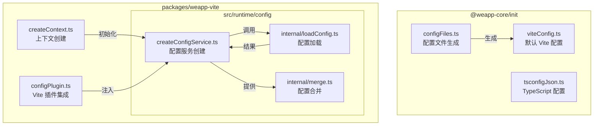
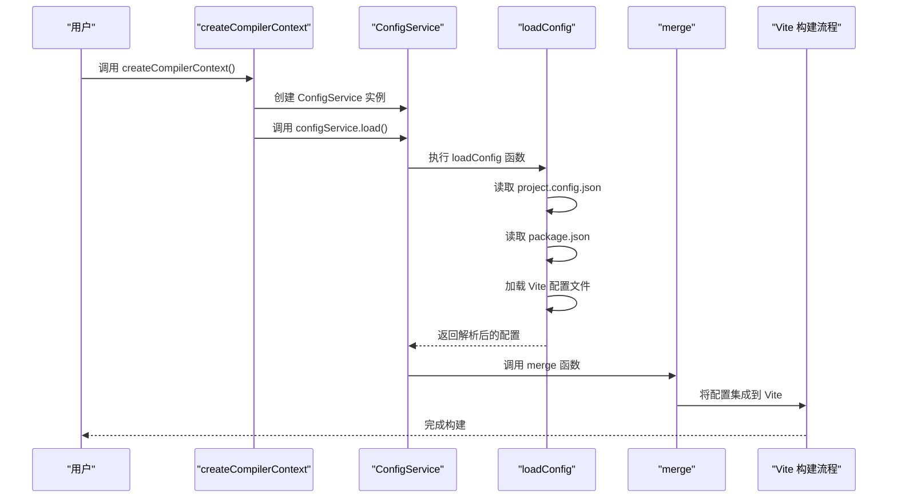
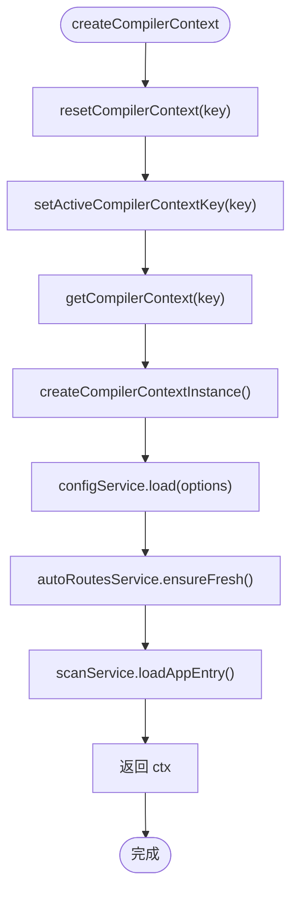
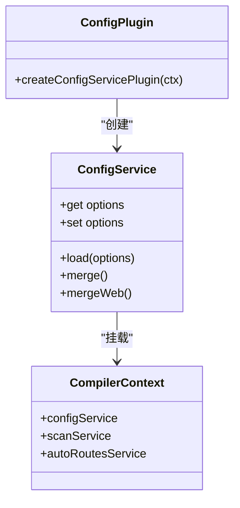

# 配置系统

<cite>
**本文档中引用的文件**  
- [createContext.ts](file://packages/weapp-vite/src/createContext.ts)
- [configPlugin.ts](file://packages/weapp-vite/src/runtime/configPlugin.ts)
- [createConfigService.ts](file://packages/weapp-vite/src/runtime/config/createConfigService.ts)
- [loadConfig.ts](file://packages/weapp-vite/src/runtime/config/internal/loadConfig.ts)
- [merge.ts](file://packages/weapp-vite/src/runtime/config/internal/merge.ts)
- [viteConfig.ts](file://@weapp-core/init/src/viteConfig.ts)
- [configFiles.ts](file://@weapp-core/init/src/configFiles.ts)
- [getInstance.ts](file://packages/weapp-vite/src/context/getInstance.ts)
</cite>

## 目录

1. [简介](#简介)
2. [项目结构](#项目结构)
3. [核心组件](#核心组件)
4. [架构概述](#架构概述)
5. [详细组件分析](#详细组件分析)
6. [依赖分析](#依赖分析)
7. [性能考虑](#性能考虑)
8. [故障排除指南](#故障排除指南)
9. [结论](#结论)

## 简介

weapp-vite 的配置系统是一个高度模块化和可扩展的架构，旨在为微信小程序开发提供灵活且强大的构建配置能力。该系统通过分层设计实现了配置的加载、合并、解析和运行时集成，支持开发（dev）与生产（prod）环境的差异化配置，并兼容插件模式下的特殊需求。本文档深入剖析其内部机制，涵盖从配置文件读取到最终应用的完整生命周期，以及与其他核心服务（如 webService、buildService）的集成方式。

## 项目结构

weapp-vite 的配置系统主要分布在 `@weapp-core/init` 和 `packages/weapp-vite` 两个核心模块中。`@weapp-core/init` 负责项目初始化时的配置文件生成，而 `packages/weapp-vite` 则包含了运行时的配置服务、加载逻辑和 Vite 插件集成。



**Diagram sources**
- [configFiles.ts](file://@weapp-core/init/src/configFiles.ts#L1-L90)
- [viteConfig.ts](file://@weapp-core/init/src/viteConfig.ts#L1-L11)
- [createConfigService.ts](file://packages/weapp-vite/src/runtime/config/createConfigService.ts#L1-L302)
- [loadConfig.ts](file://packages/weapp-vite/src/runtime/config/internal/loadConfig.ts#L1-L261)
- [merge.ts](file://packages/weapp-vite/src/runtime/config/internal/merge.ts#L1-L319)
- [configPlugin.ts](file://packages/weapp-vite/src/runtime/configPlugin.ts#L1-L15)
- [createContext.ts](file://packages/weapp-vite/src/createContext.ts#L1-L28)

**Section sources**
- [configFiles.ts](file://@weapp-core/init/src/configFiles.ts#L1-L90)
- [viteConfig.ts](file://@weapp-core/init/src/viteConfig.ts#L1-L11)
- [createConfigService.ts](file://packages/weapp-vite/src/runtime/config/createConfigService.ts#L1-L302)

## 核心组件

weapp-vite 配置系统的核心在于 `ConfigService` 的创建与管理。该服务通过 `createCompilerContext` 函数进行实例化，是整个构建流程的配置中心。`ConfigService` 不仅负责加载和解析配置，还管理着别名（alias）、环境变量（defineEnv）以及与其他服务的交互。

**Section sources**
- [createContext.ts](file://packages/weapp-vite/src/createContext.ts#L4-L27)
- [createConfigService.ts](file://packages/weapp-vite/src/runtime/config/createConfigService.ts#L16-L302)

## 架构概述

weapp-vite 的配置系统采用分层架构，确保了配置的灵活性和可维护性。系统首先通过 `createCompilerContextInstance` 初始化一个编译上下文，然后在该上下文中创建 `ConfigService`。`ConfigService` 使用 `loadConfig` 函数加载配置，并通过 `merge` 系列函数将配置应用到 Vite 构建流程中。



**Diagram sources**
- [createContext.ts](file://packages/weapp-vite/src/createContext.ts#L4-L27)
- [createConfigService.ts](file://packages/weapp-vite/src/runtime/config/createConfigService.ts#L137-L165)
- [loadConfig.ts](file://packages/weapp-vite/src/runtime/config/internal/loadConfig.ts#L40-L260)
- [merge.ts](file://packages/weapp-vite/src/runtime/config/internal/merge.ts#L134-L229)

## 详细组件分析

### createCompilerContext 实例化流程

`createCompilerContext` 是配置服务初始化的入口。它首先通过 `resetCompilerContext` 确保上下文的纯净，然后调用 `getCompilerContext` 获取或创建一个 `CompilerContext` 实例。在此过程中，`ConfigService` 被创建并加载配置。



**Diagram sources**
- [createContext.ts](file://packages/weapp-vite/src/createContext.ts#L4-L27)
- [getInstance.ts](file://packages/weapp-vite/src/context/getInstance.ts#L17-L32)

**Section sources**
- [createContext.ts](file://packages/weapp-vite/src/createContext.ts#L4-L27)
- [getInstance.ts](file://packages/weapp-vite/src/context/getInstance.ts#L17-L32)

### configPlugin 集成机制

`configPlugin` 是连接 weapp-vite 配置系统与 Vite 构建流程的桥梁。它通过 `createConfigServicePlugin` 函数创建一个 Vite 插件，该插件在初始化时创建 `ConfigService` 并将其挂载到编译上下文 `ctx` 上。这样，Vite 的其他插件就可以通过 `ctx.configService` 访问统一的配置。



**Diagram sources**
- [configPlugin.ts](file://packages/weapp-vite/src/runtime/configPlugin.ts#L7-L14)
- [createConfigService.ts](file://packages/weapp-vite/src/runtime/config/createConfigService.ts#L16-L302)
- [getInstance.ts](file://packages/weapp-vite/src/context/getInstance.ts#L1-L45)

**Section sources**
- [configPlugin.ts](file://packages/weapp-vite/src/runtime/configPlugin.ts#L7-L14)
- [createConfigService.ts](file://packages/weapp-vite/src/runtime/config/createConfigService.ts#L16-L302)

## 依赖分析

weapp-vite 配置系统依赖于多个核心模块和外部库。`@weapp-core/shared` 提供了 `defu` 工具用于配置合并，`vite` 提供了 `loadConfigFromFile` 函数用于加载 Vite 配置，`local-pkg` 用于检测包管理器，`pathe` 用于路径操作。

```mermaid
graph LR
A[ConfigService] --> B[@weapp-core/shared]
A --> C[vite]
A --> D[local-pkg]
A --> E[pathe]
A --> F[package-manager-detector]
B --> G[defu]
C --> H[loadConfigFromFile]
D --> I[getPackageInfoSync]
E --> J[path operations]
F --> K[detect]
```

**Diagram sources**
- [createConfigService.ts](file://packages/weapp-vite/src/runtime/config/createConfigService.ts#L5-L8)
- [loadConfig.ts](file://packages/weapp-vite/src/runtime/config/internal/loadConfig.ts#L6-L8)

**Section sources**
- [createConfigService.ts](file://packages/weapp-vite/src/runtime/config/createConfigService.ts#L5-L8)
- [loadConfig.ts](file://packages/weapp-vite/src/runtime/config/internal/loadConfig.ts#L6-L8)

## 性能考虑

配置系统的性能主要体现在配置加载和合并的效率上。通过使用 `defu` 进行深度合并，并在 `loadConfig` 中进行必要的预处理（如路径解析、插件注入），系统避免了重复计算。此外，`ConfigService` 的单例模式减少了对象创建的开销。

## 故障排除指南

当配置系统出现问题时，应首先检查 `project.config.json` 是否正确设置了 `miniprogramRoot`。其次，确认 `vite.config.ts` 文件是否存在且语法正确。如果遇到插件冲突，可以检查 `config.plugins` 数组中是否有重复或不兼容的插件。

**Section sources**
- [loadConfig.ts](file://packages/weapp-vite/src/runtime/config/internal/loadConfig.ts#L45-L46)
- [configPlugin.ts](file://packages/weapp-vite/src/runtime/configPlugin.ts#L7-L14)

## 结论

weapp-vite 的配置系统通过精心设计的架构，实现了配置的高效加载、灵活合并和无缝集成。开发者可以通过理解 `createCompilerContext` 的初始化流程和 `configPlugin` 的集成机制，更好地掌握构建过程的控制权。该系统不仅满足了常规开发需求，还为复杂项目和插件开发提供了坚实的基础。