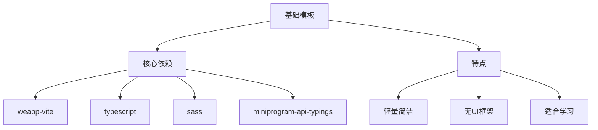
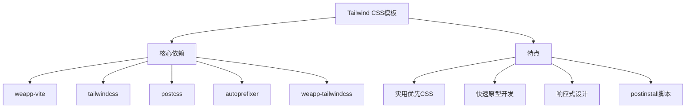
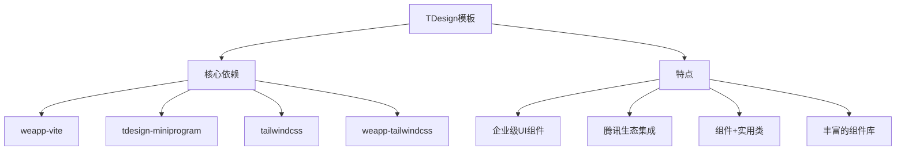
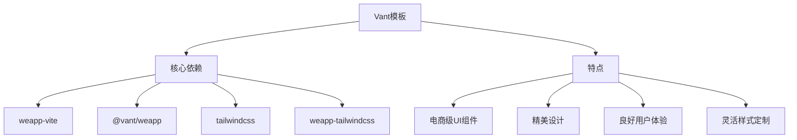
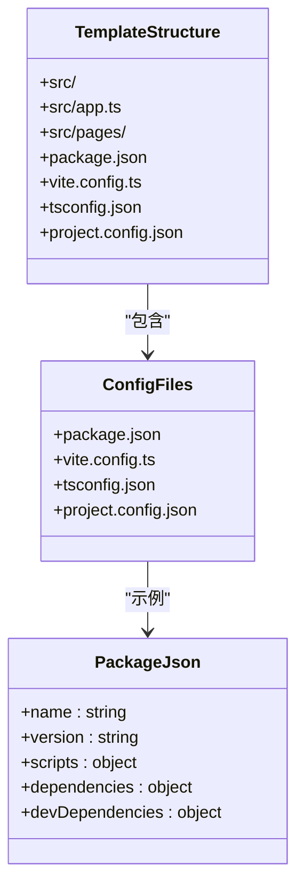
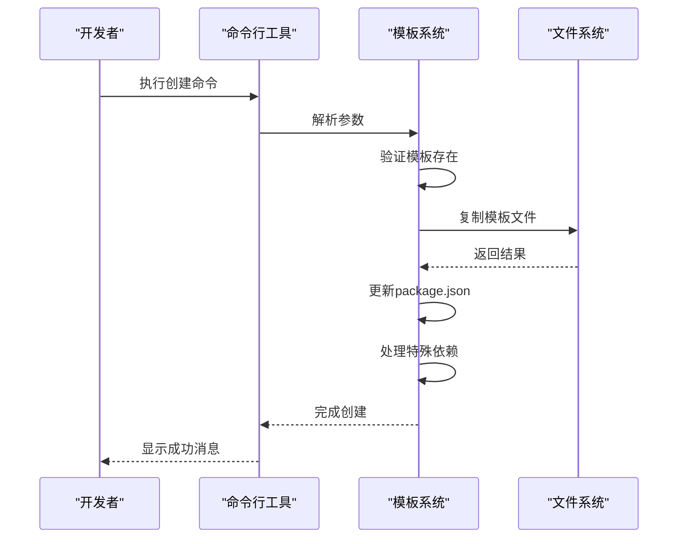
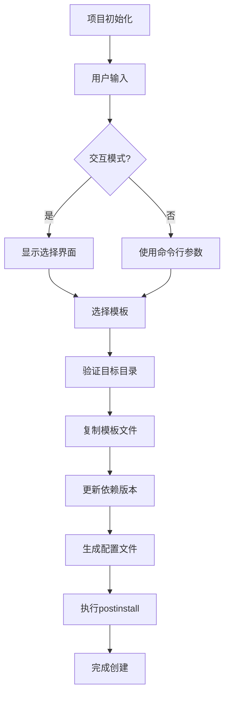

# 模板系统

<cite>
**本文档中引用的文件**
- [createProject.ts](file://@weapp-core/init/src/createProject.ts)
- [enums.ts](file://@weapp-core/init/src/enums.ts)
- [cli.ts](file://packages/create-weapp-vite/src/cli.ts)
- [default/package.json](file://@weapp-core/init/templates/default/package.json)
- [tailwindcss/package.json](file://@weapp-core/init/templates/tailwindcss/package.json)
- [tdesign/package.json](file://@weapp-core/init/templates/tdesign/package.json)
- [vant/package.json](file://@weapp-core/init/templates/vant/package.json)
- [viteConfig.ts](file://@weapp-core/init/src/viteConfig.ts)
- [projectConfig.ts](file://@weapp-core/init/src/projectConfig.ts)
- [packageJson.ts](file://@weapp-core/init/src/packageJson.ts)
- [configFiles.ts](file://@weapp-core/init/src/configFiles.ts)
- [createProject.test.ts](file://@weapp-core/init/test/createProject.test.ts)
</cite>

## 目录
1. [介绍](#介绍)
2. [预设模板](#预设模板)
3. [模板结构](#模板结构)
4. [自定义模板](#自定义模板)
5. [模板集成](#模板集成)
6. [总结](#总结)

## 介绍

weapp-vite模板系统是一个为微信小程序开发者设计的项目初始化框架，旨在帮助开发者快速启动新项目。该系统通过提供一系列预配置的模板，简化了项目创建过程，使开发者能够专注于业务逻辑而非基础配置。

模板系统的核心设计理念是"约定优于配置"，通过提供经过验证的最佳实践配置，减少开发者在项目初始化阶段的决策负担。无论是简单的基础项目还是复杂的UI组件集成项目，模板系统都能提供合适的起点。

该系统特别适用于需要快速原型开发、团队标准化项目结构或学习weapp-vite最佳实践的场景。通过使用模板，开发者可以确保项目从一开始就遵循最佳实践，包括正确的依赖管理、合理的目录结构和优化的构建配置。

**Section sources**
- [createProject.ts](file://@weapp-core/init/src/createProject.ts#L40-L90)
- [cli.ts](file://packages/create-weapp-vite/src/cli.ts#L1-L58)

## 预设模板

weapp-vite提供了四种主要的预设模板，每种模板针对不同的开发需求和场景进行了优化。

### 基础模板

基础模板是weapp-vite最简单的模板，适用于不需要额外UI框架或CSS工具的项目。它包含了运行weapp-vite所需的核心依赖，包括TypeScript支持和Sass编译功能。

该模板的特点是轻量和简洁，适合学习weapp-vite基本概念或创建简单的工具类小程序。基础模板不包含任何UI组件库，让开发者可以自由选择自己喜欢的UI解决方案。

**Diagram sources**
- [default/package.json](file://@weapp-core/init/templates/default/package.json#L1-L32)

### Tailwind CSS模板

Tailwind CSS模板集成了流行的实用优先CSS框架Tailwind CSS，为开发者提供了现代化的样式开发体验。该模板不仅包含Tailwind CSS本身，还配置了相关的构建工具链，如PostCSS和Autoprefixer。

此模板适合需要快速构建响应式界面的项目，特别是那些重视开发效率和设计一致性的应用。通过使用实用类，开发者可以直接在模板中编写样式，减少了在HTML和CSS文件之间切换的需要。

**Diagram sources**
- [tailwindcss/package.json](file://@weapp-core/init/templates/tailwindcss/package.json#L1-L39)

### TDesign模板

TDesign模板集成了腾讯开源的TDesign UI组件库，为开发者提供了完整的组件解决方案。该模板不仅包含TDesign组件，还集成了Tailwind CSS，允许开发者结合使用组件库和实用类进行开发。

此模板特别适合企业级应用开发，尤其是那些需要与腾讯生态集成的项目。TDesign提供了丰富的高质量组件，从基础按钮到复杂的数据表格，大大加速了开发过程。

**Diagram sources**
- [tdesign/package.json](file://@weapp-core/init/templates/tdesign/package.json#L1-L42)

### Vant模板

Vant模板集成了有赞开源的Vant Weapp UI组件库，为开发者提供了另一套高质量的UI解决方案。与TDesign模板类似，Vant模板也集成了Tailwind CSS，提供了灵活的样式定制能力。

此模板适合需要精美UI设计的电商类或内容类小程序，Vant组件库以其优雅的设计和良好的用户体验著称。对于希望快速构建美观界面的开发者来说，这是一个理想的选择。

**Diagram sources**
- [vant/package.json](file://@weapp-core/init/templates/vant/package.json#L1-L42)

## 模板结构

weapp-vite模板系统具有清晰的内部结构和文件组织方式，确保了模板的一致性和可维护性。

### 目录结构

所有模板都遵循相同的目录结构，这有助于开发者在不同模板间切换时保持熟悉感。核心结构包括：

- `src/` - 源代码目录，包含应用的主要代码
- `src/app.ts` - 应用入口文件
- `src/pages/` - 页面目录
- `package.json` - 项目依赖和脚本配置
- `vite.config.ts` - Vite构建配置
- `tsconfig.json` - TypeScript配置

这种一致的结构使得开发者可以轻松理解任何基于weapp-vite模板的项目。

### 配置文件

模板系统通过一系列配置文件来定义项目的行为和依赖关系。关键配置文件包括：

- `package.json`：定义项目依赖、脚本命令和元数据
- `project.config.json`：微信开发者工具配置
- `vite.config.ts`：构建工具配置
- `tsconfig.json`：TypeScript编译配置

这些配置文件都经过精心设置，确保项目开箱即用，无需额外配置即可正常运行。

**Diagram sources**
- [default/package.json](file://@weapp-core/init/templates/default/package.json#L1-L32)
- [viteConfig.ts](file://@weapp-core/init/src/viteConfig.ts#L1-L11)
- [projectConfig.ts](file://@weapp-core/init/src/projectConfig.ts#L1-L128)

**Section sources**
- [createProject.ts](file://@weapp-core/init/src/createProject.ts#L54-L90)
- [configFiles.ts](file://@weapp-core/init/src/configFiles.ts#L1-L90)

## 自定义模板

weapp-vite模板系统不仅提供预设模板，还支持创建和使用自定义模板，满足特定项目需求。

### 创建自定义模板

要创建自定义模板，开发者可以基于现有模板进行修改，或从头开始创建。基本步骤包括：

1. 创建模板目录
2. 添加必要的配置文件
3. 定义项目依赖
4. 设置构建配置
5. 添加示例代码

自定义模板可以包含特定的目录结构、预配置的组件、自定义的构建插件等，完全根据项目需求定制。

### 使用自定义模板

使用自定义模板可以通过命令行参数指定模板名称，系统会自动从指定位置加载模板并创建项目。这种方式使得团队可以共享标准化的项目模板，确保所有项目遵循相同的架构和最佳实践。

**Diagram sources**
- [createProject.ts](file://@weapp-core/init/src/createProject.ts#L54-L90)
- [cli.ts](file://packages/create-weapp-vite/src/cli.ts#L1-L58)

**Section sources**
- [createProject.ts](file://@weapp-core/init/src/createProject.ts#L54-L90)
- [cli.ts](file://packages/create-weapp-vite/src/cli.ts#L1-L58)

## 模板集成

weapp-vite模板系统与项目初始化工具深度集成，实现了无缝的项目创建体验。

### 初始化流程

模板系统的初始化流程包括以下关键步骤：

1. 用户选择模板
2. 系统验证目标目录
3. 复制模板文件
4. 更新依赖版本
5. 生成配置文件
6. 完成项目创建

这个流程确保了每个新项目都基于最新的依赖版本和最佳实践配置。

### 动态生成

模板系统支持根据用户选择动态生成项目结构。通过命令行参数，开发者可以非交互式地创建项目，这在自动化脚本和CI/CD流程中特别有用。

系统还支持在创建过程中执行额外的配置操作，如设置特定的构建选项或添加自定义的开发依赖。

**Diagram sources**
- [createProject.ts](file://@weapp-core/init/src/createProject.ts#L54-L90)
- [packageJson.ts](file://@weapp-core/init/src/packageJson.ts#L1-L104)
- [configFiles.ts](file://@weapp-core/init/src/configFiles.ts#L1-L90)

**Section sources**
- [createProject.ts](file://@weapp-core/init/src/createProject.ts#L54-L90)
- [packageJson.ts](file://@weapp-core/init/src/packageJson.ts#L1-L104)
- [configFiles.ts](file://@weapp-core/init/src/configFiles.ts#L1-L90)

## 总结

weapp-vite模板系统为微信小程序开发者提供了一套完整的项目初始化解决方案。通过提供多种预设模板，开发者可以根据项目需求选择最适合的起点。

基础模板适合简单项目和学习场景，Tailwind CSS模板提供了现代化的样式开发体验，TDesign和Vant模板则集成了成熟的UI组件库，适合需要丰富界面的应用。

模板系统的设计注重一致性和可扩展性，所有模板遵循相同的结构和配置模式，同时支持创建和使用自定义模板。与项目初始化工具的深度集成确保了流畅的创建体验，无论是交互式还是非交互式使用都能获得一致的结果。

对于新项目，建议根据具体需求选择合适的模板：如果需要快速原型开发，可以选择Tailwind CSS模板；如果需要企业级UI组件，TDesign模板是理想选择；如果需要电商级界面，Vant模板提供了优秀的解决方案。

**Section sources**
- [createProject.ts](file://@weapp-core/init/src/createProject.ts#L54-L90)
- [enums.ts](file://@weapp-core/init/src/enums.ts#L1-L7)
- [cli.ts](file://packages/create-weapp-vite/src/cli.ts#L1-L58)