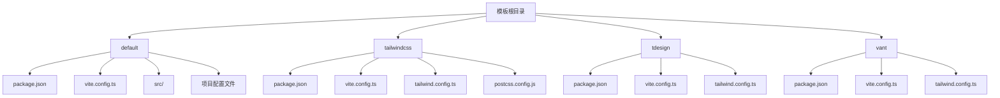
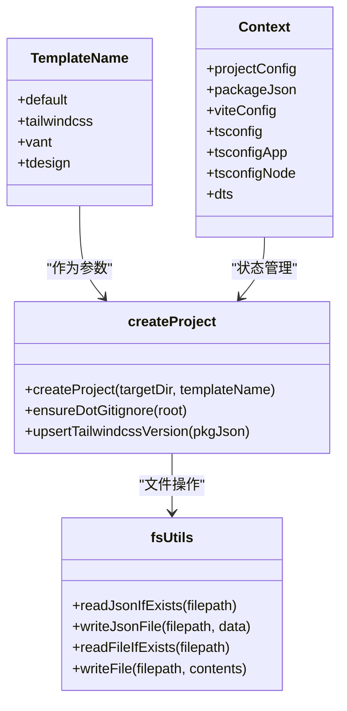
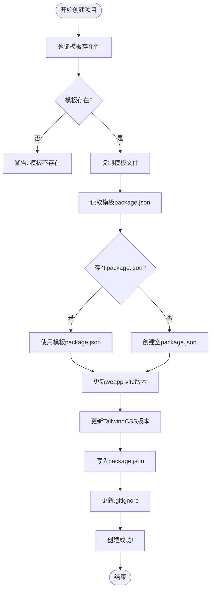
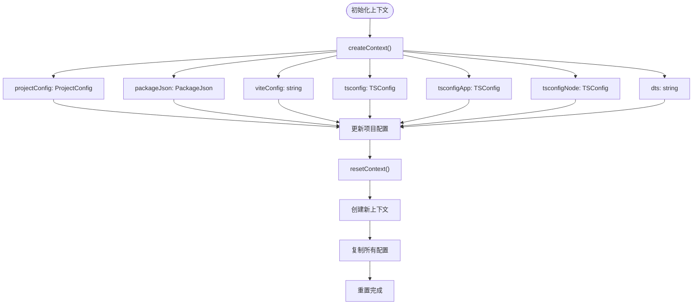

# 自定义模板

<cite>
**本文档中引用的文件**  
- [createProject.ts](file://@weapp-core/init/src/createProject.ts)
- [enums.ts](file://@weapp-core/init/src/enums.ts)
- [context.ts](file://@weapp-core/init/src/context.ts)
- [state.ts](file://@weapp-core/init/src/state.ts)
- [projectConfig.ts](file://@weapp-core/init/src/projectConfig.ts)
- [package.json](file://@weapp-core/init/templates/default/package.json)
- [package.json](file://@weapp-core/init/templates/tailwindcss/package.json)
- [package.json](file://@weapp-core/init/templates/tdesign/package.json)
- [package.json](file://@weapp-core/init/templates/vant/package.json)
- [vite.config.ts](file://@weapp-core/init/templates/default/vite.config.ts)
- [vite.config.ts](file://@weapp-core/init/templates/tailwindcss/vite.config.ts)
- [fs.ts](file://@weapp-core/init/src/utils/fs.ts)
- [index.ts](file://@weapp-core/init/src/index.ts)
</cite>

## 目录
1. [引言](#引言)
2. [项目结构](#项目结构)
3. [核心组件](#核心组件)
4. [架构概述](#架构概述)
5. [详细组件分析](#详细组件分析)
6. [依赖分析](#依赖分析)
7. [性能考虑](#性能考虑)
8. [故障排除指南](#故障排除指南)
9. [结论](#结论)

## 引言
本文档详细介绍了weapp-vite项目的自定义模板系统。自定义模板是项目初始化工具的核心功能，允许开发者根据不同的技术栈和需求快速创建微信小程序项目。模板系统通过预定义的文件结构、配置和依赖关系，为开发者提供了一致且高效的项目启动体验。

## 项目结构
weapp-vite的模板系统位于`@weapp-core/init/templates/`目录下，包含多个预定义模板。每个模板都是一个完整的项目结构，包含了开发所需的所有配置文件和基础代码。



**图示来源**  
- [templates目录结构](file://@weapp-core/init/templates)

**本节来源**  
- [templates目录结构](file://@weapp-core/init/templates)

## 核心组件
自定义模板系统的核心组件包括模板定义、项目创建逻辑和配置管理。系统通过`createProject.ts`中的`createProject`函数实现模板的复制和初始化，同时利用`context.ts`中的上下文管理来跟踪项目状态。

**本节来源**  
- [createProject.ts](file://@weapp-core/init/src/createProject.ts#L54-L85)
- [context.ts](file://@weapp-core/init/src/context.ts#L10-L38)

## 架构概述
weapp-vite的模板系统采用模块化架构，各组件职责分明。系统通过枚举定义支持的模板类型，使用上下文对象管理项目状态，并通过独立的工具函数处理文件操作。



**图示来源**  
- [enums.ts](file://@weapp-core/init/src/enums.ts#L1-L6)
- [context.ts](file://@weapp-core/init/src/context.ts#L10-L38)
- [createProject.ts](file://@weapp-core/init/src/createProject.ts#L54-L90)
- [fs.ts](file://@weapp-core/init/src/utils/fs.ts#L17-L60)

## 详细组件分析

### 模板创建逻辑分析
模板创建逻辑的核心是`createProject`函数，它负责将指定模板复制到目标目录，并进行必要的配置更新。

#### 模板创建流程


**图示来源**  
- [createProject.ts](file://@weapp-core/init/src/createProject.ts#L54-L85)

**本节来源**  
- [createProject.ts](file://@weapp-core/init/src/createProject.ts#L54-L85)

### 模板配置管理分析
系统通过`context.ts`中的`Context`接口管理项目配置，确保在项目创建过程中能够正确处理各种配置文件。

#### 配置管理流程


**图示来源**  
- [context.ts](file://@weapp-core/init/src/context.ts#L10-L38)
- [state.ts](file://@weapp-core/init/src/state.ts#L1-L15)

**本节来源**  
- [context.ts](file://@weapp-core/init/src/context.ts#L10-L38)
- [state.ts](file://@weapp-core/init/src/state.ts#L1-L15)

## 依赖分析
模板系统依赖于多个核心模块，这些模块协同工作以实现完整的模板功能。

```mermaid
graph TD
A[createProject] --> B[fs-extra]
A --> C[pathe]
A --> D[@weapp-core/logger]
A --> E[@weapp-core/shared]
A --> F[pkg-types]
G[context] --> H[pkg-types]
I[projectConfig] --> J[fs-extra]
I --> K[pathe]
I --> L[@weapp-core/shared]
I --> M[@weapp-core/logger]
N[fsUtils] --> O[fs-extra]
```

**图示来源**  
- [createProject.ts](file://@weapp-core/init/src/createProject.ts#L1-L91)
- [context.ts](file://@weapp-core/init/src/context.ts#L1-L39)
- [projectConfig.ts](file://@weapp-core/init/src/projectConfig.ts#L1-L128)
- [fs.ts](file://@weapp-core/init/src/utils/fs.ts#L1-L60)

**本节来源**  
- [createProject.ts](file://@weapp-core/init/src/createProject.ts#L1-L91)
- [context.ts](file://@weapp-core/init/src/context.ts#L1-L39)
- [projectConfig.ts](file://@weapp-core/init/src/projectConfig.ts#L1-L128)
- [fs.ts](file://@weapp-core/init/src/utils/fs.ts#L1-L60)

## 性能考虑
模板系统在设计时考虑了性能因素，通过以下方式优化项目创建过程：
- 使用`fs-extra`的高效文件操作方法
- 批量处理文件读写操作
- 缓存常用配置和路径
- 异步操作避免阻塞主线程

## 故障排除指南
当模板创建出现问题时，可以参考以下常见问题的解决方案：

**本节来源**  
- [createProject.ts](file://@weapp-core/init/src/createProject.ts#L57-L59)
- [projectConfig.ts](file://@weapp-core/init/src/projectConfig.ts#L123-L126)

## 结论
weapp-vite的自定义模板系统提供了一个强大而灵活的项目初始化解决方案。通过模块化设计和清晰的职责划分，系统能够高效地创建各种类型的微信小程序项目。开发者可以基于现有模板创建自己的自定义模板，满足特定项目的需求。