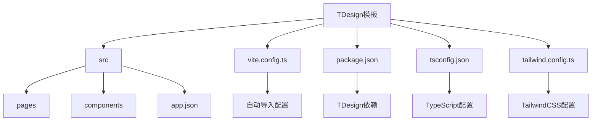
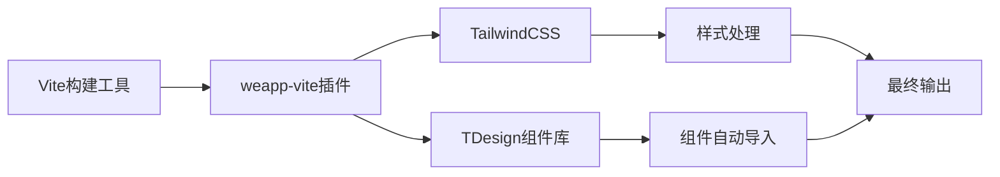
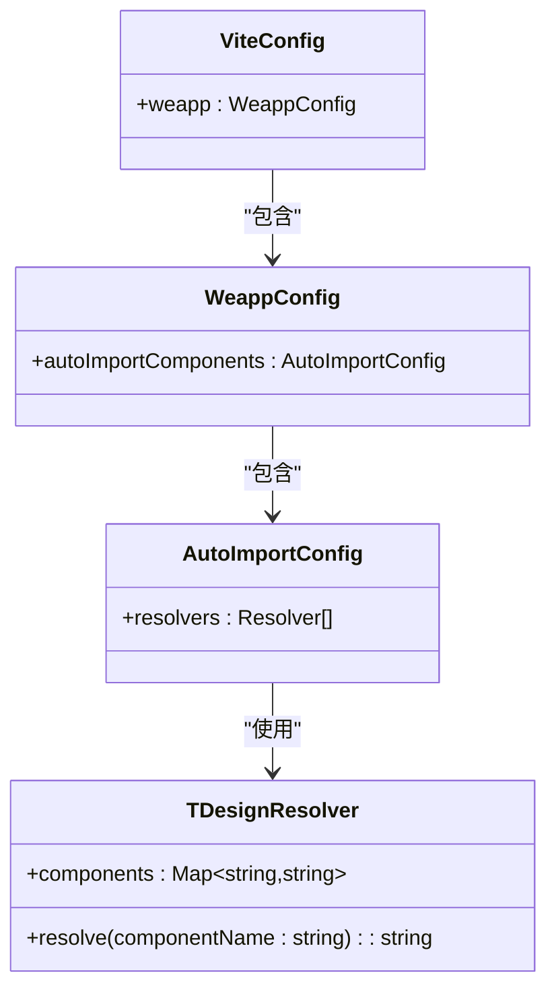
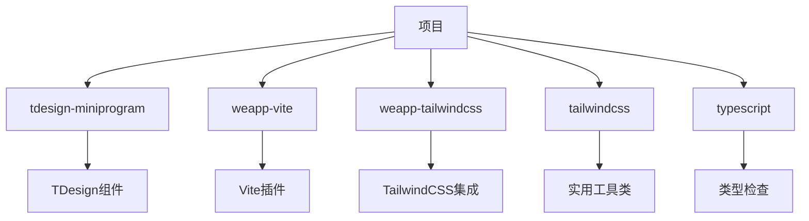

# TDesign模板

<cite>
**本文档中引用的文件**  
- [vite.config.ts](file://templates/weapp-vite-tailwindcss-tdesign-template/vite.config.ts)
- [package.json](file://templates/weapp-vite-tailwindcss-tdesign-template/package.json)
- [tsconfig.json](file://templates/weapp-vite-tailwindcss-tdesign-template/tsconfig.json)
- [auto-import-components.json](file://apps/tdesign-miniprogram-starter-retail/auto-import-components.json)
- [tailwind.config.ts](file://templates/weapp-vite-tailwindcss-tdesign-template/tailwind.config.ts)
- [app.json](file://templates/weapp-vite-tailwindcss-tdesign-template/src/app.json)
- [tdesign.md](file://website/integration/tdesign.md)
- [auto-import.md](file://website/guide/auto-import.md)
- [TDesignResolver](file://packages/weapp-vite/src/runtime/autoImport/service.ts)
</cite>

## 目录
1. [简介](#简介)
2. [项目结构](#项目结构)
3. [核心组件](#核心组件)
4. [架构概述](#架构概述)
5. [详细组件分析](#详细组件分析)
6. [依赖分析](#依赖分析)
7. [性能考虑](#性能考虑)
8. [故障排除指南](#故障排除指南)
9. [结论](#结论)

## 简介
TDesign模板是weapp-vite框架中的一个企业级UI组件库模板，专为微信小程序开发设计。该模板集成了TDesign组件库和TailwindCSS，提供了现代化的开发体验。TDesign是由腾讯开发的一套企业级设计系统，包含丰富的组件和设计规范，适用于构建高质量的小程序应用。本模板通过自动化配置简化了TDesign组件的引入和使用过程，使开发者能够专注于业务逻辑的实现。

## 项目结构
TDesign模板遵循清晰的目录结构，便于开发者快速理解和使用。模板的核心文件位于`templates/weapp-vite-tailwindcss-tdesign-template`目录下，主要包括源代码、配置文件和资源文件。

**Diagram sources**
- [vite.config.ts](file://templates/weapp-vite-tailwindcss-tdesign-template/vite.config.ts)
- [package.json](file://templates/weapp-vite-tailwindcss-tdesign-template/package.json)

**Section sources**
- [vite.config.ts](file://templates/weapp-vite-tailwindcss-tdesign-template/vite.config.ts)
- [package.json](file://templates/weapp-vite-tailwindcss-tdesign-template/package.json)

## 核心组件
TDesign模板的核心在于其对TDesign组件库的集成和自动化配置。通过`vite.config.ts`中的配置，模板实现了TDesign组件的自动导入功能，开发者无需手动在每个页面的JSON文件中声明组件引用。这种自动化机制大大简化了开发流程，提高了开发效率。

**Section sources**
- [vite.config.ts](file://templates/weapp-vite-tailwindcss-tdesign-template/vite.config.ts)
- [auto-import.md](file://website/guide/auto-import.md)

## 架构概述
TDesign模板的架构设计体现了现代前端开发的最佳实践。它基于Vite构建工具，结合TailwindCSS和TDesign组件库，形成了一个高效、灵活的开发环境。模板通过`weapp-vite`插件系统实现了对微信小程序特性的支持，同时保持了与现代前端工具链的兼容性。

**Diagram sources**
- [vite.config.ts](file://templates/weapp-vite-tailwindcss-tdesign-template/vite.config.ts)
- [tailwind.config.ts](file://templates/weapp-vite-tailwindcss-tdesign-template/tailwind.config.ts)

## 详细组件分析

### 组件自动导入机制
TDesign模板的核心特性之一是组件的自动导入功能。这一功能通过`vite.config.ts`中的`autoImportComponents`配置实现，特别是通过`TDesignResolver`解析器来识别和注册TDesign组件。

#### 自动导入配置

**Diagram sources**
- [vite.config.ts](file://templates/weapp-vite-tailwindcss-tdesign-template/vite.config.ts)
- [TDesignResolver](file://packages/weapp-vite/src/runtime/autoImport/service.ts)

#### 配置文件分析
`vite.config.ts`文件中的配置是实现TDesign组件自动导入的关键。通过引入`TDesignResolver`并将其添加到`resolvers`数组中，模板能够自动识别以`t-`前缀开头的组件标签，并正确地映射到对应的组件路径。

**Section sources**
- [vite.config.ts](file://templates/weapp-vite-tailwindcss-tdesign-template/vite.config.ts)
- [tdesign.md](file://website/integration/tdesign.md)

### 主题定制与样式覆盖
TDesign模板支持通过TailwindCSS进行主题定制和样式覆盖。`tailwind.config.ts`文件定义了项目的样式配置，包括颜色、间距、字体等设计系统的基本元素。开发者可以通过修改此文件来调整应用的整体外观。

**Section sources**
- [tailwind.config.ts](file://templates/weapp-vite-tailwindcss-tdesign-template/tailwind.config.ts)
- [package.json](file://templates/weapp-vite-tailwindcss-tdesign-template/package.json)

## 依赖分析
TDesign模板的依赖管理体现了其作为企业级解决方案的特点。通过`package.json`文件，我们可以看到模板依赖于`tdesign-miniprogram`核心库以及一系列开发工具和插件。

**Diagram sources**
- [package.json](file://templates/weapp-vite-tailwindcss-tdesign-template/package.json)
- [vite.config.ts](file://templates/weapp-vite-tailwindcss-tdesign-template/vite.config.ts)

**Section sources**
- [package.json](file://templates/weapp-vite-tailwindcss-tdesign-template/package.json)
- [vite.config.ts](file://templates/weapp-vite-tailwindcss-tdesign-template/vite.config.ts)

## 性能考虑
TDesign模板在性能方面做了多项优化。首先，通过Vite的按需编译机制，只有在实际使用时才会加载和编译组件，减少了初始加载时间。其次，TailwindCSS的JIT模式确保只生成实际使用的CSS类，有效减小了最终包的大小。此外，自动导入机制避免了手动维护`usingComponents`列表的开销，减少了潜在的错误和维护成本。

## 故障排除指南
在使用TDesign模板时，可能会遇到一些常见问题。以下是几个典型问题及其解决方案：

1. **组件未自动注册**：请检查组件的JSON文件是否包含`"component": true`，并确认组件路径是否符合`globs`配置的匹配规则。
2. **样式不生效**：确保`tailwind.config.ts`中的`content`配置包含了所有需要提取样式的文件路径。
3. **类型错误**：如果使用TypeScript，确保`tsconfig.json`正确配置了路径映射，特别是`tdesign-miniprogram/*`的路径。

**Section sources**
- [auto-import.md](file://website/guide/auto-import.md)
- [tdesign.md](file://website/integration/tdesign.md)

## 结论
TDesign模板为微信小程序开发提供了一个强大而灵活的起点。通过集成TDesign组件库和TailwindCSS，结合Vite的现代化构建能力，该模板显著提升了开发效率和代码质量。其自动导入机制、主题定制能力和清晰的项目结构，使其成为企业级小程序项目的理想选择。开发者可以在此基础上快速构建功能丰富、界面美观的应用程序，同时享受现代化开发工具带来的便利。