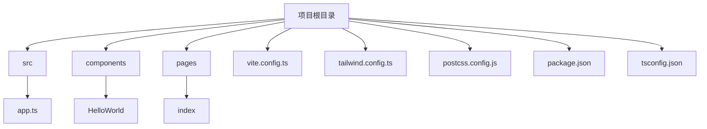
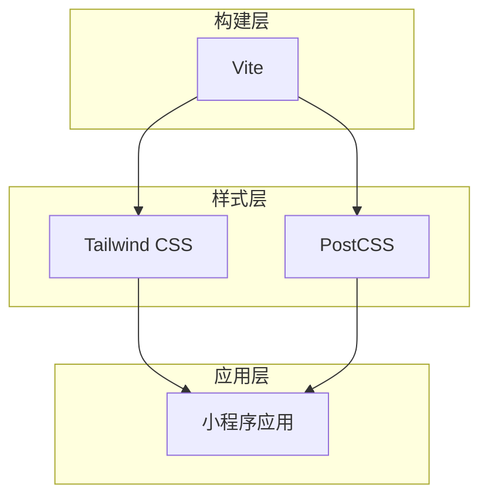

# Tailwind CSS模板

<cite>
**本文档中引用的文件**  
- [vite.config.ts](file://templates/weapp-vite-tailwindcss-template/vite.config.ts)
- [tailwind.config.ts](file://templates/weapp-vite-tailwindcss-template/tailwind.config.ts)
- [postcss.config.js](file://templates/weapp-vite-tailwindcss-template/postcss.config.js)
- [package.json](file://templates/weapp-vite-tailwindcss-template/package.json)
- [tsconfig.json](file://templates/weapp-vite-tailwindcss-template/tsconfig.json)
- [tsconfig.app.json](file://templates/weapp-vite-tailwindcss-template/tsconfig.app.json)
- [tsconfig.node.json](file://templates/weapp-vite-tailwindcss-template/tsconfig.node.json)
- [auto-import-components.json](file://templates/weapp-vite-tailwindcss-template/auto-import-components.json)
- [src/app.ts](file://templates/weapp-vite-tailwindcss-template/src/app.ts)
- [src/pages/index/index.ts](file://templates/weapp-vite-tailwindcss-template/src/pages/index/index.ts)
- [src/pages/index/index.wxml](file://templates/weapp-vite-tailwindcss-template/src/pages/index/index.wxml)
- [src/components/HelloWorld/HelloWorld.wxml](file://templates/weapp-vite-tailwindcss-template/src/components/HelloWorld/HelloWorld.wxml)
- [README.md](file://templates/weapp-vite-tailwindcss-template/README.md)
</cite>

## 目录
1. [简介](#简介)
2. [项目结构](#项目结构)
3. [核心组件](#核心组件)
4. [架构概述](#架构概述)
5. [详细组件分析](#详细组件分析)
6. [依赖分析](#依赖分析)
7. [性能考虑](#性能考虑)
8. [故障排除指南](#故障排除指南)
9. [结论](#结论)

## 简介
weapp-vite Tailwind CSS模板是一个现代化的小程序开发模板，集成了Vite构建工具和Tailwind CSS框架。该模板旨在为开发者提供一个高效、现代化的开发环境，支持原子化CSS、响应式设计和暗色模式等功能。通过使用此模板，开发者可以快速启动项目并享受热模块替换（HMR）带来的开发便利。

**Section sources**
- [README.md](file://templates/weapp-vite-tailwindcss-template/README.md)

## 项目结构
weapp-vite Tailwind CSS模板遵循清晰的目录结构，便于管理和扩展。主要目录包括`src`用于存放源代码，`components`用于存放可复用的组件，`pages`用于存放页面文件。此外，配置文件如`vite.config.ts`、`tailwind.config.ts`等位于项目根目录下，方便统一管理。



**Diagram sources**
- [vite.config.ts](file://templates/weapp-vite-tailwindcss-template/vite.config.ts)
- [tailwind.config.ts](file://templates/weapp-vite-tailwindcss-template/tailwind.config.ts)

**Section sources**
- [vite.config.ts](file://templates/weapp-vite-tailwindcss-template/vite.config.ts)
- [tailwind.config.ts](file://templates/weapp-vite-tailwindcss-template/tailwind.config.ts)

## 核心组件
该模板的核心组件包括Vite配置、Tailwind CSS集成、PostCSS配置以及TypeScript支持。这些组件共同作用，确保了开发过程的高效性和代码质量。

**Section sources**
- [vite.config.ts](file://templates/weapp-vite-tailwindcss-template/vite.config.ts)
- [tailwind.config.ts](file://templates/weapp-vite-tailwindcss-template/tailwind.config.ts)
- [postcss.config.js](file://templates/weapp-vite-tailwindcss-template/postcss.config.js)
- [tsconfig.json](file://templates/weapp-vite-tailwindcss-template/tsconfig.json)

## 架构概述
weapp-vite Tailwind CSS模板采用现代化的前端架构，结合了Vite的快速构建能力和Tailwind CSS的原子化设计思想。整体架构分为三层：构建层、样式层和应用层。构建层由Vite负责，提供快速的开发服务器和优化的构建输出；样式层由Tailwind CSS和PostCSS组成，实现灵活的样式定义；应用层则包含小程序的具体业务逻辑。



**Diagram sources**
- [vite.config.ts](file://templates/weapp-vite-tailwindcss-template/vite.config.ts)
- [tailwind.config.ts](file://templates/weapp-vite-tailwindcss-template/tailwind.config.ts)
- [postcss.config.js](file://templates/weapp-vite-tailwindcss-template/postcss.config.js)

## 详细组件分析
### Vite配置分析
Vite配置文件`vite.config.ts`定义了项目的构建选项和插件配置。通过`defineConfig`函数，设置了小程序的源码根目录、生成选项以及CSS预处理器选项。特别地，`UnifiedViteWeappTailwindcssPlugin`插件被用来集成Tailwind CSS，支持rem到rpx的转换。

**Section sources**
- [vite.config.ts](file://templates/weapp-vite-tailwindcss-template/vite.config.ts)

### Tailwind CSS配置分析
Tailwind CSS配置文件`tailwind.config.ts`定义了内容提取路径、主题扩展和插件。内容提取路径指定了需要扫描的文件类型，以生成相应的CSS类名。核心插件中禁用了`preflight`和`container`，因为它们主要用于H5端，而小程序不需要这些功能。

**Section sources**
- [tailwind.config.ts](file://templates/weapp-vite-tailwindcss-template/tailwind.config.ts)

### PostCSS配置分析
PostCSS配置文件`postcss.config.js`简单地启用了`tailwindcss`和`autoprefixer`插件。这使得Tailwind CSS能够生成所需的CSS，并自动添加浏览器前缀，提高兼容性。

**Section sources**
- [postcss.config.js](file://templates/weapp-vite-tailwindcss-template/postcss.config.js)

### TypeScript配置分析
TypeScript配置通过`tsconfig.json`文件进行管理，包含了`tsconfig.app.json`和`tsconfig.node.json`两个引用。前者用于应用程序的类型检查，后者用于Node.js环境下的类型检查。这种分离方式有助于更好地组织不同类型代码的编译选项。

**Section sources**
- [tsconfig.json](file://templates/weapp-vite-tailwindcss-template/tsconfig.json)
- [tsconfig.app.json](file://templates/weapp-vite-tailwindcss-template/tsconfig.app.json)
- [tsconfig.node.json](file://templates/weapp-vite-tailwindcss-template/tsconfig.node.json)

## 依赖分析
weapp-vite Tailwind CSS模板的依赖关系清晰明了。主要依赖包括`weapp-vite`作为构建工具，`tailwindcss`作为CSS框架，`autoprefixer`用于自动添加浏览器前缀，`@egoist/tailwindcss-icons`用于图标支持。这些依赖通过`package.json`文件进行管理，确保版本的一致性和可维护性。

```mermaid
graph LR
A[weapp-vite] --> B[Tailwind CSS]
A --> C[PostCSS]
B --> D[autoprefixer]
B --> E[@egoist/tailwindcss-icons]
C --> F[sass]
```

**Diagram sources**
- [package.json](file://templates/weapp-vite-tailwindcss-template/package.json)

**Section sources**
- [package.json](file://templates/weapp-vite-tailwindcss-template/package.json)

## 性能考虑
在性能方面，weapp-vite Tailwind CSS模板通过Vite的按需编译和热更新机制显著提升了开发体验。生产构建时，Vite会进行代码分割和懒加载，减少初始加载时间。此外，Tailwind CSS的JIT模式仅生成实际使用的CSS类名，有效减小了最终包的大小。

## 故障排除指南
当遇到问题时，首先检查`vite.config.ts`和`tailwind.config.ts`中的配置是否正确。常见的问题包括路径错误、插件未正确安装或配置不当。确保所有依赖都已正确安装，并且`postinstall`脚本已执行。如果样式未生效，请检查`content`字段是否包含了正确的文件路径。

**Section sources**
- [vite.config.ts](file://templates/weapp-vite-tailwindcss-template/vite.config.ts)
- [tailwind.config.ts](file://templates/weapp-vite-tailwindcss-template/tailwind.config.ts)
- [package.json](file://templates/weapp-vite-tailwindcss-template/package.json)

## 结论
weapp-vite Tailwind CSS模板为小程序开发提供了一个强大而灵活的基础。通过集成现代前端工具链，它不仅提高了开发效率，还保证了代码质量和性能。开发者可以根据具体需求进一步定制和扩展此模板，以满足各种应用场景的要求。