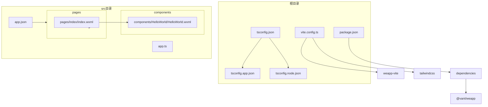
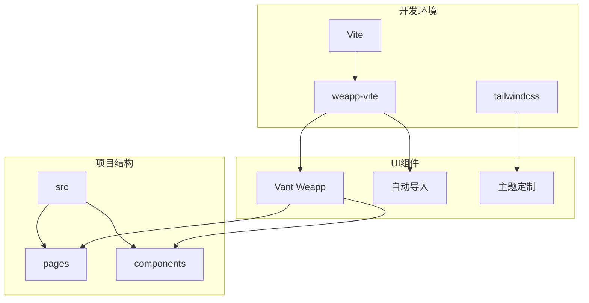
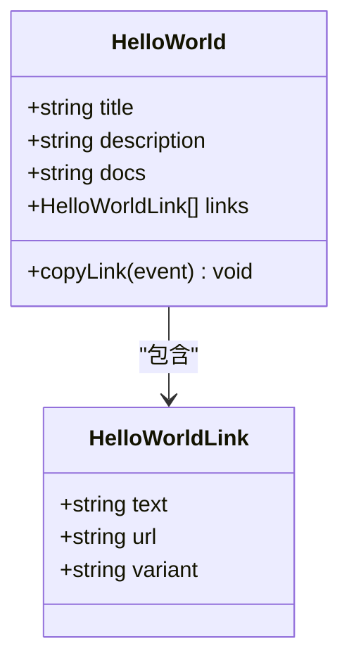
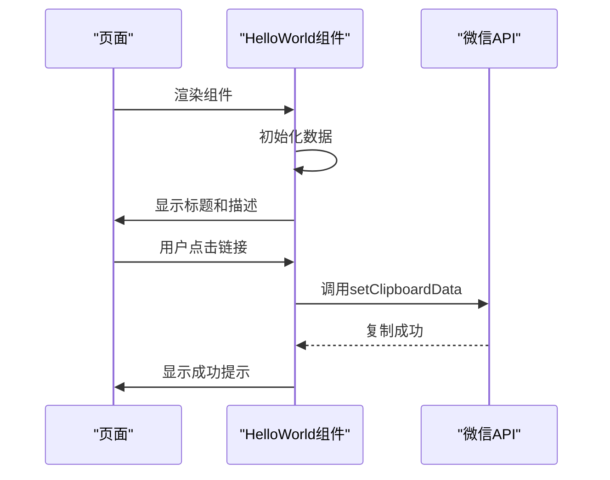
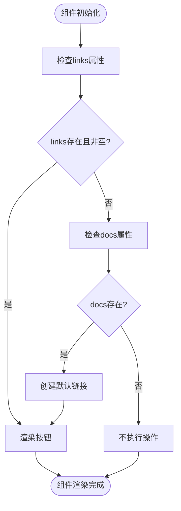
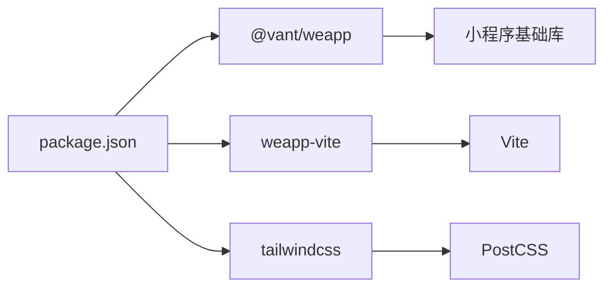

# Vant模板

<cite>
**本文档中引用的文件**  
- [package.json](file://templates/weapp-vite-tailwindcss-vant-template/package.json)
- [vite.config.ts](file://templates/weapp-vite-tailwindcss-vant-template/vite.config.ts)
- [tsconfig.json](file://templates/weapp-vite-tailwindcss-vant-template/tsconfig.json)
- [tsconfig.app.json](file://templates/weapp-vite-tailwindcss-vant-template/tsconfig.app.json)
- [tsconfig.node.json](file://templates/weapp-vite-tailwindcss-vant-template/tsconfig.node.json)
- [app.json](file://@weapp-core/init/templates/vant/src/app.json)
- [index.wxml](file://@weapp-core/init/templates/vant/src/pages/index/index.wxml)
- [HelloWorld.wxml](file://@weapp-core/init/templates/vant/src/components/HelloWorld/HelloWorld.wxml)
- [HelloWorld.ts](file://@weapp-core/init/templates/vant/src/components/HelloWorld/HelloWorld.ts)
</cite>

## 目录

1. [简介](#简介)
2. [项目结构](#项目结构)
3. [核心组件](#核心组件)
4. [架构概述](#架构概述)
5. [详细组件分析](#详细组件分析)
6. [依赖分析](#依赖分析)
7. [性能考虑](#性能考虑)
8. [故障排除指南](#故障排除指南)
9. [结论](#结论)

## 简介

Vant模板是weapp-vite框架提供的一个轻量级移动端UI组件库模板，专为微信小程序开发设计。该模板集成了Vant Weapp组件库，提供了一套完整的移动端UI解决方案。模板的设计理念是简化开发流程，提高开发效率，通过自动导入、主题定制和样式覆盖等特性，使开发者能够快速构建现代化的小程序界面。Vant模板适用于需要快速开发高质量移动端应用的场景，特别适合中小型项目和原型开发。

## 项目结构

Vant模板的项目结构清晰，遵循现代前端项目的最佳实践。项目根目录包含关键的配置文件，如`package.json`、`vite.config.ts`和`tsconfig.json`，这些文件定义了项目的依赖、构建配置和类型检查规则。`src`目录是项目的主要源码目录，包含`app.ts`、`app.json`等应用级文件，以及`pages`和`components`目录，分别存放页面和组件代码。这种结构化的组织方式使得项目易于维护和扩展。

**Diagram sources**
- [package.json](file://templates/weapp-vite-tailwindcss-vant-template/package.json)
- [vite.config.ts](file://templates/weapp-vite-tailwindcss-vant-template/vite.config.ts)
- [tsconfig.json](file://templates/weapp-vite-tailwindcss-vant-template/tsconfig.json)
- [app.json](file://@weapp-core/init/templates/vant/src/app.json)
- [index.wxml](file://@weapp-core/init/templates/vant/src/pages/index/index.wxml)

**Section sources**
- [package.json](file://templates/weapp-vite-tailwindcss-vant-template/package.json)
- [vite.config.ts](file://templates/weapp-vite-tailwindcss-vant-template/vite.config.ts)
- [tsconfig.json](file://templates/weapp-vite-tailwindcss-vant-template/tsconfig.json)
- [app.json](file://@weapp-core/init/templates/vant/src/app.json)

## 核心组件

Vant模板的核心组件包括Vant Weapp组件库的集成、自动导入机制和主题定制功能。`package.json`文件中明确声明了`@vant/weapp`作为依赖，确保了Vant组件的可用性。`vite.config.ts`文件通过`VantResolver`配置实现了Vant组件的自动导入，开发者无需手动引入每个组件，大大简化了开发流程。`tsconfig.app.json`文件中的路径映射配置使得Vant组件的引用更加便捷，提高了代码的可读性和维护性。

**Section sources**
- [package.json](file://templates/weapp-vite-tailwindcss-vant-template/package.json)
- [vite.config.ts](file://templates/weapp-vite-tailwindcss-vant-template/vite.config.ts)
- [tsconfig.app.json](file://templates/weapp-vite-tailwindcss-vant-template/tsconfig.app.json)

## 架构概述

Vant模板的架构设计充分考虑了现代前端开发的需求，采用了模块化和组件化的思想。项目通过Vite作为构建工具，结合weapp-vite插件，实现了高效的开发和构建流程。Vant组件库的集成通过自动导入机制实现，减少了手动配置的复杂性。Tailwind CSS的集成提供了强大的样式定制能力，支持响应式设计和主题切换。整体架构简洁高效，适合快速开发和迭代。

**Diagram sources**
- [vite.config.ts](file://templates/weapp-vite-tailwindcss-vant-template/vite.config.ts)
- [package.json](file://templates/weapp-vite-tailwindcss-vant-template/package.json)
- [tsconfig.app.json](file://templates/weapp-vite-tailwindcss-vant-template/tsconfig.app.json)

## 详细组件分析

### 组件A分析

#### 对象导向组件

**Diagram sources**
- [HelloWorld.ts](file://@weapp-core/init/templates/vant/src/components/HelloWorld/HelloWorld.ts)

#### API/服务组件

**Diagram sources**
- [HelloWorld.wxml](file://@weapp-core/init/templates/vant/src/components/HelloWorld/HelloWorld.wxml)
- [HelloWorld.ts](file://@weapp-core/init/templates/vant/src/components/HelloWorld/HelloWorld.ts)

#### 复杂逻辑组件

**Diagram sources**
- [HelloWorld.ts](file://@weapp-core/init/templates/vant/src/components/HelloWorld/HelloWorld.ts)

**Section sources**
- [HelloWorld.wxml](file://@weapp-core/init/templates/vant/src/components/HelloWorld/HelloWorld.wxml)
- [HelloWorld.ts](file://@weapp-core/init/templates/vant/src/components/HelloWorld/HelloWorld.ts)

## 依赖分析

Vant模板的依赖关系清晰，主要依赖包括`@vant/weapp`、`weapp-vite`和`tailwindcss`。`@vant/weapp`提供了丰富的移动端UI组件，`weapp-vite`作为构建工具集成了Vite的优势，`tailwindcss`提供了强大的样式定制能力。这些依赖通过`package.json`文件进行管理，确保了项目的稳定性和可维护性。

**Diagram sources**
- [package.json](file://templates/weapp-vite-tailwindcss-vant-template/package.json)

**Section sources**
- [package.json](file://templates/weapp-vite-tailwindcss-vant-template/package.json)

## 性能考虑

Vant模板在性能方面做了多项优化。通过Vite的热更新机制，开发过程中的编译速度显著提升。自动导入机制减少了不必要的模块引入，优化了打包体积。Tailwind CSS的按需加载特性进一步减少了最终包的大小。此外，模板支持懒加载和代码分割，有助于提高小程序的启动速度和运行效率。

## 故障排除指南

在使用Vant模板时，可能会遇到一些常见问题。例如，组件无法正确导入，可能是由于`vite.config.ts`中的`VantResolver`配置错误。样式不生效，可能是`tailwindcss`配置问题或类名拼写错误。构建失败，可能是依赖版本不兼容或配置文件语法错误。建议检查相关配置文件，确保所有依赖正确安装，并参考官方文档进行调试。

**Section sources**
- [vite.config.ts](file://templates/weapp-vite-tailwindcss-vant-template/vite.config.ts)
- [package.json](file://templates/weapp-vite-tailwindcss-vant-template/package.json)

## 结论

Vant模板为微信小程序开发提供了一个高效、灵活的解决方案。通过集成Vant Weapp组件库和Tailwind CSS，模板实现了UI组件的快速开发和样式定制。自动导入机制和模块化架构设计大大简化了开发流程，提高了开发效率。该模板适用于需要快速构建高质量移动端应用的场景，是中小型项目和原型开发的理想选择。