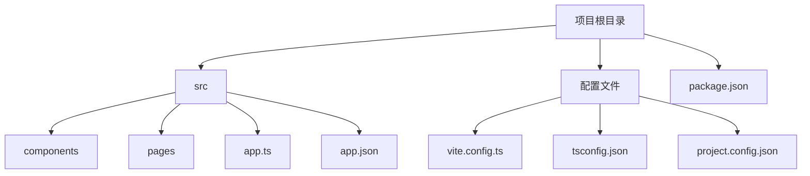
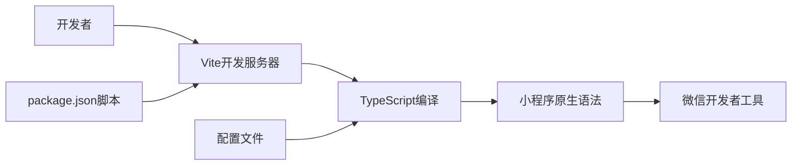
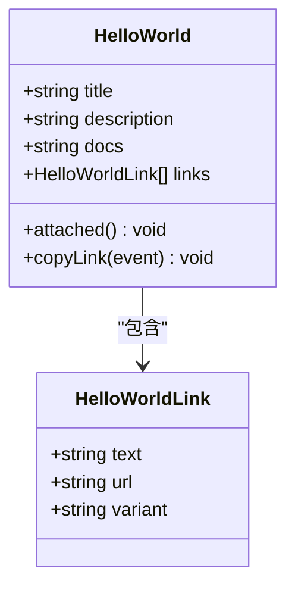
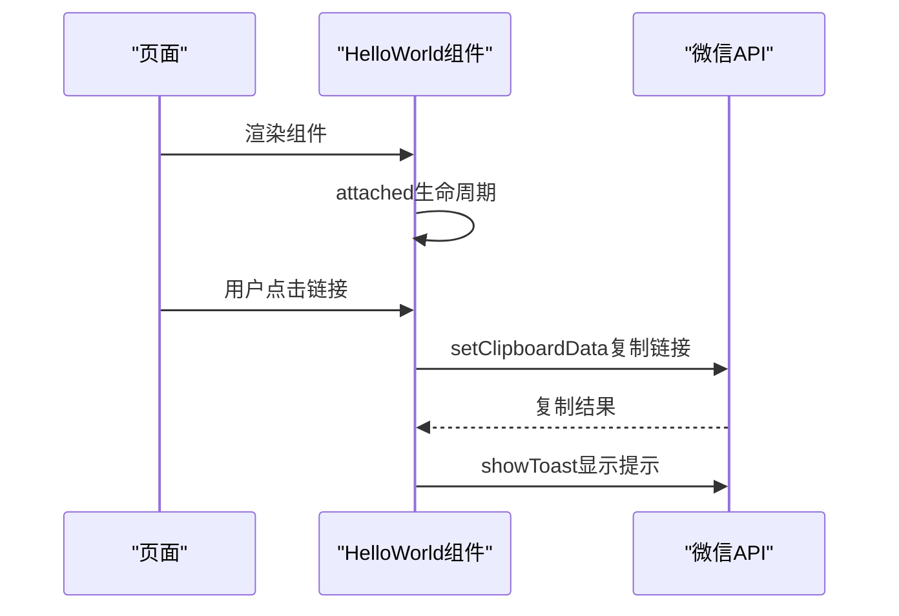
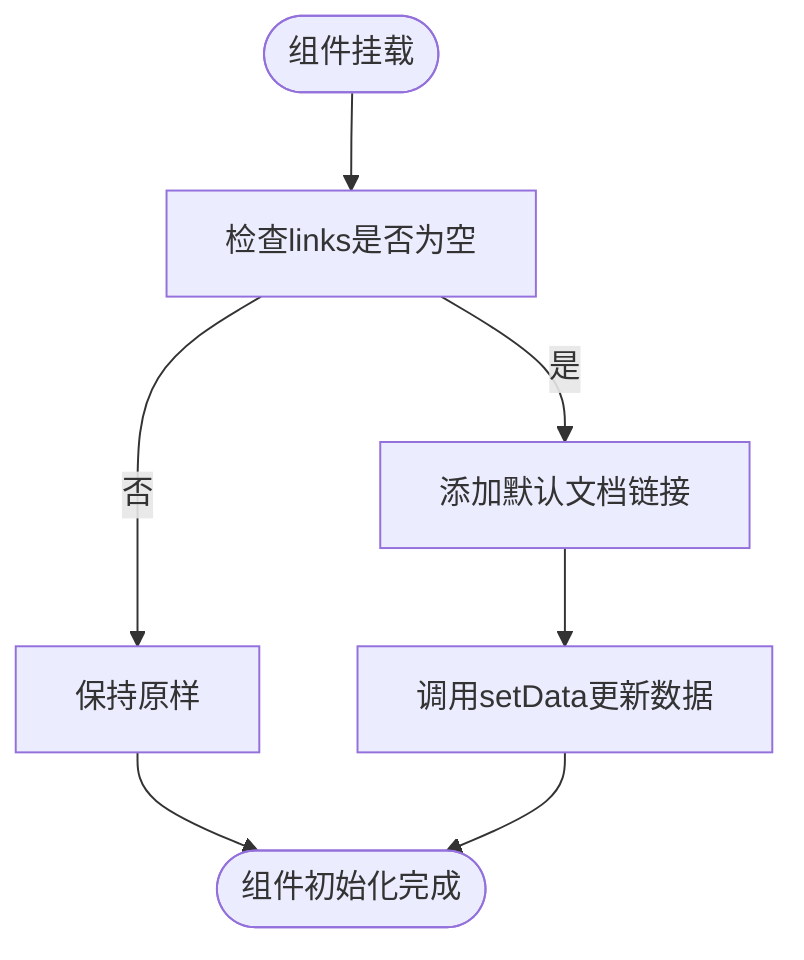
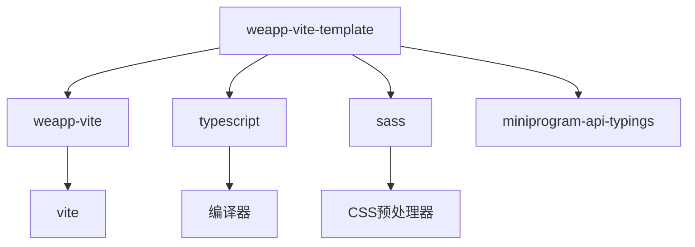

# 基础模板

<cite>
**本文档中引用的文件**  
- [vite.config.ts](file://templates/weapp-vite-template/vite.config.ts)
- [tsconfig.json](file://templates/weapp-vite-template/tsconfig.json)
- [tsconfig.app.json](file://templates/weapp-vite-template/tsconfig.app.json)
- [tsconfig.node.json](file://templates/weapp-vite-template/tsconfig.node.json)
- [package.json](file://templates/weapp-vite-template/package.json)
- [auto-import-components.json](file://templates/weapp-vite-template/auto-import-components.json)
- [app.ts](file://templates/weapp-vite-template/src/app.ts)
- [app.json](file://templates/weapp-vite-template/src/app.json)
- [index.ts](file://templates/weapp-vite-template/src/pages/index/index.ts)
- [HelloWorld.ts](file://templates/weapp-vite-template/src/components/HelloWorld/HelloWorld.ts)
- [index.json](file://templates/weapp-vite-template/src/pages/index/index.json)
- [HelloWorld.json](file://templates/weapp-vite-template/src/components/HelloWorld/HelloWorld.json)
- [project.config.json](file://templates/weapp-vite-template/project.config.json)
- [README.md](file://templates/weapp-vite-template/README.md)
</cite>

## 目录

1. [简介](#简介)
2. [项目结构](#项目结构)
3. [核心组件](#核心组件)
4. [架构概述](#架构概述)
5. [详细组件分析](#详细组件分析)
6. [依赖分析](#依赖分析)
7. [性能考虑](#性能考虑)
8. [故障排除指南](#故障排除指南)
9. [结论](#结论)

## 简介

weapp-vite基础模板是一个极简配置的微信小程序开发模板，旨在为开发者提供快速启动项目所需的最小化配置。该模板集成了Vite构建工具，提供了热更新、快速开发服务器等现代开发体验。作为最简配置模板，它适用于希望快速开始开发而无需复杂配置的开发者，同时也为需要自定义配置的高级用户提供了一个清晰的起点。

**中文(中文)转换规则严格执行：所有内容，包括标题、标签、引用注释、图表注释和其他元素，必须完全以中文(中文)输出。**

## 项目结构

weapp-vite基础模板的目录结构设计简洁明了，遵循常见的小程序项目组织方式。核心源码位于`src`目录下，包含`components`、`pages`等关键子目录。配置文件如`vite.config.ts`、`tsconfig.json`等位于项目根目录，便于统一管理。

**图表来源**  
- [vite.config.ts](file://templates/weapp-vite-template/vite.config.ts#L1-L40)
- [tsconfig.json](file://templates/weapp-vite-template/tsconfig.json#L1-L12)

**本节来源**  
- [vite.config.ts](file://templates/weapp-vite-template/vite.config.ts#L1-L40)
- [tsconfig.json](file://templates/weapp-vite-template/tsconfig.json#L1-L12)

## 核心组件

基础模板的核心功能围绕Vite集成、TypeScript支持和小程序原生语法支持展开。通过`vite.config.ts`中的`defineConfig`函数，模板实现了对小程序项目的定制化构建配置。`tsconfig.json`文件通过引用`tsconfig.app.json`和`tsconfig.node.json`，实现了应用代码和构建脚本的分离配置。

**本节来源**  
- [vite.config.ts](file://templates/weapp-vite-template/vite.config.ts#L1-L40)
- [tsconfig.json](file://templates/weapp-vite-template/tsconfig.json#L1-L12)

## 架构概述

weapp-vite基础模板的架构设计体现了现代前端开发的最佳实践。它利用Vite的快速冷启动和热模块替换（HMR）特性，显著提升了开发效率。TypeScript的集成提供了静态类型检查，增强了代码的可维护性。同时，模板保留了对小程序原生语法的完全支持，确保了与微信开发者工具的兼容性。

**图表来源**  
- [vite.config.ts](file://templates/weapp-vite-template/vite.config.ts#L1-L40)
- [package.json](file://templates/weapp-vite-template/package.json#L1-L32)

## 详细组件分析

### 组件A分析

基础模板中的`HelloWorld`组件是一个典型的自定义组件示例，展示了如何在weapp-vite环境中定义和使用组件。该组件通过`properties`定义了可配置的属性，并在`lifetimes`中实现了组件挂载时的逻辑处理。

#### 对于面向对象的组件：

**图表来源**  
- [HelloWorld.ts](file://templates/weapp-vite-template/src/components/HelloWorld/HelloWorld.ts#L1-L62)
- [HelloWorld.json](file://templates/weapp-vite-template/src/components/HelloWorld/HelloWorld.json#L1-L7)

#### 对于API/服务组件：

**图表来源**  
- [HelloWorld.ts](file://templates/weapp-vite-template/src/components/HelloWorld/HelloWorld.ts#L1-L62)
- [index.ts](file://templates/weapp-vite-template/src/pages/index/index.ts#L1-L25)

#### 对于复杂逻辑组件：

**图表来源**  
- [HelloWorld.ts](file://templates/weapp-vite-template/src/components/HelloWorld/HelloWorld.ts#L26-L38)

**本节来源**  
- [HelloWorld.ts](file://templates/weapp-vite-template/src/components/HelloWorld/HelloWorld.ts#L1-L62)
- [HelloWorld.json](file://templates/weapp-vite-template/src/components/HelloWorld/HelloWorld.json#L1-L7)

## 依赖分析

基础模板的依赖关系清晰，主要依赖`weapp-vite`核心包、`typescript`和`sass`等开发工具。`package.json`中的`devDependencies`字段明确列出了所有开发依赖，确保了项目构建环境的一致性。

**图表来源**  
- [package.json](file://templates/weapp-vite-template/package.json#L1-L32)
- [vite.config.ts](file://templates/weapp-vite-template/vite.config.ts#L1-L40)

**本节来源**  
- [package.json](file://templates/weapp-vite-template/package.json#L1-L32)
- [vite.config.ts](file://templates/weapp-vite-template/vite.config.ts#L1-L40)

## 性能考虑

weapp-vite基础模板通过Vite的基于ES模块的开发服务器，实现了极快的冷启动速度。生产构建利用Rollup进行代码打包和优化，确保了最终包体积的最小化。TypeScript的严格模式配置有助于在开发阶段发现潜在的性能问题。

## 故障排除指南

当使用基础模板遇到问题时，首先检查`vite.config.ts`中的配置是否正确，特别是`srcRoot`和`generate`选项。确保`tsconfig.json`的引用路径正确无误。如果遇到类型错误，检查`miniprogram-api-typings`的版本是否与微信开发者工具兼容。

**本节来源**  
- [vite.config.ts](file://templates/weapp-vite-template/vite.config.ts#L1-L40)
- [tsconfig.json](file://templates/weapp-vite-template/tsconfig.json#L1-L12)

## 结论

weapp-vite基础模板为微信小程序开发提供了一个现代化、高效的起点。通过集成Vite和TypeScript，它在保持小程序原生特性的同时，极大地提升了开发体验。该模板的简洁设计使其易于理解和扩展，是新项目启动的理想选择。