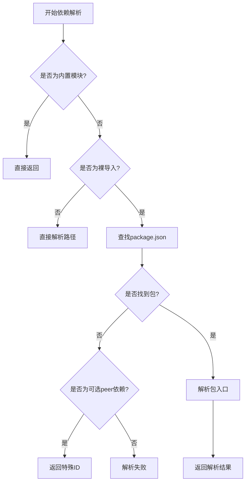
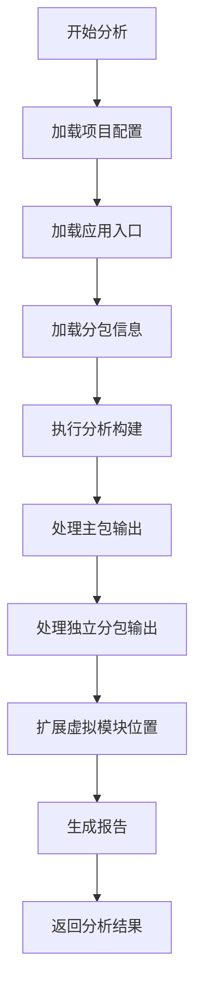
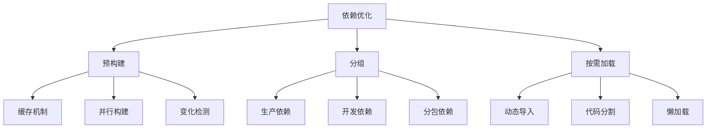

# 依赖问题

<cite>
**本文档引用的文件**   
- [package.json](file://package.json)
- [pnpm-workspace.yaml](file://pnpm-workspace.yaml)
- [pnpm-lock.yaml](file://pnpm-lock.yaml)
- [turbo.json](file://turbo.json)
- [weapp-vite/package.json](file://packages/weapp-vite/package.json)
- [create-weapp-vite/package.json](file://packages/create-weapp-vite/package.json)
- [rolldown-require/src/index.ts](file://packages/rolldown-require/src/index.ts)
- [rolldown-require/src/config.ts](file://packages/rolldown-require/src/config.ts)
- [rolldown-require/src/optimizer/index.ts](file://packages/rolldown-require/src/optimizer/index.ts)
- [rolldown-require/src/plugins/resolve.ts](file://packages/rolldown-require/src/plugins/resolve.ts)
- [weapp-vite/src/runtime/npmPlugin.ts](file://packages/weapp-vite/src/runtime/npmPlugin.ts)
- [weapp-vite/src/runtime/buildPlugin.ts](file://packages/weapp-vite/src/runtime/buildPlugin.ts)
- [weapp-vite/src/analyze/subpackages.ts](file://packages/weapp-vite/src/analyze/subpackages.ts)
- [weapp-core/init/src/npm.ts](file://@weapp-core/init/src/npm.ts)
- [weapp-core/init/src/packageJson.ts](file://@weapp-core/init/src/packageJson.ts)
- [website/config/npm.md](file://website/config/npm.md)
- [website/guide/npm.md](file://website/guide/npm.md)
- [.npmrc](file://.npmrc)
</cite>

## 目录

1. [项目依赖管理概述](#项目依赖管理概述)
2. [依赖解析机制](#依赖解析机制)
3. [npm构建流程](#npm构建流程)
4. [依赖树分析方法](#依赖树分析方法)
5. [常见依赖问题及解决方案](#常见依赖问题及解决方案)
6. [依赖优化策略](#依赖优化策略)
7. [工具链差异与配置](#工具链差异与配置)
8. [总结](#总结)

## 项目依赖管理概述

weapp-vite项目采用pnpm作为包管理器，通过monorepo架构管理多个包。项目根目录的package.json文件中定义了packageManager为pnpm@10.26.1，表明项目强制使用pnpm进行依赖管理。项目使用turbo作为任务运行器，通过turbo.json配置了build、lint、dev等任务的依赖关系和缓存策略。

项目结构包含多个核心包：
- @weapp-core系列包：提供初始化、日志、共享工具等功能
- packages/weapp-vite：核心打包工具
- packages/create-weapp-vite：项目创建工具
- packages/rolldown-require：依赖解析和打包核心

**Section sources**
- [package.json](file://package.json#L6)
- [turbo.json](file://turbo.json)
- [pnpm-workspace.yaml](file://pnpm-workspace.yaml)

## 依赖解析机制

weapp-vite的依赖解析主要通过rolldown-require包实现。该包提供了bundleRequire函数，用于解析和打包依赖。核心机制包括：

1. **模块类型检测**：通过detectModuleType函数检测模块是ESM还是CommonJS
2. **入口文件解析**：通过resolveEntryFilepath解析入口文件路径
3. **依赖收集**：在打包过程中收集所有依赖项

rolldown-require的resolve插件处理了多种特殊情况：
- 内置模块检测：通过isModuleBuiltin检查是否为Node.js内置模块
- 自引用依赖：检查是否为当前包的自引用
- 可选peer依赖：处理peerDependenciesMeta中标记为optional的依赖

当遇到可选peer依赖时，系统会返回一个特殊ID，只有在实际导入时才会报错，这提高了开发体验。



**Diagram sources **
- [rolldown-require/src/index.ts](file://packages/rolldown-require/src/index.ts#L11-L34)
- [rolldown-require/src/plugins/resolve.ts](file://packages/rolldown-require/src/plugins/resolve.ts#L332-L374)

**Section sources**
- [rolldown-require/src/index.ts](file://packages/rolldown-require/src/index.ts)
- [rolldown-require/src/plugins/resolve.ts](file://packages/rolldown-require/src/plugins/resolve.ts)

## npm构建流程

weapp-vite的npm构建流程分为自动构建和手动构建两种模式。自动构建是默认模式，在每次构建时自动处理npm依赖。

### 自动构建策略

weapp-vite采用两种自动构建策略：

1. **miniprogram_npm构建**：将dependencies中的依赖打包到miniprogram_npm目录
2. **代码内联**：将devDependencies中的依赖直接内联到JS产物中

这种策略的设计考虑了小程序的运行环境：
- dependencies中的生产依赖通过miniprogram_npm管理，便于微信开发者工具识别和调试
- devDependencies中的开发依赖直接内联，减少额外的npm目录和文件数量

### 构建配置

weapp.npm配置允许精细控制npm构建行为：
- enable：是否启用自动构建
- cache：是否启用缓存
- buildOptions：为特定包覆写构建选项

```typescript
weapp: {
  npm: {
    enable: true,
    cache: true,
    buildOptions(options, { name }) {
      if (name === 'lodash') {
        return {
          ...options,
          build: {
            ...options.build,
            target: 'es2018',
            rollupOptions: {
              ...options.build?.rollupOptions,
              treeshake: true,
            },
          },
        }
      }
      return options
    },
  },
}
```

**Section sources**
- [website/guide/npm.md](file://website/guide/npm.md)
- [website/config/npm.md](file://website/config/npm.md#L25-L121)

## 依赖树分析方法

weapp-vite提供了完善的依赖树分析能力，主要通过analyzeSubpackages函数实现。该函数分析主包和分包的依赖关系，生成详细的报告。

### 分析流程

1. **加载配置**：获取项目配置、扫描服务和构建服务
2. **加载入口**：加载应用入口和分包信息
3. **构建分析**：使用write: false配置进行构建分析，不生成实际文件
4. **结果处理**：处理构建输出，生成依赖报告

### 分析结果

分析结果包含三个主要部分：
- packages：包的使用情况报告
- modules：模块的使用情况
- subPackages：分包描述符

这种分析方法可以帮助开发者理解复杂的依赖关系，识别潜在的性能问题。



**Diagram sources **
- [weapp-vite/src/analyze/subpackages.ts](file://packages/weapp-vite/src/analyze/subpackages.ts#L52-L600)

**Section sources**
- [weapp-vite/src/analyze/subpackages.ts](file://packages/weapp-vite/src/analyze/subpackages.ts)

## 常见依赖问题及解决方案

### npm包安装失败

**问题原因**：
- 网络问题导致无法访问npm registry
- 镜像源配置不当
- 权限问题

**解决方案**：
1. 检查网络连接
2. 配置合适的镜像源，在.npmrc中设置：
```
registry=https://registry.npmmirror.com/
```
3. 确保有足够的权限

### 依赖版本冲突

**问题原因**：
- 不同包依赖同一包的不同版本
- peerDependencies不匹配

**解决方案**：
1. 使用pnpm的shamefullyHoist配置提升依赖
2. 在package.json中明确指定版本
3. 使用resolutions字段强制版本

### peer依赖缺失

**问题原因**：
- 未正确声明peerDependencies
- 可选peer依赖未正确处理

**解决方案**：
1. 在package.json中正确声明peerDependencies
2. 对于可选依赖，使用peerDependenciesMeta标记为optional
3. 使用rolldown-require的可选peer依赖处理机制

### 第三方库集成问题

**问题原因**：
- 库的构建格式不兼容
- 缺少必要的polyfill
- 模块解析问题

**解决方案**：
1. 在buildOptions中为特定包覆写构建选项
2. 添加必要的external配置
3. 使用format选项指定输出格式

**Section sources**
- [weapp-vite/src/runtime/npmPlugin.ts](file://packages/weapp-vite/src/runtime/npmPlugin.ts#L206-L261)
- [.npmrc](file://.npmrc)

## 依赖优化策略

### 依赖预构建

weapp-vite通过依赖预构建优化构建性能：
- 缓存已构建的依赖
- 并行构建多个依赖
- 智能检测依赖变化

预构建的元数据包含：
- hash：由用户配置和依赖锁文件决定
- lockfileHash：由依赖锁文件决定
- configHash：由用户配置决定
- browserHash：用于浏览器请求缓存失效

### 依赖分组

通过合理的依赖分组优化包大小：
- 将核心依赖放在dependencies
- 将开发工具放在devDependencies
- 使用分包独立依赖减少主包体积

### 按需加载

weapp-vite支持按需加载策略：
- 动态导入
- 代码分割
- 懒加载

这些策略可以显著减少初始加载时间，提高用户体验。



**Diagram sources **
- [rolldown-require/src/optimizer/index.ts](file://packages/rolldown-require/src/optimizer/index.ts#L1-L179)

**Section sources**
- [rolldown-require/src/optimizer/index.ts](file://packages/rolldown-require/src/optimizer/index.ts)
- [rolldown-require/src/config.ts](file://packages/rolldown-require/src/config.ts)

## 工具链差异与配置

### pnpm配置

项目使用pnpm作为包管理器，关键配置包括：
- shamefullyHoist: true - 提升依赖到node_modules根目录
- autoInstallPeers: true - 自动安装peer依赖
- onlyBuiltDependencies - 指定仅构建的依赖

### 不同包管理器差异

| 特性 | pnpm | npm | yarn |
| --- | --- | --- | --- |
| 磁盘使用 | 最优 | 一般 | 较好 |
| 安装速度 | 快 | 一般 | 快 |
| 依赖提升 | 可配置 | 自动 | 可配置 |
| 锁文件 | pnpm-lock.yaml | package-lock.json | yarn.lock |

### 私有仓库配置

配置私有仓库的方法：
1. 在.npmrc中设置registry
2. 配置认证信息
3. 使用scope指定特定包使用私有仓库

### 依赖包别名设置

通过packageManagerDetector和resolve.exports支持依赖别名设置，允许：
- 包名重定向
- 版本别名
- 路径别名

**Section sources**
- [pnpm-workspace.yaml](file://pnpm-workspace.yaml)
- [.npmrc](file://.npmrc)
- [weapp-vite/package.json](file://packages/weapp-vite/package.json#L148)

## 总结

weapp-vite的依赖管理系统设计精巧，通过rolldown-require实现了高效的依赖解析和打包。系统采用智能的自动构建策略，根据依赖类型选择最优的构建方式。通过完善的分析工具，开发者可以深入理解依赖关系，优化应用性能。

关键优势包括：
- 智能的依赖分类处理
- 高效的预构建和缓存机制
- 完善的分析和诊断工具
- 灵活的配置选项

这些特性使得weapp-vite成为小程序开发的强大工具，有效解决了传统小程序开发中的依赖管理难题。

**Section sources**
- [weapp-vite/package.json](file://packages/weapp-vite/package.json)
- [create-weapp-vite/package.json](file://packages/create-weapp-vite/package.json)
- [weapp-core/init/src/npm.ts](file://@weapp-core/init/src/npm.ts)