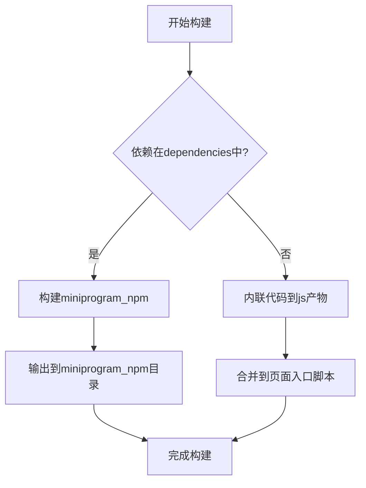
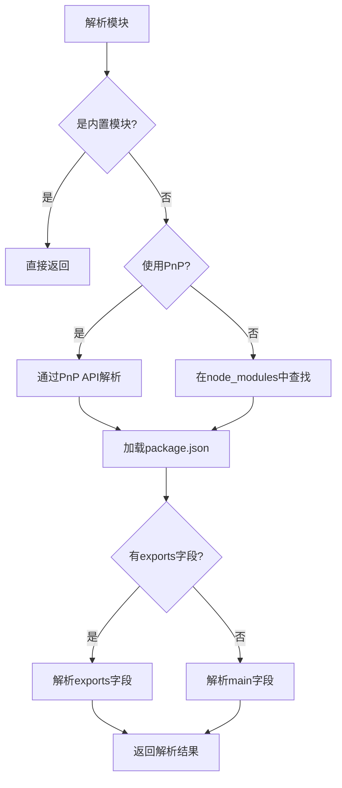
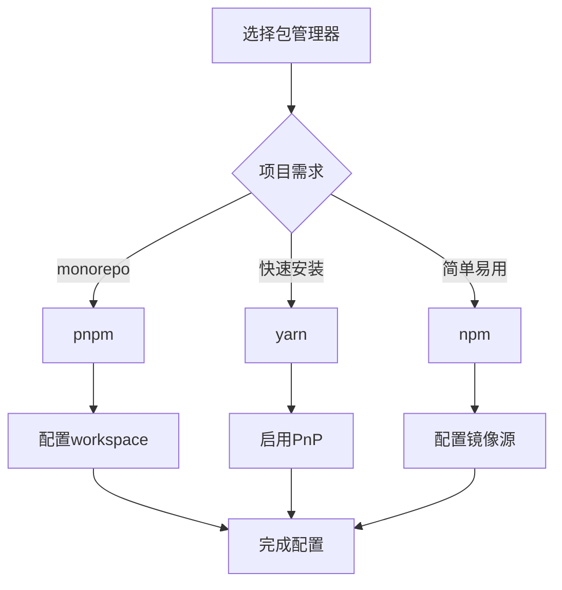
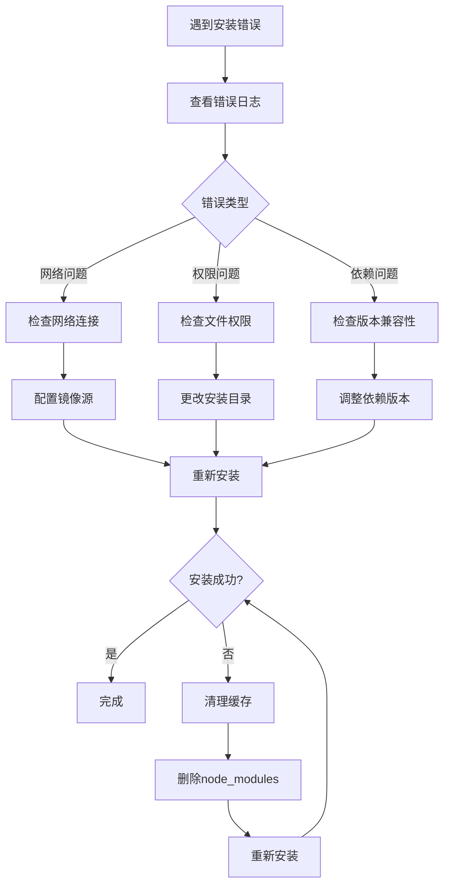

# 安装问题

<cite>
**本文档引用的文件**   
- [package.json](file://package.json)
- [pnpm-workspace.yaml](file://pnpm-workspace.yaml)
- [pnpm-lock.yaml](file://pnpm-lock.yaml)
- [.npmrc](file://.npmrc)
- [website/guide/npm.md](file://website/guide/npm.md)
- [website/troubleshoot/index.md](file://website/troubleshoot/index.md)
- [packages/weapp-vite/package.json](file://packages/weapp-vite/package.json)
- [packages/create-weapp-vite/package.json](file://packages/create-weapp-vite/package.json)
- [packages/weapp-vite/src/runtime/npmPlugin.ts](file://packages/weapp-vite/src/runtime/npmPlugin.ts)
- [packages/rolldown-require/src/packages.ts](file://packages/rolldown-require/src/packages.ts)
- [website/guide/debug.md](file://website/guide/debug.md)
- [website/guide/manual-integration.md](file://website/guide/manual-integration.md)
</cite>

## 目录
1. [weapp-vite的npm构建流程与依赖解析机制](#weapp-vite的npm构建流程与依赖解析机制)
2. [npm包安装失败的常见原因及解决方案](#npm包安装失败的常见原因及解决方案)
3. [不同包管理器的配置差异与最佳实践](#不同包管理器的配置差异与最佳实践)
4. [私有仓库配置与镜像源设置](#私有仓库配置与镜像源设置)
5. [离线安装指导](#离线安装指导)
6. [调试安装过程中的错误日志](#调试安装过程中的错误日志)

## weapp-vite的npm构建流程与依赖解析机制

weapp-vite内置了两种npm自动构建策略和一种手动构建策略，用于处理小程序项目中的依赖。

### 自动构建策略

weapp-vite根据`package.json`中依赖项的注册位置采用不同的构建策略：

1. **自动构建miniprogram_npm**：注册在`dependencies`字段中的依赖项会在每次构建时被打包成小程序可接受的格式，并输出到`project.config.json`中注册的`miniprogramNpmDistDir`目录下的`miniprogram_npm`中。

2. **自动内联代码到js产物中**：注册在`devDependencies`中的依赖项或monorepo中更高层级的依赖项，在代码引入后会被自动转换成内联代码，直接合并进页面入口脚本中。



**Diagram sources**
- [website/guide/npm.md](file://website/guide/npm.md)

### 依赖解析机制

weapp-vite使用`rolldown-require`包来处理依赖解析。该包实现了Node.js的模块解析算法，包括：

- 从`node_modules`目录中查找包
- 解析`package.json`中的`exports`、`imports`、`main`等字段
- 处理条件导出（conditional exports）
- 支持PnP（Plug'n'Play）包管理器



**Diagram sources**
- [packages/rolldown-require/src/packages.ts](file://packages/rolldown-require/src/packages.ts)

**Section sources**
- [packages/rolldown-require/src/packages.ts](file://packages/rolldown-require/src/packages.ts)

## npm包安装失败的常见原因及解决方案

### 网络问题

网络问题是最常见的安装失败原因，包括：

- 无法连接到npm registry
- 下载超时
- 网络不稳定导致下载中断

**解决方案**：
1. 使用国内镜像源，如淘宝镜像：
   ```bash
   npm config set registry https://registry.npmmirror.com/
   ```
2. 配置.pnpmrc文件使用镜像源：
   ```text
   # .npmrc
   registry=http://registry.npmmirror.com/
   ```

### 权限问题

权限问题通常发生在全局安装包或在受限制的目录中安装包时。

**解决方案**：
1. 避免使用sudo安装全局包，改用nvm管理Node.js版本
2. 配置npm的全局安装目录到用户目录：
   ```bash
   npm config set prefix ~/.npm-global
   ```
3. 将~/.npm-global/bin添加到PATH环境变量中

### 缓存问题

npm缓存损坏可能导致安装失败或安装了错误的版本。

**解决方案**：
1. 清理npm缓存：
   ```bash
   npm cache clean --force
   ```
2. 清理pnpm缓存：
   ```bash
   pnpm store prune
   ```
3. 删除node_modules和lock文件后重新安装：
   ```bash
   rm -rf node_modules pnpm-lock.yaml
   pnpm install
   ```

**Section sources**
- [.npmrc](file://.npmrc)

## 不同包管理器的配置差异与最佳实践

### pnpm

weapp-vite项目使用pnpm作为默认包管理器，配置在`package.json`的`packageManager`字段中。

**特点**：
- 使用硬链接和符号链接，节省磁盘空间
- 严格的依赖解析，避免幽灵依赖
- 支持workspace协议，方便monorepo管理

**最佳实践**：
1. 在项目根目录的`.npmrc`文件中配置：
   ```text
   # 启用shamefully-hoist将依赖提升到node_modules根目录
   shamefully-hoist=true
   # 禁用git检查以加快安装速度
   git-checks=false
   ```

2. 在`pnpm-workspace.yaml`中定义workspace包：
   ```yaml
   packages:
     - apps/*
     - templates/*
     - packages/*
     - '@weapp-core/*'
     - website
   ```

### npm

**特点**：
- 最常用的包管理器
- 简单易用
- 社区支持广泛

**最佳实践**：
1. 使用最新的npm版本
2. 配置镜像源以提高下载速度
3. 使用`--save-dev`和`--save`明确指定依赖类型

### yarn

**特点**：
- 快速的并行安装
- 可靠的锁定文件
- 丰富的插件生态系统

**最佳实践**：
1. 使用yarn 2+的Plug'n'Play特性
2. 配置镜像源
3. 定期清理缓存



**Diagram sources**
- [package.json](file://package.json)
- [pnpm-workspace.yaml](file://pnpm-workspace.yaml)

**Section sources**
- [package.json](file://package.json)
- [pnpm-workspace.yaml](file://pnpm-workspace.yaml)

## 私有仓库配置与镜像源设置

### 私有仓库配置

配置私有仓库需要在`.npmrc`文件中设置registry和认证信息。

```text
# .npmrc
# 私有仓库地址
@mycompany:registry=https://npm.mycompany.com/
# 认证令牌
//npm.mycompany.com/:_authToken=your-token-here
```

### 镜像源设置

使用镜像源可以显著提高包的下载速度，特别是在网络条件不佳的情况下。

**常用镜像源**：
- 淘宝镜像：https://registry.npmmirror.com/
- 华为镜像：https://mirrors.huaweicloud.com/repository/npm/

**配置方法**：
1. 全局配置：
   ```bash
   npm config set registry https://registry.npmmirror.com/
   ```
2. 项目级配置（推荐）：
   ```text
   # .npmrc
   registry=https://registry.npmmirror.com/
   ```

**Section sources**
- [.npmrc](file://.npmrc)

## 离线安装指导

离线安装适用于没有网络连接或网络受限的环境。

### 使用本地缓存

1. 在有网络的环境中安装并缓存所有依赖：
   ```bash
   pnpm install --offline
   ```
2. 将`node_modules`和`pnpm-store`目录复制到离线环境
3. 在离线环境中安装：
   ```bash
   pnpm install --offline
   ```

### 使用包压缩文件

1. 将`node_modules`目录打包：
   ```bash
   tar -czf node_modules.tar.gz node_modules
   ```
2. 在离线环境中解压并安装：
   ```bash
   tar -xzf node_modules.tar.gz
   pnpm install --offline
   ```

## 调试安装过程中的错误日志

### 常见错误日志分析

1. **网络连接错误**：
   ```
   npm ERR! network timeout at: https://registry.npmjs.org/some-package
   ```
   解决方案：检查网络连接，配置镜像源。

2. **权限错误**：
   ```
   npm ERR! Error: EACCES: permission denied, access '/usr/local/lib/node_modules'
   ```
   解决方案：更改npm全局安装目录或使用nvm。

3. **依赖解析错误**：
   ```
   npm ERR! Could not resolve dependency: peer react@"^18.0.0" from react-dom@18.2.0
   ```
   解决方案：检查依赖版本兼容性，使用`--legacy-peer-deps`选项。

### 调试工具和方法

1. **启用详细日志**：
   ```bash
   npm install --verbose
   pnpm install --reporter=ndjson
   ```

2. **使用调试模式**：
   ```bash
   npm install --timing
   pnpm install --dry-run
   ```

3. **检查配置**：
   ```bash
   npm config list
   pnpm config list
   ```

4. **清理并重新安装**：
   ```bash
   # 清理缓存
   npm cache clean --force
   pnpm store prune
   # 删除依赖并重新安装
   rm -rf node_modules pnpm-lock.yaml
   pnpm install
   ```



**Diagram sources**
- [website/troubleshoot/index.md](file://website/troubleshoot/index.md)

**Section sources**
- [website/troubleshoot/index.md](file://website/troubleshoot/index.md)