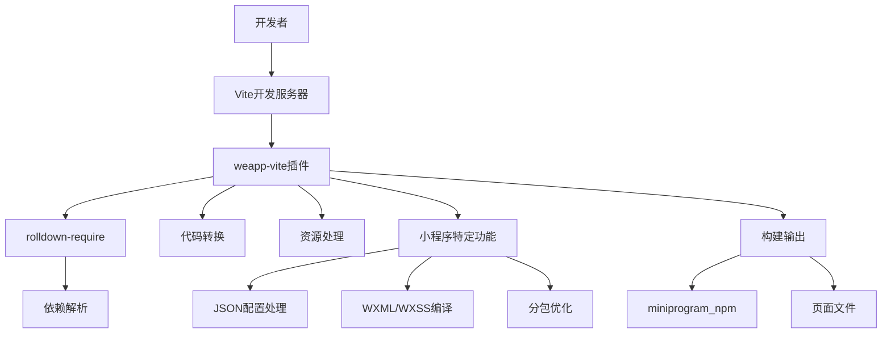
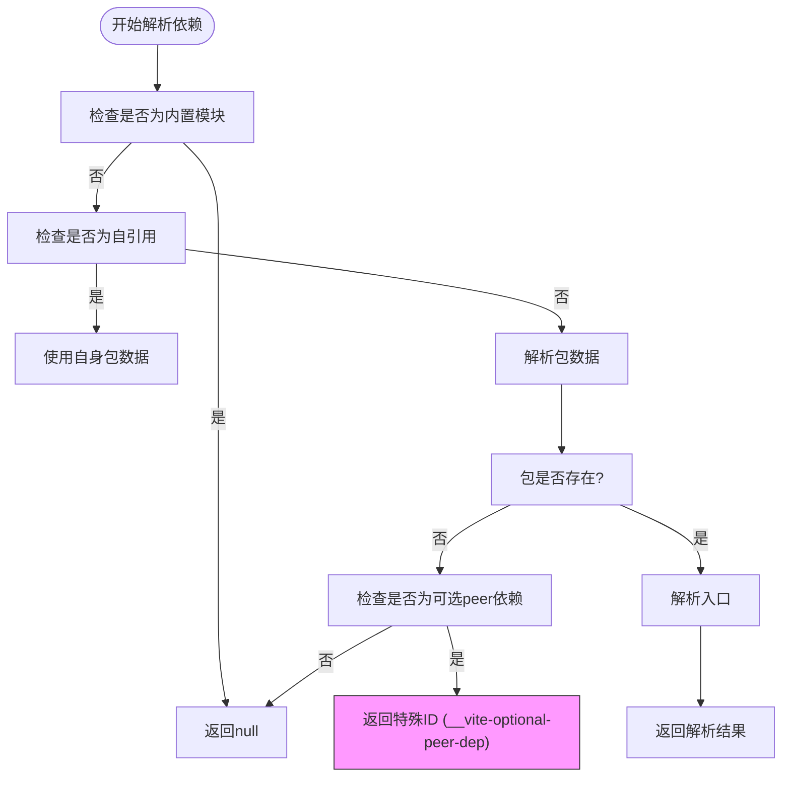
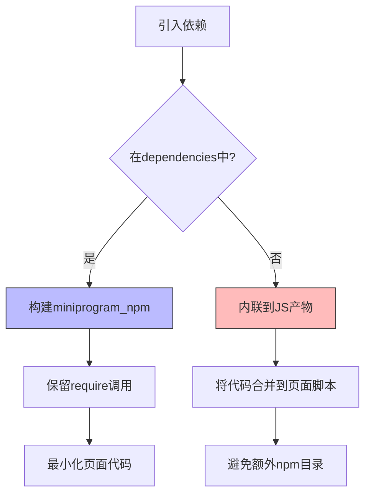
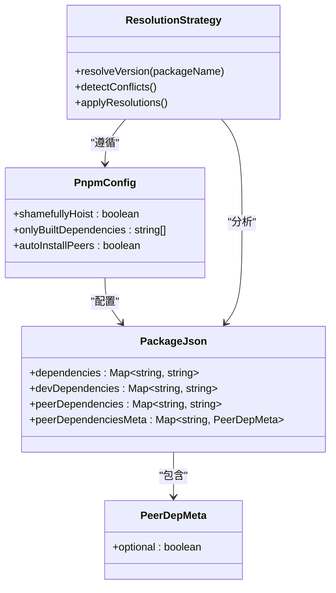
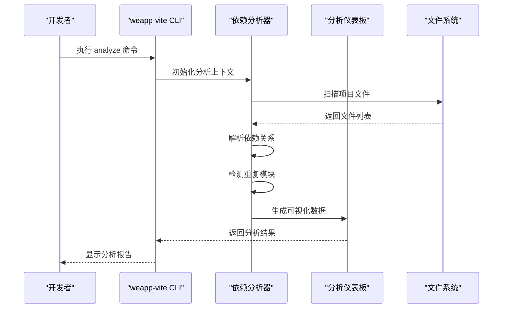
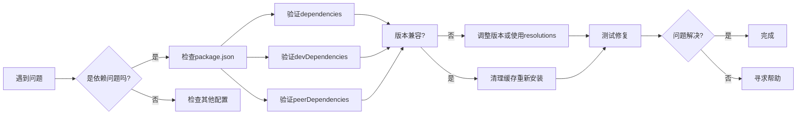

# 版本冲突

<cite>
**本文档中引用的文件**  
- [package.json](file://package.json)
- [pnpm-workspace.yaml](file://pnpm-workspace.yaml)
- [pnpm-lock.yaml](file://pnpm-lock.yaml)
- [@weapp-core/init/package.json](file://@weapp-core/init/package.json)
- [packages/weapp-vite/package.json](file://packages/weapp-vite/package.json)
- [packages/create-weapp-vite/package.json](file://packages/create-weapp-vite/package.json)
- [packages/rolldown-require/package.json](file://packages/rolldown-require/package.json)
- [packages/rolldown-require/src/plugins/resolve.ts](file://packages/rolldown-require/src/plugins/resolve.ts)
- [packages/plugin-wevu/package.json](file://packages/plugin-wevu/package.json)
- [website/guide/npm.md](file://website/guide/npm.md)
- [website/troubleshoot/index.md](file://website/troubleshoot/index.md)
</cite>

## 目录
1. [引言](#引言)
2. [项目结构](#项目结构)
3. [核心组件](#核心组件)
4. [架构概述](#架构概述)
5. [详细组件分析](#详细组件分析)
6. [依赖分析](#依赖分析)
7. [性能考虑](#性能考虑)
8. [故障排除指南](#故障排除指南)
9. [结论](#结论)

## 引言

本文件旨在深入探讨WeApp Vite项目中的版本冲突问题，提供解决依赖版本不兼容的策略。我们将分析peer依赖缺失的检测机制和解决方案，包括如何正确声明peerDependencies。此外，还将介绍处理依赖树中多个版本同一包的策略，如使用resolutions字段。通过实际案例展示如何分析和解决复杂的版本冲突问题，包括使用npm ls和yarn why等工具进行依赖树分析。

## 项目结构

该项目是一个基于monorepo架构的多包项目，使用PNPM作为包管理器。项目包含多个子包，分布在`@weapp-core/`、`packages/`、`apps/`和`templates/`目录下。这种结构允许不同功能模块独立开发和发布，同时共享公共代码。

```mermaid
graph TD
A[根目录] --> B[@weapp-core/]
A --> C[packages/]
A --> D[apps/]
A --> E[templates/]
B --> F[init]
B --> G[logger]
B --> H[schematics]
B --> I[shared]
C --> J[create-weapp-vite]
C --> K[weapp-vite]
C --> L[rolldown-require]
C --> M[plugin-wevu]
D --> N[多个应用示例]
E --> O[多个模板]
```

**Diagram sources**
- [package.json](file://package.json#L6)
- [pnpm-workspace.yaml](file://pnpm-workspace.yaml#L1-L5)

**Section sources**
- [package.json](file://package.json#L1-L165)
- [pnpm-workspace.yaml](file://pnpm-workspace.yaml#L1-L17)

## 核心组件

WeApp Vite项目的核心组件主要包括`weapp-vite`主包、`rolldown-require`依赖解析器、`create-weapp-vite`项目创建工具以及各种插件和模板。这些组件共同构成了一个现代化的小程序开发工具链，提供了从项目创建到构建部署的完整解决方案。

**Section sources**
- [packages/weapp-vite/package.json](file://packages/weapp-vite/package.json#L1-L156)
- [packages/rolldown-require/package.json](file://packages/rolldown-require/package.json#L1-L86)
- [packages/create-weapp-vite/package.json](file://packages/create-weapp-vite/package.json#L1-L58)

## 架构概述

WeApp Vite的架构基于Vite构建工具，通过自定义插件和配置实现了对小程序开发的全面支持。系统采用模块化设计，各组件职责分明，通过清晰的依赖关系协同工作。



**Diagram sources**
- [packages/weapp-vite/package.json](file://packages/weapp-vite/package.json#L97-L124)
- [packages/rolldown-require/package.json](file://packages/rolldown-require/package.json#L73-L81)

## 详细组件分析

### Peer依赖缺失检测机制

WeApp Vite项目中的`rolldown-require`组件实现了peer依赖缺失的检测机制。当解析模块依赖时，如果发现依赖是可选的peer依赖，则会返回一个特殊的ID，该ID在被导入时会抛出错误。



**Diagram sources**
- [packages/rolldown-require/src/plugins/resolve.ts](file://packages/rolldown-require/src/plugins/resolve.ts#L332-L374)

**Section sources**
- [packages/rolldown-require/src/plugins/resolve.ts](file://packages/rolldown-require/src/plugins/resolve.ts#L332-L374)
- [packages/rolldown-require/package.json](file://packages/rolldown-require/package.json#L73-L75)

### 依赖预构建和分组优化

WeApp Vite实现了智能的依赖预构建和分组策略，根据依赖在package.json中的位置（dependencies或devDependencies）采取不同的处理方式。



**Diagram sources**
- [website/guide/npm.md](file://website/guide/npm.md#L9-L70)

**Section sources**
- [website/guide/npm.md](file://website/guide/npm.md#L9-L70)
- [packages/weapp-vite/package.json](file://packages/weapp-vite/package.json#L97-L124)

## 依赖分析

### 多版本依赖处理策略

在monorepo项目中，处理多个版本的同一包是一个常见挑战。WeApp Vite项目通过PNPM的工作区配置和依赖提升机制来解决这个问题。



**Diagram sources**
- [pnpm-workspace.yaml](file://pnpm-workspace.yaml#L1-L17)
- [pnpm-lock.yaml](file://pnpm-lock.yaml#L1-L800)
- [package.json](file://package.json#L53-L158)

**Section sources**
- [pnpm-workspace.yaml](file://pnpm-workspace.yaml#L1-L17)
- [pnpm-lock.yaml](file://pnpm-lock.yaml#L1-L800)
- [package.json](file://package.json#L53-L158)

### 依赖树分析工具

WeApp Vite提供了多种工具来分析和可视化依赖树，帮助开发者理解和解决版本冲突问题。



**Diagram sources**
- [packages/weapp-vite/src/cli/commands/analyze.ts](file://packages/weapp-vite/src/cli/commands/analyze.ts#L1-L30)
- [packages/weapp-vite/analyze-dashboard/useTreemapData.ts](file://packages/weapp-vite/analyze-dashboard/useTreemapData.ts#L161-L226)

**Section sources**
- [packages/weapp-vite/src/cli/commands/analyze.ts](file://packages/weapp-vite/src/cli/commands/analyze.ts#L1-L30)
- [packages/weapp-vite/analyze-dashboard/useTreemapData.ts](file://packages/weapp-vite/analyze-dashboard/useTreemapData.ts#L161-L226)

## 性能考虑

在处理版本冲突时，需要考虑性能影响。WeApp Vite通过以下方式优化性能：
- 使用缓存机制避免重复解析
- 智能的依赖分组减少构建时间
- 预构建常用依赖提高开发服务器启动速度
- 内联开发依赖避免额外的npm构建步骤

## 故障排除指南

### 常见版本冲突问题

当遇到版本冲突时，可以按照以下步骤进行排查：

1. **检查peer依赖声明**：确保所有必要的peer依赖都已正确声明
2. **验证依赖版本**：使用`npm ls <package-name>`或`pnpm list <package-name>`检查依赖版本
3. **清理缓存**：删除`node_modules`和`pnpm-lock.yaml`后重新安装
4. **检查工作区配置**：确认`pnpm-workspace.yaml`配置正确
5. **使用分析工具**：运行`weapp-vite analyze`命令查看依赖关系



**Diagram sources**
- [website/troubleshoot/index.md](file://website/troubleshoot/index.md#L1-L50)
- [packages/weapp-vite/package.json](file://packages/weapp-vite/package.json#L97-L124)

**Section sources**
- [website/troubleshoot/index.md](file://website/troubleshoot/index.md#L1-L50)
- [packages/weapp-vite/package.json](file://packages/weapp-vite/package.json#L97-L124)

## 结论

WeApp Vite项目通过精心设计的依赖管理和版本控制策略，有效解决了小程序开发中的版本冲突问题。通过正确使用peerDependencies、合理配置PNPM工作区、利用智能的依赖预构建机制，开发者可以构建稳定可靠的项目。建议开发者熟悉项目中的依赖分析工具，及时发现和解决潜在的版本冲突问题，确保项目的长期可维护性。