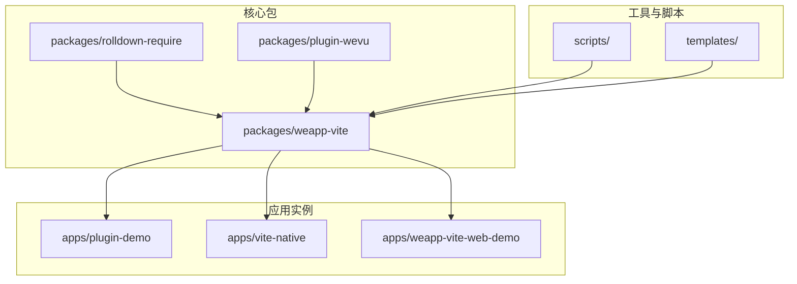
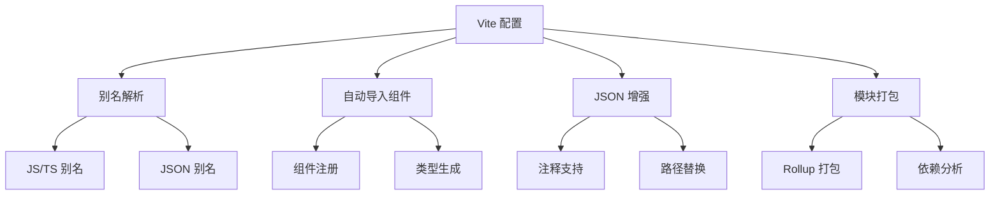
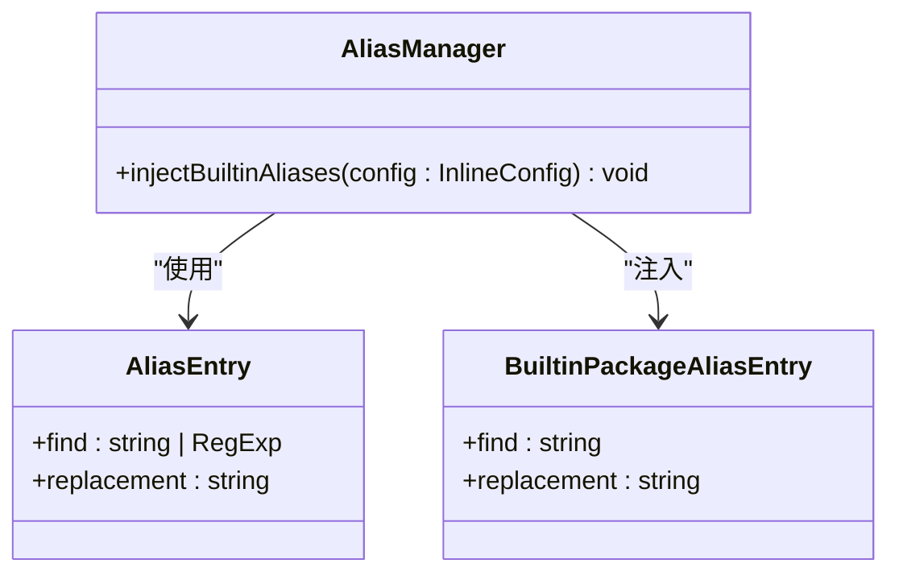
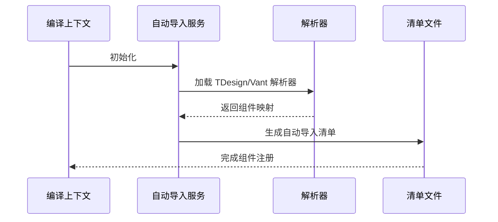
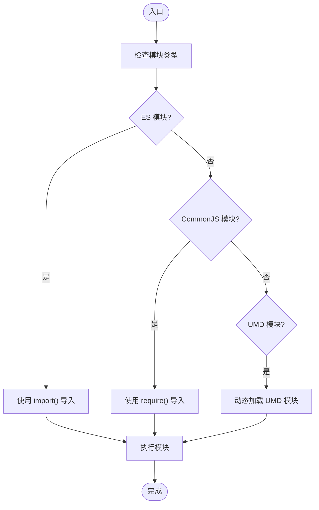
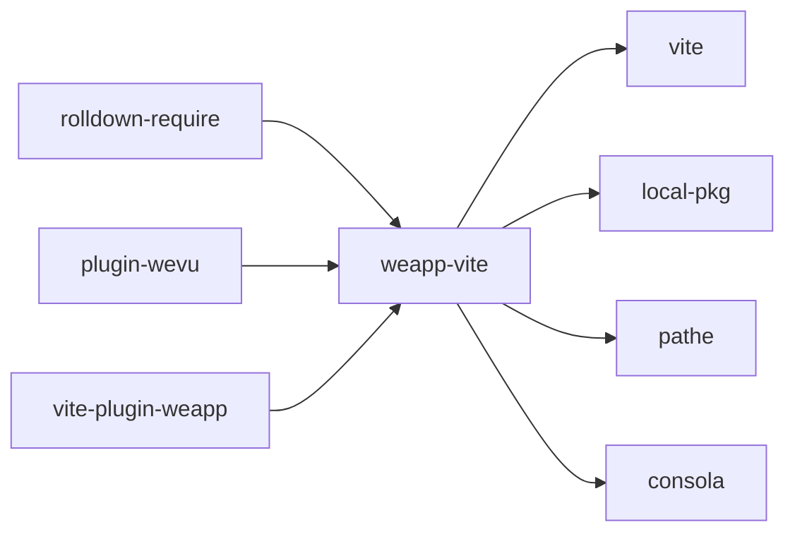

# 第三方库集成

<cite>
**本文档引用的文件**  
- [vite.config.ts](file://apps/vite-native/vite.config.ts)
- [packageAliases.ts](file://packages/weapp-vite/src/runtime/packageAliases.ts)
- [alias.ts](file://packages/weapp-vite/src/runtime/config/internal/alias.ts)
- [autoImportService.ts](file://packages/weapp-vite/src/runtime/autoImport/service.ts)
- [alias.md](file://website/guide/alias.md)
- [extract.ts](file://apps/vite-native/scripts/extract.ts)
- [import-json.ts](file://apps/vite-native/scripts/import-json.ts)
- [cos-wx-sdk-v5.js](file://apps/vite-native/utils/cos-wx-sdk-v5.js)
</cite>

## 目录
1. [简介](#简介)
2. [项目结构](#项目结构)
3. [核心组件](#核心组件)
4. [架构概述](#架构概述)
5. [详细组件分析](#详细组件分析)
6. [依赖分析](#依赖分析)
7. [性能考虑](#性能考虑)
8. [故障排除指南](#故障排除指南)
9. [结论](#结论)

## 简介
本文档旨在为 WeApp Vite 项目提供详细的第三方库集成指南，重点解决在集成外部库时遇到的路径解析问题、模块混合使用场景以及不兼容库的适配方案。通过配置 `vite.config.ts` 中的 `resolve.alias` 和 `weapp.jsonAlias.entries`，可以有效管理依赖包别名。同时，文档还介绍了如何处理 UMD、CommonJS 和 ES 模块的混合使用，并为不同类型的第三方库（如 UI 组件库、工具库、SDK）提供最佳实践和实际代码示例。

## 项目结构
WeApp Vite 项目采用 monorepo 结构，包含多个子包和应用实例。核心功能由 `packages/weapp-vite` 提供，而具体的集成示例则分布在 `apps/` 目录下的各个子项目中。项目支持多种模板（如 TailwindCSS、TDesign、Vant），并通过 `vite.config.ts` 配置文件进行灵活的构建和开发设置。

**Diagram sources**
- [vite.config.ts](file://apps/vite-native/vite.config.ts#L1-L138)
- [package.json](file://packages/weapp-vite/package.json#L1-L20)

## 核心组件
本项目的核心组件包括 Vite 配置管理、别名解析、自动导入服务和模块打包器。这些组件协同工作，确保第三方库能够被正确解析、转换和集成到小程序环境中。

**Section sources**
- [vite.config.ts](file://apps/vite-native/vite.config.ts#L1-L138)
- [packageAliases.ts](file://packages/weapp-vite/src/runtime/packageAliases.ts#L1-L53)

## 架构概述
WeApp Vite 的架构设计围绕 Vite 的插件系统展开，通过自定义插件和配置扩展，实现了对小程序开发环境的全面支持。关键架构特性包括别名解析、自动组件导入、JSON 增强和模块打包优化。

**Diagram sources**
- [vite.config.ts](file://apps/vite-native/vite.config.ts#L1-L138)
- [autoImportService.ts](file://packages/weapp-vite/src/runtime/autoImport/service.ts#L1-L640)

## 详细组件分析

### 别名解析组件分析
别名解析是 WeApp Vite 的核心功能之一，它允许开发者在 JS/TS 和 JSON 文件中使用一致的路径前缀。通过 `resolve.alias` 和 `weapp.jsonAlias.entries` 配置，可以实现跨语言的路径映射。

#### 对于对象导向的组件：

**Diagram sources**
- [alias.ts](file://packages/weapp-vite/src/runtime/config/internal/alias.ts#L1-L60)
- [packageAliases.ts](file://packages/weapp-vite/src/runtime/packageAliases.ts#L1-L53)

### 自动导入组件分析
自动导入服务负责在构建过程中自动注册和解析第三方组件库中的组件，减少手动配置的工作量。

#### 对于 API/服务组件：

**Diagram sources**
- [autoImportService.ts](file://packages/weapp-vite/src/runtime/autoImport/service.ts#L1-L640)
- [resolvers/index.ts](file://packages/weapp-vite/src/auto-import-components/resolvers/index.ts#L1-L4)

### 模块混合使用分析
WeApp Vite 支持 UMD、CommonJS 和 ES 模块的混合使用，通过 `tsx` 和 `jiti` 等工具实现动态导入和模块转换。

#### 对于复杂逻辑组件：

**Diagram sources**
- [import-json.ts](file://apps/vite-native/scripts/import-json.ts#L1-L8)
- [cos-wx-sdk-v5.js](file://apps/vite-native/utils/cos-wx-sdk-v5.js#L614-L1252)

## 依赖分析
WeApp Vite 项目依赖于多个核心包和工具，这些依赖共同构成了完整的开发和构建环境。

**Diagram sources**
- [package.json](file://packages/weapp-vite/package.json#L1-L20)
- [vite.config.ts](file://apps/vite-native/vite.config.ts#L1-L138)

**Section sources**
- [package.json](file://packages/weapp-vite/package.json#L1-L20)
- [vite.config.ts](file://apps/vite-native/vite.config.ts#L1-L138)

## 性能考虑
在集成第三方库时，应注意以下性能优化建议：
- 使用按需导入而非全量导入，减少包体积。
- 合理配置别名和自动导入，避免不必要的路径解析开销。
- 对大型库进行代码分割，利用分包功能提升加载速度。
- 启用构建时优化，如压缩和 tree-shaking。

## 故障排除指南
### 常见问题及解决方案
- **别名未生效？** 请确认已重启开发服务器，因为 `tsconfig` 修改后需要重新启动进程。
- **JSON 中提示路径不存在？** 这是开发者工具的校验限制，实际编译产物会正确替换路径。
- **模块导入失败？** 检查模块是否支持当前环境，必要时创建适配器或包装器。

**Section sources**
- [alias.md](file://website/guide/alias.md#L1-L151)
- [vite.config.ts](file://apps/vite-native/vite.config.ts#L1-L138)

## 结论
WeApp Vite 提供了一套完整的第三方库集成解决方案，通过灵活的配置和强大的插件系统，能够有效解决路径解析、模块兼容性和性能优化等问题。开发者可以根据具体需求选择合适的集成策略，并参考文档中的最佳实践进行实施。