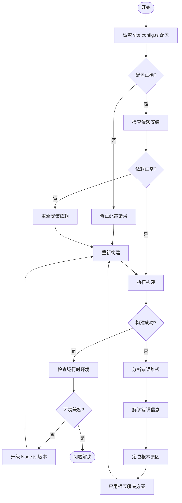

# 常见问题

<cite>
**本文档中引用的文件**  
- [vite.config.ts](file://@weapp-core/init/templates/default/vite.config.ts)
- [vite.config.mts](file://apps/plugin-demo/vite.config.mts)
- [merge.ts](file://packages/weapp-vite/src/runtime/config/internal/merge.ts)
- [independentError.ts](file://packages/weapp-vite/src/runtime/independentError.ts)
- [errors.ts](file://packages/weapp-vite/src/types/errors.ts)
- [version.ts](file://packages/weapp-vite/src/utils/version.ts)
- [npm.ts](file://@weapp-core/init/src/npm.ts)
- [viteConfig.ts](file://@weapp-core/init/src/viteConfig.ts)
</cite>

## 目录
1. [配置错误](#配置错误)
2. [构建失败](#构建失败)
3. [运行时异常](#运行时异常)
4. [环境问题](#环境问题)
5. [问题诊断流程图](#问题诊断流程图)
6. [已知问题与临时解决方案](#已知问题与临时解决方案)

## 配置错误

在使用 `weapp-vite` 时，最常见的问题之一是 `vite.config.ts` 配置不当。配置错误可能导致构建失败、资源无法正确解析或开发服务器无法启动。

### 错误配置示例
```ts
import { defineConfig } from 'weapp-vite/config'

export default defineConfig({
  weapp: {
    srcRoot: 'src',
    // 错误：generate 配置格式不正确
    generate: {
      extensions: 'ts', // 应为对象
      dirs: 'src/components' // 应为对象
    }
  }
})
```

### 正确配置示例
```ts
import { defineConfig } from 'weapp-vite/config'

export default defineConfig({
  weapp: {
    srcRoot: 'src',
    generate: {
      extensions: {
        js: 'ts',
        wxss: 'scss'
      },
      dirs: {
        component: 'src/components',
        page: 'src/pages'
      }
    }
  },
  css: {
    preprocessorOptions: {
      scss: {
        silenceDeprecations: ['legacy-js-api', 'import']
      }
    }
  }
})
```

### 常见配置错误及解决方案
- **错误：`weapp` 配置项缺失**  
  **原因**：未正确配置 `weapp` 选项，导致无法识别小程序源码目录。  
  **解决方案**：确保 `vite.config.ts` 中包含 `weapp` 配置项，并正确设置 `srcRoot`。

- **错误：插件根目录配置错误**  
  **原因**：在插件开发中，`pluginRoot` 未正确指向插件入口目录。  
  **解决方案**：在 `weapp` 配置中明确指定 `pluginRoot` 路径。

**Section sources**
- [vite.config.ts](file://@weapp-core/init/templates/default/vite.config.ts#L1-L40)
- [vite.config.mts](file://apps/plugin-demo/vite.config.mts#L1-L10)
- [viteConfig.ts](file://@weapp-core/init/src/viteConfig.ts#L1-L11)

## 构建失败

构建失败通常由依赖解析问题、分包配置错误或插件冲突引起。

### 依赖解析失败
当项目依赖的 npm 包无法正确解析时，构建会失败。

**错误信息示例**：
```
Failed to resolve entry for package "lodash". The package may have incorrect main/module/exports specified in its package.json.
```

**可能原因**：
- 包的 `package.json` 中 `main`、`module` 或 `exports` 字段配置错误。
- 依赖包未正确安装或版本冲突。

**解决方案**：
1. 检查 `package.json` 中依赖的版本是否兼容。
2. 清理 `node_modules` 并重新安装依赖。
3. 使用 `pnpm` 或 `yarn` 的 lock 文件确保依赖一致性。

### 分包构建失败
当分包配置为独立构建上下文时，可能出现构建错误。

**错误处理机制**：
```ts
export function createIndependentBuildError(root: string, cause?: unknown): Error {
  const fallback = `Independent bundle for ${root} failed`
  // 错误信息提取与聚合
  return new Error(fallback, { cause })
}
```

**解决方案**：
- 检查分包的 `independent` 配置是否正确。
- 确保分包内的依赖项已正确声明。

**Section sources**
- [merge.ts](file://packages/weapp-vite/src/runtime/config/internal/merge.ts#L1-319)
- [independentError.ts](file://packages/weapp-vite/src/runtime/independentError.ts#L55-L159)
- [resolve.ts](file://packages/rolldown-require/src/plugins/resolve.ts#L332-L548)

## 运行时异常

运行时异常通常表现为组件加载失败、页面无法渲染或 API 调用错误。

### 组件加载失败
**可能原因**：
- 组件路径配置错误。
- `usingComponents` 在 JSON 配置中未正确定义。
- 插件组件未正确注册。

**解决方案**：
- 检查 `jsonService.read` 是否正确读取了组件配置。
- 确保 `resolve` 调用的路径与实际文件路径匹配。

```ts
// 插件组件注册示例
await loader.call(pluginCtx, '/project/src/app.js', 'app')
expect(resolveSpy).toHaveBeenCalledWith(`${pluginRoot}/components/card/index`)
```

### 错误堆栈跟踪解读
`weapp-vite` 使用 `BindingErrorLike` 接口标准化错误信息：

```ts
export interface BindingErrorLike {
  message?: string
  code?: string
  plugin?: string
  id?: string
  frame?: string
  stack?: string
}
```

**解读方法**：
- `message`：错误的简要描述。
- `code`：错误代码，用于快速定位问题类型。
- `plugin`：引发错误的插件名称。
- `id`：出错的模块 ID。
- `frame`：错误发生时的代码上下文。
- `stack`：完整的调用堆栈。

**Section sources**
- [errors.ts](file://packages/weapp-vite/src/types/errors.ts#L1-L9)
- [loadEntry.test.ts](file://packages/weapp-vite/src/plugins/hooks/useLoadEntry/loadEntry.test.ts#L343-L438)

## 环境问题

环境问题主要涉及 Node.js 版本不兼容或运行时检测失败。

### Node.js 版本不兼容
`weapp-vite` 对 Node.js 版本有最低要求。

**版本检查逻辑**：
```ts
export function checkRuntime(minVersions: MinVersions): void {
  const { runtime, version } = getRuntime()
  const required = minVersions[runtime]
  if (!semverGte(version, required)) {
    logger.warn(`当前 ${runtime} 版本为 ${version} 无法满足 \`weapp-vite\` 最低要求的版本(>= ${required})`)
  }
}
```

**解决方案**：
- 升级 Node.js 至推荐版本（建议 v18+）。
- 使用 `nvm` 管理多个 Node.js 版本。

### 运行时检测
支持 Node.js、Deno 和 Bun 运行时检测。

**检测优先级**：
1. Node.js（通过 `process.versions.node`）
2. Deno（通过 `Deno.version.deno`）
3. Bun（通过 `Bun.version`）

**Section sources**
- [version.ts](file://packages/weapp-vite/src/utils/version.ts#L1-L63)
- [version.test.ts](file://packages/weapp-vite/src/utils/version.test.ts#L1-L94)

## 问题诊断流程图



**Diagram sources**
- [merge.ts](file://packages/weapp-vite/src/runtime/config/internal/merge.ts#L1-319)
- [independentError.ts](file://packages/weapp-vite/src/runtime/independentError.ts#L55-L159)
- [version.ts](file://packages/weapp-vite/src/utils/version.ts#L1-L63)

## 已知问题与临时解决方案

### 已知问题
- **插件开发中 auto-import 功能未生效**  
  **临时解决方案**：手动在 `vite.config.ts` 中配置 `auto-import-components.json`。

- **分包独立构建时共享模块重复打包**  
  **临时解决方案**：使用 `sharedChunks` 配置明确指定共享模块。

### 预防措施
- 定期更新 `weapp-vite` 至最新版本。
- 使用 `create-weapp-vite` 脚手架初始化项目，避免配置错误。
- 在 CI/CD 中加入版本检查步骤。

**Section sources**
- [plugin.md](file://website/guide/plugin.md#L133-L141)
- [npm.ts](file://@weapp-core/init/src/npm.ts#L1-L51)