# 依赖问题

<cite>
**本文档引用的文件**  
- [index.ts](file://packages/weapp-vite/src/index.ts)
- [bundleRequire.ts](file://packages/rolldown-require/src/index.ts)
- [optimizer/index.ts](file://packages/rolldown-require/src/optimizer/index.ts)
- [options.ts](file://packages/rolldown-require/src/options.ts)
- [bundler.ts](file://packages/rolldown-require/src/bundler.ts)
- [loader.ts](file://packages/rolldown-require/src/loader.ts)
- [cache.ts](file://packages/rolldown-require/src/cache.ts)
- [utils.ts](file://packages/rolldown-require/src/utils.ts)
- [config.ts](file://packages/weapp-vite/src/config.ts)
- [constants.ts](file://packages/rolldown-require/src/constants.ts)
- [resolve.ts](file://packages/rolldown-require/src/plugins/resolve.ts)
- [packages.ts](file://packages/rolldown-require/src/packages.ts)
- [externalize.ts](file://packages/rolldown-require/src/externalize.ts)
- [normalizer.ts](file://packages/weapp-vite/src/plugins/hooks/useLoadEntry/normalizer.ts)
- [wxmlPlugin.ts](file://packages/weapp-vite/src/runtime/wxmlPlugin.ts)
- [subpackages.ts](file://packages/weapp-vite/src/analyze/subpackages.ts)
- [chunkStrategy.ts](file://packages/weapp-vite/src/runtime/chunkStrategy.ts)
- [independentError.ts](file://packages/weapp-vite/src/runtime/independentError.ts)
</cite>

## 目录
1. [引言](#引言)
2. [依赖解析机制](#依赖解析机制)
3. [模块格式处理](#模块格式处理)
4. [依赖缓存机制](#依赖缓存机制)
5. [依赖树分析](#依赖树分析)
6. [常见依赖问题及解决方案](#常见依赖问题及解决方案)
7. [分包依赖管理](#分包依赖管理)
8. [优化策略](#优化策略)
9. [结论](#结论)

## 引言

weapp-vite 是一个用于微信小程序开发的构建工具，它基于 Vite 和 Rolldown 构建，提供了高效的依赖解析和模块处理能力。本文档旨在深入分析 weapp-vite 在构建过程中遇到的依赖问题，包括第三方库引入异常、npm 包依赖冲突、模块路径解析错误等。我们将探讨依赖收集机制和模块解析流程，涵盖 commonjs、esm、umd 等不同模块格式的处理方式。此外，文档还将提供依赖树分析方法，帮助开发者识别循环依赖和版本冲突，并介绍依赖缓存机制和优化策略。

**Section sources**
- [index.ts](file://packages/weapp-vite/src/index.ts#L1-L4)
- [bundleRequire.ts](file://packages/rolldown-require/src/index.ts#L1-L35)

## 依赖解析机制

weapp-vite 的依赖解析机制主要由 `rolldown-require` 模块实现，该模块负责处理模块的加载和依赖关系的解析。核心函数 `bundleRequire` 是整个依赖解析过程的入口点，它接受一个选项对象，包含文件路径、工作目录、外部依赖等配置。

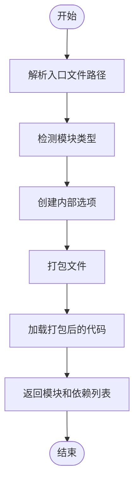

**Diagram sources**
- [bundleRequire.ts](file://packages/rolldown-require/src/index.ts#L11-L34)
- [options.ts](file://packages/rolldown-require/src/options.ts#L7-L47)

### 路径解析与模块类型检测

`resolveEntryFilepath` 函数负责解析入口文件的绝对路径。如果提供的路径已经是绝对路径，则直接返回；否则，结合工作目录（cwd）进行解析。`detectModuleType` 函数则用于判断文件是否为 ESM 模块，主要通过检查文件扩展名和 `package.json` 中的 `type` 字段来确定。

**Section sources**
- [options.ts](file://packages/rolldown-require/src/options.ts#L7-L47)

### 依赖收集与外部化

在打包过程中，`collectReferencedModules` 函数会遍历生成的 bundle，收集所有引用的模块。`createExternalizeDepsPlugin` 插件则负责将外部依赖（如 node_modules 中的包）从 bundle 中排除，确保这些依赖在运行时通过 `require` 或 `import` 动态加载。

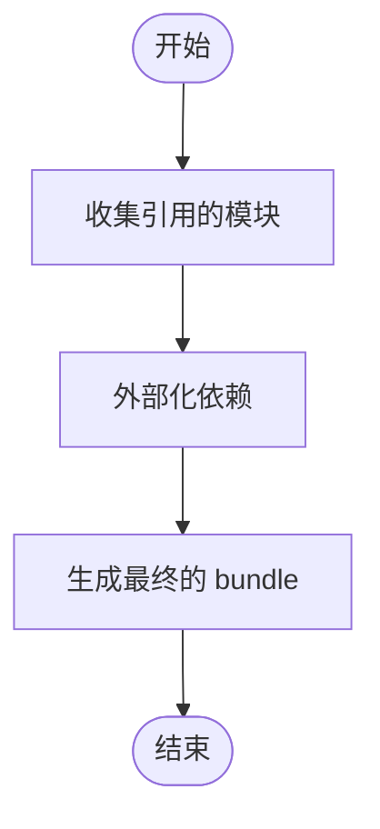

**Diagram sources**
- [bundler.ts](file://packages/rolldown-require/src/bundler.ts#L112-L119)
- [externalize.ts](file://packages/rolldown-require/src/externalize.ts#L73-L77)

## 模块格式处理

weapp-vite 支持多种模块格式，包括 CommonJS、ESM 和 UMD。不同的模块格式在解析和加载时需要采用不同的策略。

### CommonJS 处理

对于 CommonJS 模块，weapp-vite 使用 Node.js 的 `require` 机制进行加载。`_require.extensions` 被用来注册自定义的加载器，以便在需要时编译和加载模块。`compileLoader` 函数会检查文件路径，如果是目标文件，则使用 `_compile` 方法编译代码；否则，调用默认的加载器。

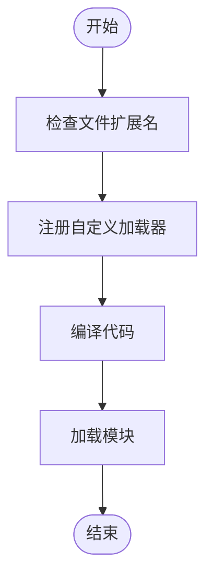

**Diagram sources**
- [loader.ts](file://packages/rolldown-require/src/loader.ts#L71-L99)

### ESM 处理

对于 ESM 模块，weapp-vite 采用了一种临时文件的策略。首先将打包后的代码写入一个临时文件，然后使用 `import` 语句加载该文件。这种方式避免了在不支持 ESM 的环境中直接执行 ESM 代码的问题。加载完成后，临时文件会被删除。

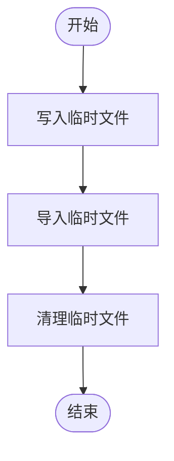

**Diagram sources**
- [loader.ts](file://packages/rolldown-require/src/loader.ts#L48-L69)

### UMD 处理

UMD 模块通常包含多种模块格式的兼容代码，weapp-vite 会根据运行环境选择合适的模块格式进行加载。对于浏览器环境，优先使用 ESM 格式；对于 Node.js 环境，则使用 CommonJS 格式。

**Section sources**
- [loader.ts](file://packages/rolldown-require/src/loader.ts#L44-L70)

## 依赖缓存机制

为了提高构建性能，weapp-vite 实现了依赖缓存机制。缓存机制通过 `cache.ts` 文件中的 `resolveCacheOptions`、`maybeReadCache` 和 `storeCacheOutput` 函数实现。

### 缓存配置

`resolveCacheOptions` 函数根据输入的文件路径和选项生成缓存配置。如果缓存被启用，函数会计算文件的哈希值作为缓存键，并确定缓存目录。缓存目录通常位于 `node_modules/.rolldown-require-cache` 或系统的临时目录中。

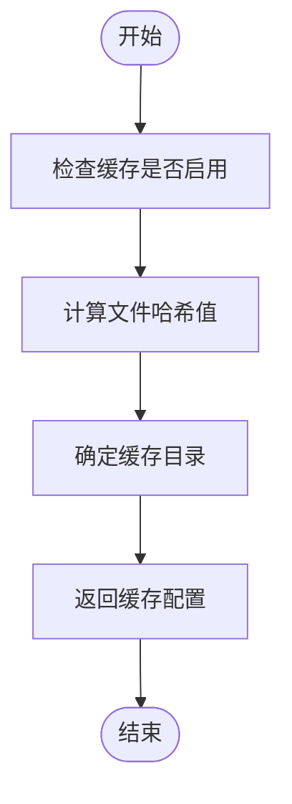

**Diagram sources**
- [cache.ts](file://packages/rolldown-require/src/cache.ts#L39-L97)

### 缓存读取与存储

`maybeReadCache` 函数尝试从缓存中读取已有的模块。如果缓存存在且有效，函数会返回缓存的模块；否则，返回 `undefined`。`storeCacheOutput` 函数则负责将打包后的代码和元数据写入缓存。元数据包括文件路径、修改时间、大小等信息，用于验证缓存的有效性。

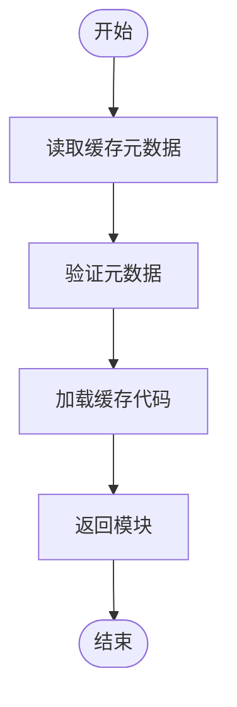

**Diagram sources**
- [cache.ts](file://packages/rolldown-require/src/cache.ts#L109-L144)
- [cache.ts](file://packages/rolldown-require/src/cache.ts#L162-L193)

## 依赖树分析

依赖树分析是识别和解决依赖问题的关键步骤。weapp-vite 提供了多种工具和方法来帮助开发者分析依赖树，包括依赖图谱、模块使用情况和分包依赖。

### 依赖图谱

`analyzeSubpackages` 函数可以生成分包的依赖图谱，显示每个分包的依赖关系。通过分析 `depsMap` 和 `tokenMap`，可以了解各个模块之间的依赖关系，从而识别潜在的循环依赖和冗余依赖。

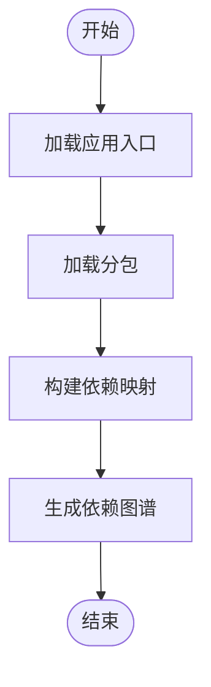

**Diagram sources**
- [subpackages.ts](file://packages/weapp-vite/src/analyze/subpackages.ts#L546-L547)

### 模块使用情况

`summarizeSubPackages` 函数可以汇总分包的使用情况，包括每个模块被哪些分包引用。通过分析 `module.packages`，可以了解模块的共享程度，从而优化分包策略。

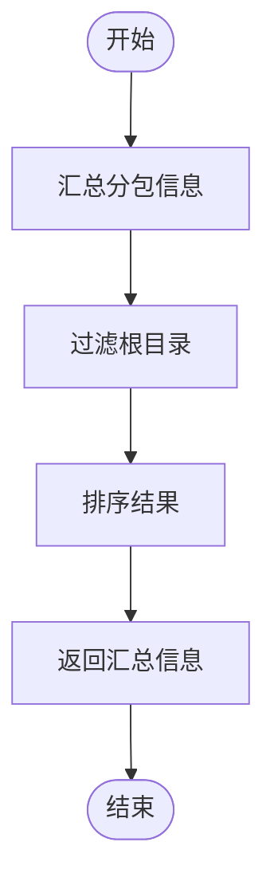

**Diagram sources**
- [subpackages.ts](file://packages/weapp-vite/src/analyze/subpackages.ts#L523-L536)

## 常见依赖问题及解决方案

在实际开发中，weapp-vite 可能会遇到各种依赖问题。以下是一些常见的问题及其解决方案。

### 第三方库引入异常

当引入第三方库时，可能会出现找不到模块或版本冲突的问题。解决方案包括：
- 确保 `package.json` 中的依赖版本正确。
- 使用 `npm install` 或 `yarn install` 重新安装依赖。
- 检查 `node_modules` 目录是否存在损坏的文件。

**Section sources**
- [resolve.ts](file://packages/rolldown-require/src/plugins/resolve.ts#L334-L370)

### npm 包依赖冲突

多个依赖包可能依赖同一个库的不同版本，导致版本冲突。解决方案包括：
- 使用 `npm dedupe` 或 `yarn deduplicate` 命令去重依赖。
- 手动调整 `package.json` 中的依赖版本，确保一致性。
- 使用 `resolutions` 字段强制指定依赖版本。

**Section sources**
- [packages.ts](file://packages/rolldown-require/src/packages.ts#L217-L230)

### 模块路径解析错误

模块路径解析错误通常发生在别名配置不当或路径拼接错误的情况下。解决方案包括：
- 检查 `vite.config.ts` 中的 `resolve.alias` 配置。
- 确保路径拼接时使用 `path.resolve` 或 `pathe` 库。
- 使用 `console.log` 输出路径，检查是否正确。

**Section sources**
- [normalizer.ts](file://packages/weapp-vite/src/plugins/hooks/useLoadEntry/normalizer.ts#L6-L25)

### 循环依赖

循环依赖会导致模块加载失败或性能下降。解决方案包括：
- 重构代码，消除循环依赖。
- 使用懒加载或动态导入，延迟模块的加载。
- 使用 `import()` 语句替代 `require`，避免同步加载。

**Section sources**
- [wxmlPlugin.ts](file://packages/weapp-vite/src/runtime/wxmlPlugin.ts#L28-L36)

## 分包依赖管理

weapp-vite 支持分包功能，允许将应用拆分为多个独立的包，以减少主包的体积。分包依赖管理是确保分包正常工作的关键。

### 分包配置

在 `project.config.json` 中，可以通过 `subPackages` 字段配置分包。每个分包可以有自己的入口文件和依赖列表。`independent` 字段用于指定分包是否独立，独立分包不会与主包共享依赖。

```json
{
  "subPackages": [
    {
      "root": "packageA",
      "pages": ["index"],
      "independent": true
    }
  ]
}
```

**Section sources**
- [subpackages.ts](file://packages/weapp-vite/src/analyze/subpackages.ts#L52-L56)

### 共享依赖

共享依赖是指多个分包共同使用的模块。weapp-vite 会自动识别共享依赖，并将其提取到公共包中。`resolveTakeSharedChunkName` 函数负责生成共享包的名称，确保不同分包中的相同模块被正确合并。

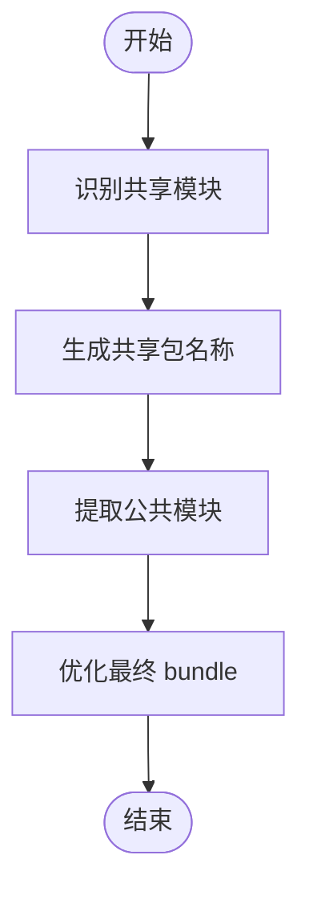

**Diagram sources**
- [chunkStrategy.ts](file://packages/weapp-vite/src/runtime/chunkStrategy.ts#L365-L392)

## 优化策略

为了提高构建性能和应用加载速度，weapp-vite 提供了多种优化策略。

### 依赖预编译

依赖预编译是指在构建过程中提前编译和优化依赖模块。`optimizeDeps` 配置项可以指定需要预编译的依赖列表。预编译后的模块会被缓存，下次构建时直接使用缓存，从而加快构建速度。

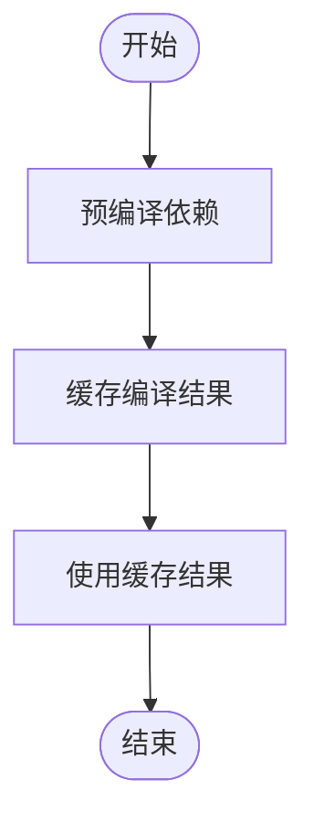

**Diagram sources**
- [optimizer/index.ts](file://packages/rolldown-require/src/optimizer/index.ts#L69-L143)

### 按需加载

按需加载是指在运行时动态加载模块，而不是在构建时将所有模块打包在一起。weapp-vite 支持通过 `import()` 语句实现按需加载，从而减少初始加载时间。

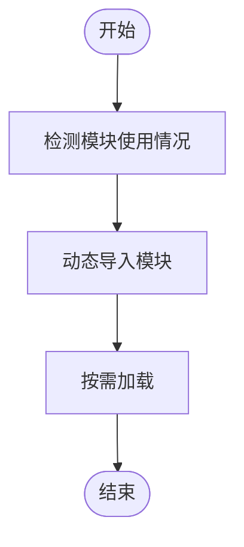

**Diagram sources**
- [loader.ts](file://packages/rolldown-require/src/loader.ts#L48-L69)

## 结论

weapp-vite 通过高效的依赖解析和模块处理机制，为微信小程序开发提供了强大的构建支持。本文档详细介绍了依赖解析机制、模块格式处理、依赖缓存机制、依赖树分析、常见依赖问题及解决方案、分包依赖管理和优化策略。通过理解和应用这些知识，开发者可以更好地管理和优化项目依赖，提高构建性能和应用加载速度。

**Section sources**
- [index.ts](file://packages/weapp-vite/src/index.ts#L1-L4)
- [bundleRequire.ts](file://packages/rolldown-require/src/index.ts#L11-L34)
- [optimizer/index.ts](file://packages/rolldown-require/src/optimizer/index.ts#L69-L143)
- [subpackages.ts](file://packages/weapp-vite/src/analyze/subpackages.ts#L52-L56)
- [chunkStrategy.ts](file://packages/weapp-vite/src/runtime/chunkStrategy.ts#L365-L392)