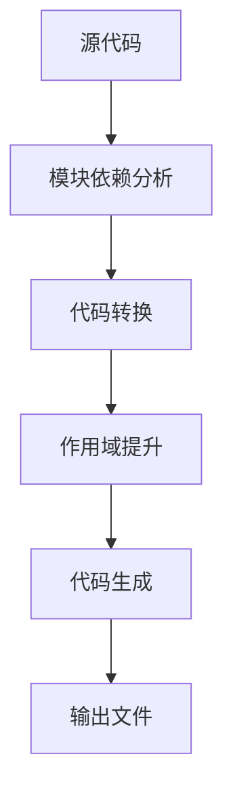
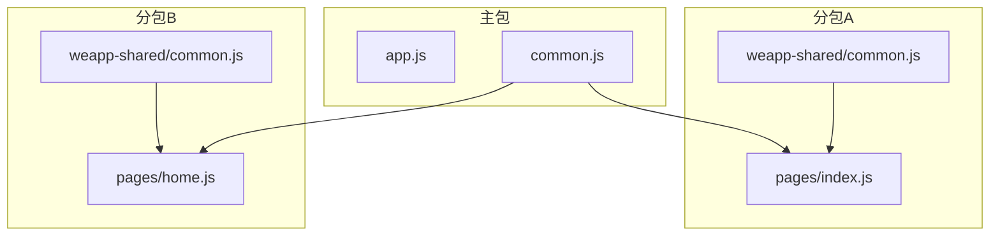
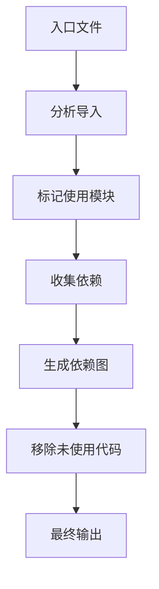
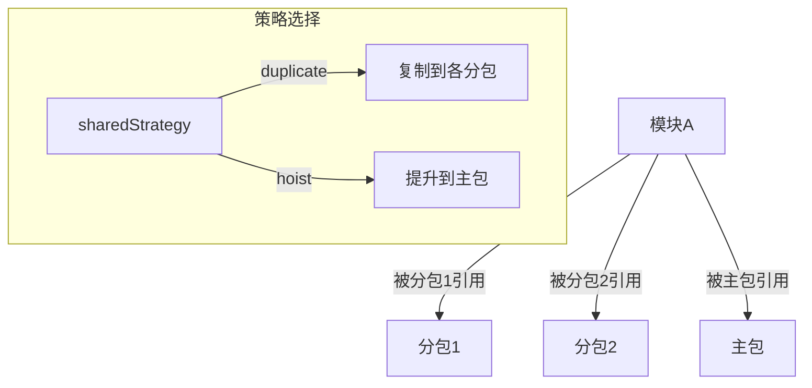
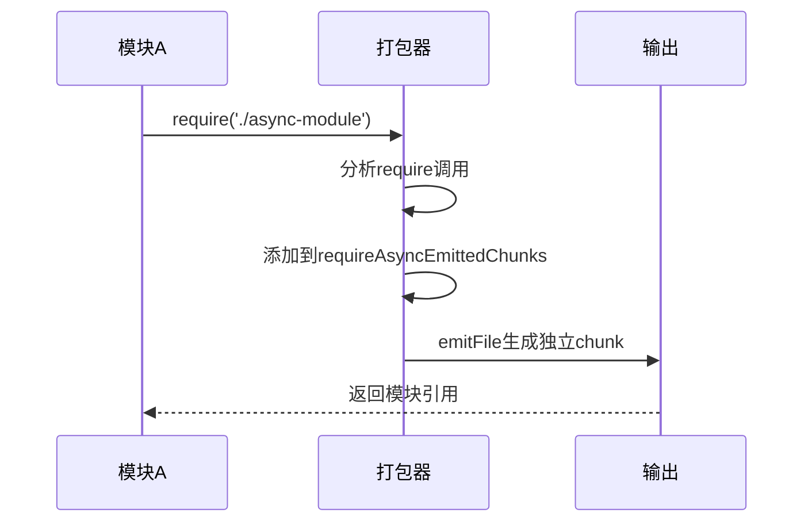
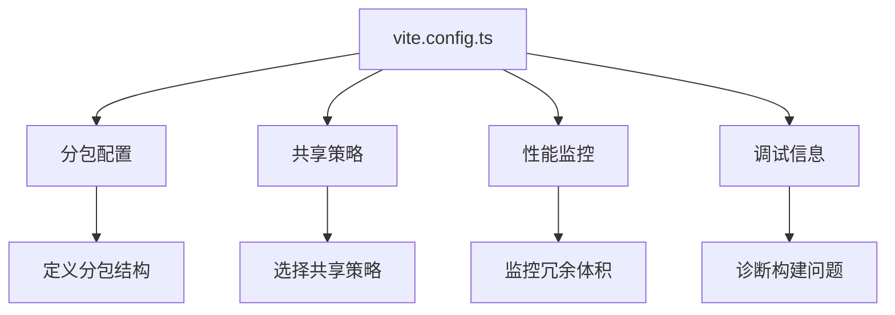
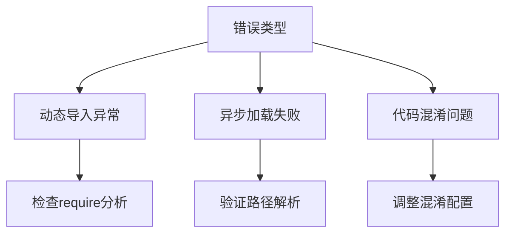
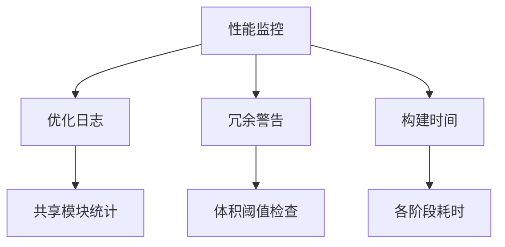

# 打包问题

<cite>
**本文档引用的文件**
- [chunkStrategy.ts](file://packages/weapp-vite/src/runtime/chunkStrategy.ts)
- [core.ts](file://packages/weapp-vite/src/plugins/core.ts)
- [vite.config.ts](file://apps/vite-native/vite.config.ts)
- [weapp-vite/src/index.ts](file://packages/weapp-vite/src/index.ts)
- [weapp-vite/src/createContext.ts](file://packages/weapp-vite/src/createContext.ts)
- [weapp-vite/src/types/external.ts](file://packages/weapp-vite/src/types/external.ts)
- [npmPlugin.ts](file://packages/weapp-vite/src/runtime/npmPlugin.ts)
- [viteConfig.ts](file://@weapp-core/init/src/viteConfig.ts)
</cite>

## 目录
1. [简介](#简介)
2. [打包器工作原理](#打包器工作原理)
3. [代码分割与chunk生成](#代码分割与chunk生成)
4. [tree-shaking机制](#tree-shaking机制)
5. [分包策略与公共模块提取](#分包策略与公共模块提取)
6. [动态导入与异步加载](#动态导入与异步加载)
7. [打包配置优化建议](#打包配置优化建议)
8. [常见打包错误解决方案](#常见打包错误解决方案)
9. [打包性能监控与分析](#打包性能监控与分析)
10. [总结](#总结)

## 简介

weapp-vite构建系统基于Vite和Rolldown构建工具，为微信小程序提供现代化的开发体验。本文档深入分析weapp-vite构建过程中常见的打包问题，包括代码分割失败、chunk生成错误、tree-shaking失效等核心问题。通过理解打包器的工作原理和配置优化，开发者可以有效解决分包策略不当、公共模块提取失败等问题，并掌握动态导入处理、异步加载和代码混淆等高级功能的解决方案。

**Section sources**
- [weapp-vite/src/index.ts](file://packages/weapp-vite/src/index.ts#L1-L4)
- [weapp-vite/src/createContext.ts](file://packages/weapp-vite/src/createContext.ts#L1-L28)

## 打包器工作原理

weapp-vite的打包器基于Vite的构建系统，采用Rolldown作为底层打包工具。打包过程主要包括模块依赖分析、代码转换、作用域提升和代码生成四个核心阶段。

在模块依赖分析阶段，打包器通过静态分析代码中的import和require语句，构建完整的依赖图。代码转换阶段则应用各种插件对源代码进行转换，如TypeScript编译、CSS预处理等。作用域提升阶段将模块中的变量和函数提升到更高作用域，减少闭包开销。最后，代码生成阶段将处理后的模块组合成最终的输出文件。

**Diagram sources**
- [core.ts](file://packages/weapp-vite/src/plugins/core.ts#L1-L776)

## 代码分割与chunk生成

weapp-vite的代码分割机制通过`chunkStrategy`模块实现，主要处理分包场景下的共享模块管理。系统提供了两种共享策略：'hoist'（提升）和'duplicate'（复制）。

在'hoist'策略下，被多个分包引用的公共模块会被提升到主包的common.js中。而在'duplicate'策略下，共享模块会被复制到各个分包的weapp-shared目录中。这种机制确保了分包的独立性，同时避免了主包体积过大。

**Diagram sources**
- [chunkStrategy.ts](file://packages/weapp-vite/src/runtime/chunkStrategy.ts#L1-L800)

## tree-shaking机制

weapp-vite的tree-shaking机制通过静态分析模块的导入导出关系，移除未使用的代码。系统通过`createRequireAnalysisPlugin`插件收集require调用，分析模块间的依赖关系。

在构建过程中，打包器会标记所有被引用的模块，未被标记的模块将被排除在最终输出之外。这种机制特别适用于第三方库的按需引入，可以显著减少最终包的体积。

**Diagram sources**
- [core.ts](file://packages/weapp-vite/src/plugins/core.ts#L486-L546)

## 分包策略与公共模块提取

weapp-vite的分包策略通过`applySharedChunkStrategy`函数实现，该函数负责处理分包场景下的共享模块。系统通过分析模块的引用关系，决定如何处理跨分包的共享代码。

当一个模块被多个分包引用时，系统会根据配置的`sharedStrategy`决定处理方式。如果策略为'duplicate'，共享模块会被复制到各个分包；如果为'hoist'，则会被提升到主包。这种机制确保了分包的独立性和代码复用的平衡。

**Diagram sources**
- [chunkStrategy.ts](file://packages/weapp-vite/src/runtime/chunkStrategy.ts#L475-L658)

## 动态导入与异步加载

weapp-vite通过`createRequireAnalysisPlugin`插件处理动态导入和异步加载。该插件在`moduleParsed`钩子中分析模块的require调用，确保异步加载的模块能够正确打包。

系统通过`requireAsyncEmittedChunks`集合跟踪异步加载的模块，使用`this.emitFile`方法将这些模块作为独立的chunk输出。这种机制确保了动态导入的模块能够被正确处理，避免了运行时找不到模块的错误。

**Diagram sources**
- [core.ts](file://packages/weapp-vite/src/plugins/core.ts#L486-L546)

## 打包配置优化建议

weapp-vite的打包配置可以通过`vite.config.ts`文件进行优化。以下是一些关键的配置建议：

1. **分包配置**：在`weapp.subPackages`中明确定义分包及其依赖，确保独立分包的正确构建。
2. **共享策略**：通过`weapp.chunks.sharedStrategy`配置共享模块的处理策略，根据项目需求选择'hoist'或'duplicate'。
3. **性能监控**：启用`weapp.chunks.logOptimization`和`weapp.chunks.duplicateWarningBytes`来监控打包优化效果和冗余体积。
4. **调试信息**：使用`weapp.debug.watchFiles`获取详细的文件监听信息，帮助诊断构建问题。

**Section sources**
- [vite.config.ts](file://apps/vite-native/vite.config.ts#L1-L138)

## 常见打包错误解决方案

### 动态导入处理异常

当动态导入的模块无法正确打包时，检查`requireAsyncEmittedChunks`集合是否正确跟踪了模块引用。确保`createRequireAnalysisPlugin`插件正常工作，并验证模块路径的正确性。

### 异步加载失败

异步加载失败通常源于模块路径解析错误。检查`resolveRelativeImport`函数的实现，确保相对路径的正确解析。同时验证`emitFile`方法是否正确生成了独立的chunk文件。

### 代码混淆问题

代码混淆可能导致变量名冲突或作用域问题。在`build.rolldownOptions`中配置适当的混淆选项，或暂时禁用混淆以定位问题。使用`preserveSignature`选项保护关键的导出签名。

**Section sources**
- [core.ts](file://packages/weapp-vite/src/plugins/core.ts#L486-L546)
- [chunkStrategy.ts](file://packages/weapp-vite/src/runtime/chunkStrategy.ts#L725-L733)

## 打包性能监控与分析

weapp-vite提供了多种性能监控工具。通过`weapp.chunks.logOptimization`配置，系统会输出详细的优化信息，包括共享模块的处理情况和冗余体积统计。

当`duplicateWarningBytes`配置的阈值被超过时，系统会发出警告，提示开发者检查分包划分是否合理。这些监控数据可以帮助开发者优化分包策略，减少不必要的代码复制。

**Section sources**
- [core.ts](file://packages/weapp-vite/src/plugins/core.ts#L313-L318)

## 总结

weapp-vite的打包系统通过精细的模块管理和优化策略，为微信小程序开发提供了强大的构建能力。理解代码分割、tree-shaking和分包策略的工作原理，可以帮助开发者有效解决常见的打包问题。通过合理的配置优化和性能监控，可以构建出高效、可维护的小程序应用。