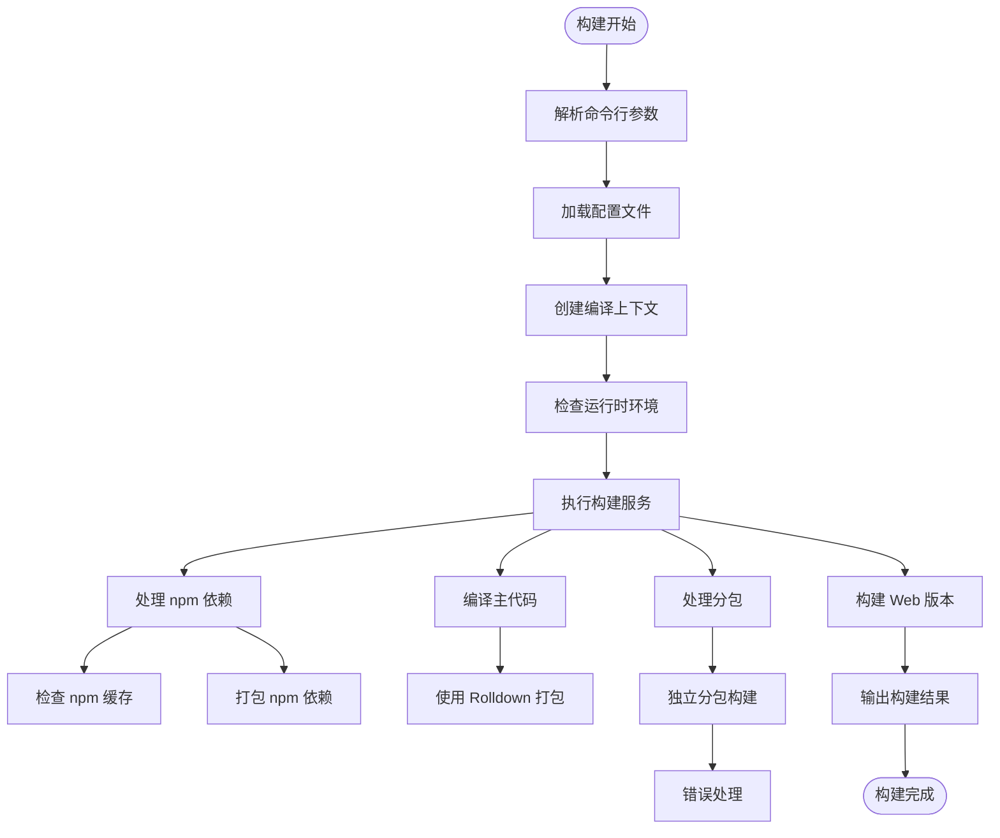
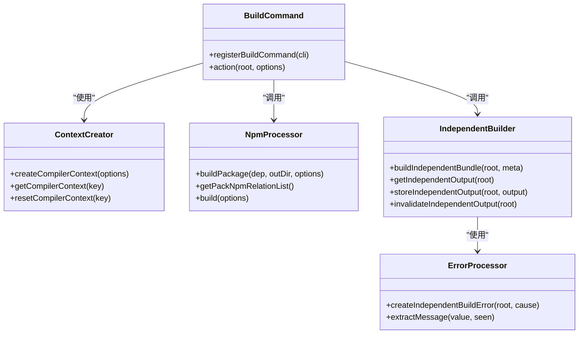
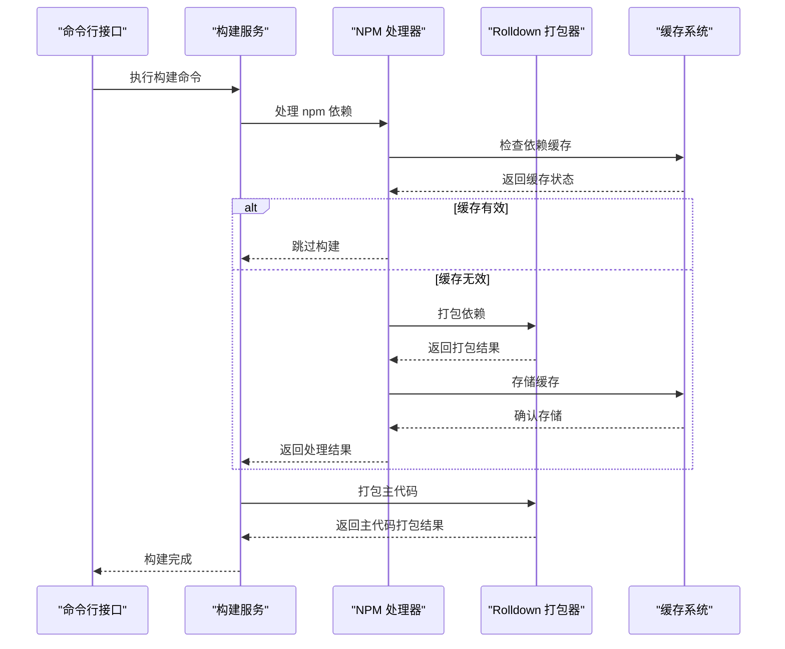
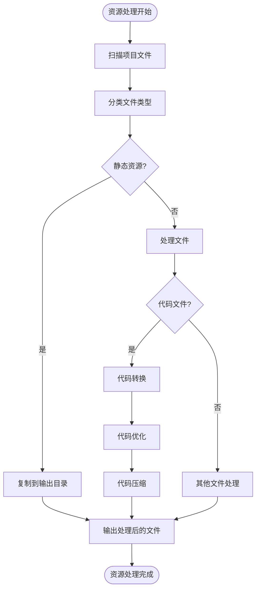
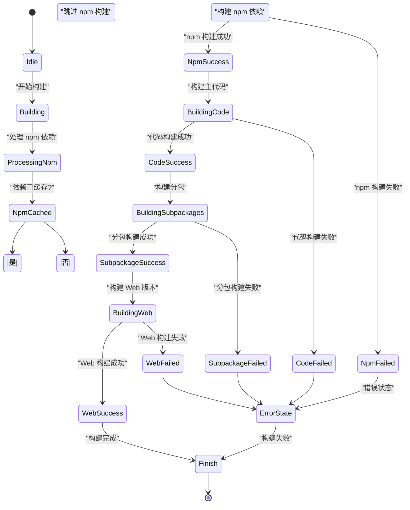
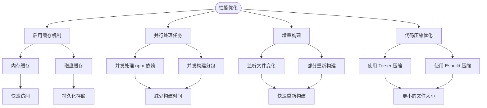
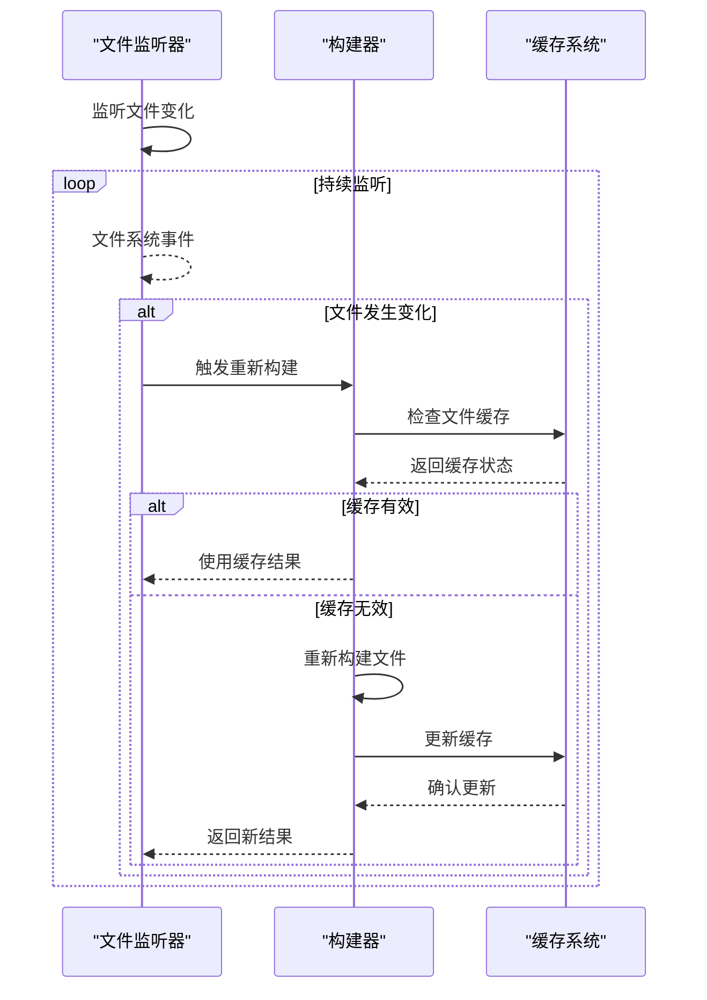

# 构建问题

<cite>
**本文档引用的文件**
- [build.ts](file://packages/weapp-vite/src/cli/commands/build.ts)
- [createContext.ts](file://packages/weapp-vite/src/createContext.ts)
- [index.ts](file://packages/rolldown-require/src/index.ts)
- [npmPlugin.ts](file://packages/weapp-vite/src/runtime/npmPlugin.ts)
- [buildPlugin.ts](file://packages/weapp-vite/src/runtime/buildPlugin.ts)
- [cache.ts](file://packages/rolldown-require/src/cache.ts)
- [independentError.ts](file://packages/weapp-vite/src/runtime/independentError.ts)
- [cli.ts](file://packages/weapp-vite/src/cli.ts)
- [getInstance.ts](file://packages/weapp-vite/src/context/getInstance.ts)
</cite>

## 目录
1. [简介](#简介)
2. [构建流程分析](#构建流程分析)
3. [核心构建组件](#核心构建组件)
4. [依赖解析与模块打包](#依赖解析与模块打包)
5. [资源文件处理](#资源文件处理)
6. [构建日志解读](#构建日志解读)
7. [常见构建错误及解决方案](#常见构建错误及解决方案)
8. [构建性能优化](#构建性能优化)
9. [增量构建机制](#增量构建机制)
10. [结论](#结论)

## 简介
weapp-vite 是一个用于微信小程序开发的构建工具，它基于 Vite 和 Rolldown 构建，提供了快速的开发服务器和高效的生产构建能力。本文档深入分析了 weapp-vite 构建过程中可能出现的各种问题，包括依赖解析错误、模块打包异常、资源文件处理失败等。我们将详细解释构建流程的各个阶段，提供构建日志的解读指南，并给出常见构建错误的解决方案。

## 构建流程分析

weapp-vite 的构建流程是一个复杂的多阶段过程，涉及多个服务和组件的协同工作。构建流程从命令行接口开始，经过配置加载、上下文创建、依赖处理、代码转换到最终的文件输出。



**Diagram sources**
- [build.ts](file://packages/weapp-vite/src/cli/commands/build.ts#L36-L80)
- [cli.ts](file://packages/weapp-vite/src/cli.ts#L27-L49)

**Section sources**
- [build.ts](file://packages/weapp-vite/src/cli/commands/build.ts#L1-L81)
- [cli.ts](file://packages/weapp-vite/src/cli.ts#L1-L50)

## 核心构建组件

weapp-vite 的构建系统由多个核心组件组成，这些组件协同工作以完成构建任务。主要组件包括构建命令注册器、编译上下文创建器、npm 依赖处理器和独立分包构建器。



**Diagram sources**
- [build.ts](file://packages/weapp-vite/src/cli/commands/build.ts#L13-L80)
- [createContext.ts](file://packages/weapp-vite/src/createContext.ts#L4-L27)
- [npmPlugin.ts](file://packages/weapp-vite/src/runtime/npmPlugin.ts#L165-L261)
- [buildPlugin.ts](file://packages/weapp-vite/src/runtime/buildPlugin.ts#L59-L105)
- [independentError.ts](file://packages/weapp-vite/src/runtime/independentError.ts#L55-L111)

**Section sources**
- [build.ts](file://packages/weapp-vite/src/cli/commands/build.ts#L1-L81)
- [createContext.ts](file://packages/weapp-vite/src/createContext.ts#L1-L28)
- [npmPlugin.ts](file://packages/weapp-vite/src/runtime/npmPlugin.ts#L165-L261)
- [buildPlugin.ts](file://packages/weapp-vite/src/runtime/buildPlugin.ts#L31-L61)
- [independentError.ts](file://packages/weapp-vite/src/runtime/independentError.ts#L55-L111)

## 依赖解析与模块打包

依赖解析和模块打包是构建过程中的关键环节。weapp-vite 使用 rolldown-require 包来处理依赖解析和模块打包，该包提供了缓存机制和高效的打包能力。



**Diagram sources**
- [npmPlugin.ts](file://packages/weapp-vite/src/runtime/npmPlugin.ts#L165-L261)
- [index.ts](file://packages/rolldown-require/src/index.ts#L11-L34)
- [cache.ts](file://packages/rolldown-require/src/cache.ts#L55-L285)

**Section sources**
- [npmPlugin.ts](file://packages/weapp-vite/src/runtime/npmPlugin.ts#L165-L261)
- [index.ts](file://packages/rolldown-require/src/index.ts#L1-L34)
- [cache.ts](file://packages/rolldown-require/src/cache.ts#L55-L285)

## 资源文件处理

资源文件处理是构建过程中的重要环节，涉及静态资源的复制、转换和优化。weapp-vite 通过配置服务和扫描服务来管理资源文件的处理流程。



**Diagram sources**
- [createContext.ts](file://packages/weapp-vite/src/createContext.ts#L4-L27)
- [buildPlugin.ts](file://packages/weapp-vite/src/runtime/buildPlugin.ts#L31-L61)

**Section sources**
- [createContext.ts](file://packages/weapp-vite/src/createContext.ts#L1-L28)
- [buildPlugin.ts](file://packages/weapp-vite/src/runtime/buildPlugin.ts#L31-L61)

## 构建日志解读

构建日志是诊断构建问题的重要工具。weapp-vite 提供了详细的日志输出，帮助开发者理解构建过程中的每个步骤和可能的错误。



**Diagram sources**
- [build.ts](file://packages/weapp-vite/src/cli/commands/build.ts#L36-L80)
- [npmPlugin.ts](file://packages/weapp-vite/src/runtime/npmPlugin.ts#L165-L261)

**Section sources**
- [build.ts](file://packages/weapp-vite/src/cli/commands/build.ts#L1-L81)
- [npmPlugin.ts](file://packages/weapp-vite/src/runtime/npmPlugin.ts#L165-L261)

## 常见构建错误及解决方案

在使用 weapp-vite 进行构建时，开发者可能会遇到各种错误。本节将介绍一些常见的构建错误及其解决方案。

### 依赖解析错误

依赖解析错误通常发生在 npm 依赖处理阶段。当依赖包的版本不兼容或缺少必要的类型定义时，可能会出现此类错误。

**错误示例：**
```
[npm] 无法解析模块 `some-package`，跳过处理!
```

**解决方案：**
1. 检查 package.json 中的依赖版本是否正确
2. 确保所有依赖都已正确安装
3. 检查是否有类型定义缺失，必要时安装 @types 包

### 模块打包异常

模块打包异常可能由代码中的语法错误或不兼容的模块格式引起。

**错误示例：**
```
独立分包 some-subpackage 构建失败: Cannot find module 'some-module'
```

**解决方案：**
1. 检查模块路径是否正确
2. 确认模块是否已正确导出
3. 检查构建配置中的模块解析设置

### 资源路径错误

资源路径错误通常发生在静态资源引用时，路径不正确或资源不存在。

**错误示例：**
```
File not found: /static/images/logo.png
```

**解决方案：**
1. 检查资源文件是否存在于指定路径
2. 确认路径是否使用了正确的相对或绝对路径
3. 检查构建配置中的静态资源目录设置

**Section sources**
- [npmPlugin.ts](file://packages/weapp-vite/src/runtime/npmPlugin.ts#L165-L261)
- [buildPlugin.ts](file://packages/weapp-vite/src/runtime/buildPlugin.ts#L59-L105)
- [independentError.ts](file://packages/weapp-vite/src/runtime/independentError.ts#L55-L111)

## 构建性能优化

构建性能优化是提高开发效率的关键。weapp-vite 提供了多种机制来优化构建性能，包括缓存、并行处理和增量构建。



**Diagram sources**
- [cache.ts](file://packages/rolldown-require/src/cache.ts#L55-L285)
- [buildPlugin.ts](file://packages/weapp-vite/src/runtime/buildPlugin.ts#L31-L61)

**Section sources**
- [cache.ts](file://packages/rolldown-require/src/cache.ts#L55-L285)
- [buildPlugin.ts](file://packages/weapp-vite/src/runtime/buildPlugin.ts#L31-L61)

## 增量构建机制

增量构建机制是 weapp-vite 提高构建效率的核心特性之一。通过只重新构建发生变化的文件，大大减少了构建时间。



**Diagram sources**
- [buildPlugin.ts](file://packages/weapp-vite/src/runtime/buildPlugin.ts#L31-L61)
- [cache.ts](file://packages/rolldown-require/src/cache.ts#L55-L285)

**Section sources**
- [buildPlugin.ts](file://packages/weapp-vite/src/runtime/buildPlugin.ts#L31-L61)
- [cache.ts](file://packages/rolldown-require/src/cache.ts#L55-L285)

## 结论

weapp-vite 的构建系统是一个复杂而强大的工具，它通过多个组件的协同工作来实现高效的构建流程。理解构建过程的各个阶段、常见错误及其解决方案，以及性能优化技巧，对于有效使用 weapp-vite 至关重要。通过合理配置和使用增量构建机制，开发者可以显著提高开发效率，减少构建时间，从而更快地迭代和发布小程序应用。