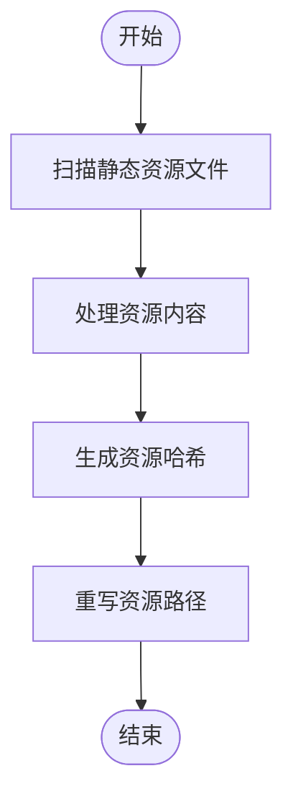

# 资源处理问题

<cite>
**本文档引用的文件**   
- [asset.ts](file://packages/weapp-vite/src/plugins/asset.ts)
- [css.ts](file://packages/weapp-vite/src/plugins/css.ts)
- [wxs.ts](file://packages/weapp-vite/src/plugins/wxs.ts)
- [handle.ts](file://packages/weapp-vite/src/wxml/handle.ts)
- [defaults.ts](file://packages/weapp-vite/src/defaults.ts)
- [image-optimize.md](file://website/guide/image-optimize.md)
- [troubleshoot/index.md](file://website/troubleshoot/index.md)
- [preprocessor.ts](file://packages/weapp-vite/src/plugins/css/shared/preprocessor.ts)
</cite>

## 目录

1. [引言](#引言)
2. [资源处理流程](#资源处理流程)
3. [图片资源加载失败问题](#图片资源加载失败问题)
4. [样式文件编译异常](#样式文件编译异常)
5. [wxs文件处理错误](#wxs文件处理错误)
6. [资源优化配置建议](#资源优化配置建议)
7. [常见资源错误解决方案](#常见资源错误解决方案)
8. [资源预加载与懒加载配置](#资源预加载与懒加载配置)
9. [结论](#结论)

## 引言

weapp-vite 是一个专为微信小程序设计的构建工具，它基于 Vite 构建，提供了现代化的开发体验。在构建过程中，静态资源的处理是关键环节之一，涉及图片、样式、wxs 脚本等多种资源类型。本文档旨在深入分析 weapp-vite 在构建过程中可能出现的静态资源处理失败问题，重点解决图片资源加载失败、样式文件编译异常、wxs 文件处理错误等问题。通过详细解释资源处理流程，包括资源定位、内容转换、哈希生成和路径重写，提供资源优化配置建议，帮助开发者解决资源路径错误、资源重复打包、资源压缩失败等问题。同时，本文档将介绍资源预加载和懒加载的配置方法，以提升小程序的性能和用户体验。

**Section sources**
- [image-optimize.md](file://website/guide/image-optimize.md#L1-L64)
- [troubleshoot/index.md](file://website/troubleshoot/index.md#L1-L50)

## 资源处理流程

weapp-vite 的资源处理流程主要包括资源定位、内容转换、哈希生成和路径重写四个步骤。首先，资源定位是通过 `scanAssetFiles` 函数实现的，该函数会扫描项目中的所有静态资源文件，并将其添加到待处理列表中。接着，内容转换是通过 `processCssWithCache` 和 `transformWxsCode` 等函数完成的，这些函数会对资源内容进行预处理，如 CSS 的预编译和 wxs 脚本的转换。然后，哈希生成是通过 `createHash` 函数实现的，该函数会为每个资源生成一个唯一的哈希值，用于缓存和版本控制。最后，路径重写是通过 `configService.relativeOutputPath` 函数完成的，该函数会将资源的路径转换为相对于输出目录的路径，确保资源在小程序中正确引用。

**Diagram sources **
- [asset.ts](file://packages/weapp-vite/src/plugins/asset.ts#L26-L88)
- [css.ts](file://packages/weapp-vite/src/plugins/css/shared/preprocessor.ts#L21-L36)
- [wxs.ts](file://packages/weapp-vite/src/plugins/wxs.ts#L48-L79)
- [defaults.ts](file://packages/weapp-vite/src/defaults.ts#L68-L87)

## 图片资源加载失败问题

图片资源加载失败是 weapp-vite 构建过程中常见的问题之一。主要原因包括资源路径错误、资源未正确打包、资源压缩失败等。为了解决这些问题，开发者需要确保图片资源的路径正确无误，避免手动编写相对路径字符串，改用 `import` 或 `new URL` 让构建器接管路径计算。此外，还需要检查资源是否被正确打包，确保资源文件位于 `public/` 根目录而非 `src/public/`。对于资源压缩失败的问题，可以使用 Vite 插件在打包阶段压缩图片，如 `vite-plugin-image-optimizer`，该插件支持无损/有损压缩，并可结合 `sharp`、`svgo` 等工具进行优化。

**Section sources**
- [image-optimize.md](file://website/guide/image-optimize.md#L59-L64)
- [troubleshoot/index.md](file://website/troubleshoot/index.md#L61-L63)

## 样式文件编译异常

样式文件编译异常通常表现为样式文件无法正确编译或编译后的样式文件内容不正确。这可能是由于样式文件的语法错误、预处理器配置不当或依赖项缺失等原因引起的。为了解决这些问题，开发者需要确保样式文件的语法正确，遵循 Vite 和 weapp-vite 的约定。同时，需要正确配置预处理器，如 `postcss`，确保其能够正确处理样式文件。此外，还需要检查样式文件的依赖项是否完整，确保所有依赖项都已正确安装和引用。

**Section sources**
- [css.ts](file://packages/weapp-vite/src/plugins/css.ts#L1-L251)
- [preprocessor.ts](file://packages/weapp-vite/src/plugins/css/shared/preprocessor.ts#L1-L162)

## wxs文件处理错误

wxs 文件处理错误通常表现为 wxs 脚本无法正确执行或执行结果不符合预期。这可能是由于 wxs 脚本的语法错误、依赖项缺失或路径错误等原因引起的。为了解决这些问题，开发者需要确保 wxs 脚本的语法正确，遵循微信小程序的规范。同时，需要正确处理 wxs 脚本的依赖项，确保所有依赖项都已正确导入和引用。此外，还需要检查 wxs 脚本的路径是否正确，确保路径与实际文件位置一致。

**Section sources**
- [wxs.ts](file://packages/weapp-vite/src/plugins/wxs.ts#L48-L141)
- [handle.ts](file://packages/weapp-vite/src/wxml/handle.ts#L83-L139)

## 资源优化配置建议

为了优化资源处理，weapp-vite 提供了多种配置选项。首先，可以通过 `weappViteConfig` 配置对象中的 `copy` 属性来指定需要复制的资源文件，避免不必要的资源打包。其次，可以通过 `outputExtensions` 配置对象来指定不同平台的输出文件扩展名，确保资源文件在不同平台上的兼容性。此外，还可以通过 `jsFormat` 配置选项来指定 JavaScript 的输出格式，如 `cjs` 或 `esm`，以适应不同的运行环境。最后，建议使用 Vite 插件来进一步优化资源处理，如 `vite-plugin-image-optimizer` 用于图片压缩，`vite-plugin-pwa` 用于 PWA 支持等。

**Section sources**
- [defaults.ts](file://packages/weapp-vite/src/defaults.ts#L40-L66)
- [css.ts](file://packages/weapp-vite/src/plugins/css.ts#L235-L251)

## 常见资源错误解决方案

针对常见的资源错误，weapp-vite 提供了多种解决方案。对于资源路径错误，建议使用 `import` 或 `new URL` 来引用资源，避免手动编写相对路径字符串。对于资源重复打包，可以通过配置 `copy` 属性来排除不需要打包的资源文件。对于资源压缩失败，可以使用 Vite 插件在打包阶段进行压缩，如 `vite-plugin-image-optimizer`。此外，还可以通过配置 `publicDir` 来调整 `public` 目录的位置，或完全禁用该行为。对于 `custom-tab-bar` 不生效的问题，需要确保 `custom-tab-bar/` 文件夹与 `app.json` 位于同级目录，并且 `app.json.tabBar.custom` 设置为 `true`。

**Section sources**
- [image-optimize.md](file://website/guide/image-optimize.md#L59-L64)
- [troubleshoot/index.md](file://website/troubleshoot/index.md#L31-L37)

## 资源预加载与懒加载配置

资源预加载和懒加载是提升小程序性能的重要手段。weapp-vite 支持通过配置 `preload` 和 `lazy` 属性来实现资源的预加载和懒加载。预加载可以通过在 `app.json` 中配置 `preloadRule` 来实现，指定需要预加载的页面或组件。懒加载则可以通过在页面或组件的 `json` 文件中配置 `lazy` 属性来实现，指定需要懒加载的资源。此外，还可以通过 `import()` 动态导入来实现按需加载，减少初始加载时间。

**Section sources**
- [troubleshoot/index.md](file://website/troubleshoot/index.md#L1-L50)

## 结论

weapp-vite 为微信小程序的开发提供了强大的构建能力，但在资源处理方面仍存在一些挑战。通过深入理解资源处理流程，包括资源定位、内容转换、哈希生成和路径重写，开发者可以更好地解决图片资源加载失败、样式文件编译异常、wxs 文件处理错误等问题。同时，通过合理的资源优化配置，如使用 Vite 插件进行图片压缩、正确配置 `copy` 属性等，可以显著提升小程序的性能和用户体验。希望本文档能为开发者提供有价值的参考，帮助他们更高效地使用 weapp-vite 进行小程序开发。