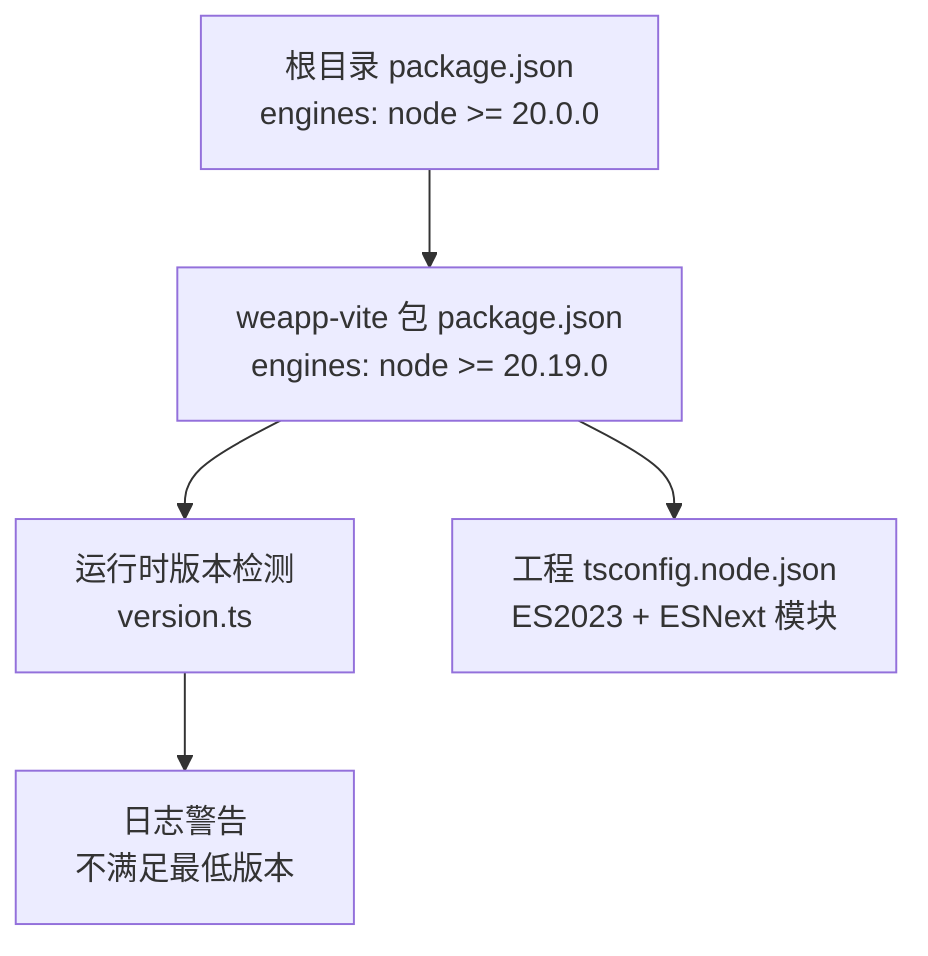
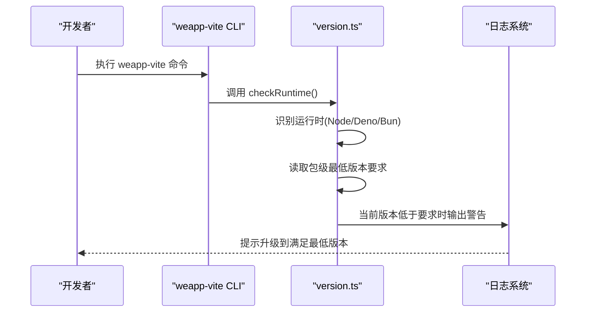
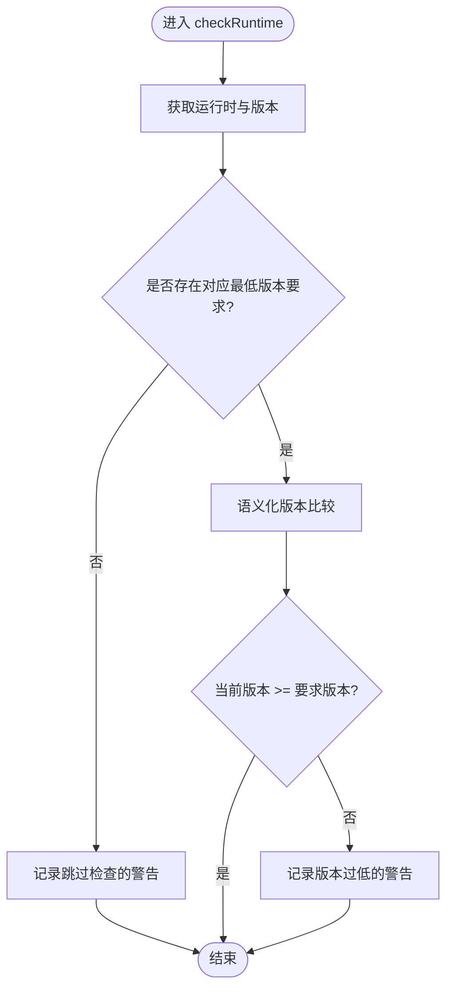
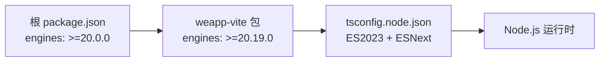

# Node.js版本兼容性

<cite>
**本文引用的文件**
- [package.json](file://package.json)
- [packages/weapp-vite/package.json](file://packages/weapp-vite/package.json)
- [packages/weapp-vite/src/utils/version.ts](file://packages/weapp-vite/src/utils/version.ts)
- [packages/weapp-vite/src/utils/version.test.ts](file://packages/weapp-vite/src/utils/version.test.ts)
- [website/troubleshoot/index.md](file://website/troubleshoot/index.md)
- [apps/tdesign-miniprogram-starter-retail/tsconfig.node.json](file://apps/tdesign-miniprogram-starter-retail/tsconfig.node.json)
- [templates/weapp-vite-tailwindcss-tdesign-template/tsconfig.node.json](file://templates/weapp-vite-tailwindcss-tdesign-template/tsconfig.node.json)
- [apps/vite-native/tsconfig.node.json](file://apps/vite-native/tsconfig.node.json)
</cite>

## 目录
1. [引言](#引言)
2. [项目结构](#项目结构)
3. [核心组件](#核心组件)
4. [架构总览](#架构总览)
5. [详细组件分析](#详细组件分析)
6. [依赖分析](#依赖分析)
7. [性能考量](#性能考量)
8. [故障排查指南](#故障排查指南)
9. [结论](#结论)
10. [附录](#附录)

## 引言
本篇文档聚焦于 weapp-vite 对 Node.js 版本的兼容性要求与实践建议，覆盖最低版本要求、ES 模块支持、API 变更与性能差异，并提供版本检测机制、升级指南与常见错误的排查方法。目标是帮助开发者在不同 Node.js 版本下稳定运行 weapp-vite，避免因版本不匹配导致的模块加载失败、语法错误与性能退化等问题。

## 项目结构
- 顶层通过 engines 字段声明 Node.js 最低版本要求，用于统一约束 monorepo 内部与 CI 环境。
- weapp-vite 包自身在 package.json 中声明了更高的最低 Node.js 版本，体现其对较新运行时能力的依赖。
- 工程侧 tsconfig.node.json 多处采用 ES2023 目标与 ESNext 模块策略，强调现代运行时与打包器的协同。

图表来源
- [package.json](file://package.json#L14-L17)
- [packages/weapp-vite/package.json](file://packages/weapp-vite/package.json#L82-L84)
- [packages/weapp-vite/src/utils/version.ts](file://packages/weapp-vite/src/utils/version.ts#L1-L64)
- [apps/tdesign-miniprogram-starter-retail/tsconfig.node.json](file://apps/tdesign-miniprogram-starter-retail/tsconfig.node.json#L1-L33)

章节来源
- [package.json](file://package.json#L14-L17)
- [packages/weapp-vite/package.json](file://packages/weapp-vite/package.json#L82-L84)

## 核心组件
- 版本检测与告警：在运行时识别 Node/Deno/Bun，并根据各运行时的最低版本要求输出警告，便于开发者及时升级。
- 构建与运行时目标：工程侧 tsconfig.node.json 明确使用 ES2023 与 ESNext 模块解析策略，与较新的 Node.js 版本配合更佳。

章节来源
- [packages/weapp-vite/src/utils/version.ts](file://packages/weapp-vite/src/utils/version.ts#L1-L64)
- [apps/tdesign-miniprogram-starter-retail/tsconfig.node.json](file://apps/tdesign-miniprogram-starter-retail/tsconfig.node.json#L1-L33)

## 架构总览
weapp-vite 的 Node.js 兼容性由三层协同保障：
- 顶层约束：monorepo engines 要求 Node >= 20.0.0，确保 CI 与本地开发环境一致。
- 包级约束：weapp-vite 包自身要求 Node >= 20.19.0，反映其对较新运行时 API 与打包器能力的依赖。
- 运行时检测：启动时检测当前运行时与版本，若低于包级要求则发出警告，指导升级。

图表来源
- [packages/weapp-vite/src/utils/version.ts](file://packages/weapp-vite/src/utils/version.ts#L1-L64)
- [packages/weapp-vite/src/utils/version.test.ts](file://packages/weapp-vite/src/utils/version.test.ts#L1-L94)

## 详细组件分析

### 版本检测与告警机制
- 运行时识别：优先检测 Node.js（process.versions.node），其次支持 Deno 与 Bun。
- 版本比较：使用语义化版本比较函数，当当前版本低于包级要求时，记录警告日志。
- 测试覆盖：单元测试覆盖了无要求、低于要求、满足要求与 Deno/Bun 的检测场景。

图表来源
- [packages/weapp-vite/src/utils/version.ts](file://packages/weapp-vite/src/utils/version.ts#L1-L64)
- [packages/weapp-vite/src/utils/version.test.ts](file://packages/weapp-vite/src/utils/version.test.ts#L1-L94)

章节来源
- [packages/weapp-vite/src/utils/version.ts](file://packages/weapp-vite/src/utils/version.ts#L1-L64)
- [packages/weapp-vite/src/utils/version.test.ts](file://packages/weapp-vite/src/utils/version.test.ts#L1-L94)

### ES 模块与模块解析策略
- 工程侧 tsconfig.node.json 使用 ES2023 目标与 ESNext 模块解析策略，结合 type: module 的包导出配置，确保 ESM 与打包器的协同。
- 该策略在较新的 Node.js 版本上表现更稳定，旧版本可能在模块解析、动态导入与打包器行为上出现差异。

章节来源
- [apps/tdesign-miniprogram-starter-retail/tsconfig.node.json](file://apps/tdesign-miniprogram-starter-retail/tsconfig.node.json#L1-L33)
- [templates/weapp-vite-tailwindcss-tdesign-template/tsconfig.node.json](file://templates/weapp-vite-tailwindcss-tdesign-template/tsconfig.node.json#L1-L33)
- [apps/vite-native/tsconfig.node.json](file://apps/vite-native/tsconfig.node.json#L1-L33)

### API 变更与性能差异
- 较新 Node.js 版本通常带来更好的 ESM 支持、更快的打包器性能与更稳定的模块解析行为，有助于减少构建与运行时的不确定性。
- 旧版本 Node.js 可能出现动态导入、正则表达式处理、模块解析边界条件等差异，导致构建失败或运行时行为异常。

[本小节为通用指导，无需特定文件引用]

## 依赖分析
- 顶层 monorepo 要求 Node >= 20.0.0，保证 CI 与本地环境一致性。
- weapp-vite 包要求 Node >= 20.19.0，反映其对较新运行时 API 的依赖。
- 工程侧 tsconfig.node.json 采用 ES2023 与 ESNext 模块解析策略，与较新 Node.js 版本协同更佳。

图表来源
- [package.json](file://package.json#L14-L17)
- [packages/weapp-vite/package.json](file://packages/weapp-vite/package.json#L82-L84)
- [apps/tdesign-miniprogram-starter-retail/tsconfig.node.json](file://apps/tdesign-miniprogram-starter-retail/tsconfig.node.json#L1-L33)

章节来源
- [package.json](file://package.json#L14-L17)
- [packages/weapp-vite/package.json](file://packages/weapp-vite/package.json#L82-L84)

## 性能考量
- 使用较新的 Node.js 版本可获得更优的打包器性能与更稳定的模块解析行为，减少构建与运行时的不确定性。
- 在 Node 20.19+ 上，ES2023 与 ESNext 模块解析策略与打包器的协同更顺畅，有助于提升增量构建与热更新的稳定性。

[本小节为通用指导，无需特定文件引用]

## 故障排查指南
- 模块加载失败（CJS/ESM 混用）
  - 症状：引入 UMD/CJS 模块时报错，ESM 分析失败。
  - 解决：将文件重命名为 .cjs 或在源码中显式 require()，提示 bundler 按 CommonJS 处理。
  - 参考：[常见问题排查](file://website/troubleshoot/index.md#L25-L30)
- 语法错误（与 Node.js 版本相关）
  - 症状：在旧版 Node.js 上使用较新的语言特性导致语法错误。
  - 解决：升级 Node.js 至满足包级最低版本要求（>= 20.19.0），并确保 tsconfig.node.json 的目标与模块策略与运行时匹配。
  - 参考：[版本检测与告警机制](file://packages/weapp-vite/src/utils/version.ts#L1-L64)
- 构建产物异常（仅 WXML）
  - 症状：dist 中仅有 .wxml，缺失 .js/.wxss/.json。
  - 解决：检查页面是否在 app.json.pages 注册，组件是否具备同名 .json 且 json.component = true；参考依赖扫描流程。
  - 参考：[常见问题排查](file://website/troubleshoot/index.md#L1-L16)
- 开发者工具缓存问题
  - 症状：目录结构正确仍报 require() 错误。
  - 解决：在开发者工具中临时开启“将 JS 编译成 ES5”触发重新编译，再关闭该选项并重启工具；必要时删除 miniprogram_npm、dist 后重新构建。
  - 参考：[常见问题排查](file://website/troubleshoot/index.md#L17-L24)

章节来源
- [website/troubleshoot/index.md](file://website/troubleshoot/index.md#L1-L50)
- [packages/weapp-vite/src/utils/version.ts](file://packages/weapp-vite/src/utils/version.ts#L1-L64)

## 结论
- 顶层 monorepo 要求 Node >= 20.0.0，weapp-vite 包自身要求 Node >= 20.19.0。
- 工程侧 tsconfig.node.json 采用 ES2023 与 ESNext 模块解析策略，建议在 Node 20.19+ 上使用以获得最佳兼容性与性能。
- 建议在 CI 与本地均使用满足最低版本要求的 Node.js，并在运行时关注版本检测的告警提示，及时升级。

[本小节为总结，无需特定文件引用]

## 附录

### 版本检测与升级指南
- 检测当前 Node.js 版本：在执行 weapp-vite 命令时，系统会自动检测运行时与版本，并在低于包级最低版本时输出警告。
- 升级建议：
  - 优先升级至 Node 20.19+，以满足 weapp-vite 包的最低版本要求。
  - 确保 tsconfig.node.json 的 target 与 module 与运行时匹配（ES2023 + ESNext）。
  - 在 CI 中固定 Node 版本，避免因版本漂移导致构建失败。

章节来源
- [packages/weapp-vite/src/utils/version.ts](file://packages/weapp-vite/src/utils/version.ts#L1-L64)
- [packages/weapp-vite/src/utils/version.test.ts](file://packages/weapp-vite/src/utils/version.test.ts#L1-L94)
- [apps/tdesign-miniprogram-starter-retail/tsconfig.node.json](file://apps/tdesign-miniprogram-starter-retail/tsconfig.node.json#L1-L33)