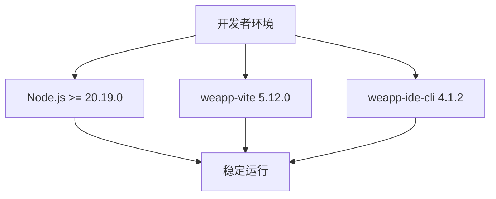
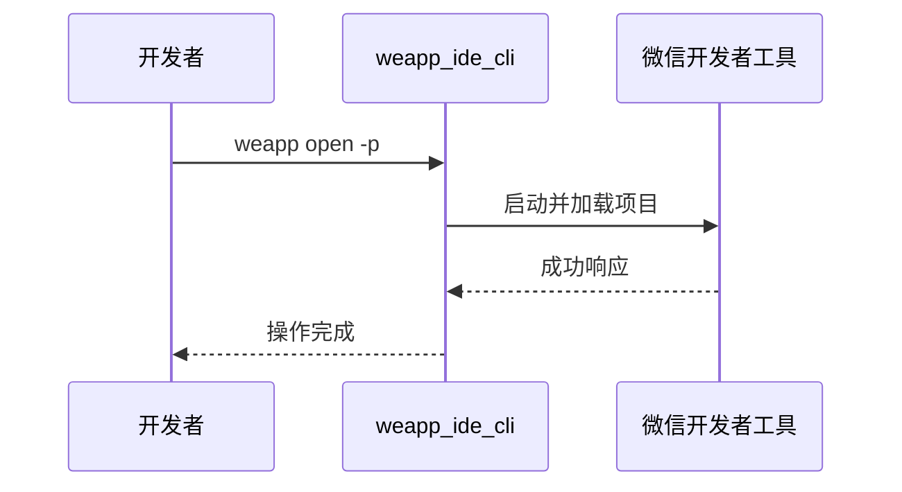
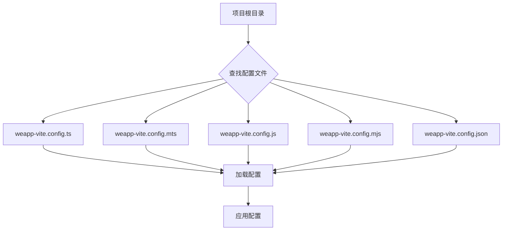

# 工具版本匹配

<cite>
**本文档引用的文件**  
- [package.json](file://package.json)
- [packages/weapp-vite/package.json](file://packages/weapp-vite/package.json)
- [packages/weapp-ide-cli/package.json](file://packages/weapp-ide-cli/package.json)
- [packages/weapp-vite/src/utils/version.ts](file://packages/weapp-vite/src/utils/version.ts)
- [packages/weapp-vite/src/utils/weappConfig.ts](file://packages/weapp-vite/src/utils/weappConfig.ts)
- [packages/weapp-ide-cli/src/runtime/platform.ts](file://packages/weapp-ide-cli/src/runtime/platform.ts)
- [docs/wevu/compatibility.md](file://docs/wevu/compatibility.md)
- [website/blog/release4.md](file://website/blog/release4.md)
</cite>

## 目录
1. [简介](#简介)
2. [核心工具版本要求](#核心工具版本要求)
3. [版本不匹配可能导致的问题](#版本不匹配可能导致的问题)
4. [版本检查方法](#版本检查方法)
5. [更新策略](#更新策略)
6. [推荐的工具版本组合](#推荐的工具版本组合)
7. [微信开发者工具CLI支持](#微信开发者工具cli支持)
8. [小程序运行环境兼容性](#小程序运行环境兼容性)
9. [配置文件版本管理](#配置文件版本管理)
10. [总结](#总结)

## 简介

本文档旨在指导开发者正确匹配微信开发者工具及相关开发工具链的版本，确保开发环境的稳定性和功能的完整性。通过分析weapp-vite项目中的版本管理机制，本文将解释版本不匹配可能导致的问题，提供版本检查方法和更新策略，并给出推荐的工具版本组合。

**Section sources**
- [package.json](file://package.json)
- [website/blog/release4.md](file://website/blog/release4.md)

## 核心工具版本要求

weapp-vite项目对核心开发工具的版本有明确要求，这些要求确保了开发工具链的稳定运行和功能完整性。

### Node.js版本要求

weapp-vite对Node.js版本有严格的最低要求。根据项目配置，Node.js版本必须满足以下条件：

- **weapp-vite-monorepo**: Node.js >= 20.0.0
- **weapp-vite**: Node.js >= 20.19.0

这些要求在项目的`package.json`文件中通过`engines`字段明确指定，确保开发者使用兼容的Node.js版本。

### weapp-vite版本

weapp-vite是本项目的核心打包工具，其当前版本为5.12.0。该工具基于Vite构建，为小程序开发提供了现代化的开发体验，包括热重载、按需编译等特性。

### weapp-ide-cli版本

weapp-ide-cli是微信开发者工具的命令行增强封装，当前版本为4.1.2。它提供了更友好的参数体验、路径兼容与配置管理能力，支持在本地和持续集成环境中高效调用工具链。



**Diagram sources**
- [package.json](file://package.json#L15-L17)
- [packages/weapp-vite/package.json](file://packages/weapp-vite/package.json#L82-L84)
- [packages/weapp-ide-cli/package.json](file://packages/weapp-ide-cli/package.json#L4-L5)

**Section sources**
- [package.json](file://package.json#L15-L17)
- [packages/weapp-vite/package.json](file://packages/weapp-vite/package.json#L1-L156)
- [packages/weapp-ide-cli/package.json](file://packages/weapp-ide-cli/package.json#L1-L94)

## 版本不匹配可能导致的问题

当开发工具版本不匹配时，可能会导致一系列问题，影响开发效率和项目稳定性。

### API不可用

如果Node.js版本过低，可能无法支持weapp-vite所需的ES6+特性，导致某些API不可用。例如，`Proxy`、`async/await`等现代JavaScript特性在旧版本Node.js中可能无法正常工作。

### 构建失败

版本不匹配可能导致构建过程失败。weapp-vite依赖于特定版本的Vite（^8.0.0-beta.4）和rolldown（1.0.0-beta.56），如果这些依赖的版本不兼容，可能会导致构建过程中的语法解析错误或模块解析失败。

### 调试功能异常

微信开发者工具的CLI接口与weapp-ide-cli的版本需要保持兼容。如果版本不匹配，可能会导致调试功能异常，如无法正确启动开发者工具、预览功能失效或上传失败等。

### 性能问题

使用不兼容的工具版本可能导致性能下降。例如，旧版本的Node.js可能无法充分利用V8引擎的优化，导致编译速度变慢，影响开发体验。

**Section sources**
- [packages/weapp-vite/package.json](file://packages/weapp-vite/package.json#L97-L125)
- [packages/weapp-vite/src/utils/version.ts](file://packages/weapp-vite/src/utils/version.ts#L49-L63)

## 版本检查方法

weapp-vite提供了内置的版本检查机制，帮助开发者确保运行环境满足最低要求。

### 运行时版本检查

weapp-vite通过`checkRuntime`函数在运行时检查Node.js版本是否满足要求。该函数会获取当前运行时的版本信息，并与最低要求进行比较。

```typescript
export function checkRuntime(minVersions: MinVersions): void {
  const { runtime, version } = getRuntime()
  const required = minVersions[runtime]

  if (!required) {
    logger.warn(`No minimum version specified for ${runtime}, skipping check.`)
    return
  }

  if (!semverGte(version, required)) {
    logger.warn(`当前 ${runtime} 版本为 ${version} 无法满足 \`weapp-vite\` 最低要求的版本(>= ${required})`)
  }
}
```

### 手动版本检查

开发者可以通过以下命令手动检查工具版本：

```bash
# 检查Node.js版本
node --version

# 检查weapp-vite版本
weapp-vite --version

# 检查weapp-ide-cli版本
weapp --version
```

### 项目初始化检查

在项目初始化时，`create-weapp-vite`工具会自动检查环境版本，并提示开发者安装兼容的工具版本。

**Section sources**
- [packages/weapp-vite/src/utils/version.ts](file://packages/weapp-vite/src/utils/version.ts#L1-L64)
- [packages/create-weapp-vite/package.json](file://packages/create-weapp-vite/package.json#L1-L58)

## 更新策略

为了确保开发工具链的稳定性，建议采用以下更新策略。

### 定期更新

建议开发者定期更新开发工具到最新稳定版本，以获取最新的功能和安全修复。

```bash
# 更新weapp-vite
npm update weapp-vite

# 更新weapp-ide-cli
npm update weapp-ide-cli
```

### 语义化版本控制

weapp-vite遵循语义化版本控制（SemVer），开发者可以根据版本号判断更新的兼容性：

- **主版本号**：重大更新，可能包含不兼容的API变更
- **次版本号**：向后兼容的功能新增
- **修订号**：向后兼容的问题修复

### 依赖锁定

使用`pnpm-lock.yaml`文件锁定依赖版本，确保团队成员使用相同的工具版本，避免因版本差异导致的问题。

### 渐进式更新

对于大型项目，建议采用渐进式更新策略，先在测试环境中验证新版本的兼容性，再逐步推广到生产环境。

**Section sources**
- [package.json](file://package.json#L18-L52)
- [pnpm-lock.yaml](file://pnpm-lock.yaml)

## 推荐的工具版本组合

基于weapp-vite项目的最佳实践，推荐以下工具版本组合：

| 工具 | 推荐版本 | 说明 |
|------|---------|------|
| Node.js | >= 20.19.0 | 满足weapp-vite的最低要求 |
| weapp-vite | 5.12.0 | 当前稳定版本 |
| weapp-ide-cli | 4.1.2 | 命令行工具最新版本 |
| Vite | ^8.0.0-beta.4 | 兼容的构建工具版本 |
| TypeScript | ^5.9.3 | 支持现代类型系统 |
| pnpm | 10.26.1 | 包管理器版本 |

这些版本组合经过充分测试，能够确保开发环境的稳定性和功能的完整性。

**Section sources**
- [package.json](file://package.json#L6)
- [packages/weapp-vite/package.json](file://packages/weapp-vite/package.json#L151-L153)
- [packages/weapp-vite/package.json](file://packages/weapp-vite/package.json#L120-L124)

## 微信开发者工具CLI支持

weapp-ide-cli为微信开发者工具提供了增强的CLI支持，简化了开发流程。

### 跨平台支持

weapp-ide-cli支持多种操作系统：

- **Windows**: 自动识别`cli.bat`路径
- **macOS**: 自动识别`cli`可执行文件
- **Linux**: 支持社区版微信开发者工具

### 增强功能

weapp-ide-cli提供了以下增强功能：

- 自动补全项目路径
- 记忆开发者工具位置
- 支持支付宝小程序CLI转发



**Diagram sources**
- [packages/weapp-ide-cli/src/runtime/platform.ts](file://packages/weapp-ide-cli/src/runtime/platform.ts#L1-L82)
- [packages/weapp-ide-cli/README.md](file://packages/weapp-ide-cli/README.md#L1-L56)

**Section sources**
- [packages/weapp-ide-cli/README.md](file://packages/weapp-ide-cli/README.md#L1-L56)
- [packages/weapp-ide-cli/src/cli.ts](file://packages/weapp-ide-cli/src/cli.ts#L1-L13)

## 小程序运行环境兼容性

除了开发工具版本，还需要考虑小程序在用户设备上的运行环境兼容性。

### 基础库版本

建议设置最低基础库版本≥3.0.0，以确保支持现代ES6特性。某些API需要特定版本的基础库才能使用：

- `canIUseFormFieldButton()`: 需要基础库≥2.10.3
- `canUseVirtualHost()`: 需要基础库≥2.19.2
- `canUseProxyScrollView()`: 需要基础库≥2.19.2

### 设备兼容性

- **iOS**: 建议最低iOS 10，以支持ES6特性
- **Android**: 主流设备已原生支持ES6
- **PC端**: 支持Windows和macOS平台的开发者工具

**Section sources**
- [docs/wevu/compatibility.md](file://docs/wevu/compatibility.md#L3-L8)
- [packages/weapp-vite/test/fixtures/mixjs/miniprogram_npm/tdesign-miniprogram/common/version.js](file://packages/weapp-vite/test/fixtures/mixjs/miniprogram_npm/tdesign-miniprogram/common/version.js#L1-L43)

## 配置文件版本管理

weapp-vite支持多种配置文件格式，便于版本管理和迁移。

### 配置文件格式

支持的配置文件格式包括：
- `weapp-vite.config.ts`
- `weapp-vite.config.mts`
- `weapp-vite.config.js`
- `weapp-vite.config.mjs`
- `weapp-vite.config.json`

### 配置合并

weapp-vite支持配置文件的合并，允许开发者在`vite.config.ts`中定义基础配置，在`weapp-vite.config.ts`中定义小程序特定配置。



**Diagram sources**
- [packages/weapp-vite/src/utils/weappConfig.ts](file://packages/weapp-vite/src/utils/weappConfig.ts#L4-L12)
- [packages/weapp-vite/test/weapp-config.test.ts](file://packages/weapp-vite/test/weapp-config.test.ts#L1-L27)

**Section sources**
- [packages/weapp-vite/src/utils/weappConfig.ts](file://packages/weapp-vite/src/utils/weappConfig.ts#L1-L56)
- [packages/weapp-vite/test/weapp-config.test.ts](file://packages/weapp-vite/test/weapp-config.test.ts#L1-L27)

## 总结

正确的工具版本匹配是确保weapp-vite项目稳定开发的关键。通过遵循本文档的指导，开发者可以避免因版本不匹配导致的各种问题，提高开发效率和项目质量。建议定期检查和更新工具版本，使用推荐的版本组合，并关注小程序运行环境的兼容性要求。

**Section sources**
- [README.md](file://README.md#L1-L52)
- [website/blog/release4.md](file://website/blog/release4.md#L62-L96)