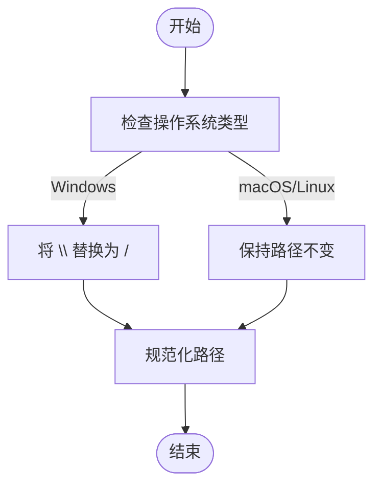
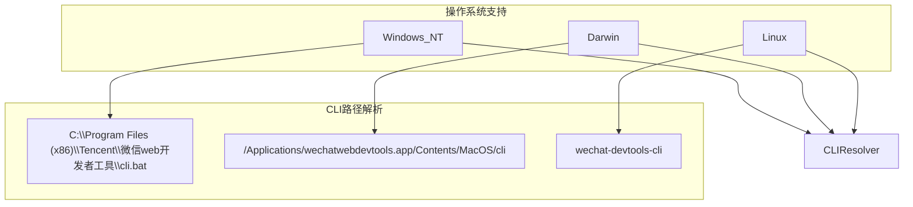
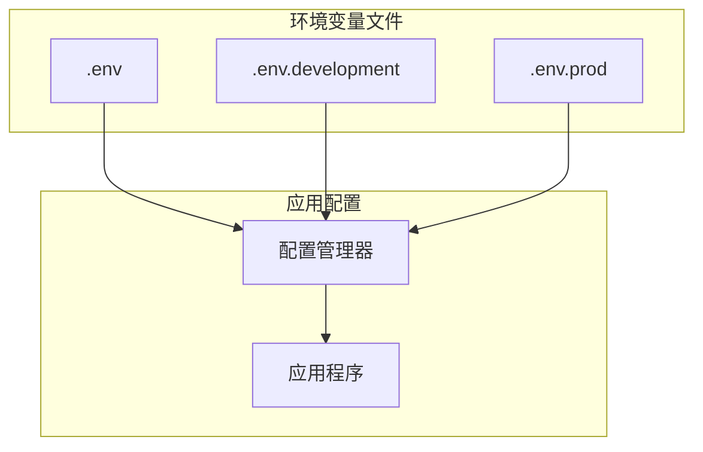
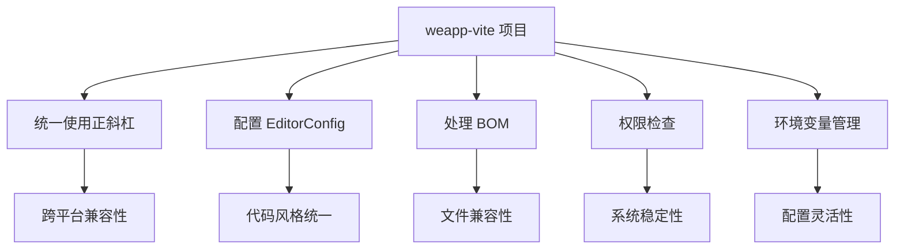
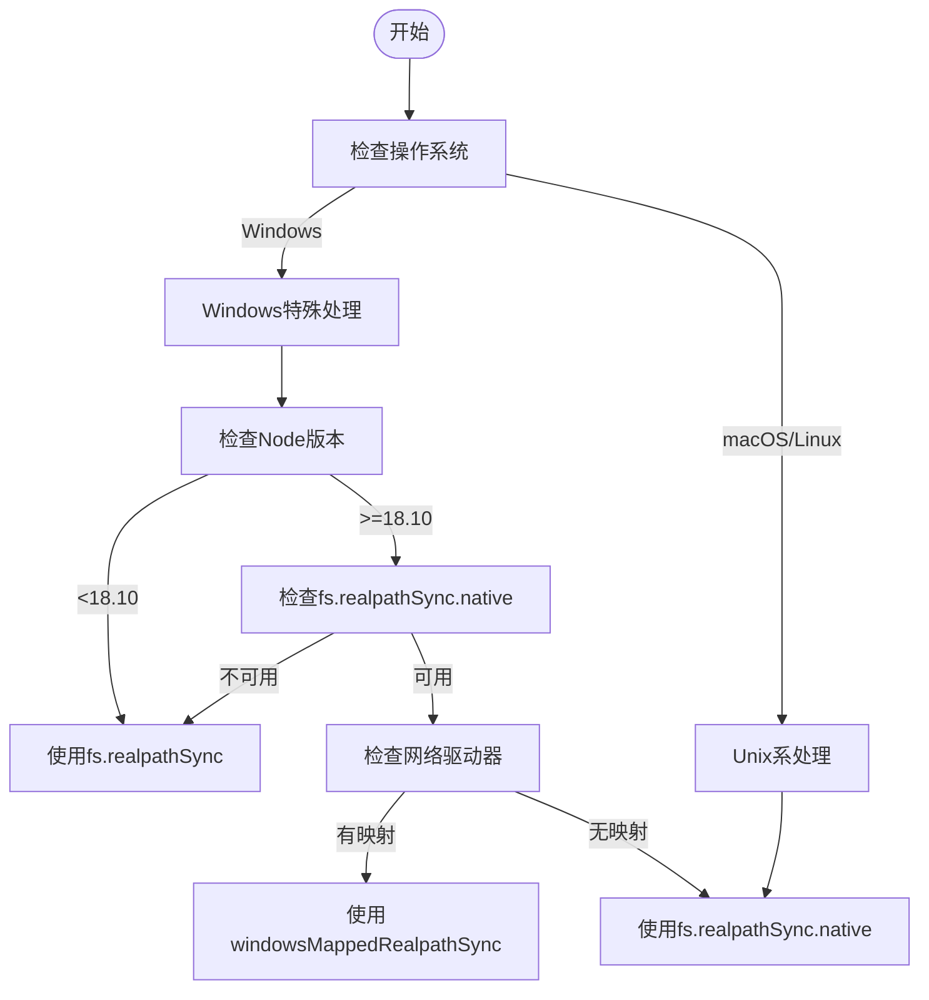

# 操作系统环境差异

<cite>
**本文档中引用的文件**  
- [sharedUtils.ts](file://packages/rolldown-require/src/sharedUtils.ts)
- [utils.ts](file://packages/rolldown-require/src/utils.ts)
- [.editorconfig](file://.editorconfig)
- [platform.ts](file://packages/weapp-ide-cli/src/runtime/platform.ts)
- [gitignore.ts](file://@weapp-core/init/src/gitignore.ts)
- [projectConfig.ts](file://@weapp-core/init/src/projectConfig.ts)
- [vite-native/.env](file://apps/vite-native/.env)
- [vite-native/envDir/.env](file://apps/vite-native/envDir/.env)
</cite>

## 目录
1. [引言](#引言)
2. [文件路径分隔符处理](#文件路径分隔符处理)
3. [权限管理差异](#权限管理差异)
4. [编码格式与BOM处理](#编码格式与bom处理)
5. [行尾符统一规范](#行尾符统一规范)
6. [环境变量配置](#环境变量配置)
7. [跨平台开发最佳实践](#跨平台开发最佳实践)
8. [系统特定配置调整](#系统特定配置调整)
9. [结论](#结论)

## 引言

weapp-vite 是一个用于微信小程序开发的构建工具，需要在不同操作系统（Windows、macOS、Linux）上保持一致的行为。本文档分析了在不同操作系统下 weapp-vite 的行为差异，并提供了解决文件路径分隔符、权限管理、编码格式和行尾符等问题的方案。同时，提供了跨平台开发的最佳实践，确保项目在不同操作系统间无缝迁移。

**Section sources**
- [sharedUtils.ts](file://packages/rolldown-require/src/sharedUtils.ts#L3-L9)
- [platform.ts](file://packages/weapp-ide-cli/src/runtime/platform.ts#L10-L14)

## 文件路径分隔符处理

在不同操作系统中，文件路径分隔符存在差异：Windows 使用反斜杠（\），而 macOS 和 Linux 使用正斜杠（/）。weapp-vite 通过统一的路径处理机制来解决这一问题。

在 `sharedUtils.ts` 文件中，定义了 `isWindows` 常量来检测当前操作系统是否为 Windows，并提供了 `slash` 函数将路径中的反斜杠替换为正斜杠：



**Diagram sources**
- [sharedUtils.ts](file://packages/rolldown-require/src/sharedUtils.ts#L3-L9)

**Section sources**
- [sharedUtils.ts](file://packages/rolldown-require/src/sharedUtils.ts#L3-L9)
- [utils.ts](file://packages/rolldown-require/src/utils.ts#L107-L114)

## 权限管理差异

不同操作系统对文件权限的管理方式有所不同。weapp-vite 在处理文件系统操作时，需要考虑这些差异。

在 `platform.ts` 文件中，定义了支持的操作系统类型，并提供了检测操作系统是否受支持的功能。同时，针对不同操作系统提供了不同的 CLI 路径解析器：



**Diagram sources**
- [platform.ts](file://packages/weapp-ide-cli/src/runtime/platform.ts#L10-L72)

**Section sources**
- [platform.ts](file://packages/weapp-ide-cli/src/runtime/platform.ts#L10-L82)
- [getPermission.js](file://apps/tdesign-miniprogram-starter-retail/utils/getPermission.js#L1-L45)

## 编码格式与BOM处理

文件编码格式和字节顺序标记（BOM）在不同操作系统和编辑器中可能存在差异。weapp-vite 提供了相应的处理机制。

在 `utils.ts` 文件中，实现了 `stripBomTag` 函数来移除 UTF-8 BOM：

```mermaid
flowchart TD
Start([开始]) --> CheckBOM["检查文件内容开头"]
CheckBOM --> |存在BOM (0xFEFF)| RemoveBOM["移除第一个字符"]
CheckBOM --> |不存在BOM| KeepContent["保持内容不变"]
RemoveBOM --> ReturnContent["返回处理后的内容"]
KeepContent --> ReturnContent
ReturnContent --> End([结束])
```

**Diagram sources**
- [utils.ts](file://packages/rolldown-require/src/utils.ts#L223-L227)

**Section sources**
- [utils.ts](file://packages/rolldown-require/src/utils.ts#L223-L227)
- [.editorconfig](file://.editorconfig#L10)

## 行尾符统一规范

不同操作系统使用不同的行尾符：Windows 使用 CRLF（\r\n），而 macOS 和 Linux 使用 LF（\n）。weapp-vite 通过 .editorconfig 文件统一行尾符规范。

项目根目录下的 .editorconfig 文件中配置了 `end_of_line = lf`，确保所有文件使用 LF 作为行尾符：


**Diagram sources**
- [.editorconfig](file://.editorconfig#L7)

**Section sources**
- [.editorconfig](file://.editorconfig#L1-L12)
- [gitignore.ts](file://@weapp-core/init/src/gitignore.ts#L42-L44)

## 环境变量配置

环境变量配置是跨平台开发中的重要环节。weapp-vite 提供了灵活的环境变量管理机制。

在 `vite-native` 应用中，可以看到 .env 文件的使用：



**Diagram sources**
- [vite-native/.env](file://apps/vite-native/.env)
- [vite-native/envDir/.env](file://apps/vite-native/envDir/.env)

**Section sources**
- [vite-native/.env](file://apps/vite-native/.env)
- [vite-native/envDir/.env](file://apps/vite-native/envDir/.env)

## 跨平台开发最佳实践

为了确保 weapp-vite 项目在不同操作系统间无缝迁移，建议遵循以下最佳实践：

1. **统一使用正斜杠**：在代码中始终使用正斜杠（/）作为路径分隔符，让工具自动处理操作系统差异。
2. **配置 EditorConfig**：使用 .editorconfig 文件统一代码风格，包括行尾符、缩进等。
3. **处理 BOM**：确保工具能够正确处理带有 BOM 的文件。
4. **权限检查**：在访问系统资源时进行适当的权限检查。
5. **环境变量管理**：使用统一的环境变量管理机制。



**Diagram sources**
- [sharedUtils.ts](file://packages/rolldown-require/src/sharedUtils.ts#L7-L9)
- [.editorconfig](file://.editorconfig#L7)
- [utils.ts](file://packages/rolldown-require/src/utils.ts#L223-L227)
- [platform.ts](file://packages/weapp-ide-cli/src/runtime/platform.ts#L10-L14)

**Section sources**
- [sharedUtils.ts](file://packages/rolldown-require/src/sharedUtils.ts#L3-L9)
- [.editorconfig](file://.editorconfig#L1-L12)
- [utils.ts](file://packages/rolldown-require/src/utils.ts#L223-L227)
- [platform.ts](file://packages/weapp-ide-cli/src/runtime/platform.ts#L10-L14)

## 系统特定配置调整

针对不同操作系统，weapp-vite 提供了特定的配置调整：

1. **Windows**：处理长路径限制和网络驱动器映射
2. **macOS**：适配应用程序包结构
3. **Linux**：支持社区版开发者工具

在 `utils.ts` 中，针对 Windows 系统的特殊处理：



**Diagram sources**
- [utils.ts](file://packages/rolldown-require/src/utils.ts#L187-L220)

**Section sources**
- [utils.ts](file://packages/rolldown-require/src/utils.ts#L156-L220)
- [platform.ts](file://packages/weapp-ide-cli/src/runtime/platform.ts#L64-L72)

## 结论

weapp-vite 通过一系列机制有效解决了不同操作系统间的差异问题。通过统一路径处理、标准化编码格式、规范化行尾符以及灵活的环境变量管理，确保了项目在 Windows、macOS 和 Linux 系统间的无缝迁移。开发者应遵循文档中提出的最佳实践，充分利用 weapp-vite 提供的跨平台支持功能，提高开发效率和项目稳定性。

[无具体文件分析，无需添加来源]