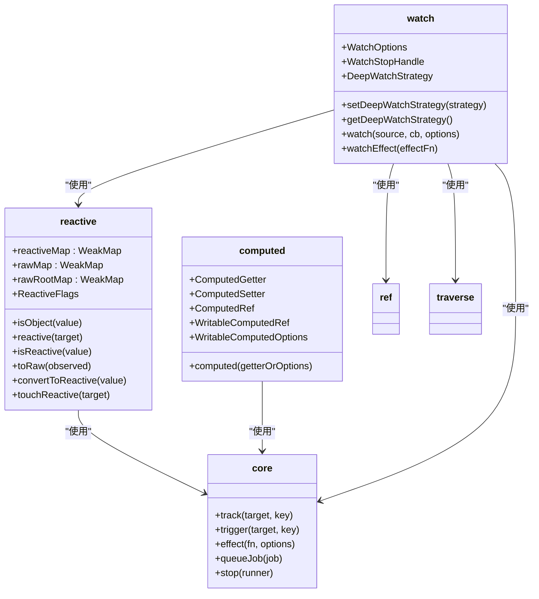
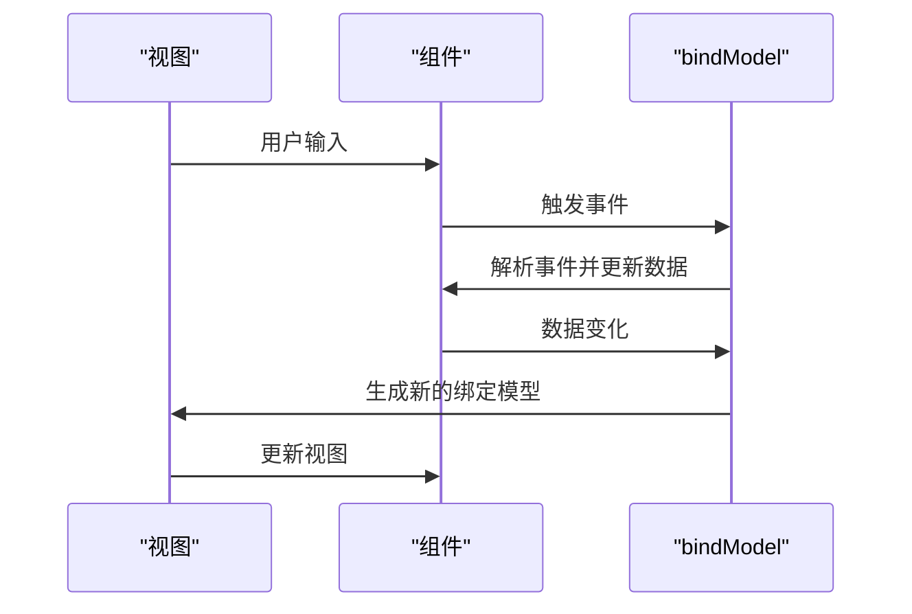
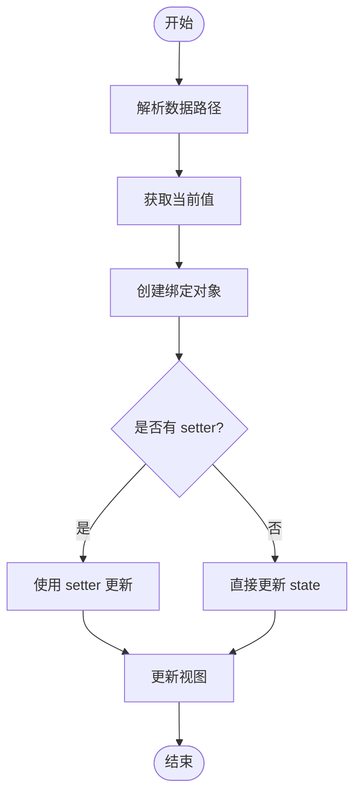
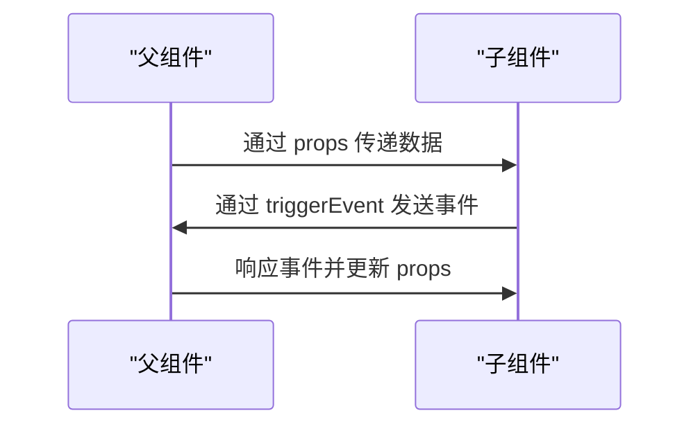
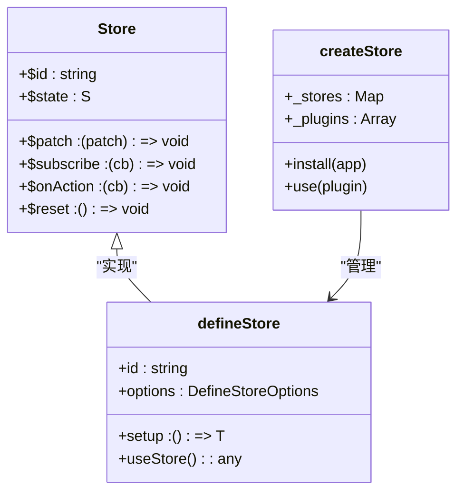
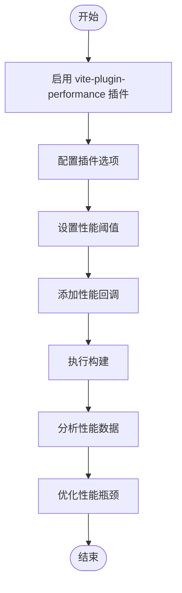

# 数据流问题

<cite>
**本文档引用的文件**   
- [bindModel.ts](file://packages/wevu/src/runtime/bindModel.ts)
- [reactive.ts](file://packages/wevu/src/reactivity/reactive.ts)
- [computed.ts](file://packages/wevu/src/reactivity/computed.ts)
- [watch.ts](file://packages/wevu/src/reactivity/watch.ts)
- [store.md](file://docs/wevu/store.md)
- [store.ts](file://packages/wevu/src/store/index.ts)
- [define.ts](file://packages/wevu/src/store/define.ts)
- [manager.ts](file://packages/wevu/src/store/manager.ts)
- [index.ts](file://packages/wevu/src/reactivity/index.ts)
- [emitter-child/index.ts](file://apps/wevu-runtime-demo/src/components/emitter-child/index.ts)
- [communicate/index.ts](file://apps/wevu-runtime-demo/src/pages/communicate/index.ts)
- [vite-plugin-performance](file://packages/vite-plugin-performance)
</cite>

## 目录
1. [引言](#引言)
2. [响应式系统工作原理](#响应式系统工作原理)
3. [数据绑定与双向绑定](#数据绑定与双向绑定)
4. [组件间数据传递](#组件间数据传递)
5. [全局状态管理](#全局状态管理)
6. [数据流调试方法](#数据流调试方法)
7. [常见问题与解决方案](#常见问题与解决方案)
8. [性能优化建议](#性能优化建议)
9. [结论](#结论)

## 引言
weapp-vite 是一个用于开发微信小程序的现代化构建工具，它集成了响应式数据绑定、组件化架构和状态管理等现代前端开发特性。本文档旨在深入分析 weapp-vite 中的数据流问题，重点解决数据绑定异常、响应式系统失效、状态管理错误等常见问题。我们将详细解释 weapp-vite 响应式系统的工作原理，包括数据劫持和依赖追踪机制，并提供组件间数据传递的最佳实践。此外，本文档还将介绍数据流调试方法，帮助开发者监控数据变化、追踪数据来源和诊断性能瓶颈。

## 响应式系统工作原理

weapp-vite 的响应式系统基于 Proxy 实现，通过拦截对象的读写操作来实现依赖追踪和变更通知。系统核心包括 `reactive`、`computed`、`watch` 等 API，它们共同构成了一个完整的响应式数据流体系。

**图示来源**
- [reactive.ts](file://packages/wevu/src/reactivity/reactive.ts)
- [computed.ts](file://packages/wevu/src/reactivity/computed.ts)
- [watch.ts](file://packages/wevu/src/reactivity/watch.ts)
- [core.ts](file://packages/wevu/src/reactivity/core.ts)

**响应式系统核心机制：**

1. **数据劫持**：通过 `reactive` 函数将普通对象转换为响应式对象，使用 Proxy 拦截对象的 get、set、deleteProperty 和 ownKeys 操作。
2. **依赖追踪**：在 getter 中调用 `track` 函数收集依赖，在 setter 中调用 `trigger` 函数触发更新。
3. **计算属性**：`computed` 函数创建一个计算属性，它会自动追踪其依赖并在依赖变化时重新计算。
4. **侦听器**：`watch` 和 `watchEffect` 函数用于侦听数据变化并执行回调函数。

**Section sources**
- [reactive.ts](file://packages/wevu/src/reactivity/reactive.ts#L1-L119)
- [computed.ts](file://packages/wevu/src/reactivity/computed.ts#L1-L65)
- [watch.ts](file://packages/wevu/src/reactivity/watch.ts#L1-L127)

## 数据绑定与双向绑定

weapp-vite 提供了强大的数据绑定机制，支持单向绑定和双向绑定。`bindModel` 是实现双向绑定的核心 API，它允许在组件和视图之间建立双向数据流。

**图示来源**
- [bindModel.ts](file://packages/wevu/src/runtime/bindModel.ts)

### 双向绑定实现

`bindModel` 函数通过以下步骤实现双向绑定：

1. **路径解析**：将数据路径字符串转换为路径段数组，支持嵌套属性访问。
2. **值获取**：通过 `getFromPath` 函数从响应式对象中获取指定路径的值。
3. **值设置**：通过 `setByPath` 函数将新值设置到响应式对象的指定路径。
4. **事件处理**：生成包含事件处理器的绑定模型，当用户输入时自动更新数据。

**图示来源**
- [bindModel.ts](file://packages/wevu/src/runtime/bindModel.ts)

**Section sources**
- [bindModel.ts](file://packages/wevu/src/runtime/bindModel.ts#L1-L139)

## 组件间数据传递

在 weapp-vite 中，组件间数据传递主要通过 props、events 和全局状态三种方式实现。每种方式都有其适用场景和最佳实践。

### Props 和 Events

Props 用于父组件向子组件传递数据，Events 用于子组件向父组件传递消息。这是最常用和最推荐的组件通信方式。

**图示来源**
- [emitter-child/index.ts](file://apps/wevu-runtime-demo/src/components/emitter-child/index.ts)
- [communicate/index.ts](file://apps/wevu-runtime-demo/src/pages/communicate/index.ts)

**最佳实践：**

1. **单向数据流**：保持数据流动的单向性，避免在子组件中直接修改 props。
2. **事件命名**：使用语义化的事件名称，避免命名冲突。
3. **类型安全**：为 props 和 events 定义明确的类型，提高代码可维护性。

**Section sources**
- [emitter-child/index.ts](file://apps/wevu-runtime-demo/src/components/emitter-child/index.ts#L1-L14)
- [communicate/index.ts](file://apps/wevu-runtime-demo/src/pages/communicate/index.ts#L1-L16)

## 全局状态管理

weapp-vite 提供了轻量级的状态管理解决方案，API 设计接近 Pinia，但以 `wevu/store` 导入以避免混淆。全局状态管理适用于跨组件共享状态的场景。

**图示来源**
- [store.ts](file://packages/wevu/src/store/index.ts)
- [define.ts](file://packages/wevu/src/store/define.ts)
- [manager.ts](file://packages/wevu/src/store/manager.ts)

### 状态管理最佳实践

1. **模块化设计**：将状态按功能模块划分，每个模块使用独立的 store。
2. **状态扁平化**：避免过深的嵌套状态，提高性能和可维护性。
3. **异步操作**：将异步操作封装在 actions 中，保持状态更新的同步性。
4. **状态持久化**：对于需要持久化的状态，使用插件机制实现。

**Section sources**
- [store.md](file://docs/wevu/store.md)
- [store.ts](file://packages/wevu/src/store/index.ts#L1-L10)
- [define.ts](file://packages/wevu/src/store/define.ts#L1-L145)
- [manager.ts](file://packages/wevu/src/store/manager.ts#L1-L19)

## 数据流调试方法

有效的调试方法是解决数据流问题的关键。weapp-vite 提供了多种调试工具和方法，帮助开发者监控数据变化、追踪数据来源和诊断性能瓶颈。

### 数据变化监控

1. **使用 watch**：通过 `watch` 函数监听特定数据的变化，实时输出变化信息。
2. **使用 $subscribe**：订阅 store 的状态变化，获取每次状态变更的详细信息。
3. **日志输出**：在关键数据操作处添加日志输出，跟踪数据流动过程。

### 数据来源追踪

1. **调用栈分析**：通过浏览器开发者工具或小程序开发者工具的调用栈功能，追踪数据变化的源头。
2. **依赖关系图**：使用静态分析工具生成组件和数据的依赖关系图，可视化数据流动路径。
3. **断点调试**：在关键数据操作处设置断点，逐步执行代码，观察数据变化过程。

### 性能瓶颈诊断

weapp-vite 集成了 `vite-plugin-performance` 插件，用于统计构建过程中的性能瓶颈。

**图示来源**
- [vite-plugin-performance](file://packages/vite-plugin-performance)

**Section sources**
- [vite-plugin-performance](file://packages/vite-plugin-performance)

## 常见问题与解决方案

### 双向绑定失效

**问题描述**：在某些情况下，双向绑定无法正确更新数据。

**解决方案**：
1. 检查数据路径是否正确，确保路径字符串与实际数据结构匹配。
2. 确认事件名称和值属性名称是否正确配置。
3. 检查是否有自定义的 parser 或 formatter 函数影响了数据解析。

### 异步数据更新不渲染

**问题描述**：异步获取的数据更新后，视图没有重新渲染。

**解决方案**：
1. 确保异步操作完成后正确更新响应式数据。
2. 使用 `nextTick` 确保 DOM 更新完成后再进行后续操作。
3. 检查是否有错误的依赖追踪，导致更新未被正确触发。

### 复杂对象响应式丢失

**问题描述**：对复杂嵌套对象的深层属性修改无法触发响应式更新。

**解决方案**：
1. 使用 `reactive` 包装整个对象，确保所有层级都是响应式的。
2. 避免直接替换对象的某个深层属性，而是使用 `setByPath` 等工具函数。
3. 在必要时手动调用 `touchReactive` 强制触发依赖更新。

### 事件总线使用错误

**问题描述**：事件总线的使用导致内存泄漏或事件重复触发。

**解决方案**：
1. 在组件销毁时及时清理事件监听器。
2. 使用唯一的事件名称，避免命名冲突。
3. 考虑使用更现代的状态管理方案替代事件总线。

**Section sources**
- [bindModel.ts](file://packages/wevu/src/runtime/bindModel.ts)
- [reactive.ts](file://packages/wevu/src/reactivity/reactive.ts)
- [store.ts](file://packages/wevu/src/store/index.ts)

## 性能优化建议

1. **细粒度更新**：尽量保持响应式更新的细粒度，避免不必要的全量更新。
2. **批量更新**：将多个数据更新操作合并为一次，减少 `setData` 调用次数。
3. **懒加载**：对于非关键数据，使用懒加载策略，提高初始渲染性能。
4. **缓存计算属性**：合理使用计算属性的缓存机制，避免重复计算。
5. **避免深层监听**：除非必要，避免对深层嵌套对象进行 `deep watch`，使用 `version` 策略替代。

## 结论

weapp-vite 的数据流系统基于现代响应式编程思想，提供了强大而灵活的数据绑定和状态管理能力。通过深入理解响应式系统的工作原理，掌握正确的数据传递和状态管理实践，开发者可以构建高效、可维护的小程序应用。同时，利用提供的调试工具和性能分析方法，可以有效解决开发过程中遇到的各种数据流问题，确保应用的稳定性和性能。