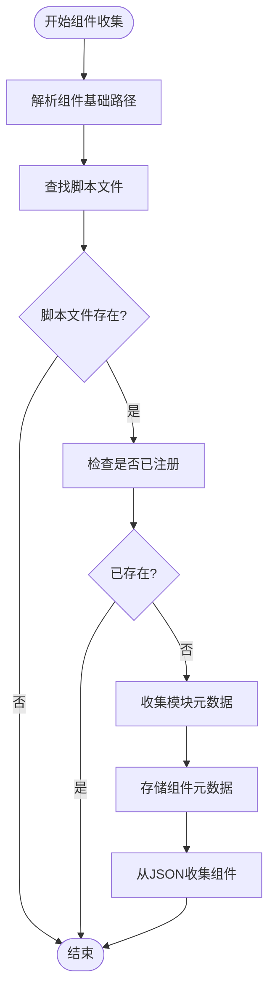
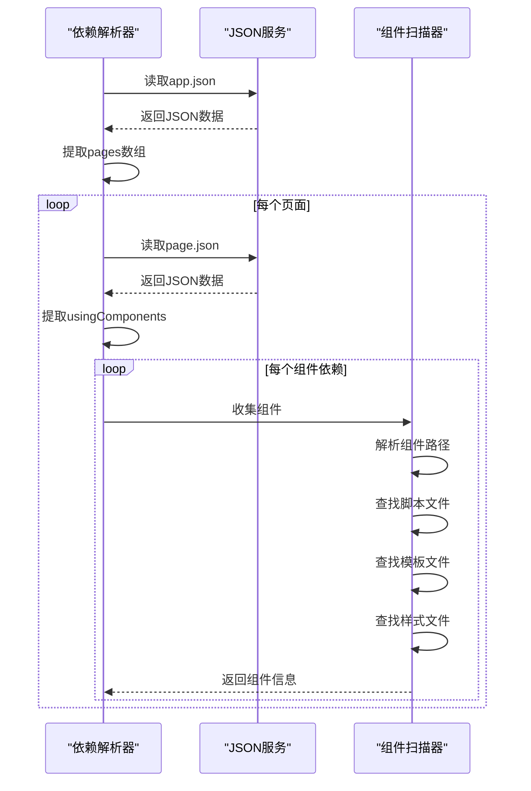
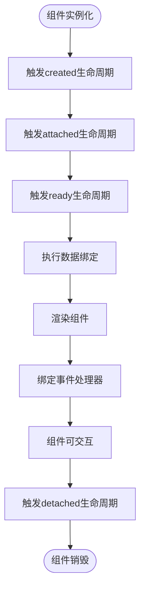

# 组件运行时问题

<cite>
**本文档引用的文件**   
- [componentProps.ts](file://packages/weapp-vite/src/runtime/componentProps.ts)
- [autoImport/service.ts](file://packages/weapp-vite/src/runtime/autoImport/service.ts)
- [autoImport/metadata.ts](file://packages/weapp-vite/src/runtime/autoImport/metadata.ts)
- [autoImport/typedDefinition.ts](file://packages/weapp-vite/src/runtime/autoImport/typedDefinition.ts)
- [plugin.ts](file://packages/web/src/plugin.ts)
- [scan.ts](file://packages/weapp-vite/src/wxml/scan.ts)
- [config.ts](file://packages/weapp-vite/src/runtime/autoImport/config.ts)
- [types.ts](file://packages/weapp-vite/src/runtime/autoImport/types.ts)
</cite>

## 目录
1. [组件加载与注册机制](#组件加载与注册机制)
2. [组件属性类型校验机制](#组件属性类型校验机制)
3. [组件依赖解析过程](#组件依赖解析过程)
4. [组件生命周期与数据绑定调试](#组件生命周期与数据绑定调试)
5. [常见问题与解决方案](#常见问题与解决方案)

## 组件加载与注册机制

weapp-vite中的组件加载机制基于自动组件注册系统，该系统通过扫描项目中的组件文件并自动注册到运行时环境中。组件注册的核心流程包括组件发现、路径解析和自动导入。

组件的发现是通过监听`.wxml`文件的变化来触发的。当系统检测到新的组件模板文件时，会通过`collectComponent`函数进行组件收集。该函数首先解析组件的基础路径，然后查找对应的脚本文件、模板文件和样式文件，并将这些信息存储在模块元数据中。



**Diagram sources**
- [plugin.ts](file://packages/web/src/plugin.ts#L359-L387)

**Section sources**
- [plugin.ts](file://packages/web/src/plugin.ts#L359-L420)

## 组件属性类型校验机制

weapp-vite提供了强大的组件属性类型校验机制，通过静态分析组件代码和JSON配置文件来提取属性类型信息。类型校验主要分为两个层面：JSON配置层和脚本代码层。

在JSON配置文件中，可以通过`properties`字段定义组件属性及其类型。系统支持多种类型别名，如`String`映射为`string`，`Number`映射为`number`等。当属性配置为对象形式时，可以指定`type`字段和`optionalTypes`字段来定义主类型和可选类型。

```mermaid
classDiagram
class ComponentMetadata {
+types : ComponentPropMap
+docs : Map<string, string>
}
class ComponentPropMap {
+Map<string, string>
}
class JSON_TYPE_ALIASES {
+String : 'string'
+Number : 'number'
+Boolean : 'boolean'
+Object : 'Record<string, any>'
+Array : 'any[]'
+Null : 'null'
+Any : 'any'
}
ComponentMetadata --> ComponentPropMap : "包含"
JSON_TYPE_ALIASES -.-> ComponentPropMap : "类型映射"
```

**Diagram sources**
- [metadata.ts](file://packages/weapp-vite/src/runtime/autoImport/metadata.ts#L3-L68)

脚本代码中的属性类型通过Babel AST解析提取。系统会解析组件定义中的`properties`对象，提取每个属性的类型信息。对于复杂的类型定义，如联合类型或可选类型，系统会进行合并处理。

**Section sources**
- [componentProps.ts](file://packages/weapp-vite/src/runtime/componentProps.ts#L1-L220)
- [metadata.ts](file://packages/weapp-vite/src/runtime/autoImport/metadata.ts#L1-L68)

## 组件依赖解析过程

组件依赖解析是weapp-vite构建系统的核心功能之一，它负责解析组件之间的依赖关系并确保正确的加载顺序。依赖解析过程从`app.json`文件开始，递归解析所有页面和组件的依赖。

依赖解析的主要步骤包括：
1. 从`app.json`读取页面列表
2. 解析每个页面的JSON配置文件
3. 提取`usingComponents`中的组件依赖
4. 递归解析嵌套的组件依赖



**Diagram sources**
- [plugin.ts](file://packages/web/src/plugin.ts#L389-L407)

**Section sources**
- [plugin.ts](file://packages/web/src/plugin.ts#L280-L333)

## 组件生命周期与数据绑定调试

weapp-vite提供了完善的组件生命周期与数据绑定调试机制。开发者可以通过开发者工具检查组件树结构和属性传递情况。

组件生命周期的调试主要通过以下方式实现：
- 在组件定义中添加生命周期钩子
- 使用`setData`方法更新组件数据
- 监听组件的创建、挂载和销毁事件

数据绑定的调试可以通过检查组件实例的`data`属性来实现。当组件接收到新的属性值时，系统会自动调用`setData`方法更新组件数据。



**Diagram sources**
- [service.ts](file://packages/weapp-vite/src/runtime/autoImport/service.ts#L109-L117)

**Section sources**
- [service.ts](file://packages/weapp-vite/src/runtime/autoImport/service.ts#L109-L129)

## 常见问题与解决方案

### 组件路径解析错误

组件路径解析错误通常发生在相对路径或绝对路径配置不正确时。解决方案包括：
- 确保组件路径以正确的前缀开头（`.`表示相对路径，`/`表示根路径）
- 检查组件文件是否存在
- 验证组件JSON配置文件中的`component`字段是否设置为`true`

### 第三方组件集成问题

第三方组件集成问题主要表现为样式冲突或功能异常。解决方案包括：
- 使用`styleIsolation`配置隔离组件样式
- 确保第三方组件的JSON配置文件正确
- 检查组件依赖是否完整

### 自定义组件样式隔离失效

自定义组件样式隔离失效通常是由于`styleIsolation`配置不当导致的。正确的配置方式包括：
- 设置`styleIsolation`为`apply-shared`以应用共享样式
- 设置`styleIsolation`为`shared`以完全共享样式
- 不设置`styleIsolation`以使用默认隔离

**Section sources**
- [scan.ts](file://packages/weapp-vite/src/wxml/scan.ts#L52-L113)
- [config.ts](file://packages/weapp-vite/src/runtime/autoImport/config.ts#L1-L303)