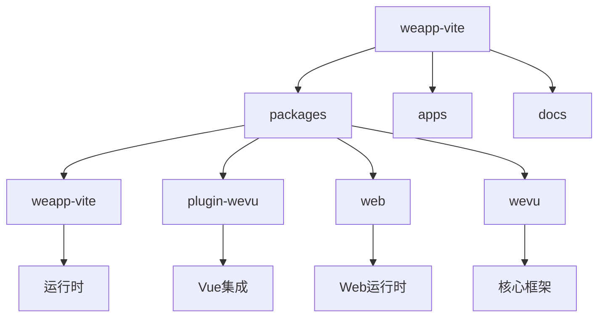
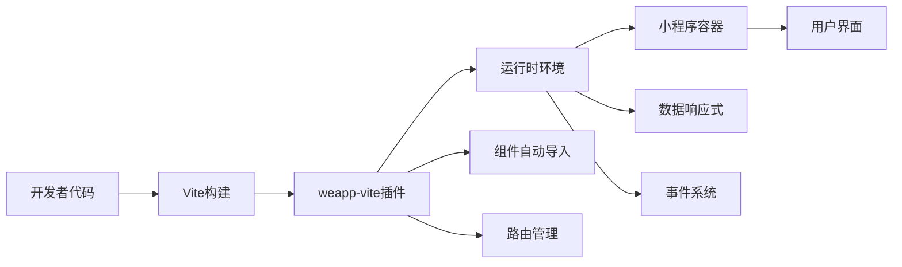
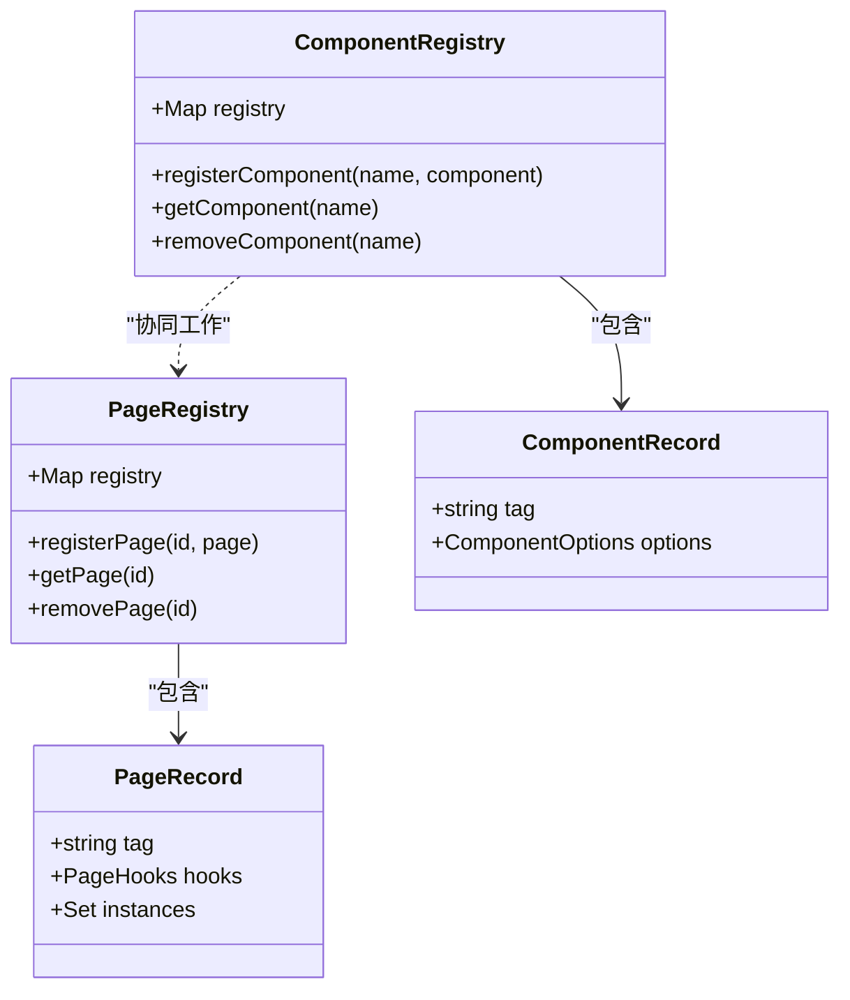
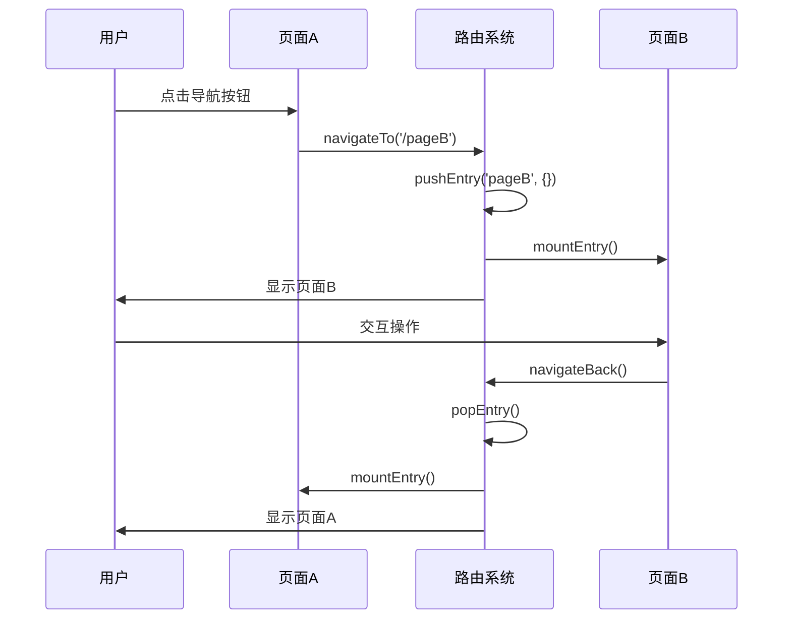
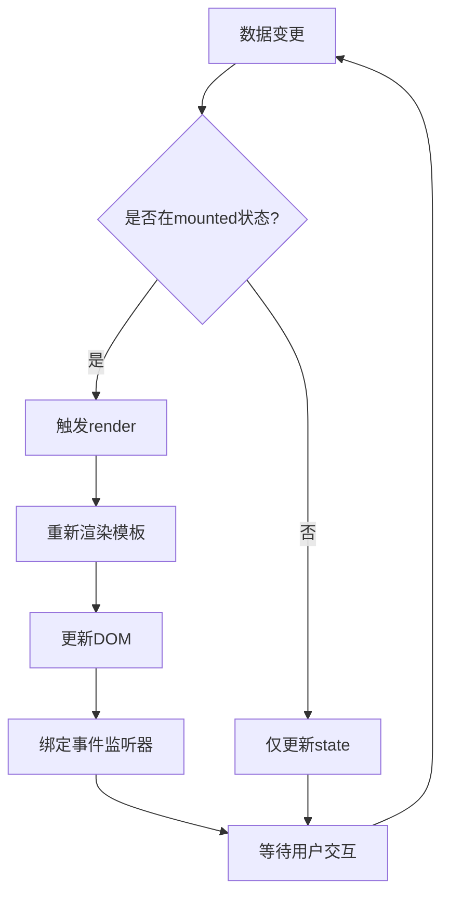
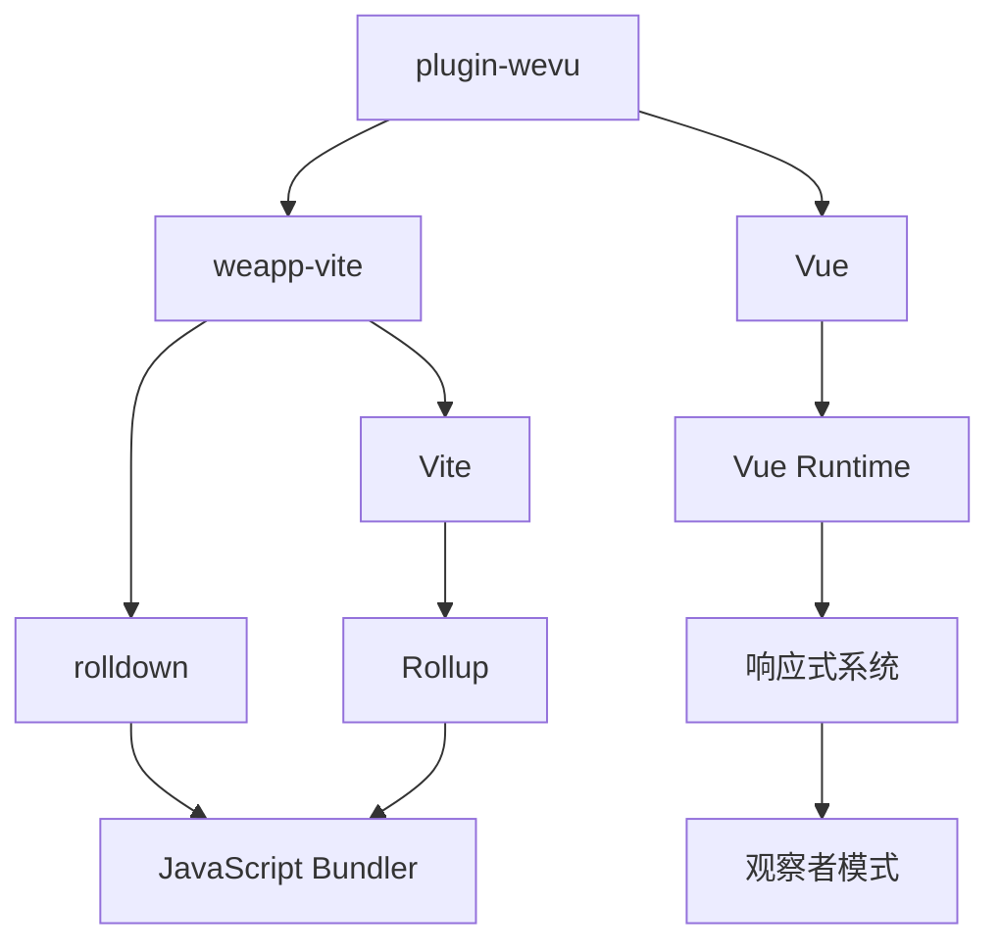

# 运行时问题

<cite>
**本文档引用的文件**
- [runtime.ts](file://packages/plugin-wevu/src/runtime.ts)
- [component.ts](file://packages/web/src/runtime/component.ts)
- [polyfill.ts](file://packages/web/src/runtime/polyfill.ts)
- [plugin.ts](file://packages/web/src/plugin.ts)
- [service.ts](file://packages/weapp-vite/src/runtime/autoImport/service.ts)
</cite>

## 目录
1. [引言](#引言)
2. [项目结构](#项目结构)
3. [核心组件](#核心组件)
4. [架构概述](#架构概述)
5. [详细组件分析](#详细组件分析)
6. [依赖分析](#依赖分析)
7. [性能考虑](#性能考虑)
8. [故障排除指南](#故障排除指南)
9. [结论](#结论)

## 引言
本文档旨在深入分析weapp-vite框架的运行时机制，重点解决小程序运行时出现的各种异常问题。文档将详细解释组件加载、页面路由、数据响应式系统的工作原理，并提供调试方法和常见问题的解决方案。

## 项目结构
weapp-vite项目采用模块化设计，主要包含核心运行时、插件系统和工具模块。项目结构清晰，便于维护和扩展。

**Diagram sources**
- [polyfill.ts](file://packages/web/src/runtime/polyfill.ts#L240-L481)
- [component.ts](file://packages/web/src/runtime/component.ts#L1-L331)

**Section sources**
- [polyfill.ts](file://packages/web/src/runtime/polyfill.ts#L1-L500)
- [component.ts](file://packages/web/src/runtime/component.ts#L1-L331)

## 核心组件
weapp-vite的核心组件包括页面管理、组件注册和数据响应式系统。这些组件协同工作，确保小程序的正常运行。

**Section sources**
- [runtime.ts](file://packages/plugin-wevu/src/runtime.ts#L1-L100)
- [service.ts](file://packages/weapp-vite/src/runtime/autoImport/service.ts#L614-L640)

## 架构概述
weapp-vite的架构基于现代前端技术栈，结合了Vite的快速开发特性和小程序的运行时需求。

**Diagram sources**
- [plugin.ts](file://packages/web/src/plugin.ts#L485-L546)
- [polyfill.ts](file://packages/web/src/runtime/polyfill.ts#L386-L435)

## 详细组件分析

### 组件注册分析
weapp-vite通过自动导入机制实现组件的动态注册，确保组件在需要时能够正确加载。

**Diagram sources**
- [service.ts](file://packages/weapp-vite/src/runtime/autoImport/service.ts#L614-L640)
- [polyfill.ts](file://packages/web/src/runtime/polyfill.ts#L405-L416)

### 页面路由分析
weapp-vite实现了完整的页面路由系统，支持导航、历史记录和页面状态管理。

**Diagram sources**
- [polyfill.ts](file://packages/web/src/runtime/polyfill.ts#L265-L272)
- [polyfill.ts](file://packages/web/src/runtime/polyfill.ts#L428-L435)

### 数据响应式分析
weapp-vite的数据响应式系统基于观察者模式，确保数据变化能够自动更新UI。

**Diagram sources**
- [component.ts](file://packages/web/src/runtime/component.ts#L280-L298)
- [component.ts](file://packages/web/src/runtime/component.ts#L316-L323)

## 依赖分析
weapp-vite的依赖关系清晰，各模块之间耦合度低，便于维护和测试。

**Diagram sources**
- [runtime.ts](file://packages/plugin-wevu/src/runtime.ts#L1-L50)
- [component.ts](file://packages/web/src/runtime/component.ts#L1-L50)

**Section sources**
- [runtime.ts](file://packages/plugin-wevu/src/runtime.ts#L1-L100)
- [component.ts](file://packages/web/src/runtime/component.ts#L1-L331)

## 性能考虑
weapp-vite在设计时充分考虑了性能优化，包括：
- 使用Shadow DOM隔离组件样式
- 实现高效的setData批量更新
- 优化事件绑定机制
- 支持组件懒加载

## 故障排除指南
### 组件加载失败
当组件加载失败时，检查以下几点：
1. 确认组件路径是否正确
2. 检查组件是否已正确注册
3. 验证组件依赖是否完整

**Section sources**
- [service.ts](file://packages/weapp-vite/src/runtime/autoImport/service.ts#L614-L640)
- [polyfill.ts](file://packages/web/src/runtime/polyfill.ts#L405-L416)

### 页面渲染错误
页面渲染错误通常由以下原因引起：
1. 模板语法错误
2. 数据绑定问题
3. 样式冲突

### 事件绑定异常
事件绑定异常的常见解决方案：
1. 检查事件名称是否正确
2. 验证事件处理函数是否存在
3. 确认事件冒泡设置

### 数据绑定问题
数据绑定问题的调试方法：
1. 使用开发者工具检查data状态
2. 验证setData调用是否正确
3. 检查数据类型是否匹配

## 结论
weapp-vite提供了一套完整的运行时解决方案，通过合理的架构设计和优化策略，有效解决了小程序开发中的各种运行时问题。开发者应充分理解其运行机制，合理使用提供的工具和API，以构建高性能的小程序应用。