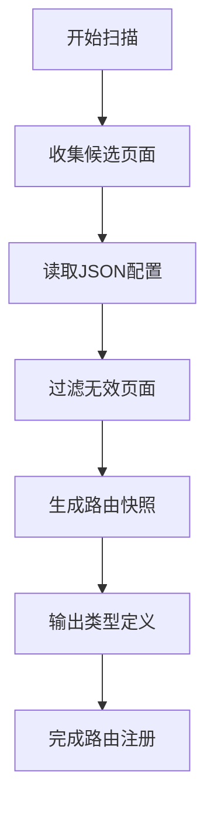
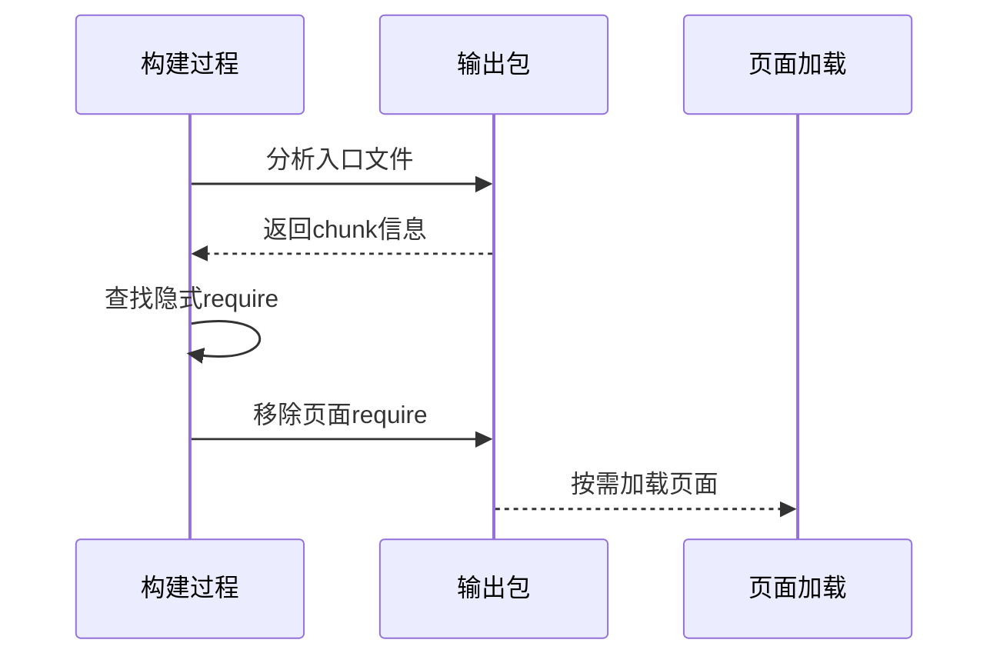

# 页面运行时问题

<cite>
**本文档引用的文件**   
- [autoRoutesPlugin.ts](file://packages/weapp-vite/src/runtime/autoRoutesPlugin.ts)
- [polyfill.ts](file://packages/web/src/runtime/polyfill.ts)
- [type.auto.ts](file://@weapp-core/schematics/src/type.auto.ts)
- [pagePreloadRemoval.test.ts](file://packages/weapp-vite/test/plugins/pagePreloadRemoval.test.ts)
- [auto-routes.md](file://website/guide/auto-routes.md)
- [subpackage.md](file://website/guide/subpackage.md)
- [index.md](file://website/troubleshoot/index.md)
- [hooks.ts](file://packages/wevu/src/runtime/hooks.ts)
- [register.ts](file://packages/wevu/src/runtime/register.ts)
</cite>

## 目录
1. [页面路由异常](#页面路由异常)
2. [页面配置错误](#页面配置错误)
3. [页面生命周期执行问题](#页面生命周期执行问题)
4. [weapp-vite页面自动路由机制](#weapp-vite页面自动路由机制)
5. [页面JSON配置文件处理流程](#页面json配置文件处理流程)
6. [页面加载性能优化](#页面加载性能优化)
7. [常见问题解决方案](#常见问题解决方案)

## 页面路由异常

页面路由异常通常表现为页面无法找到、路由注册失败或跳转参数丢失。在weapp-vite中，路由异常主要与自动路由扫描机制和分包配置有关。

当启用`weapp-vite`的自动路由功能时，系统会扫描`src/pages/**`以及各分包`root/pages/**`下的页面文件，自动生成路由清单。如果页面未被正确扫描，可能是因为文件结构不符合约定，或`autoRoutes`功能未启用。

路由扫描会监听以下类型的文件变更：
- 页面脚本：`.js` / `.jsx` / `.ts` / `.tsx` / `.vue`
- 页面模板：`.wxml` 以及 `pages/**/*.vue`
- 页面样式：`.wxss`、`.css`、`.scss`、`.less`、`.sass`、`.styl(us)` 等
- 页面/应用配置：`app.json`、页面 `json`，以及通过 `configExtensions` 声明的扩展后缀

新增或删除这些文件会同步更新路由清单。如果路由未更新，可检查`vite.config.ts`中是否已启用`autoRoutes`配置。

**Section sources**
- [autoRoutesPlugin.ts](file://packages/weapp-vite/src/runtime/autoRoutesPlugin.ts#L1-L906)
- [auto-routes.md](file://website/guide/auto-routes.md#L1-L71)

## 页面配置错误

页面配置错误主要指`app.json`或页面`.json`文件中的配置项不正确。weapp-vite通过JSON Schema对配置文件进行验证，确保配置的正确性。

在`app.json`中，主要配置项包括：
- `pages`: 指定小程序由哪些页面组成
- `window`: 定义窗口表现，如导航栏、背景色等
- `tabBar`: 底部tab栏配置
- `subpackages`: 分包配置

页面级别的`.json`配置文件支持对单个页面进行配置，主要配置项包括：
- `navigationBarBackgroundColor`: 导航栏背景色
- `navigationBarTextStyle`: 导航栏标题颜色
- `navigationBarTitleText`: 导航栏标题文字
- `backgroundColor`: 窗口背景色
- `enablePullDownRefresh`: 是否开启下拉刷新

配置文件中的`component`字段用于标识是否为自定义组件，当`component`为`true`时，该目录被视为组件目录。

**Section sources**
- [type.auto.ts](file://@weapp-core/schematics/src/type.auto.ts#L1-L406)
- [page.json](file://website/public/page.json#L1-L60)

## 页面生命周期执行问题

页面生命周期执行问题通常表现为生命周期钩子未按预期执行。在weapp-vite中，页面生命周期通过`polyfill`机制进行增强和管理。

页面生命周期钩子包括：
- `onLoad`: 页面加载时触发
- `onShow`: 页面显示时触发
- `onReady`: 页面初次渲染完成时触发
- `onHide`: 页面隐藏时触发
- `onUnload`: 页面卸载时触发

在`weapp-vite`的运行时中，这些生命周期钩子通过`Component`的`lifetimes`和`pageLifetimes`进行映射。`attached`生命周期对应`onLoad`和`onShow`，`ready`对应`onReady`，`detached`对应`onHide`和`onUnload`。

使用`wevu`框架时，可以通过`setup`函数注册生命周期钩子：
```typescript
setup() {
  onShow(() => {
    console.log('页面显示')
  })
  onHide(() => {
    console.log('页面隐藏')
  })
}
```

**Section sources**
- [polyfill.ts](file://packages/web/src/runtime/polyfill.ts#L330-L384)
- [hooks.ts](file://packages/wevu/src/runtime/hooks.ts#L101-L138)

## weapp-vite页面自动路由机制

weapp-vite的页面自动路由机制通过扫描源码目录中的页面文件，自动生成路由配置，避免手动维护`app.json`中的`pages`数组。

### 页面入口扫描

自动路由服务会扫描`src`目录下的`pages`文件夹以及分包中的`pages`文件夹。扫描过程使用`fdir`库进行文件遍历，收集所有可能的页面入口。

扫描时会检查文件路径是否包含`pages/`或`/pages/`，并根据路径结构确定是主包页面还是分包页面。主包页面路径以`pages/`开头，分包页面路径包含`/pages/`。

### 路由注册过程

路由注册过程分为以下几个步骤：
1. 收集候选页面入口
2. 读取页面JSON配置
3. 过滤无效页面（如组件页面）
4. 生成路由快照
5. 输出类型定义文件

路由快照包含三个主要部分：
- `pages`: 主包页面列表
- `entries`: 所有入口页面列表（包括主包和分包）
- `subPackages`: 分包信息列表



**Diagram sources **
- [autoRoutesPlugin.ts](file://packages/weapp-vite/src/runtime/autoRoutesPlugin.ts#L143-L210)
- [auto-routes.md](file://website/guide/auto-routes.md#L1-L71)

**Section sources**
- [autoRoutesPlugin.ts](file://packages/weapp-vite/src/runtime/autoRoutesPlugin.ts#L1-L906)

## 页面JSON配置文件处理流程

页面JSON配置文件的处理流程包括配置读取、验证和应用三个阶段。

### 配置读取

系统通过`jsonService.read`方法读取JSON文件内容。读取时会解析文件路径，确定配置文件对应的页面或组件。

### 配置验证

使用Zod库定义的JSON Schema对配置内容进行验证。主要配置Schema包括：
- `AppSchema`: 全局配置
- `PageSchema`: 页面配置
- `ComponentSchema`: 组件配置

验证确保配置项的类型和值符合要求，避免运行时错误。

### 正确配置页面参数和窗口样式

配置页面参数和窗口样式时，应遵循以下原则：
- 使用正确的属性名和数据类型
- 遵循微信小程序的配置规范
- 利用类型提示避免拼写错误

例如，配置页面窗口样式：
```json
{
  "navigationBarBackgroundColor": "#ffffff",
  "navigationBarTextStyle": "black",
  "navigationBarTitleText": "页面标题",
  "backgroundColor": "#f8f8f8",
  "enablePullDownRefresh": true
}
```

**Section sources**
- [json.ts](file://@weapp-core/schematics/scripts/json.ts#L145-L176)
- [type.auto.ts](file://@weapp-core/schematics/src/type.auto.ts#L296-L346)

## 页面加载性能优化

页面加载性能优化主要包括分包加载策略和页面预加载机制。

### 分包加载策略

分包加载策略通过将小程序划分为多个子包，实现按需加载，减少主包体积。

#### 普通分包

普通分包与主包共享同一个构建上下文。代码产物的位置取决于引用关系：
- 只被单个分包使用的代码会打包到该分包
- 被多个分包使用的代码会复制到各分包的`__shared__/common.js`
- 被主包和分包共同使用的代码会提取到主包

#### 独立分包

独立分包与主包隔离，有独立的构建上下文。独立分包不能依赖主包和其他分包的内容。

### 页面预加载机制

weapp-vite通过移除隐式页面预加载来优化性能。在构建过程中，会移除`app.js`中对页面的`require`语句，避免页面在启动时被提前加载。



**Diagram sources **
- [core.ts](file://packages/weapp-vite/src/plugins/core.ts#L689-L711)
- [pagePreloadRemoval.test.ts](file://packages/weapp-vite/test/plugins/pagePreloadRemoval.test.ts#L1-L86)

**Section sources**
- [core.ts](file://packages/weapp-vite/src/plugins/core.ts#L580-L739)
- [subpackage.md](file://website/guide/subpackage.md#L1-L244)

## 常见问题解决方案

### 页面找不到

**原因**：页面未在`app.json.pages`中注册，或文件结构不符合路由扫描约定。

**解决方案**：
1. 检查`app.json`是否包含该页面路径
2. 确认页面文件位于`pages/`目录下
3. 检查`vite.config.ts`中`autoRoutes`是否启用

### 页面栈溢出

**原因**：页面跳转层级过深，超过微信小程序的页面栈限制（5层）。

**解决方案**：
1. 使用`wx.redirectTo`替代`wx.navigateTo`，关闭当前页面跳转
2. 使用`wx.reLaunch`重新启动应用
3. 合理设计页面导航结构

### 页面跳转参数丢失

**原因**：跳转URL中参数格式不正确，或页面未正确接收参数。

**解决方案**：
1. 确保跳转URL参数使用`?key=value`格式
2. 在目标页面的`onLoad`生命周期中接收参数
3. 检查参数是否被正确解析

### 分包页面加载失败

**原因**：分包配置错误，或独立分包中引用了主包资源。

**解决方案**：
1. 检查`app.json`中分包配置是否正确
2. 确认独立分包中不引用主包资源
3. 使用`weapp.debug.watchFiles`检查构建输出

**Section sources**
- [index.md](file://website/troubleshoot/index.md#L1-L50)
- [subpackage.md](file://website/guide/subpackage.md#L1-L244)