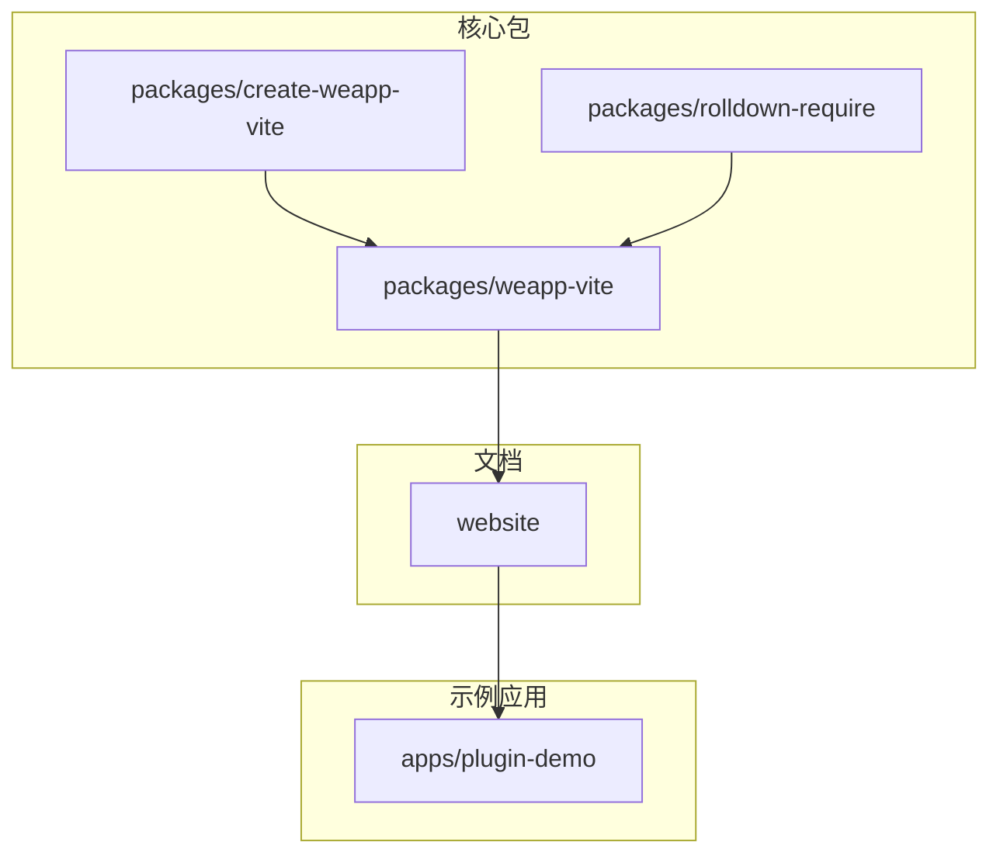
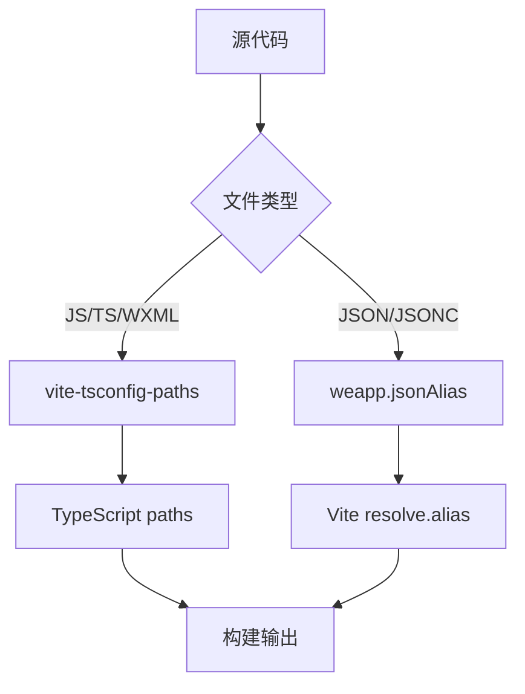
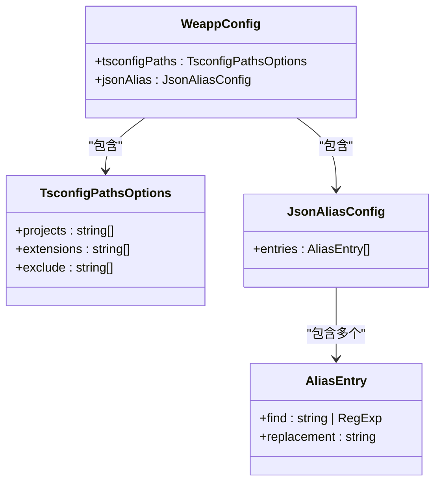
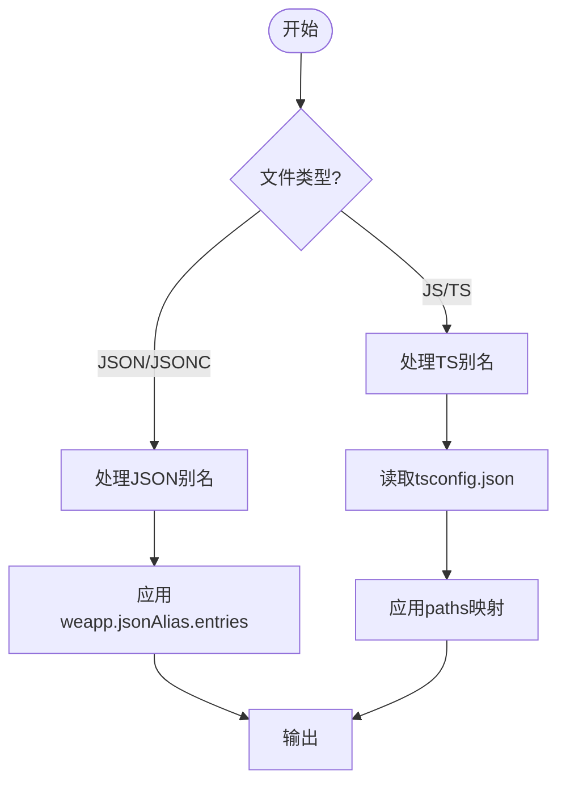
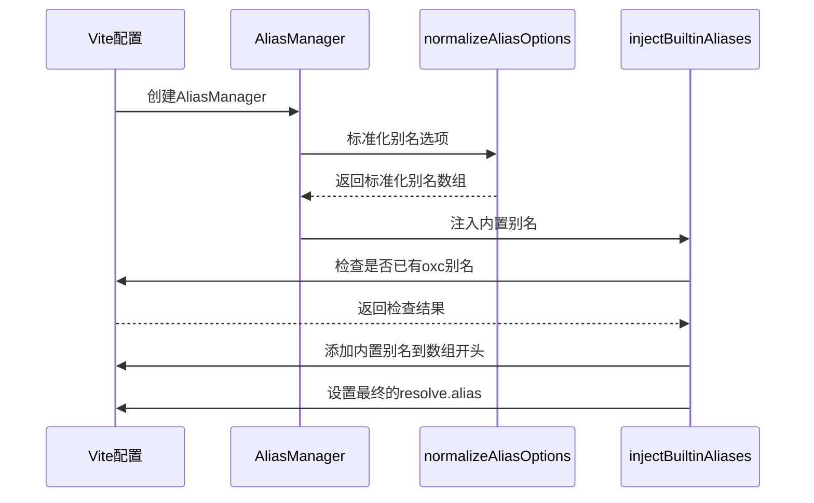
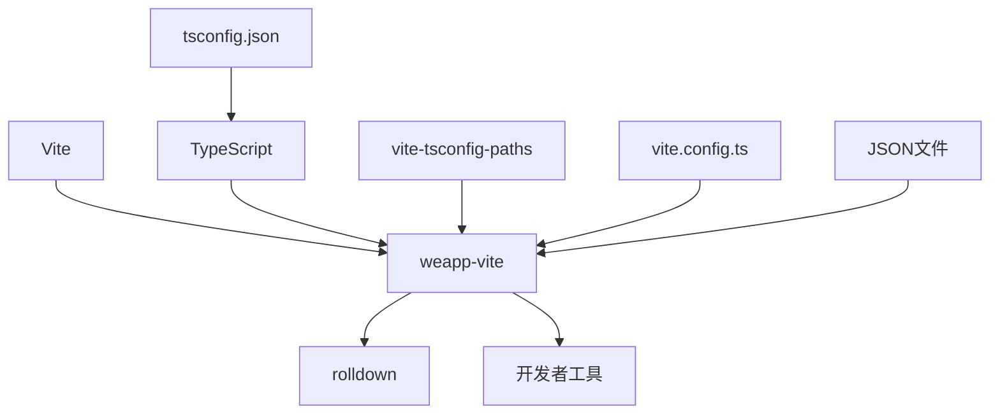

# 别名配置

<cite>
**本文档引用的文件**
- [alias.ts](file://packages/weapp-vite/src/runtime/config/internal/alias.ts)
- [alias.md](file://website/guide/alias.md)
- [js.md](file://website/config/js.md)
- [vite.config.ts](file://apps/vite-native/vite.config.ts)
- [tsconfig.json](file://apps/vite-native/tsconfig.json)
- [oxcRuntime.ts](file://packages/weapp-vite/src/runtime/oxcRuntime.ts)
</cite>

## 目录
1. [简介](#简介)
2. [项目结构](#项目结构)
3. [核心组件](#核心组件)
4. [架构概述](#架构概述)
5. [详细组件分析](#详细组件分析)
6. [依赖分析](#依赖分析)
7. [性能考虑](#性能考虑)
8. [故障排除指南](#故障排除指南)
9. [结论](#结论)
10. [附录](#附录)（如有必要）

## 简介
`weapp-vite` 支持 **JS/TS 别名** 和 **JSON/JSONC 别名**，使开发者能够在不同语言中使用一致的路径前缀。本文档详细说明了如何正确配置路径别名，解决因别名配置不当导致的模块导入问题，并提供最佳实践和调试技巧。

## 项目结构
`weapp-vite` 项目采用 monorepo 结构，包含多个子包和应用示例。别名配置主要涉及 `packages/weapp-vite` 核心包、`website` 文档站点以及多个 `apps` 示例项目。



**图示来源**
- [project_structure](file://project_structure)

**本节来源**
- [project_structure](file://project_structure)

## 核心组件
别名配置的核心组件包括：
- `vite-tsconfig-paths` 插件：处理 JS/TS 文件中的路径别名
- `weapp.jsonAlias` 配置：处理 JSON/JSONC 文件中的路径别名
- TypeScript 的 `paths` 配置：定义路径映射规则
- Vite 的 `resolve.alias` 配置：定义构建时的路径替换规则

**本节来源**
- [alias.md](file://website/guide/alias.md#js-ts-别名)
- [js.md](file://website/config/js.md#weapp-tsconfigpaths)

## 架构概述
`weapp-vite` 的别名处理架构分为两个主要部分：JS/TS 别名处理和 JSON 别名处理。JS/TS 别名通过 `vite-tsconfig-paths` 插件与 TypeScript 的 `paths` 配置协同工作，而 JSON 别名通过 `weapp.jsonAlias` 配置独立处理。



**图示来源**
- [alias.ts](file://packages/weapp-vite/src/runtime/config/internal/alias.ts)
- [alias.md](file://website/guide/alias.md)

## 详细组件分析

### JS/TS 别名分析
`weapp-vite` 默认启用 `vite-tsconfig-paths` 插件，通过 TypeScript 的 `tsconfig.json` 文件中的 `baseUrl` 和 `paths` 配置来处理 JS/TS 文件的路径别名。

#### 配置语法
在 `tsconfig.json` 中配置 `baseUrl` 和 `paths`：

```json
{
  "compilerOptions": {
    "baseUrl": ".",
    "paths": {
      "@/*": [
        "./*"
      ],
      "@components/*": [
        "src/components/*"
      ]
    }
  }
}
```

配置后可在代码中使用别名：
```ts
import utils from '@/utils'
import Button from '@components/Button'
```

#### 通配符别名
支持通配符 `*` 进行路径映射，如 `@/*` 映射到 `./src/*`。



**图示来源**
- [js.md](file://website/config/js.md#weapp-tsconfigpaths)
- [alias.ts](file://packages/weapp-vite/src/runtime/config/internal/alias.ts)

**本节来源**
- [js.md](file://website/config/js.md)
- [tsconfig.json](file://apps/vite-native/tsconfig.json#L13-L32)

### JSON/JSONC 别名分析
`weapp-vite` 对 JSON 配置文件进行增强，支持在 JSON/JSONC 文件中使用别名和注释。

#### 配置语法
在 `vite.config.ts` 中配置 `weapp.jsonAlias.entries`：

```ts
export default <UserConfig>{
  weapp: {
    jsonAlias: {
      entries: [
        {
          find: '@',
          replacement: path.resolve(__dirname, 'components'),
        },
      ],
    },
  },
}
```

配置后可在 JSON 文件中使用别名：
```json
{
  "usingComponents": {
    "navigation-bar": "@/navigation-bar/navigation-bar",
    "avatar": "@/avatar/avatar"
  }
}
```

构建时会自动转换为相对路径：
```json
{
  "usingComponents": {
    "navigation-bar": "../../components/navigation-bar/navigation-bar",
    "avatar": "../../components/avatar/avatar"
  }
}
```

#### 绝对路径别名
也可以使用以 `/` 开头的绝对路径：
```json
{
  "usingComponents": {
    "navigation-bar": "/components/navigation-bar/navigation-bar"
  }
}
```



**图示来源**
- [alias.md](file://website/guide/alias.md#json--jsonc-别名)
- [vite.config.ts](file://apps/vite-native/vite.config.ts#L60-L67)

**本节来源**
- [alias.md](file://website/guide/alias.md#json--jsonc-别名)
- [vite.config.ts](file://apps/vite-native/vite.config.ts)

### 别名管理器分析
`weapp-vite` 内部使用 `AliasManager` 来管理别名配置，确保内置别名和用户自定义别名正确合并。



**图示来源**
- [alias.ts](file://packages/weapp-vite/src/runtime/config/internal/alias.ts)
- [oxcRuntime.ts](file://packages/weapp-vite/src/runtime/oxcRuntime.ts)

**本节来源**
- [alias.ts](file://packages/weapp-vite/src/runtime/config/internal/alias.ts)
- [oxcRuntime.ts](file://packages/weapp-vite/src/runtime/oxcRuntime.ts)

## 依赖分析
别名配置涉及多个组件之间的依赖关系，包括 Vite、TypeScript、`vite-tsconfig-paths` 插件和 `weapp-vite` 自身的配置系统。



**图示来源**
- [package.json](file://packages/weapp-vite/package.json)
- [alias.md](file://website/guide/alias.md)

**本节来源**
- [package.json](file://packages/weapp-vite/package.json)
- [alias.md](file://website/guide/alias.md)

## 性能考虑
正确的别名配置可以提高开发效率和构建性能，而错误的配置可能导致：
- 构建时间增加
- 开发服务器启动变慢
- IDE 无法正确解析路径
- 运行时模块找不到错误

最佳实践包括：
- 避免过多的别名规则
- 使用精确的路径映射
- 合理组织项目结构减少深层级引用
- 定期清理未使用的别名配置

## 故障排除指南
### 常见问题及解决方案

#### 别名未生效
- **问题**：修改 `tsconfig.json` 后别名未生效
- **解决方案**：重启开发服务器，因为 `tsconfig` 修改后需要重新启动进程

#### JSON 中路径不存在警告
- **问题**：开发者工具提示路径不存在
- **解决方案**：这是正常现象，编译产物会替换为真实路径。可在 IDE 中通过类型定义消除警告

#### 多个 tsconfig 文件
- **问题**：Monorepo 中有多个 `tsconfig` 文件
- **解决方案**：在 `vite.config.ts` 中配置 `weapp.tsconfigPaths.projects` 指定额外的配置文件

#### 别名冲突
- **问题**：多个别名规则冲突
- **解决方案**：检查别名顺序，`weapp-vite` 会将内置别名添加到数组开头，确保优先级

**本节来源**
- [alias.md](file://website/guide/alias.md#常见问题排查)
- [js.md](file://website/config/js.md#常见问题)

## 结论
`weapp-vite` 提供了完善的别名配置系统，支持 JS/TS 和 JSON/JSONC 文件的路径别名。通过正确配置 `tsconfig.json` 的 `paths` 和 `vite.config.ts` 的 `weapp.jsonAlias`，可以有效组织项目结构，避免深层级的相对路径引用。建议遵循最佳实践，定期检查和优化别名配置，以确保开发效率和构建性能。

## 附录

### 配置示例对比

| 配置类型 | 配置位置 | 配置示例 | 适用范围 |
|--------|--------|--------|--------|
| JS/TS别名 | tsconfig.json | `"@/*": ["./*"]` | JS/TS/WXML文件 |
| JSON别名 | vite.config.ts | `{find: '@', replacement: 'src'}` | JSON/JSONC文件 |
| Vite别名 | vite.config.ts | `resolve.alias` | 构建时路径替换 |

### 调试技巧
1. 使用 `console.log` 输出配置对象
2. 检查构建产物中的路径是否正确替换
3. 使用开发者工具的调试功能
4. 查看构建日志中的别名处理信息