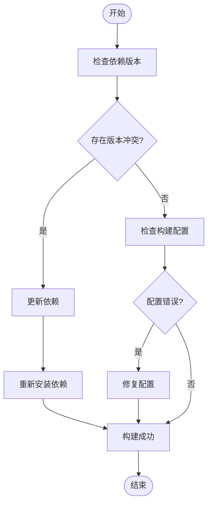
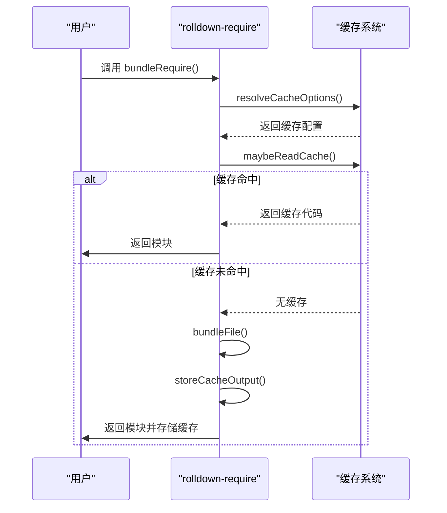
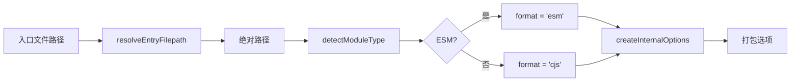
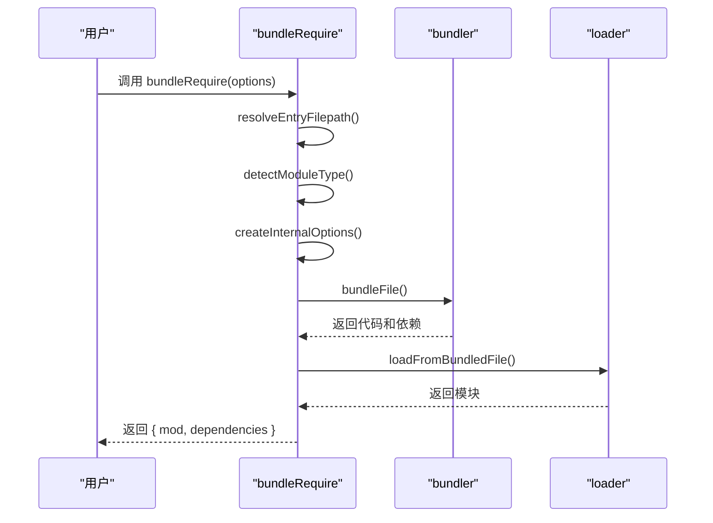
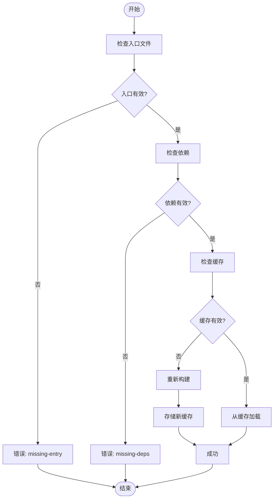

# 依赖调试

<cite>
**本文档中引用的文件**  
- [index.ts](file://packages/rolldown-require/src/index.ts)
- [cache.ts](file://packages/rolldown-require/src/cache.ts)
- [temp-output.ts](file://packages/rolldown-require/src/temp-output.ts)
- [options.ts](file://packages/rolldown-require/src/options.ts)
- [bundler.ts](file://packages/rolldown-require/src/bundler.ts)
- [loader.ts](file://packages/rolldown-require/src/loader.ts)
- [types.ts](file://packages/rolldown-require/src/types.ts)
- [debug.md](file://website/guide/debug.md)
- [options.md](file://website/packages/rolldown-require/options.md)
- [cache.md](file://website/packages/rolldown-require/cache.md)
- [package.json](file://packages/rolldown-require/package.json)
</cite>

## 目录
1. [简介](#简介)
2. [依赖构建失败与版本冲突](#依赖构建失败与版本冲突)
3. [缓存机制与调试](#缓存机制与调试)
4. [临时文件与构建过程调试](#临时文件与构建过程调试)
5. [依赖路径解析与模块别名调试](#依赖路径解析与模块别名调试)
6. [rolldown-require 的依赖处理流程](#rolldown-require-的依赖处理流程)
7. [错误处理与诊断步骤](#错误处理与诊断步骤)
8. [总结](#总结)

## 简介

`weapp-vite` 是一个现代化的小程序打包工具，其核心依赖处理由 `rolldown-require` 模块实现。该模块负责处理小程序中的 `require` 依赖，通过打包、缓存和加载机制确保依赖能够正确解析和执行。本文档旨在提供详细的依赖调试指南，帮助开发者解决 npm 包构建失败、依赖版本冲突和缓存问题。

**Section sources**
- [package.json](file://packages/weapp-vite/package.json#L1-L156)

## 依赖构建失败与版本冲突

依赖构建失败通常由以下原因引起：
- **npm 包版本冲突**：不同依赖项对同一包的版本要求不一致。
- **依赖解析失败**：无法正确解析模块路径或别名。
- **构建配置错误**：`tsconfig.json` 或 `vite.config.ts` 配置不当。

### 解决方案
1. **检查依赖版本**：使用 `pnpm why <package-name>` 查看依赖关系。
2. **更新依赖**：确保所有依赖项使用兼容的版本。
3. **清理缓存**：删除 `node_modules` 和 `.pnpm-store` 后重新安装。



**Diagram sources**
- [package.json](file://packages/weapp-vite/package.json#L98-L125)

## 缓存机制与调试

`rolldown-require` 提供了强大的缓存机制，以提高重复加载的性能。缓存配置可通过 `cache` 选项进行控制。

### 缓存配置选项
- **enabled**：启用或禁用缓存。
- **dir**：指定缓存目录，默认为 `node_modules/.rolldown-require-cache` 或系统临时目录。
- **reset**：在写入新缓存前清除现有缓存。
- **memory**：是否启用内存缓存，默认为 `true`。
- **onEvent**：接收缓存事件用于调试或指标收集。

### 调试缓存
1. **启用缓存日志**：通过 `onEvent` 回调输出缓存事件。
2. **强制重置缓存**：设置 `cache.reset: true` 以清除旧缓存。
3. **检查缓存文件**：查看 `.rolldown-require-cache` 目录下的缓存文件。



**Diagram sources**
- [cache.ts](file://packages/rolldown-require/src/cache.ts#L39-L286)
- [loader.ts](file://packages/rolldown-require/src/loader.ts#L26-L133)

**Section sources**
- [cache.ts](file://packages/rolldown-require/src/cache.ts#L15-L286)
- [types.ts](file://packages/rolldown-require/src/types.ts#L14-L37)

## 临时文件与构建过程调试

`rolldown-require` 在构建过程中会生成临时文件，这些文件可用于调试构建错误。

### preserveTemporaryFile 选项
- **preserveTemporaryFile**：设置为 `true` 可保留编译后的临时文件，便于检查生成的代码。
- 默认情况下，临时文件在加载后会被清理。

### 调试步骤
1. **启用临时文件保留**：在配置中设置 `preserveTemporaryFile: true`。
2. **检查临时输出**：查找 `node_modules/.rolldown-require` 或系统临时目录中的 `.bundled_*.js` 文件。
3. **分析生成代码**：检查生成的代码是否存在语法错误或逻辑问题。

```mermaid
classDiagram
class TempOutput {
+outfile : string
+cleanup : () => Promise~void~
+cacheMeta? : CacheMeta
}
class CacheMeta {
+format : 'cjs' | 'esm'
+codePath : string
+files : { path : string, mtimeMs : number, size : number }[]
}
class InternalOptions {
+isESM : boolean
+format : 'cjs' | 'esm'
+tsconfig? : string
+preserveTemporaryFile? : boolean
}
TempOutput --> CacheMeta : "包含"
InternalOptions --> TempOutput : "生成"
```

**Diagram sources**
- [temp-output.ts](file://packages/rolldown-require/src/temp-output.ts#L11-L81)
- [types.ts](file://packages/rolldown-require/src/types.ts#L114-L106)

**Section sources**
- [temp-output.ts](file://packages/rolldown-require/src/temp-output.ts#L1-L81)
- [loader.ts](file://packages/rolldown-require/src/loader.ts#L48-L70)

## 依赖路径解析与模块别名调试

`rolldown-require` 支持通过 `tsconfig.json` 中的 `paths` 选项进行模块别名解析。

### 路径解析流程
1. **自动搜索 tsconfig**：从入口文件所在目录向上搜索 `tsconfig.json`。
2. **读取 paths 配置**：使用 `get-tsconfig` 包读取 `paths` 选项。
3. **解析别名**：在打包过程中将别名替换为实际路径。

### 调试方法
1. **显式指定 tsconfig**：通过 `tsconfig` 选项指定配置文件路径。
2. **禁用 tsconfig 处理**：设置 `tsconfig: false` 以禁用路径解析。
3. **检查解析结果**：使用 `resolveEntryFilepath` 函数验证路径解析是否正确。



**Diagram sources**
- [options.ts](file://packages/rolldown-require/src/options.ts#L7-L47)
- [utils.ts](file://packages/rolldown-require/src/utils.ts#L131-L150)

**Section sources**
- [options.ts](file://packages/rolldown-require/src/options.ts#L1-L47)
- [utils.ts](file://packages/rolldown-require/src/utils.ts#L38-L46)

## rolldown-require 的依赖处理流程

`rolldown-require` 的核心流程包括解析、打包、加载三个阶段。

### 处理流程
1. **解析入口**：将相对路径转换为绝对路径，并推断模块格式。
2. **打包文件**：使用 `rolldown` 打包入口文件及其依赖。
3. **加载模块**：通过临时文件或内存加载打包后的代码。

### 关键函数
- **bundleRequire**：一站式函数，完成解析、打包、加载。
- **bundleFile**：执行打包操作，返回代码和依赖列表。
- **loadFromBundledFile**：加载打包后的代码，支持缓存。



**Diagram sources**
- [index.ts](file://packages/rolldown-require/src/index.ts#L11-L34)
- [bundler.ts](file://packages/rolldown-require/src/bundler.ts#L10-L119)
- [loader.ts](file://packages/rolldown-require/src/loader.ts#L26-L133)

**Section sources**
- [index.ts](file://packages/rolldown-require/src/index.ts#L1-L35)
- [bundler.ts](file://packages/rolldown-require/src/bundler.ts#L1-L147)

## 错误处理与诊断步骤

当构建失败时，应按照以下步骤进行诊断：

### 诊断步骤
1. **检查入口文件**：确保入口文件存在且可读。
2. **验证依赖**：确认所有依赖项已正确安装。
3. **启用详细日志**：设置 `cache.onEvent` 输出缓存事件。
4. **保留临时文件**：设置 `preserveTemporaryFile: true` 检查生成代码。
5. **重置缓存**：设置 `cache.reset: true` 清除可能损坏的缓存。

### 常见错误
- **missing-entry**：入口文件不存在。
- **format-mismatch**：缓存格式与当前请求不匹配。
- **stale-deps**：依赖文件已更改，缓存失效。
- **missing-code**：缓存代码文件丢失。



**Diagram sources**
- [cache.ts](file://packages/rolldown-require/src/cache.ts#L251-L268)
- [loader.ts](file://packages/rolldown-require/src/loader.ts#L129-L132)

**Section sources**
- [cache.ts](file://packages/rolldown-require/src/cache.ts#L8-L286)
- [loader.ts](file://packages/rolldown-require/src/loader.ts#L19-L133)

## 总结

`weapp-vite` 通过 `rolldown-require` 模块实现了高效且可靠的依赖处理机制。开发者可以通过配置缓存、保留临时文件和调试路径解析来解决常见的构建问题。理解其内部流程有助于快速定位和修复依赖相关的错误。