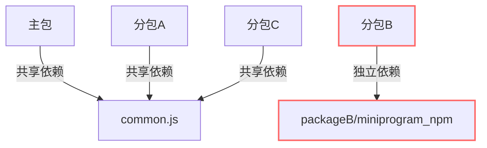
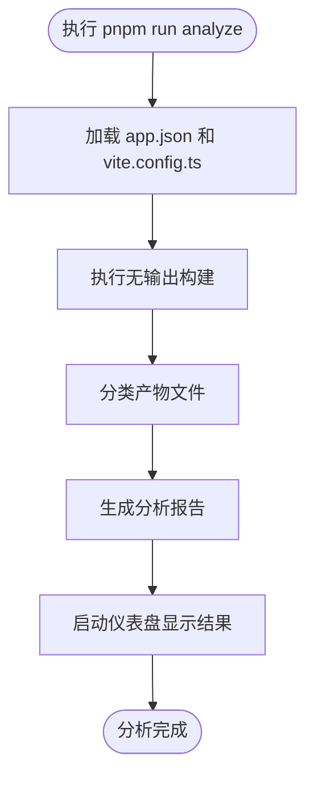

# 分包调试

<cite>
**本文档引用的文件 **   
- [vite.config.ts](file://apps/vite-native/vite.config.ts)
- [app.json.ts](file://apps/vite-native/app.json.ts)
- [independent-subpackage.ts](file://apps/vite-native/subpackage-demos/independent-subpackage.ts)
- [chunkStrategy.ts](file://packages/weapp-vite/src/runtime/chunkStrategy.ts)
- [analyze/subpackages.ts](file://packages/weapp-vite/src/analyze/subpackages.ts)
- [scanPlugin.ts](file://packages/weapp-vite/src/runtime/scanPlugin.ts)
- [core.ts](file://packages/weapp-vite/src/plugins/core.ts)
- [independentError.ts](file://packages/weapp-vite/src/runtime/independentError.ts)
- [commands/analyze.ts](file://packages/weapp-vite/src/cli/commands/analyze.ts)
- [commands/serve.ts](file://packages/weapp-vite/src/cli/commands/serve.ts)
</cite>

## 目录
1. [分包加载与依赖管理](#分包加载与依赖管理)
2. [独立分包上下文与依赖隔离](#独立分包上下文与依赖隔离)
3. [npm 依赖分布控制](#npm-依赖分布控制)
4. [产物结构分析](#产物结构分析)
5. [分包预加载与异步化](#分包预加载与异步化)
6. [构建日志与产物对比](#构建日志与产物对比)

## 分包加载与依赖管理

在 weapp-vite 构建系统中，分包的加载和依赖管理是通过 `app.json` 和 `vite.config.ts` 两个核心配置文件协同完成的。`app.json` 定义了分包的物理结构，包括分包根目录、页面列表和独立性标志；而 `vite.config.ts` 则提供了构建时的逻辑配置，如依赖声明和构建策略。

分包的加载过程由 `scanPlugin.ts` 中的 `createScanService` 函数负责。该函数在构建开始时扫描 `app.json` 文件，解析出所有分包的元数据（`SubPackageMetaValue`），并根据 `independent` 字段将独立分包和普通分包分别存储在 `independentSubPackageMap` 和 `subPackageMap` 两个映射表中。这一过程确保了构建系统能够准确识别每个分包的上下文。

当分包被加载时，其内部的模块依赖关系由 `chunkStrategy.ts` 中的 `resolveSharedChunkName` 函数进行分析。该函数根据模块的导入图（import graph）和分包的根目录，决定共享模块的最终归属。如果一个模块被多个分包引用，系统会根据 `sharedStrategy` 策略（默认为 `hoist`）将其提升到主包的 `common.js` 中，以避免代码重复。

**Section sources**
- [app.json.ts](file://apps/vite-native/app.json.ts#L22-L57)
- [scanPlugin.ts](file://packages/weapp-vite/src/runtime/scanPlugin.ts#L514-L546)
- [chunkStrategy.ts](file://packages/weapp-vite/src/runtime/chunkStrategy.ts#L76-L162)

## 独立分包上下文与依赖隔离

独立分包的核心特性是其拥有独立的运行时上下文，这通过在 `app.json` 中设置 `independent: true` 来实现。当一个分包被标记为独立时，它将获得一个完全隔离的依赖环境，这意味着它不会与主包或其他分包共享 `node_modules` 中的依赖。

在 `vite.config.ts` 中，可以通过 `weapp.subPackages` 配置项为独立分包指定其专属的依赖。例如，在 `apps/vite-native` 示例中，`packageB` 被定义为独立分包，并明确声明了其依赖 `tdesign-miniprogram` 和 `miniprogram-computed`。这种精确的依赖控制确保了独立分包的自包含性，使其可以独立于主包进行开发、测试和发布。

独立分包的构建过程由 `buildService` 中的 `getIndependentOutput` 方法触发。由于其上下文独立，构建系统会为独立分包创建一个独立的构建实例，该实例拥有自己的插件链和配置。这保证了独立分包的构建过程不会受到主包或其他分包的影响，从而实现了真正的依赖隔离。

**Diagram sources **
- [vite.config.ts](file://apps/vite-native/vite.config.ts#L89-L97)
- [app.json.ts](file://apps/vite-native/app.json.ts#L35-L46)

**Section sources**
- [vite.config.ts](file://apps/vite-native/vite.config.ts#L89-L99)
- [app.json.ts](file://apps/vite-native/app.json.ts#L35-L46)
- [independent-subpackage.ts](file://apps/vite-native/subpackage-demos/independent-subpackage.ts#L1-L3)

## npm 依赖分布控制

对 npm 依赖的精确控制是分包调试的关键。weapp-vite 通过 `weapp.subPackages.dependencies` 配置项来实现这一功能。开发者可以在此处声明一个分包所需的特定 npm 包，构建系统会将这些依赖复制到分包的 `miniprogram_npm` 目录下。

在 `npmPlugin.ts` 文件中，`checkDependenciesCacheOutdate` 和 `writeDependenciesCache` 函数负责管理依赖的缓存。当分包的依赖列表发生变化时，系统会检测到缓存过期，并重新执行依赖复制操作。`filter` 函数确保只有在 `dependencies` 数组中声明的包才会被复制，从而避免了不必要的文件拷贝。

对于独立分包，这种控制尤为重要。由于独立分包不共享主包的依赖，所有必需的 npm 包都必须显式声明。例如，如果 `packageB` 需要使用 `lodash`，就必须在 `vite.config.ts` 中将其添加到 `dependencies` 数组中。否则，构建时会出现模块找不到的错误。

**Section sources**
- [vite.config.ts](file://apps/vite-native/vite.config.ts#L90-L97)
- [npmPlugin.ts](file://packages/weapp-vite/src/runtime/npmPlugin.ts#L308-L331)

## 产物结构分析

分析产物结构是调试分包问题的有效手段。weapp-vite 提供了 `pnpm run analyze` 命令，该命令会启动一个分析仪表盘，直观地展示主包、分包和共享 chunk 的资源分布。

该功能的核心实现在于 `analyze/subpackages.ts` 文件中的 `analyzeSubpackages` 函数。该函数首先加载应用入口和所有分包，然后通过 `build` 函数执行一次无输出的构建（`write: false`），以获取完整的产物对象（`RolldownOutput`）。接着，它遍历产物中的所有 chunk 和 asset，根据文件路径将其分类到主包、分包或虚拟包中。

分析结果以 `AnalyzeSubpackagesResult` 接口的形式返回，包含 `packages`、`modules` 和 `subPackages` 三个主要部分。`packages` 报告了每个包（主包、分包）中包含的文件及其大小；`modules` 则展示了每个模块被哪些包引用，这对于定位共享模块的分布非常有帮助。

**Diagram sources **
- [commands/analyze.ts](file://packages/weapp-vite/src/cli/commands/analyze.ts#L96-L102)
- [analyze/subpackages.ts](file://packages/weapp-vite/src/analyze/subpackages.ts#L539-L600)

**Section sources**
- [commands/analyze.ts](file://packages/weapp-vite/src/cli/commands/analyze.ts#L77-L135)
- [analyze/subpackages.ts](file://packages/weapp-vite/src/analyze/subpackages.ts#L1-L601)

## 分包预加载与异步化

分包的预加载（preloadRule）和异步化（lazyCodeLoading）是优化小程序启动性能的重要手段。`lazyCodeLoading: 'requiredComponents'` 配置项指示小程序框架只在需要时才加载分包，而不是在启动时全部加载。

然而，在构建过程中，Vite 的模块解析机制可能会在 `app.js` 中注入对分包页面的 `require` 语句，这会导致分包被提前加载，违背了懒加载的初衷。为了解决这个问题，weapp-vite 在 `core.ts` 插件中实现了 `removeImplicitPagePreloads` 函数。

该函数在构建的最后阶段扫描 `app.js` 的代码，通过正则表达式匹配并移除所有对分包页面的 `require` 语句。同时，它也会从 `imports` 数组和 `implicitlyLoadedBefore` 元数据中移除相应的条目，确保产物的正确性。这一过程保证了分包的加载完全由小程序框架的懒加载机制控制。

**Section sources**
- [app.json.ts](file://apps/vite-native/app.json.ts#L60)
- [core.ts](file://packages/weapp-vite/src/plugins/core.ts#L684-L739)

## 构建日志与产物对比

构建日志是诊断分包问题的第一手资料。当独立分包构建失败时，`independentError.ts` 文件中的 `createIndependentBuildError` 函数会捕获底层的构建错误，并将其包装成一个更具可读性的错误信息。该函数会递归地提取错误对象中的 `message`、`reason`、`cause` 等字段，尝试生成一个清晰的错误摘要。

对于产物对比，`apps/vite-native` 中的独立分包示例是绝佳的案例。通过对比 `packageA`（普通分包）、`packageB`（独立分包）和主包的产物，可以清晰地看到依赖隔离的效果。`packageB` 的产物中会包含其独有的 `miniprogram_npm` 目录，而 `packageA` 则会共享主包的依赖。

此外，`analyze` 命令的输出可以用来进行精确的产物对比。通过比较 `packages` 数组中不同分包的 `files` 列表，可以发现哪些共享模块被正确地提升到了主包，哪些模块被错误地复制到了多个分包中，从而指导开发者调整分包划分或依赖配置。

**Section sources**
- [independentError.ts](file://packages/weapp-vite/src/runtime/independentError.ts#L99-L159)
- [commands/serve.ts](file://packages/weapp-vite/src/cli/commands/serve.ts#L52-L72)
- [apps/vite-native](file://apps/vite-native)