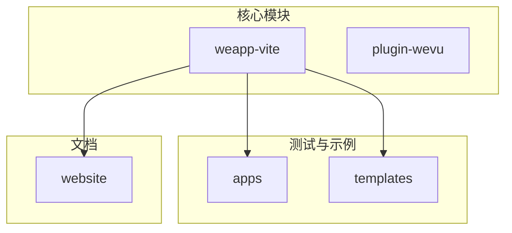
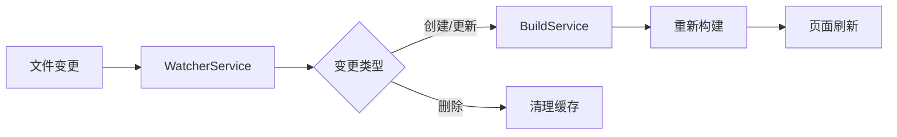
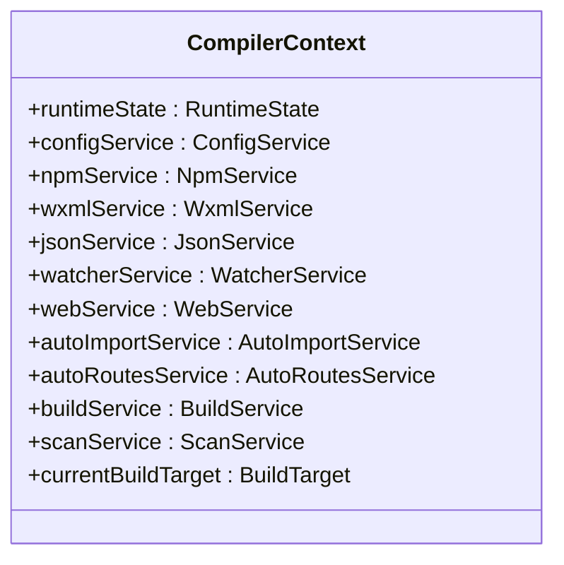
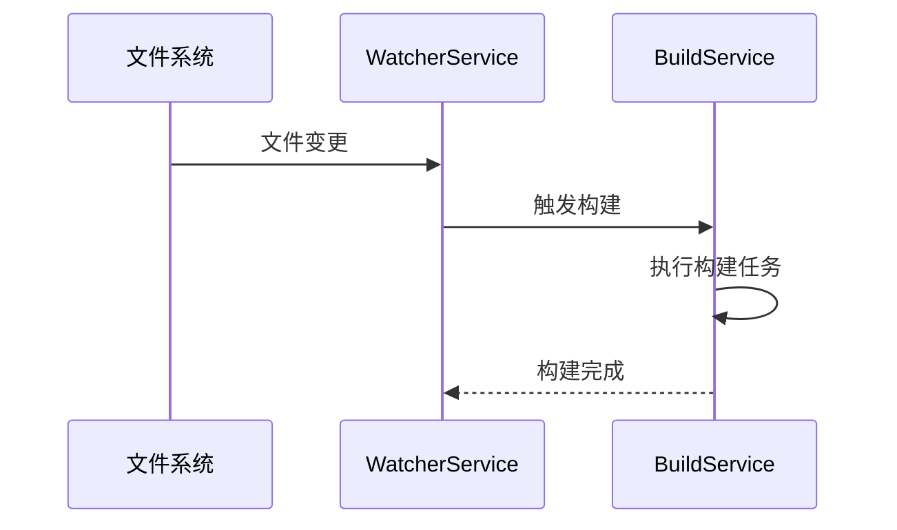
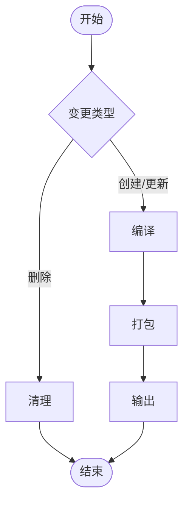
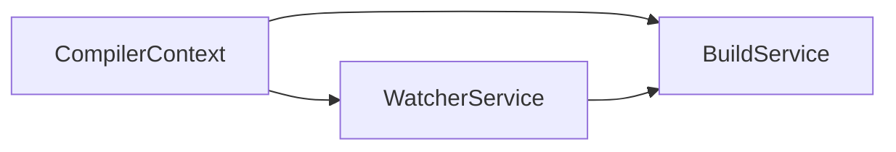

# 热更新调试

<cite>
**本文档引用的文件**  
- [CompilerContext.ts](file://packages/weapp-vite/src/context/CompilerContext.ts)
- [invalidateEntry.ts](file://packages/weapp-vite/src/plugins/utils/invalidateEntry.ts)
- [watcherPlugin.ts](file://packages/weapp-vite/src/runtime/watcherPlugin.ts)
- [buildPlugin.ts](file://packages/weapp-vite/src/runtime/buildPlugin.ts)
- [autoRoutes.ts](file://packages/weapp-vite/src/plugins/autoRoutes.ts)
- [addModulesHot.ts](file://packages/weapp-vite/src/plugins/utils/addModulesHot.ts)
- [watch-no-npm.test.ts](file://packages/weapp-vite/test/watch-no-npm.test.ts)
- [watch-no-subpackage.test.ts](file://packages/weapp-vite/test/watch-no-subpackage.test.ts)
- [watch.test.ts](file://packages/weapp-vite/test/watch.test.ts)
</cite>

## 目录

1. [简介](#简介)
2. [项目结构](#项目结构)
3. [核心组件](#核心组件)
4. [架构概述](#架构概述)
5. [详细组件分析](#详细组件分析)
6. [依赖分析](#依赖分析)
7. [性能考虑](#性能考虑)
8. [故障排除指南](#故障排除指南)
9. [结论](#结论)

## 简介

weapp-vite 是一个用于微信小程序开发的构建工具，支持热更新（HMR）功能，能够在开发过程中实时反映代码变更。然而，在实际使用中，开发者可能会遇到文件变更未触发重新构建或页面未刷新的问题。本指南旨在深入分析 weapp-vite 的文件监听机制和编译上下文（CompilerContext），帮助开发者理解和解决 HMR 失败的常见问题。

## 项目结构

weapp-vite 项目的结构清晰，主要分为以下几个部分：
- `@weapp-core/`: 核心初始化和配置管理。
- `apps/`: 示例应用和测试用例。
- `packages/`: 主要功能包，包括 `weapp-vite`、`plugin-wevu` 等。
- `templates/`: 项目模板。
- `website/`: 官方网站和文档。

**图表来源**
- [CompilerContext.ts](file://packages/weapp-vite/src/context/CompilerContext.ts)
- [invalidateEntry.ts](file://packages/weapp-vite/src/plugins/utils/invalidateEntry.ts)

**章节来源**
- [CompilerContext.ts](file://packages/weapp-vite/src/context/CompilerContext.ts)
- [invalidateEntry.ts](file://packages/weapp-vite/src/plugins/utils/invalidateEntry.ts)

## 核心组件

weapp-vite 的核心组件主要包括 CompilerContext、WatcherService 和 BuildService。这些组件协同工作，确保文件变更能够被正确检测并触发相应的构建和刷新操作。

**章节来源**
- [CompilerContext.ts](file://packages/weapp-vite/src/context/CompilerContext.ts)
- [watcherPlugin.ts](file://packages/weapp-vite/src/runtime/watcherPlugin.ts)
- [buildPlugin.ts](file://packages/weapp-vite/src/runtime/buildPlugin.ts)

## 架构概述

weapp-vite 的架构设计遵循模块化原则，各组件职责明确，通过 CompilerContext 统一管理。WatcherService 负责监听文件变化，BuildService 负责执行构建任务，而 CompilerContext 则作为全局状态管理器，协调各个服务的工作。

**图表来源**
- [watcherPlugin.ts](file://packages/weapp-vite/src/runtime/watcherPlugin.ts)
- [buildPlugin.ts](file://packages/weapp-vite/src/runtime/buildPlugin.ts)

## 详细组件分析

### CompilerContext 分析

CompilerContext 是 weapp-vite 的核心数据结构，包含了运行时状态、配置服务、NPM 服务、WXML 服务、JSON 服务、Watcher 服务、Web 服务、自动导入服务、自动路由服务、构建服务和扫描服务等。它作为全局上下文，为其他组件提供必要的信息和支持。

**图表来源**
- [CompilerContext.ts](file://packages/weapp-vite/src/context/CompilerContext.ts)

**章节来源**
- [CompilerContext.ts](file://packages/weapp-vite/src/context/CompilerContext.ts)

### WatcherService 分析

WatcherService 负责监听文件系统的变化，当检测到文件变更时，会触发相应的事件。它通过 chokidar 库实现文件监听，并将变更事件传递给 BuildService 进行处理。

**图表来源**
- [watcherPlugin.ts](file://packages/weapp-vite/src/runtime/watcherPlugin.ts)
- [buildPlugin.ts](file://packages/weapp-vite/src/runtime/buildPlugin.ts)

**章节来源**
- [watcherPlugin.ts](file://packages/weapp-vite/src/runtime/watcherPlugin.ts)
- [buildPlugin.ts](file://packages/weapp-vite/src/runtime/buildPlugin.ts)

### BuildService 分析

BuildService 负责执行具体的构建任务，包括编译、打包和输出。它接收来自 WatcherService 的变更事件，根据变更类型执行相应的构建逻辑。

**图表来源**
- [buildPlugin.ts](file://packages/weapp-vite/src/runtime/buildPlugin.ts)

**章节来源**
- [buildPlugin.ts](file://packages/weapp-vite/src/runtime/buildPlugin.ts)

## 依赖分析

weapp-vite 的各个组件之间存在紧密的依赖关系。CompilerContext 作为中心节点，连接了所有其他服务。WatcherService 依赖于 CompilerContext 获取配置信息，并将变更事件传递给 BuildService。BuildService 依赖于 CompilerContext 中的多个服务来完成构建任务。

**图表来源**
- [CompilerContext.ts](file://packages/weapp-vite/src/context/CompilerContext.ts)
- [watcherPlugin.ts](file://packages/weapp-vite/src/runtime/watcherPlugin.ts)
- [buildPlugin.ts](file://packages/weapp-vite/src/runtime/buildPlugin.ts)

**章节来源**
- [CompilerContext.ts](file://packages/weapp-vite/src/context/CompilerContext.ts)
- [watcherPlugin.ts](file://packages/weapp-vite/src/runtime/watcherPlugin.ts)
- [buildPlugin.ts](file://packages/weapp-vite/src/runtime/buildPlugin.ts)

## 性能考虑

weapp-vite 在设计时充分考虑了性能优化。通过异步处理和缓存机制，减少了不必要的文件读写和编译操作。此外，使用 chokidar 库进行文件监听，能够高效地处理大量文件的变更事件。

## 故障排除指南

### 常见 HMR 失败场景

1. **静态路径拼接**：如果文件路径是通过字符串拼接生成的，weapp-vite 可能无法正确识别这些路径，导致 HMR 失败。
2. **自定义组件未注册**：自定义组件需要在 app.json 中正确注册，否则无法触发 HMR。
3. **文件监听被意外关闭**：某些情况下，文件监听服务可能被意外关闭，导致 HMR 无法正常工作。

### 使用调试工具

weapp-vite 提供了 `weapp.debug.watchFiles` 和 `weapp.debug.resolveId` 两个调试工具，可以帮助开发者验证文件是否被正确扫描和解析。

- `weapp.debug.watchFiles`：列出当前被监听的所有文件。
- `weapp.debug.resolveId`：解析指定文件的 ID，检查其是否被正确识别。

### 恢复监听服务

如果文件监听服务被关闭，可以通过调用 `context.watcherService.closeAll()` 方法重新启动监听服务。

**章节来源**
- [watch-no-npm.test.ts](file://packages/weapp-vite/test/watch-no-npm.test.ts)
- [watch-no-subpackage.test.ts](file://packages/weapp-vite/test/watch-no-subpackage.test.ts)
- [watch.test.ts](file://packages/weapp-vite/test/watch.test.ts)

## 结论

weapp-vite 的热更新功能依赖于复杂的文件监听和编译机制。通过深入理解 CompilerContext、WatcherService 和 BuildService 的工作原理，开发者可以更好地利用这一功能，提高开发效率。同时，掌握常见的 HMR 失败场景和调试方法，有助于快速定位和解决问题。