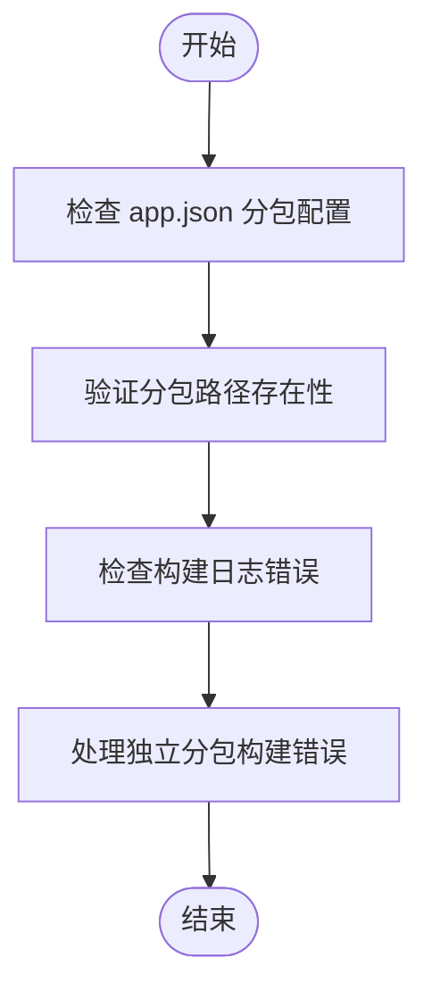
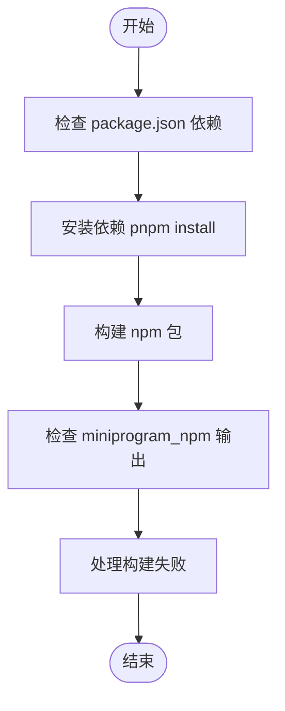
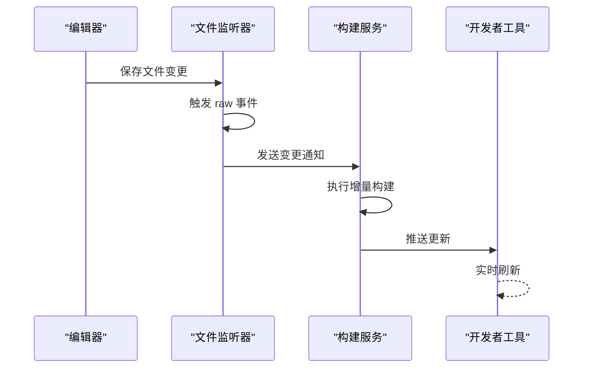
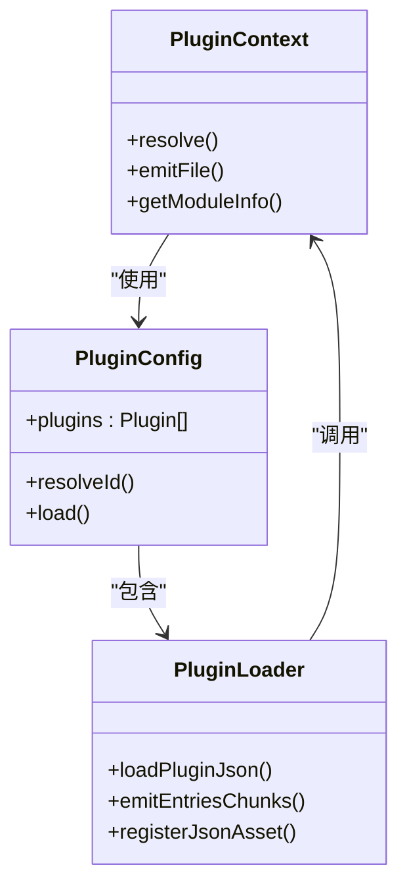

# 特定场景调试

<cite>
**本文档中引用的文件**  
- [debug.md](file://website/guide/debug.md)
- [troubleshoot/index.md](file://website/troubleshoot/index.md)
- [createContext.ts](file://packages/weapp-vite/src/createContext.ts)
- [watcherPlugin.ts](file://packages/weapp-vite/src/runtime/watcherPlugin.ts)
- [npmPlugin.ts](file://packages/weapp-vite/src/runtime/npmPlugin.ts)
- [independentError.ts](file://packages/weapp-vite/src/runtime/independentError.ts)
- [subpackages.ts](file://packages/weapp-vite/src/analyze/subpackages.ts)
- [vite.config.ts](file://apps/vite-native/vite.config.ts)
- [vite.config.mts](file://apps/plugin-demo/vite.config.mts)
- [project.config.json](file://apps/vite-native/project.config.json)
</cite>

## 目录
1. [引言](#引言)
2. [分包问题调试](#分包问题调试)
3. [依赖管理问题调试](#依赖管理问题调试)
4. [热更新问题调试](#热更新问题调试)
5. [插件系统问题调试](#插件系统问题调试)
6. [复杂调试案例研究](#复杂调试案例研究)
7. [配置检查清单与最佳实践](#配置检查清单与最佳实践)

## 引言
weapp-vite 是一个现代化的小程序打包工具，为开发者提供现代化的开发体验。本指南旨在为使用 weapp-vite 的高级功能时遇到的特定场景提供详细的调试方法。重点涵盖分包加载失败、依赖版本冲突、热更新失效以及插件加载异常等常见问题。通过系统化的诊断步骤、错误模式分析和解决方案，帮助开发者快速定位并解决复杂问题。

**Section sources**
- [README.md](file://README.md#L1-L52)
- [debug.md](file://website/guide/debug.md#L1-L63)

## 分包问题调试

### 分包加载失败
分包加载失败通常表现为小程序运行时无法找到分包路径或资源。可能的原因包括：
- 分包配置未正确写入 `app.json`
- 分包根目录不存在或路径错误
- 独立分包构建失败

诊断步骤：
1. 检查 `app.json` 中的 `subPackages` 或 `subpackages` 字段是否包含正确的分包路径和入口文件。
2. 确认分包目录在源码中存在且结构正确。
3. 查看构建日志是否有 `Independent bundle for ${root} failed` 错误信息。

解决方案：
- 使用 `weapp.debug.watchFiles` 配置输出监听文件列表，确认分包文件是否被正确扫描。
- 检查 `project.config.json` 中的 `packOptions.ignore` 是否误排除了分包文件。

### 分包依赖冲突
当多个分包引入相同依赖但版本不一致时，可能导致运行时行为异常。

诊断步骤：
1. 使用 `npm ls <package-name>` 检查依赖树中是否存在多个版本。
2. 在构建日志中查找重复依赖警告。

解决方案：
- 统一项目中所有分包的依赖版本。
- 使用 `resolutions` 字段在 `package.json` 中强制指定依赖版本。



**Diagram sources**
- [subpackages.ts](file://packages/weapp-vite/src/analyze/subpackages.ts#L503-L550)
- [independentError.ts](file://packages/weapp-vite/src/runtime/independentError.ts#L99-L159)

**Section sources**
- [subpackages.ts](file://packages/weapp-vite/src/analyze/subpackages.ts#L503-L550)
- [independentError.ts](file://packages/weapp-vite/src/runtime/independentError.ts#L99-L159)

## 依赖管理问题调试

### npm包构建失败
npm包构建失败通常由于包本身不兼容小程序环境或缺少必要配置。

常见错误模式：
- 构建时报错 "无法解析模块"
- 生成的 `miniprogram_npm` 目录缺失目标包

诊断步骤：
1. 确认该npm包是否支持小程序环境。
2. 检查 `vite.config.ts` 中是否正确配置了 `weapp.npm` 选项。
3. 查看 `node_modules` 中是否存在该包。

解决方案：
- 对于UMD/CJS模块，重命名为 `.cjs` 后缀或使用 `require()` 显式引入。
- 在 `vite.config.ts` 中添加 `optimizeDeps.include` 强制预构建。

### 依赖版本冲突
依赖版本冲突可能导致API不一致或运行时错误。

诊断步骤：
1. 使用 `pnpm why <package>` 查看依赖关系。
2. 检查 `package-lock.json` 或 `pnpm-lock.yaml` 中的版本锁定情况。

解决方案：
- 使用 `resolutions` 字段统一版本。
- 清理 `node_modules` 和锁文件后重新安装。



**Diagram sources**
- [npmPlugin.ts](file://packages/weapp-vite/src/runtime/npmPlugin.ts#L17-L210)
- [vite.config.ts](file://apps/vite-native/vite.config.ts#L1-L50)

**Section sources**
- [npmPlugin.ts](file://packages/weapp-vite/src/runtime/npmPlugin.ts#L17-L210)
- [@weapp-core/init/src/npm.ts](file://@weapp-core/init/src/npm.ts#L1-L51)

## 热更新问题调试

### 文件变更未触发重新构建
热更新失效是开发过程中常见的问题。

诊断步骤：
1. 检查文件是否在 `weapp.debug.watchFiles` 的监听范围内。
2. 查看控制台是否有 `watcher.on('event')` 的 `END` 事件。
3. 确认编辑器是否正确保存了文件变更。

解决方案：
- 在 `vite.config.ts` 中显式配置 `server.watch` 选项。
- 重启开发服务器以重置监听器状态。
- 检查操作系统文件监视限制（如inotify watches）。



**Diagram sources**
- [watcherPlugin.ts](file://packages/weapp-vite/src/runtime/watcherPlugin.ts#L1-L76)
- [buildPlugin.ts](file://packages/weapp-vite/src/runtime/buildPlugin.ts#L202-L275)

**Section sources**
- [watcherPlugin.ts](file://packages/weapp-vite/src/runtime/watcherPlugin.ts#L1-L76)
- [watch-rebuild.test.ts](file://packages/weapp-vite/test/watch-rebuild.test.ts#L1-L42)

## 插件系统问题调试

### 插件加载失败
插件加载失败通常表现为 `requirePlugin` 报错或找不到插件入口。

诊断步骤：
1. 检查 `plugin.json` 是否存在且配置正确。
2. 确认插件主入口文件路径是否正确。
3. 查看构建日志中是否有插件相关错误。

解决方案：
- 确保 `plugin.json` 中的 `main` 字段指向正确的入口文件。
- 检查插件目录结构是否符合规范。

### 插件冲突
多个插件之间可能存在依赖或命名冲突。

诊断步骤：
1. 检查是否有重复的组件名称。
2. 查看全局变量是否被覆盖。

解决方案：
- 使用命名空间隔离插件代码。
- 在 `vite.config.ts` 中配置插件加载顺序。



**Diagram sources**
- [useLoadEntry/loadEntry.test.ts](file://packages/weapp-vite/src/plugins/hooks/useLoadEntry/loadEntry.test.ts#L343-L438)
- [vite.config.mts](file://apps/plugin-demo/vite.config.mts#L1-L20)

**Section sources**
- [useLoadEntry/loadEntry.test.ts](file://packages/weapp-vite/src/plugins/hooks/useLoadEntry/loadEntry.test.ts#L343-L438)
- [plugin.md](file://website/guide/plugin.md#L133-L141)

## 复杂调试案例研究

### 案例：分包共享依赖构建失败
问题描述：在使用分包共享机制时，公共依赖未能正确提取到主包。

诊断过程：
1. 启用 `weapp.debug.watchFiles` 查看文件监听情况。
2. 发现共享文件未被正确识别为公共依赖。
3. 检查 `vite.config.ts` 中的 `shared` 配置。

根本原因：`shared` 配置路径未包含分包内的共享模块。

解决方案：
```ts
// vite.config.ts
export default defineConfig({
  weapp: {
    shared: [
      'src/shared/**',
      'src/packageA/shared/**',
      'src/packageB/shared/**'
    ]
  }
})
```

验证结果：重新构建后，共享依赖被正确提取并可在各分包间访问。

**Section sources**
- [shared-chunks/project.private.config.json](file://packages/weapp-vite/test/fixtures/shared-chunks/project.private.config.json#L1-L8)
- [subpackage-shared-chunks/vite.config.ts](file://apps/subpackage-shared-chunks/vite.config.ts#L1-L30)

## 配置检查清单与最佳实践

### 分包配置检查清单
- [ ] `app.json` 中正确配置 `subPackages`
- [ ] 分包目录存在且结构正确
- [ ] 独立分包设置合理
- [ ] 共享依赖配置完整

### 依赖管理最佳实践
- 统一依赖版本，避免冲突
- 定期更新依赖并测试兼容性
- 使用 `resolutions` 锁定关键依赖版本
- 对大型npm包进行性能评估

### 热更新优化建议
- 合理配置文件监听范围
- 避免监听不必要的大文件
- 使用SSD提升文件IO性能
- 定期重启开发服务器释放内存

### 插件开发规范
- 遵循官方插件目录结构
- 提供完整的 `plugin.json` 配置
- 避免全局变量污染
- 文档化API接口

**Section sources**
- [project.config.json](file://apps/vite-native/project.config.json#L1-L10)
- [vite.config.ts](file://apps/vite-native/vite.config.ts#L1-L50)
- [troubleshoot/index.md](file://website/troubleshoot/index.md#L1-L50)