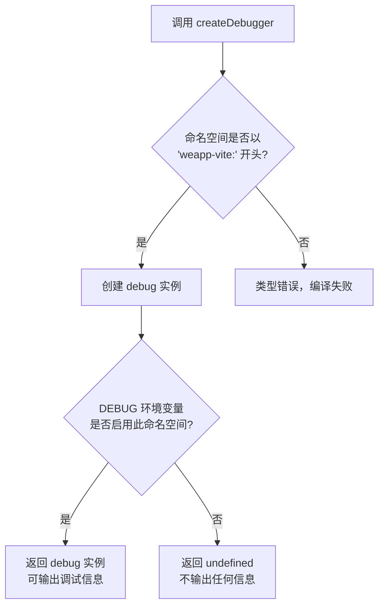

# 日志系统

<cite>
**本文档中引用的文件**  
- [@weapp-core/logger/src/index.ts](file://@weapp-core/logger/src/index.ts)
- [packages/weapp-vite/src/logger.ts](file://packages/weapp-vite/src/logger.ts)
- [packages/weapp-vite/src/cli/types.ts](file://packages/weapp-vite/src/cli/types.ts)
- [packages/weapp-vite/src/debugger.ts](file://packages/weapp-vite/src/debugger.ts)
- [packages/weapp-vite/src/cli/analyze/dashboard.ts](file://packages/weapp-vite/src/cli/analyze/dashboard.ts)
- [packages/weapp-vite/src/cli/commands/analyze.ts](file://packages/weapp-vite/src/cli/commands/analyze.ts)
- [packages/weapp-ide-cli/src/logger.ts](file://packages/weapp-ide-cli/src/logger.ts)
- [packages/plugin-wevu/src/plugin.ts](file://packages/plugin-wevu/src/plugin.ts)
- [packages/weapp-vite/test/debugger.test.ts](file://packages/weapp-vite/test/debugger.test.ts)
</cite>

## 目录
1. [简介](#简介)
2. [日志级别与使用方法](#日志级别与使用方法)
3. [日志格式与输出位置](#日志格式与输出位置)
4. [日志系统配置](#日志系统配置)
5. [代码示例与使用场景](#代码示例与使用场景)
6. [日志解读与问题诊断](#日志解读与问题诊断)
7. [与其他调试工具的集成](#与其他调试工具的集成)
8. [总结](#总结)

## 简介

weapp-vite 的日志系统基于 `consola` 库构建，提供了一套统一、结构化的日志记录机制。该系统被多个核心模块（如 `@weapp-core/logger`、`weapp-vite` 和 `weapp-ide-cli`）所共享，确保了整个工具链中日志行为的一致性。日志系统支持多种日志级别，可通过命令行参数或配置文件进行灵活控制，是开发、调试和监控 weapp-vite 应用的重要工具。

**Section sources**
- [@weapp-core/logger/src/index.ts](file://@weapp-core/logger/src/index.ts)
- [packages/weapp-vite/src/logger.ts](file://packages/weapp-vite/src/logger.ts)

## 日志级别与使用方法

weapp-vite 的日志系统定义了四种主要的日志级别，用于区分消息的重要性和严重性。

### 日志级别说明

| 日志级别 | 用途说明 |
| :--- | :--- |
| `debug` | 用于输出详细的调试信息，通常在开发和问题排查时使用。默认情况下可能不显示，需要通过 `--debug` 参数启用。 |
| `info` | 用于记录程序的常规运行信息，如启动成功、配置加载、关键步骤完成等。对用户有提示作用。 |
| `warn` | 用于记录潜在的问题或非致命的异常情况。程序可以继续运行，但可能需要用户注意或干预。 |
| `error` | 用于记录导致功能失败或程序中断的严重错误。必须立即处理。 |

此外，还定义了一个特殊的 `silent` 级别，用于完全关闭所有日志输出。

### 使用方法

日志实例通过 `@weapp-core/logger` 模块导出，并在 `weapp-vite` 和 `weapp-ide-cli` 等包中被直接引用。开发者可以通过导入该实例来记录日志。

```typescript
import logger from '@weapp-core/logger'

// 记录不同级别的日志
logger.debug('这是一个调试信息')
logger.info('项目构建已开始')
logger.warn('未找到模板，将使用默认配置')
logger.error('配置文件写入失败', error)
```

**Section sources**
- [packages/weapp-vite/src/logger.ts](file://packages/weapp-vite/src/logger.ts#L5-L6)
- [@weapp-core/init/src/createProject.ts](file://@weapp-core/init/src/createProject.ts#L57)
- [@weapp-core/init/src/packageJson.ts](file://@weapp-core/init/src/packageJson.ts#L66)
- [packages/plugin-wevu/src/plugin.ts](file://packages/plugin-wevu/src/plugin.ts#L61)

## 日志格式与输出位置

### 日志格式设计

weapp-vite 的日志格式设计注重可读性和信息完整性。虽然具体的格式由底层的 `consola` 库决定，但通常包含以下元素：
- **时间戳**：记录日志产生的时间。
- **日志级别**：以不同颜色或前缀标识（如 `[INFO]`、`[WARN]`）。
- **消息内容**：开发者提供的主要信息。
- **上下文信息**：在某些情况下，会包含错误堆栈或其他相关数据。

这种结构化的格式使得日志易于扫描和理解。

### 输出位置

日志默认输出到**控制台**（Console），这是最常见的日志输出方式，便于开发者实时查看应用状态。

目前的代码分析未发现明确的日志文件输出配置。日志系统主要依赖 `consola` 的默认行为，将日志直接打印到标准输出（stdout）和标准错误（stderr）。如果需要将日志持久化到文件，可能需要通过操作系统的重定向功能（如 `weapp-vite build > log.txt`）或在更高层的应用中进行配置。

**Section sources**
- [@weapp-core/logger/src/index.ts](file://@weapp-core/logger/src/index.ts#L1-L3)

## 日志系统配置

weapp-vite 提供了多种方式来配置日志系统，主要是通过命令行参数来控制日志级别和行为。

### 通过命令行参数配置

在 `GlobalCLIOptions` 接口中定义了多个与日志相关的选项：

| 命令行参数 | 短标志 | 作用 |
| :--- | :--- | :--- |
| `--logLevel` | `-l` | 设置日志级别。可选值为 `error`、`warn`、`info`、`debug` 或 `silent`。例如：`weapp-vite --logLevel debug` |
| `--debug` | `-d` | 启用调试模式。当此标志存在时，会启用 `debug` 级别的日志输出。可以指定一个字符串来过滤调试信息的命名空间。 |

这些参数在 CLI 解析时被处理，并最终影响日志实例的行为。

### 通过配置文件配置

目前的代码分析未发现通过项目配置文件（如 `vite.config.ts` 或 `project.config.json`）直接设置日志级别的机制。日志配置主要依赖于运行时的命令行参数。

**Section sources**
- [packages/weapp-vite/src/cli/types.ts](file://packages/weapp-vite/src/cli/types.ts#L8-L12)

## 代码示例与使用场景

以下是一些在 weapp-vite 代码库中使用日志的实际示例。

### 场景一：分析仪表盘启动

当启动分包分析仪表盘时，系统会输出一系列信息日志：

```typescript
logger.info('分析仪表盘已启动（实时模式），按 Ctrl+C 退出。')
logger.info(`分包分析仪表盘：${url}`)
```

这为用户提供了清晰的操作指引和访问地址。

**Section sources**
- [packages/weapp-vite/src/cli/analyze/dashboard.ts](file://packages/weapp-vite/src/cli/analyze/dashboard.ts#L158-L160)

### 场景二：处理配置文件

在创建项目时，如果未找到特定的配置文件，系统会记录一条信息日志：

```typescript
logger.info(`✨ 没有找到 ${projectConfigFilename} 文件，正在使用默认模板创建...`)
```

如果写入配置文件失败，则会记录一条错误日志：

```typescript
logger.error(`⚠️ 设置 ${projectConfigFilename} 配置文件失败`, error)
```

这有助于用户了解配置状态和排查问题。

**Section sources**
- [@weapp-core/init/src/projectConfig.ts](file://@weapp-core/init/src/projectConfig.ts#L102-L123)

### 场景三：插件错误处理

在 `plugin-wevu` 插件中，当遇到错误时，会直接使用共享的日志实例进行记录：

```typescript
logger.error(message)
```

这确保了错误信息能够被统一捕获和展示。

**Section sources**
- [packages/plugin-wevu/src/plugin.ts](file://packages/plugin-wevu/src/plugin.ts#L61)

## 日志解读与问题诊断

解读日志是诊断问题的关键步骤。以下是一些指导原则：

1.  **从 `error` 级别开始**：首先查找 `error` 级别的日志，它们通常指向问题的根源。结合错误堆栈可以定位到具体的代码行。
2.  **关注 `warn` 级别**：`warn` 日志可能揭示了潜在的配置错误或不推荐的用法，长期忽略可能导致问题。
3.  **利用 `info` 级别追踪流程**：`info` 日志可以帮助你理解程序的执行流程，确认某个功能是否被正确触发。
4.  **启用 `debug` 级别获取细节**：当标准日志不足以定位问题时，使用 `--debug` 参数启动应用，获取更详细的内部状态信息。

例如，如果遇到构建失败，应首先检查是否有 `error` 日志，然后查看失败前的 `info` 日志以了解最后执行的步骤。

## 与其他调试工具的集成

weapp-vite 的日志系统与 `debug` 库进行了集成，提供了更精细的调试能力。

### `debug` 调试器

`weapp-vite` 定义了一个 `createDebugger` 函数，用于创建一个命名空间化的调试器实例。

```typescript
export function createDebugger(namespace: `weapp-vite:${string}`) {
  const debug = createDebug(namespace)
  if (debug.enabled) {
    return debug
  }
}
```

这个函数确保了所有调试信息都以 `weapp-vite:` 开头，便于管理和过滤。只有当通过环境变量（如 `DEBUG=weapp-vite:*`）启用了相应的命名空间时，调试器才会返回一个可用的实例。

**Diagram sources**
- [packages/weapp-vite/src/debugger.ts](file://packages/weapp-vite/src/debugger.ts#L8-L13)



**Diagram sources**
- [packages/weapp-vite/src/debugger.ts](file://packages/weapp-vite/src/debugger.ts#L8-L13)
- [packages/weapp-vite/test/debugger.test.ts](file://packages/weapp-vite/test/debugger.test.ts#L18-L49)

## 总结

weapp-vite 的日志系统是一个基于 `consola` 的强大工具，它通过清晰的日志级别（`debug`、`info`、`warn`、`error`）和灵活的配置方式（命令行参数）为开发者提供了全面的运行时洞察。日志默认输出到控制台，格式清晰，便于阅读。通过与 `debug` 库的集成，系统还支持更精细的、按模块划分的调试。正确使用和解读日志是高效开发和快速解决问题的基础。