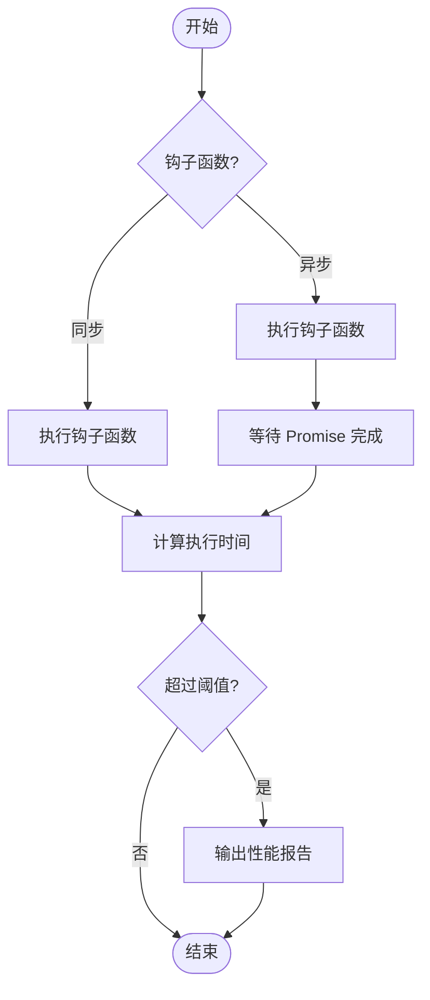

# 调试工具

<cite>
**本文档引用的文件**
- [debugger.ts](file://packages/weapp-vite/src/debugger.ts)
- [logger.ts](file://packages/weapp-vite/src/logger.ts)
- [index.ts](file://@weapp-core/logger/src/index.ts)
- [wrapPlugin.ts](file://packages/vite-plugin-performance/src/wrapPlugin.ts)
- [constants.ts](file://packages/vite-plugin-performance/src/constants.ts)
- [options.ts](file://packages/vite-plugin-performance/src/options.ts)
- [types.ts](file://packages/vite-plugin-performance/src/types.ts)
- [cli/types.ts](file://packages/weapp-vite/src/cli/types.ts)
- [independentError.ts](file://packages/weapp-vite/src/runtime/independentError.ts)
- [errors.ts](file://packages/weapp-vite/src/types/errors.ts)
</cite>

## 目录
1. [简介](#简介)
2. [内置日志系统](#内置日志系统)
3. [错误追踪机制](#错误追踪机制)
4. [性能分析工具](#性能分析工具)
5. [调试标志与环境变量](#调试标志与环境变量)
6. [实际使用示例](#实际使用示例)
7. [与微信开发者工具的集成](#与微信开发者工具的集成)

## 简介
weapp-vite 提供了一套完整的调试工具集，帮助开发者在开发微信小程序时进行高效的调试和性能优化。本文档详细介绍了内置日志系统、错误追踪机制、性能分析工具以及调试标志和环境变量的使用方法。

## 内置日志系统

weapp-vite 的日志系统基于 `@weapp-core/logger` 模块，该模块使用 `consola` 库创建了一个全局的日志实例。日志系统提供了不同级别的日志输出，包括错误、警告和信息级别。

日志级别定义在 `LogLevel` 类型中，包括 'error'、'warn'、'info' 和 'silent' 四个级别。开发者可以通过命令行参数或配置文件来设置日志级别，从而控制日志输出的详细程度。

日志系统的主要功能包括：
- 统一的日志输出格式
- 支持不同级别的日志过滤
- 可扩展的日志处理器

**Section sources**
- [logger.ts](file://packages/weapp-vite/src/logger.ts#L1-L7)
- [index.ts](file://@weapp-core/logger/src/index.ts#L1-L3)

## 错误追踪机制

weapp-vite 提供了完善的错误追踪机制，能够捕获和处理构建过程中的各种错误。错误追踪机制的核心是 `createIndependentBuildError` 函数，它能够从各种错误源中提取有意义的错误信息，并创建结构化的错误对象。

错误追踪机制的工作原理如下：
1. 接收原始错误信息（可以是字符串、Error 对象或包含错误信息的对象）
2. 提取错误消息、代码、插件名称、ID、堆栈跟踪等关键信息
3. 格式化错误摘要和详细信息
4. 创建包含原始错误作为原因的新错误对象

错误信息的提取遵循一定的优先级顺序：直接消息 > 原因 > 详细信息 > 错误字段 > 其他嵌套字段。这种设计确保了即使在复杂的错误嵌套情况下，也能提取出最有意义的错误信息。

**Section sources**
- [independentError.ts](file://packages/weapp-vite/src/runtime/independentError.ts#L1-L159)
- [errors.ts](file://packages/weapp-vite/src/types/errors.ts#L1-L8)

## 性能分析工具

weapp-vite 集成了 `vite-plugin-performance` 插件，用于监控和分析构建性能。该工具能够测量 Vite 插件各个生命周期钩子的执行时间，帮助开发者识别性能瓶颈。

### 构建性能监控

`vite-plugin-performance` 通过包裹 Vite 插件来实现性能监控。它会在每个钩子函数执行前后记录时间戳，计算执行耗时，并在超过阈值时输出性能报告。

主要特性包括：
- 支持单个或多个插件的性能监控
- 可配置的钩子列表，默认监控常用钩子
- 阈值过滤机制，只报告耗时较长的钩子
- 可自定义的日志输出、格式化和回调函数

### 运行时性能分析

性能分析工具支持对异步钩子的监控，能够正确处理 Promise 和 async/await 模式的钩子函数。它通过以下方式实现：
- 在钩子函数调用前记录开始时间
- 对同步钩子直接计算执行时间
- 对异步钩子在 Promise 的 then 和 catch 回调中计算执行时间



**Diagram sources**
- [wrapPlugin.ts](file://packages/vite-plugin-performance/src/wrapPlugin.ts#L1-L86)
- [options.ts](file://packages/vite-plugin-performance/src/options.ts#L1-L39)
- [constants.ts](file://packages/vite-plugin-performance/src/constants.ts#L1-L30)

## 调试标志与环境变量

weapp-vite 提供了丰富的调试标志和环境变量，用于控制调试行为和输出。

### CLI 调试标志

通过命令行参数可以启用各种调试功能：

| 参数 | 别名 | 作用 |
|------|------|------|
| --debug | -d | 启用调试模式，输出详细调试信息 |
| --logLevel | -l | 设置日志级别 (error, warn, info, silent) |
| --filter | -f | 过滤调试输出，只显示匹配的命名空间 |
| --analyze | | 启用构建分析功能 |

这些参数在 `GlobalCLIOptions` 接口中定义，可以在启动 weapp-vite 时使用。

### 环境变量

weapp-vite 支持以下环境变量：

| 环境变量 | 默认值 | 作用 |
|----------|--------|------|
| WEAPP_WEB_HOST | 127.0.0.1 | 设置 Web 运行时 Dev Server 监听地址 |
| WEAPP_WEB_PORT | 5173 | 设置 Dev Server 端口 |
| WEAPP_WEB_OPEN | false | 启动时是否自动打开浏览器 |

**Section sources**
- [cli/types.ts](file://packages/weapp-vite/src/cli/types.ts#L1-L30)
- [apps/weapp-vite-web-demo/.env.example](file://apps/weapp-vite-web-demo/.env.example#L1-L12)

## 实际使用示例

### 启用调试模式

要启用调试模式，可以使用以下命令：

```bash
weapp-vite --debug --logLevel info
```

或者设置环境变量：

```bash
DEBUG=weapp-vite:* weapp-vite
```

### 解读调试输出

调试输出包含以下信息：
- 调试命名空间（如 weapp-vite:config）
- 时间戳
- 调试消息
- 相关上下文信息

例如：
```
[weapp-vite:config] Loading configuration from vite.config.ts
[weapp-vite:build] Starting build process for miniprogram
```

### 利用调试信息解决问题

当遇到构建错误时，可以按照以下步骤利用调试信息解决问题：

1. 启用详细日志输出
2. 查看错误发生前的调试信息，了解上下文
3. 分析错误堆栈，定位问题根源
4. 根据错误信息调整配置或代码

## 与微信开发者工具的集成

weapp-vite 提供了与微信开发者工具的深度集成，通过 `weapp-ide-cli` 实现命令行控制。

### 集成调试方法

1. **配置开发者工具路径**：
   ```bash
   weapp config
   ```
   这会启动交互式配置，设置微信开发者工具的安装路径。

2. **常用调试命令**：
   - `weapp open -p [path]`：启动工具并打开项目
   - `weapp preview --project <path>`：生成预览二维码
   - `weapp upload --project <path> --version <ver>`：上传小程序代码
   - `weapp login`：在终端扫码登录账号

3. **路径兼容性处理**：
   - `-p` 会被自动替换为 `--project`
   - 相对路径会解析为绝对路径
   - 缺省路径参数会默认指向当前工作目录

### 调试工作流

典型的调试工作流如下：
1. 启动 weapp-vite 开发服务器
2. 使用 `weapp open` 命令在微信开发者工具中打开项目
3. 在代码中进行修改，观察热重载效果
4. 使用调试标志获取详细日志信息
5. 使用性能分析工具优化构建速度

**Section sources**
- [weapp-ide-cli/src/cli/run.ts](file://packages/weapp-ide-cli/src/cli/run.ts#L1-L60)
- [weapp-ide-cli/README.md](file://packages/weapp-ide-cli/README.md#L58-L89)