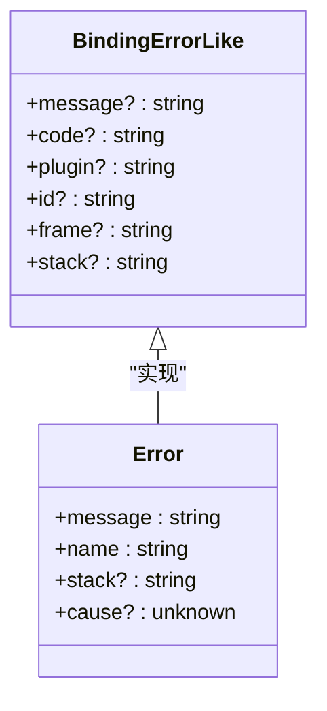
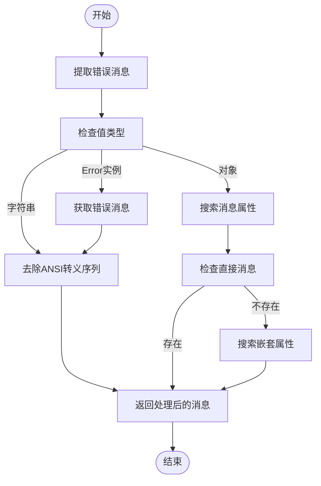
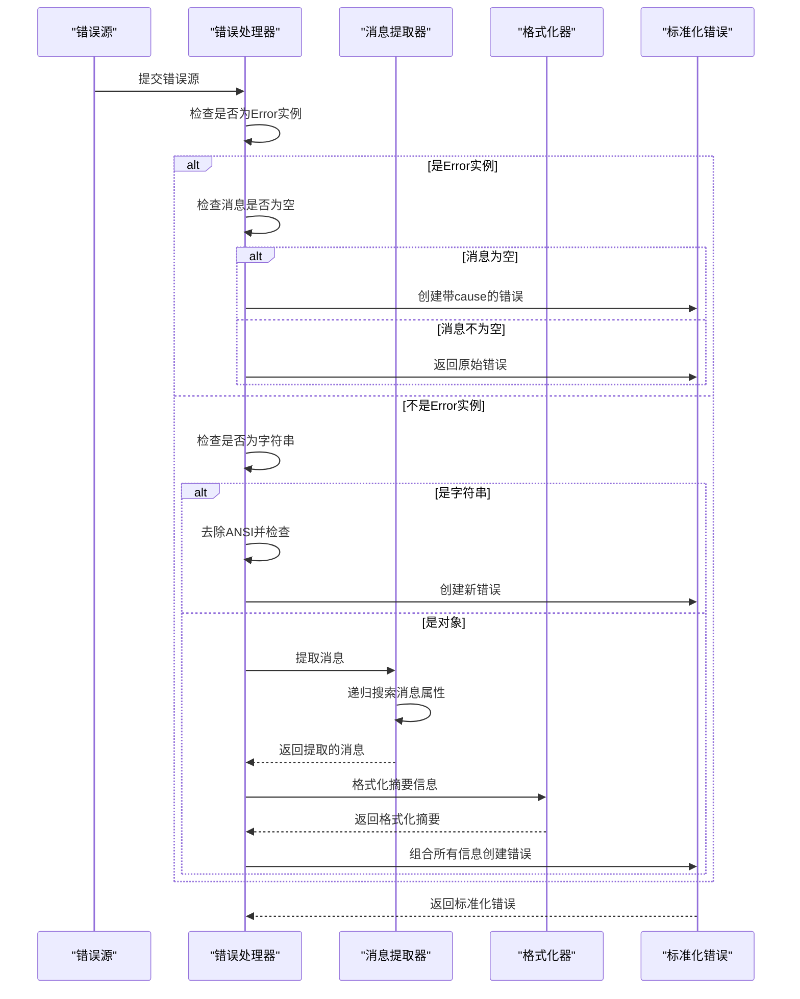
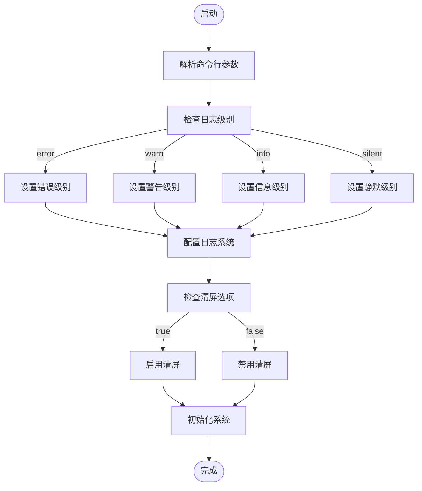
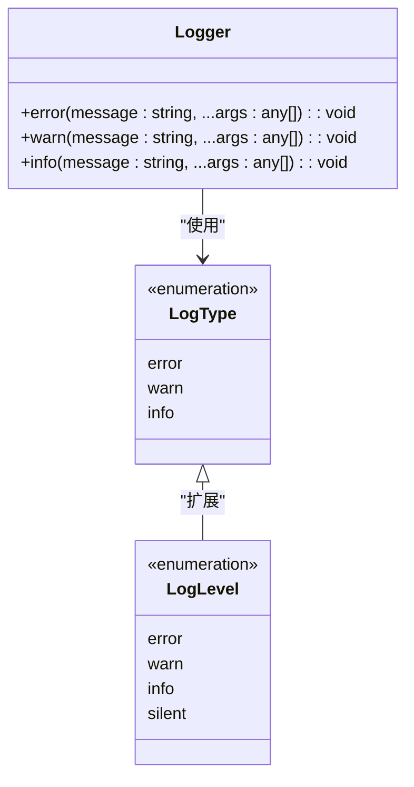

# 错误追踪

<cite>
**本文档中引用的文件**  
- [independentError.ts](file://packages/weapp-vite/src/runtime/independentError.ts)
- [errors.ts](file://packages/weapp-vite/src/types/errors.ts)
- [logger.ts](file://packages/weapp-vite/src/logger.ts)
- [index.ts](file://@weapp-core/logger/src/index.ts)
- [cli.ts](file://packages/weapp-vite/src/cli.ts)
</cite>

## 目录
1. [简介](#简介)
2. [错误对象结构](#错误对象结构)
3. [错误码系统](#错误码系统)
4. [错误堆栈跟踪机制](#错误堆栈跟踪机制)
5. [错误捕获与处理流程](#错误捕获与处理流程)
6. [编译时与运行时错误处理](#编译时与运行时错误处理)
7. [错误报告配置](#错误报告配置)
8. [错误追踪与日志系统集成](#错误追踪与日志系统集成)
9. [常见错误类型与解决方案](#常见错误类型与解决方案)

## 简介
weapp-vite 提供了一套完整的错误追踪机制，用于捕获、处理和报告在开发和构建过程中出现的各种错误。该机制涵盖了从编译时错误到运行时错误的完整生命周期管理，通过结构化的错误对象、标准化的错误码系统和详细的堆栈跟踪信息，帮助开发者快速定位和解决问题。

**Section sources**
- [independentError.ts](file://packages/weapp-vite/src/runtime/independentError.ts#L1-L159)
- [errors.ts](file://packages/weapp-vite/src/types/errors.ts#L1-L8)

## 错误对象结构
weapp-vite 的错误对象遵循统一的结构规范，确保错误信息的一致性和可解析性。核心错误接口 `BindingErrorLike` 定义了标准的错误属性：

- **message**: 错误的简要描述信息
- **code**: 错误码，用于标识特定类型的错误
- **plugin**: 产生错误的插件名称
- **id**: 错误相关的资源标识符
- **frame**: 错误发生位置的代码帧信息
- **stack**: 完整的调用堆栈信息

错误对象通过 `createIndependentBuildError` 函数创建，该函数能够处理各种类型的错误源（Error 实例、字符串、对象等），并将其规范化为统一的错误格式。

**Diagram sources**
- [errors.ts](file://packages/weapp-vite/src/types/errors.ts#L1-L8)
- [independentError.ts](file://packages/weapp-vite/src/runtime/independentError.ts#L99-L159)

**Section sources**
- [errors.ts](file://packages/weapp-vite/src/types/errors.ts#L1-L8)
- [independentError.ts](file://packages/weapp-vite/src/runtime/independentError.ts#L99-L159)

## 错误码系统
weapp-vite 采用标准化的错误码系统来分类和标识不同类型的错误。错误码通常以常量形式定义，便于在代码中引用和比较。系统通过 `formatSummary` 函数将错误码和其他元数据（如插件名、资源ID）组合成可读的摘要信息。

错误码的命名遵循清晰的语义规则，通常采用大写字母和下划线的组合形式（如 `ERR_RESOLVE_PACKAGE_ENTRY_FAIL`），确保其含义明确且易于识别。

**Section sources**
- [independentError.ts](file://packages/weapp-vite/src/runtime/independentError.ts#L14-L37)

## 错误堆栈跟踪机制
weapp-vite 的错误堆栈跟踪机制通过 `collectDetails` 函数实现，能够收集和整理错误的详细信息。该机制支持从多种来源提取堆栈信息：

- 直接从错误对象的 `stack` 属性获取
- 从错误对象的 `frame` 属性获取代码帧信息
- 递归解析错误的 `cause` 链，获取根本原因

系统还实现了 ANSI 转义序列的过滤功能（`stripAnsi` 函数），确保输出的错误信息干净整洁，不受终端格式化字符的影响。

**Diagram sources**
- [independentError.ts](file://packages/weapp-vite/src/runtime/independentError.ts#L55-L97)
- [independentError.ts](file://packages/weapp-vite/src/runtime/independentError.ts#L39-L53)

**Section sources**
- [independentError.ts](file://packages/weapp-vite/src/runtime/independentError.ts#L6-L8)
- [independentError.ts](file://packages/weapp-vite/src/runtime/independentError.ts#L39-L53)
- [independentError.ts](file://packages/weapp-vite/src/runtime/independentError.ts#L55-L97)

## 错误捕获与处理流程
weapp-vite 的错误处理流程采用分层设计，确保各种类型的错误都能被正确捕获和处理。核心流程如下：

1. 捕获原始错误源（可能是 Error 实例、字符串或其他对象）
2. 通过 `isErrorInstance` 函数判断是否为 Error 实例
3. 使用 `extractMessage` 函数递归提取最相关的错误消息
4. 收集错误摘要信息（错误码、插件名等）
5. 整合所有信息，创建标准化的错误对象

该流程通过 `createIndependentBuildError` 函数实现，能够处理各种边界情况，如空消息、循环引用等。

**Diagram sources**
- [independentError.ts](file://packages/weapp-vite/src/runtime/independentError.ts#L102-L158)

**Section sources**
- [independentError.ts](file://packages/weapp-vite/src/runtime/independentError.ts#L99-L159)

## 编译时与运行时错误处理
weapp-vite 区分编译时错误和运行时错误的处理方式：

**编译时错误**：主要发生在构建和打包过程中，通常与模块解析、依赖分析相关。这类错误通过 Vite 的插件系统捕获，并转换为标准化的错误格式。

**运行时错误**：发生在应用执行过程中，可能与 API 调用、数据处理相关。这类错误通过 try-catch 机制捕获，并通过错误追踪系统上报。

两种错误都遵循相同的结构化原则，确保开发者能够使用统一的方式处理和分析。

**Section sources**
- [independentError.ts](file://packages/weapp-vite/src/runtime/independentError.ts#L99-L159)

## 错误报告配置
weapp-vite 提供了灵活的错误报告配置选项，允许开发者根据需要调整错误输出行为。主要配置项包括：

- **日志级别**：通过命令行参数 `--logLevel` 设置，支持 `info`、`warn`、`error`、`silent` 等级别
- **屏幕清理**：通过 `--clearScreen` 参数控制日志输出时是否清空屏幕
- **调试模式**：通过 `-d` 或 `--debug` 参数启用调试日志

这些配置在 CLI 启动时解析，并影响整个构建过程中的错误报告行为。

**Diagram sources**
- [cli.ts](file://packages/weapp-vite/src/cli.ts#L27-L33)

**Section sources**
- [cli.ts](file://packages/weapp-vite/src/cli.ts#L27-L33)

## 错误追踪与日志系统集成
weapp-vite 的错误追踪系统与日志系统深度集成，使用 `@weapp-core/logger` 作为统一的日志输出接口。该日志系统基于 `consola` 库构建，提供了一致的日志格式和输出控制。

错误信息通过标准的错误日志级别（`error`）输出，同时支持警告（`warn`）和信息（`info`）级别的日志记录。日志系统还支持类型定义 `LogType` 和 `LogLevel`，确保类型安全。

**Diagram sources**
- [logger.ts](file://packages/weapp-vite/src/logger.ts#L5-L6)
- [index.ts](file://@weapp-core/logger/src/index.ts#L1-L3)

**Section sources**
- [logger.ts](file://packages/weapp-vite/src/logger.ts#L1-L6)
- [index.ts](file://@weapp-core/logger/src/index.ts#L1-L3)

## 常见错误类型与解决方案
weapp-vite 中常见的错误类型包括：

- **模块解析失败**：通常是由于依赖包缺失或路径错误导致
- **配置错误**：项目配置文件格式不正确或缺少必要字段
- **编译错误**：代码语法错误或类型检查失败
- **运行时异常**：API 调用失败或数据处理错误

对于这些错误，建议的解决方案包括：
1. 检查依赖是否完整安装
2. 验证配置文件的正确性
3. 查看详细的错误堆栈信息定位问题
4. 参考错误码文档了解具体含义

**Section sources**
- [independentError.ts](file://packages/weapp-vite/src/runtime/independentError.ts#L99-L159)
- [errors.ts](file://packages/weapp-vite/src/types/errors.ts#L1-L8)